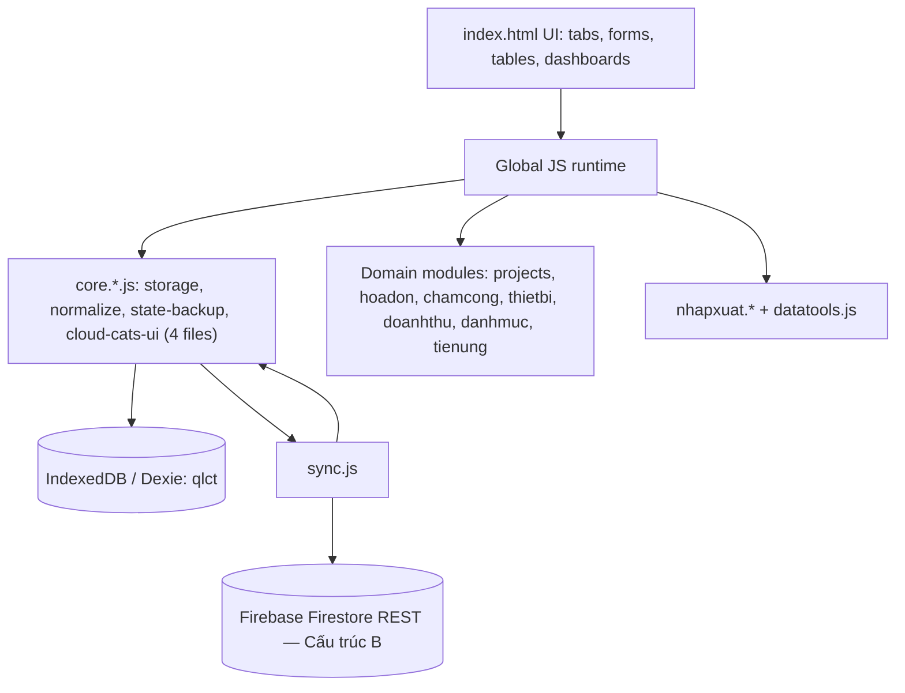
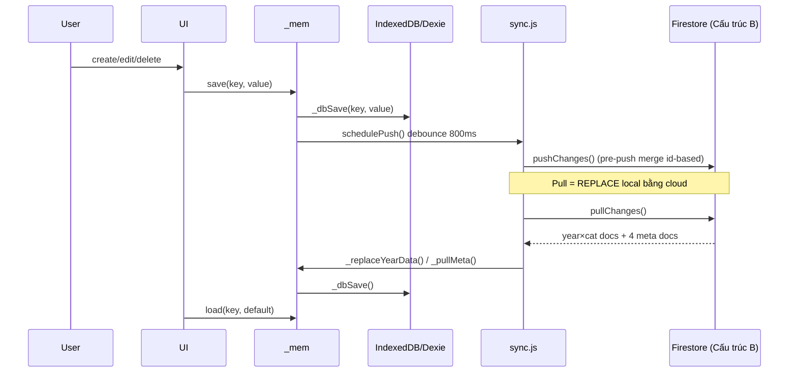

# AI_CONTEXT.md

Tài liệu ngữ cảnh kỹ thuật cho AI Code khi làm việc với project **App Quản Lý Chi Phí Công Trình**.

> **Cách dùng tài liệu này:** Phần **I — THAM CHIẾU HIỆN HÀNH** (mục 1–7) luôn phản ánh **trạng thái code thực tế hiện tại**. Phần **II — QUY TẮC UI & BẢO TRÌ** (mục 8) là quy ước phải tuân theo. Phần **III — LỊCH SỬ THAY ĐỔI** (mục 9) là changelog theo thời gian; một số mục trong đây mô tả kiến trúc cũ (V2 subcollection) đã bị thay thế — đọc để hiểu bối cảnh, KHÔNG dùng làm tham chiếu hiện hành. **Phụ lục A** lưu di sản V2 đã xóa khỏi code để nhận diện dấu vết khi dọn dẹp.

---

## Mục lục

**Phần I — Tham chiếu hiện hành**
1. [Tổng quan ứng dụng](#1-tổng-quan-ứng-dụng-project-overview)
2. [Thứ tự nạp Script](#2-thứ-tự-nạp-script-script-load-order)
3. [Sơ đồ thư mục](#3-sơ-đồ-thư-mục-directory-structure)
4. [Kiến trúc lưu trữ & đồng bộ](#4-kiến-trúc-lưu-trữ--đồng-bộ-storage--sync-architecture)
5. [Sơ đồ dữ liệu](#5-sơ-đồ-dữ-liệu-data-model)
6. [Hàm & Biến Global quan trọng](#6-hàm--biến-global-quan-trọng-key-functions--globals)
7. [Quy tắc lập trình](#7-quy-tắc-lập-trình-coding-rules)

**Phần II — Quy tắc UI & bảo trì**

8. [Bootstrap migration & quy tắc UI](#8-bootstrap-migration--quy-tắc-ui)

**Phần III — Lịch sử thay đổi (Changelog)**

9. [Lịch sử thay đổi theo thời gian](#9-lịch-sử-thay-đổi-theo-thời-gian-changelog)
   - [9.1 Bootstrap migration + cleanup (20–22/05/2026)](#91-bootstrap-migration--cleanup-202205-2026)
   - [9.2 V2 Quota Optimization — Phase 1+2+3+4 (23/05/2026)](#92-v2-quota-optimization--phase-1234-23052026--lịch-sử)
   - [9.3 Sync Reliability & Quota Fix — Phase 5 (24/05/2026)](#93-sync-reliability--quota-fix--phase-5-24052026)
   - [9.4 Cải tiến UI/UX — Tasks 7–14 (24/05/2026)](#94-cải-tiến-uiux--tasks-714-24052026)
   - [9.5 Điểm kiểm tra sau cleanup](#95-điểm-kiểm-tra-sau-cleanup)
   - [9.6 UI/UX Phase 2 — Sticky + Dropdown + Layout (24/05/2026)](#96-uiux-phase-2--sticky--dropdown--layout-24052026)
   - [9.7 UI/UX Phase 3 — Sticky + dropdown + dashboard fixes (24/05/2026)](#97-uiux-phase-3--sticky--dropdown--dashboard-fixes-24052026)
   - [9.8 Chủ Đầu Tư + Hide Closed Projects (24/05/2026)](#98-chủ-đầu-tư--hide-closed-projects-24052026)
   - [9.9 Bỏ Offline-first → Online-only + Cấu trúc B + Normalize (29/05/2026)](#99-bỏ-offline-first--online-only--cấu-trúc-b--normalize-29052026--kiến-trúc-hiện-hành)
   - [9.10 Hóa đơn trong ngày + Chấm công copy + Tiền Ứng (11/06/2026)](#910-hóa-đơn-trong-ngày--chấm-công-copy--tiền-ứng-11062026)
   - [9.11 Fix lỗi Thùng Rác "xóa rồi vẫn hồi về" (13/06/2026)](#911-fix-lỗi-thùng-rác-xóa-rồi-vẫn-hồi-về-13062026)
   - [9.12 Tách Tab Công Nợ + Doanh Thu 2 subtab + UI Công Nợ mới (16/06/2026)](#912-tách-tab-công-nợ--doanh-thu-2-subtab--ui-công-nợ-mới-16062026)

**Phụ lục**

- [Phụ lục A — Di sản V2 đã xóa khỏi code](#phụ-lục-a--di-sản-v2-đã-xóa-khỏi-code)

---

# PHẦN I — THAM CHIẾU HIỆN HÀNH

## 1. Tổng quan ứng dụng (Project Overview)

| Hạng mục | Mô tả |
|---|---|
| Loại ứng dụng | SPA tĩnh, Vanilla JS, không bundler, không ES module import/export |
| Entry point | `index.html` nạp toàn bộ CSS/JS bằng `<script>` tuần tự |
| Mục đích | Quản lý chi phí công trình: hóa đơn, chấm công, thiết bị, tiền ứng, doanh thu, công nợ, nhập/xuất dữ liệu |
| UI language | Tiếng Việt, domain text dùng thuật ngữ xây dựng/kế toán Việt Nam |
| Core tech | HTML, CSS, Vanilla JavaScript, IndexedDB qua Dexie, Firebase/Firestore REST sync, XLSX import/export, html2canvas export image |
| Runtime style | Global mutable state trên `window`/global scope; file sau gọi trực tiếp biến/hàm của file trước |
| Mô hình sync | **Online-only, cloud là nguồn chân lý** (từ 29/05/2026). Pull = REPLACE local bằng cloud. Khi offline → chặn dùng app. |

Kiến trúc tổng thể:



---

## 2. Thứ tự nạp Script (Script Load Order)

Thứ tự chính xác trong `index.html`:

| # | Script | Vai trò |
|---:|---|---|
| 1 | `https://cdnjs.cloudflare.com/ajax/libs/xlsx/0.18.5/xlsx.full.min.js` | Thư viện Excel |
| 2 | `https://cdnjs.cloudflare.com/ajax/libs/html2canvas/1.4.1/html2canvas.min.js` | Export UI/table thành ảnh |
| 3 | `https://unpkg.com/dexie@4/dist/dexie.min.js` | IndexedDB wrapper |
| 4 | `js/core/core.storage.js` | Lớp nền thấp nhất: `DEFAULTS`, `CATS`, `FB_CONFIG`, Dexie `db`, `DB_KEY_MAP`, `_mem`, `load/save`, pending sync counter (`_pendingChanges`, `_SYNC_DATA_KEYS`, `_incPending`, `_resetPending`, `_updateSyncBtnBadge`), `LAST_SYNC_KEY`, `mkRecord`, `mkUpdate`, autocomplete |
| 5 | `js/core/core.normalize.js` | Module chuẩn hóa record về 6 field tiêu chuẩn (`id`, `createdAt`, `updatedAt`, `deletedAt`, `deviceId`, `projectId`) dùng cho import/restore: `normalizeRecord`, `normalizeDataset`, `normalizeImportStore`, `_NORM_CT_FIELD`. Nạp sau `core.storage.js`, trước `core.state-backup.js`. |
| 6 | `js/core/core.state-backup.js` | State orchestration: `DATA_VERSION`, `migrateData`, `_migrateHopDongKeys`, project lookup helpers, `BACKUP_KEYS`, backup/restore (`_snapshotNow`, `restoreFromBackup`, `renderBackupList`), `exportJSON`, `importJSON`, `importJSONFull` (push cloud cấu trúc B), `_normalizeImportData` (wrapper gọi `normalizeImportStore`), `clearAllCache`, `afterDataChange`, `_reloadGlobals`, khởi tạo global `cats`, `cnRoles`, `invoices`, `filteredInvs`, `curPage`, `PG` |
| 7 | `js/core/core.cloud-cats-ui.js` | Cloud helpers: `fbReady`, `fsWrap/fsUnwrap`, Firebase REST (`fsGet/fsSet/fsDelete`), cấu trúc B (`fbDocYearCat`, `fbDocMetaCT/DM/TK/HD`, `_YEAR_CATS`, `fbYearCatPayload`, `fbMetaCT/DM/TK/HDPayload`), `_wipeOrphanCloudDocs` (dọn doc rác cấu trúc cũ), `gsLoadAll`, sync dot UI, modal Firebase config (`openBinModal`, `fbSaveConfig`, `fbDisconnect`), `buildYearSelect`, `saveCats`, cat items soft-delete (`_syncCatItems`, `_rebuildCatArrsFromItems`, `_migrateCatItemsIfNeeded`), `normalizeCatDisplayName`, `showSyncBanner`, `_setSyncState` |
| 8 | `js/modules/projects/projects.model.js` | Domain model công trình: `PROJECT_STATUS`, `PROJECT_COMPANY`, `let projects = []`, `_saveProjects`, `rebuildCatCTFromProjects`, `createProject` (có param `customerId`), `updateProject`, `getProjectById`, `findProjectIdByName`, `getSortedProjects`, `getAllProjects`, `getProjectOptions`, `getProjectDays`, `getProjectK`, `getProjectFactor` (=k, tương thích cũ), `getProjectWeight` (=ngày×k), `getCompanyCost`, `allocateCompanyCost`, `canDeleteProject`, `resolveProjectName`. Project có thêm field `customerId` (FK → khách hàng) và `heSoTiTrong` (k). |
| 8b | `js/modules/khachhang/khachhang.model.js` | Model Khách Hàng (Chủ đầu tư/CRM): `let customers = []`, `_saveCustomers`, `_normCustomerName`, `getCustomerById`, `findCustomerByName`, `getAllCustomers`, `createCustomer`, `updateCustomer`, `deleteCustomer` (xóa mềm), `getOrCreateCustomerByName`, `getCustomerOptions`, `_migrateCustomersFromProjects`. Nạp sau `projects.model.js`, trước `projects.migration-selects.js`. |
| 9 | `js/modules/projects/projects.migration-selects.js` | Migration linking + shared select helpers: `migrateProjectLinks`, `deduplicateProjects`, `_buildProjOpts`, `_buildProjFilterOpts`, `_readPidFromSel`, `_checkProjectClosed` |
| 10 | `js/modules/projects/projects.ui.js` | Full UI tab Công Trình: `_fmtProjDate`, `_PT_STATUS_META`, `_PT_GROUP_LABELS`, `_PT_ORDER`, `_goTabWithCT`, `renderProjectsPage`, `renderCTOverview`, `_ctApply`, `_ctRenderGrid`, `openCTDetail`, `openCTCreateModal`, `saveCTCreate`, `openCTEditModal`, `saveCTEdit`, `quickCloseCT`, `confirmQuickClose`, `quickCompleteCT`, `confirmQuickComplete`, `confirmDeleteCT` |
| 11 | `js/legacy/tienich.js` | Utility, formatter, `buildInvoices()`, invoice cache |
| 12 | `js/modules/hoadon/hoadon.quick-entry.js` | Nhập hóa đơn nhanh, duplicate check, shared row/money helpers: `initTable`, `addRows`, `addRow`, `delRow`, `renumber`, `calcSummary`, `clearTable`, `saveAllRows`, `_showDupModal`, `closeDupModal`, `forceSaveAll`, `_ensureInvRef`, `_doSaveRows`, `calcRowMoney`, `getRowData` |
| 13 | `js/modules/hoadon/hoadon.sheet-grid.js` | Engine lưới nhập liệu giống Excel cho hóa đơn nhanh: selection, copy/paste vùng, keyboard navigation, autocomplete trực tiếp trong bảng |
| 14 | `js/modules/hoadon/hoadon.detail-entry.js` | Hóa đơn chi tiết nhiều dòng vật tư/nội dung: `goInnerSub`, `_initDetailFormSelects`, `renderDetailRowHTML`, `addDetailRow`, `delDetailRow`, `calcDetailRow`, `calcDetailTotals`, `generateDetailNd`, `saveDetailInvoice`, `clearDetailForm`, `_setSelectFlexible`, `openDetailEdit`, `getDetailRows` |
| 15 | `js/modules/hoadon/hoadon.list-trash.js` | Filter/render danh sách, sửa/xóa, thùng rác, hóa đơn trong ngày: `switchTatCaView`, `buildFilters`, `filterAndRender`, `renderTable`, `goTo`, `delInvoice`, `editCCInvoice`, `openEntryEdit`, `_resolveInvSource`, `editManualInvoice`, `trash` (global), `trashAdd`, `trashRestore`, `trashDeletePermanent`, `trashClearAll`, `renderTrash`, `renderTodayInvoices`, `refreshHoadonCtDropdowns` |
| 16 | `js/modules/danhmuc/danhmuc.categories.js` | Danh mục/settings: normalize, render settings, CT page, CN role, tbTen, rebuild selects, dedup cat arrays |
| 17 | `js/modules/tienung/tienung.core.js` | Tiền Ứng core: `ungRecords`, migration/normalize deletedAt/projectId, shared state cho entry/history, subtab nav: `ungGoSub`, `ungShowSubNhap`, `ungShowSubBaoCao` |
| 18 | `js/modules/tienung/tienung.entry.js` | Form nhập tiền ứng nhiều dòng, đổi loại ứng, lưu/xóa dòng, rebuild selects |
| 19 | `js/modules/tienung/tienung.history.js` | Lịch sử tiền ứng, lọc/tìm kiếm, phân trang, xuất CSV/ảnh phiếu ứng, bảng phiếu gần đây: `renderUngMini` |
| 20 | `js/modules/danhmuc/danhmuc.tools.js` | Wrapper backup/restore (`toolBackupNow`, `toolRestoreBackup`) |
| 21 | `js/modules/nhapxuat/nhapxuat.parsers.js` | Helper parse/normalize Excel + parser sheet 1–9: `_normStr`, `_parseDate`, `_pNum`, `_str`, `_sheetRows`, `_hasDiacritics`, `_deduplicateCatNames`, `_buildCanonMap`, `_dayOfWeek`, `_isEmptyRow`, `_formatCatName`, `_markDuplicateInBatch`, `_makeCatLookup`, `_makeCatLookupWithExtra`, `_resolveProvisionalProjectIds`, `_mkErr`, `_fmtErr`, `parseSheet1`–`parseSheet9`, `_DANHMUC_GROUP_MAP` |
| 22 | `js/modules/nhapxuat/nhapxuat.import.js` | Import session, detect sheet, preview, apply import, log: `_isDupInvQ/D/Ung/Thu/Tb/Tp/CC`, `_detectSheetType`, `_importSession`, `_doImportParse`, `_markDuplicates`, `_showImportPreviewNew`, `_toggleAllImportSheets`, `_applyImport`, `_generateImportLog`, `openImportModal`, `handleImportFile` |
| 23 | `js/modules/nhapxuat/nhapxuat.export.js` | Export modal, Excel sheet builders, CSV exports: `openExportModal`, `_buildSheet`, `buildHoaDonNhanh/ChiTiet/ChamCong/TienUng/ThietBi/DanhMuc/HopDongChinh/ThuTien/HopDongThauPhu/HuongDan`, `exportExcel`, `_doExport`, `exportEntryCSV`, `exportAllCSV`, `toolImportExcel`, `toolExportExcel` |
| 24 | `js/legacy/datatools.js` | Dashboard, reset/delete-year, data health, migration tools |
| 25 | `js/modules/chamcong/chamcong.core.js` | Global data (`ccData`, `ccOffset`, `ccHistPage`, `ccTltPage`), constants (`CC_DAY_LABELS`, `CC_DATE_OFFSETS`), date/week helpers, normalize/category helpers, CT selector helpers: `_dedupCC`, `round1`, `toggleCCDebtCols`, `_calcDebtBefore`, `isoFromParts`, `ccSundayISO`, `ccSaturdayISO`, `snapToSunday`, `weekLabel`, `ccAllNames`, `rebuildCCNameList`, `normalizeAllChamCong`, `rebuildCCCategories`, `updateTopFromCC`, `populateCCCtSel`, `updateCCSaveBtn`, `onCCCtSelChange`, `_fmtDate`, `ccGoSub`, `ccShowSubSoCC` |
| 26 | `js/modules/chamcong/chamcong.week-form.js` | Form nhập tuần, build table, row handlers, lưu/copy/paste: `initCC`, `ccGoToWeek`, `ccPrevWeek`, `ccNextWeek`, `onCCFromChange`, `loadCCWeekForm`, `buildCCTable`, `addCCWorker`, `addCCRow`, `buildCCRow`, `onCCNameInput`, `onCCDayKey`, `onCCWageKey`, `onCCMoneyKey`, `calcCCRow`, `delCCRow`, `renumberCC`, `updateCCSumRow`, `saveCCWeek`, `clearCCWeek`, `copyCCWeek`, `pasteCCWeek`; global `ccClipboard` |
| 27 | `js/modules/chamcong/chamcong.history-reports.js` | Lịch sử, tổng lương tuần, load/delete, CSV exports, phiếu lương/ảnh: `buildCCHistFilters`, `renderCCHistory`, `ccHistGoTo`, `renderCCTLT`, `renderCCTLTMini`, `fmtK`, `updateTLTSelectedSum`, `exportCCTLTCSV`, `ccTltGoTo`, `loadCCWeekById`, `delCCWeekById`, `delCCWorker`, `exportCCWeekCSV`, `exportCCHistCSV`, `removeVietnameseTones`, `xuatPhieuLuong`, `exportUngToImage` |
| 28 | `js/legacy/thietbi.js` | Quản lý thiết bị/kho tổng |
| 29 | `js/modules/doanhthu/doanhthu.core.js` | Global data (`hopDongData`, `thuRecords`, `thauPhuContracts`), state, shared helpers: `calcHopDongValue`, `_migrateHopDongSL`, `_normalizeThuProjectIds`, `bindItemsToTable`, `dtGoSub`, `dtPopulateSels`, `fmtInputMoney`, `_readMoneyInput`, `_dtPaginationHtml`, `_dtMatchProjFilter`, `_dtMatchHDCFilter`, pagination state, CT filter |
| 30 | `js/modules/doanhthu/doanhthu.forms.js` | Form save/edit/delete và render tables: `hdcUpdateTotal`, `saveHopDongChinh`, `editHopDongChinh`, `delHopDongChinh`, `renderHdcTable`, `saveThuRecord`, `editThuRecord`, `delThuRecord`, `renderThuTable`, `hdtpUpdateTotal`, `saveHopDongThauPhu`, `editHopDongThauPhu`, `delHopDongThauPhu`, `renderHdtpTable` |
| 31 | `js/modules/doanhthu/doanhthu.reports-export.js` | Lãi/Lỗ, init, copy/paste KLCT, xuất phiếu ảnh: `renderLaiLo`, `initDoanhThu` (set up 2 subtab KHAI BÁO/THỐNG KÊ), `copyKLCT`, `pasteKLCT`, `exportHdcToImage`, `exportHdtpToImage`, `exportThuToImage`; gán `window.initDoanhThu`, `window.dtGoSub`. (`renderCongNoThauPhu`/`renderCongNoNhaCungCap`/`_renderCongNoTable` còn lại nhưng **DEPRECATED** — xem 9.12) |
| 31b | `js/modules/doanhthu/doanhthu.congno.js` | Page **CÔNG NỢ** (tab chính độc lập): `initCongNo`, `cnRenderTable`, `cnApplyFilters`, `cnResetFilters`, `cnPopulateCtFilter`, `cnPopulateMonthFilter`, `_cnBuildRows` (chỉ đối tác có `daUng>0`), `_cnRenderKpis`, `_cnProgressBar`, `_cnStatusBadge`, `_cnGroupBadge`, `_cnMatchCt`, `_cnInMonth`; state lọc `_cnCt`/`_cnGroup`/`_cnMonth`/`_cnSearch`. Nạp sau `doanhthu.reports-export.js`. |
| 32 | `js/sync/sync.js` | Sync engine Firestore (cấu trúc B, online-only, cloud-authoritative): `DEVICE_ID`, `pushChanges` (ghi mỗi năm × hạng mục + 4 meta doc), `pullChanges` (REPLACE local bằng cloud), `_pullMeta`, `_replaceYearData`, `manualSync`, `schedulePush` (debounce 800ms), conflict merge (`resolveConflict`/`mergeDatasets`/`normalizeCC`) chỉ dùng ở pre-push merge |
| 33 | `js/app/auth.js` | Auth/session/role UI: đăng nhập, đăng xuất, đổi thông tin tài khoản, quản lý `users_v1`, phân quyền `admin`/`giamdoc`/`ketoan` |
| 34 | `js/app/main.js` | Bootstrap khởi động cuối cùng: init, year filter, tab rendering, role UI, auto-sync, chặn dùng app khi offline (`_showOfflineBlock`) |
| 35 | `https://cdn.jsdelivr.net/npm/bootstrap@5.3.3/dist/js/bootstrap.bundle.min.js` | Bootstrap bundle (nạp ở cuối body, sau toàn bộ JS app) |

Thứ tự này quan trọng vì code không dùng module system. Nhóm `core.*.js` **bắt buộc nạp trước tất cả module nghiệp vụ**. Các file dùng chung biến/hàm global như `load`, `save`, `cats`, `projects`, `invoices`, `ccData`, `hopDongData`, `buildInvoices`, `pullChanges`, `manualSync`. Nếu đổi thứ tự, module có thể đọc biến chưa khai báo hoặc render trước khi `dbInit()` populate `_mem`.

> **Hai file V2 (`sync.v2format.js`, `sync.v2meta.js`) đã bị XÓA** trong đợt chuyển sang online-only + cấu trúc B. `sync.js` không còn phụ thuộc engine subcollection V2. Nếu thấy tham chiếu `_v2*` ở đâu đó thì đó là dấu vết cũ cần dọn (xem [Phụ lục A](#phụ-lục-a--di-sản-v2-đã-xóa-khỏi-code)).

---

## 3. Sơ đồ thư mục (Directory Structure)

```text
index.html                    ← Entry point SPA
AI_CONTEXT.md
assets/
  css/
    style.css                 ← Stylesheet duy nhất

js/
  core/                       ← Nạp đầu tiên, nền tảng toàn app
    core.storage.js
    core.normalize.js
    core.state-backup.js
    core.cloud-cats-ui.js

  modules/                    ← Các module nghiệp vụ đã tách
    hoadon/
      hoadon.quick-entry.js
      hoadon.sheet-grid.js
      hoadon.detail-entry.js
      hoadon.list-trash.js
    projects/
      projects.model.js
      projects.migration-selects.js
      projects.ui.js
    danhmuc/
      danhmuc.categories.js
      danhmuc.tools.js
    tienung/
      tienung.core.js
      tienung.entry.js
      tienung.history.js
    nhapxuat/
      nhapxuat.parsers.js
      nhapxuat.import.js
      nhapxuat.export.js
    chamcong/
      chamcong.core.js
      chamcong.week-form.js
      chamcong.history-reports.js
    doanhthu/
      doanhthu.core.js
      doanhthu.forms.js
      doanhthu.reports-export.js
      doanhthu.congno.js        ← Page CÔNG NỢ (tab chính độc lập)

  legacy/                     ← File chưa tách module, vẫn ở dạng đơn khối
    tienich.js
    datatools.js
    thietbi.js

  sync/
    sync.js                   ← Sync engine Firestore (cấu trúc B, online-only)

  app/
    auth.js
    main.js                   ← Bootstrap cuối cùng
```

**Lưu ý tổ chức thư mục:**
- Thư mục chỉ là tổ chức **vật lý** — không phải module system, không dùng `import/export`.
- Toàn bộ file vẫn chạy global scope qua `<script>` tuần tự trong `index.html`.
- `js/legacy/` chứa các file chưa được tách module; có thể tách thêm trong tương lai theo cùng pattern.
- File cũ `js/legacy/hoadon.js` đã được tách thành nhóm `js/modules/hoadon/*.js` — **không còn tồn tại**, không nạp lại.
- Hai file V2 cũ `js/sync/sync.v2format.js` và `js/sync/sync.v2meta.js` đã bị **xóa** khi chuyển sang online-only + cấu trúc B; thư mục `js/sync/` chỉ còn `sync.js`.
- Khi thêm file mới: phải thêm `<script src="...">` vào `index.html` đúng thứ tự và cập nhật `AI_CONTEXT.md` (mục 2 và mục 6).

---

## 4. Kiến trúc lưu trữ & đồng bộ (Storage & Sync Architecture)

| Layer | Thành phần | Vai trò |
|---|---|---|
| Source of truth local | IndexedDB qua Dexie DB `qlct` | Cache dữ liệu khi app chạy (online-only — pull REPLACE từ cloud) |
| Memory snapshot | `_mem` trong `core.storage.js` | Cache runtime; `load(k, def)` chỉ đọc từ `_mem` sau `dbInit()` |
| Write path | `save(k, v, opts)` | Cập nhật `_mem`, ghi Dexie bằng `_dbSave()`, invalidate invoice cache, đánh dấu pending, debounce sync. `opts.skipSync=true` → bỏ qua pending + push |
| Sync cloud | `sync.js` + Firebase/Firestore REST | Pull (REPLACE local) / pre-push merge / push dữ liệu theo cấu trúc B |
| LocalStorage | Config/session only | Lưu Firebase config, `deviceId`, session user, pending marker, block-pull marker; không là nguồn dữ liệu nghiệp vụ |

Dexie physical schema:

| Dexie table | Key/index | Logical keys |
|---|---|---|
| `invoices` | `id, updatedAt` | `inv_v3` |
| `attendance` | `id, updatedAt` | `cc_v2` |
| `equipment` | `id, updatedAt` | `tb_v1` |
| `ung` | `id, updatedAt` | `ung_v1` |
| `revenue` | `id, updatedAt` | `thu_v1` |
| `settings` | `id` | `projects_v1`, `customers_v1`, `hopdong_v1`, `thauphu_v1`, `trash_v1`, `users_v1`, `cat_ct_years`, `cat_cn_roles`, `cat_items_v1` |

Online-only data flow (cloud-authoritative):



### Cấu trúc B (collection `cpct_data`)

Mỗi **năm × hạng mục = 1 doc** + **4 doc meta dùng chung**, tên field **đầy đủ (không nén)**:

- `meta_cong_trinh` → `{ projects, customers }`
- `meta_danh_muc` → `{ cats, catItems, cnRoles, ctYears }`
- `meta_tai_khoan` → `{ users }`
- `meta_hop_dong` → `{ hopDong, thauPhu }`
- `y{YYYY}_hoa_don` / `_tien_ung` / `_cham_cong` / `_thiet_bi` / `_thu_tien` → `{ v:4, yr, cat, records:[...] }`
- Ánh xạ năm×hạng mục: `_YEAR_CATS` trong `core.cloud-cats-ui.js`.

### Sync rules (hiện hành)

| Rule | Mô tả |
|---|---|
| Mô hình | **Online-only, cloud-authoritative.** Pull = **REPLACE** local bằng cloud (không merge tích lũy). Pre-push merge (id-based, tombstone + LWW) chỉ chạy lúc PUSH để tránh 2 máy cùng năm ghi đè nhau. |
| Conflict resolution | `resolveConflict(local, cloud)`: tombstone (`deletedAt`) ưu tiên, sau đó `updatedAt` mới hơn thắng |
| Multi-year sync | `_getAllLocalYears()` gom năm từ `inv_v3`, `ung_v1`, `cc_v2`, `tb_v1`, `thu_v1`; push/pull theo từng doc `y{YYYY}_<cat>` |
| Categories sync | Doc `meta_danh_muc` chứa: <br> - `catItems` (`cat_items_v1`): { [type]: { id, name, isDeleted, updatedAt }[] } (Master category storage) <br> - `cats` (các mảng `cat_loai`, `cat_ncc`, `cat_nguoi`, `cat_tp`, `cat_cn`, `cat_tbteb` — derived từ `catItems`) <br> - `cnRoles` (`cat_cn_roles`) <br> - `ctYears` (`cat_ct_years`) |
| Pull guard | `_blockPullUntil`/`localStorage._blockPullUntil` chặn pull sau reset/import để tránh cloud cũ ghi đè local mới |
| Pending | `_pendingChanges` và `_PENDING_KEY` giúp hiển thị trạng thái còn thay đổi chưa sync; `save(k,v,{skipSync:true})` ghi mà không tăng pending |
| Offline | `main.js` `_showOfflineBlock()` chặn hẳn app khi mất mạng, bắt reload khi có mạng lại |
| Flush on hide | IIFE trong `sync.js` lắng nghe `visibilitychange`(hidden)/`pagehide`: nếu `_pendingChanges>0` → `pushChanges({silent:true, skipPull:true})` (chống mất dữ liệu mobile) |
| Có mạng lại | `window.addEventListener('online', ...)`: nếu `_pendingChanges>0` → `schedulePush()` |
| Reset/delete-year | Push tombstone/rỗng theo cấu trúc B bằng `fsSet` trực tiếp (không qua `pushChanges`); `_wipeOrphanCloudDocs()` xóa hẳn doc không thuộc B bằng `fsDelete` |

> **Lưu ý:** Kiến trúc V2 Firestore Subcollection (parent doc + subcollection `ban_ghi/`, các phase quota optimization) **đã bị thay thế hoàn toàn** bởi Cấu trúc B. Mô tả V2 được lưu ở [mục 9.2](#92-v2-quota-optimization--phase-1234-23052026--lịch-sử) và [Phụ lục A](#phụ-lục-a--di-sản-v2-đã-xóa-khỏi-code) chỉ để tham khảo lịch sử.

---

## 5. Sơ đồ dữ liệu (Data Model)

| Logical key | Kiểu | Object chính | Fields quan trọng |
|---|---|---|---|
| `inv_v3` | `Array<Object>` | Hóa đơn | `id:string`, `ngay:YYYY-MM-DD`, `congtrinh:string`, `projectId:string\|null`, `loai:string`, `nguoi:string`, `ncc:string`, `nd:string`, `tien:number`, `thanhtien:number`, `sl:number`, `items:array?`, `source:string?`, `ccKey:string?`, `createdAt:number`, `updatedAt:number`, `deletedAt:number\|null`, `deviceId:string` |
| `cc_v2` | `Array<Object>` | Chấm công tuần | `id:string`, `fromDate:YYYY-MM-DD`, `toDate:YYYY-MM-DD`, `ct:string`, `projectId:string\|null`, `ctPid:string?`, `workers:array`, `createdAt:number`, `updatedAt:number`, `deletedAt:number\|null`, `deviceId:string` |
| `cc_v2.workers[]` | `Array<Object>` | Dòng công nhân | `name:string`, `d:number[7]`, `luong:number`, `phucap:number`, `hdmuale:number`, `tru:number`, `loanAmount:number`, `nd:string`, `role:string?` |
| `tb_v1` | `Array<Object>` | Thiết bị | `id:string`, `ct:string`, `projectId:string\|null`, `ten:string`, `soluong:number`, `tinhtrang:string`, `nguoi:string`, `ghichu:string`, `ngay:string`, metadata |
| `ung_v1` | `Array<Object>` | Tiền ứng | `id:string`, `ngay:string`, `loai:'thauphu'\|'nhacungcap'\|'congnhan'`, `tp:string`, `congtrinh:string`, `projectId:string\|null`, `tien:number`, `nd:string`, metadata |
| `thu_v1` | `Array<Object>` | Thu tiền | `id:string`, `ngay:string`, `congtrinh:string`, `projectId:string\|null`, `tien:number`, `nguoi:string`, `nd:string`, metadata |
| `projects_v1` | `Array<Object>` | Master công trình | `{ id, name, type, status, startDate, endDate, closedDate, note, chuDauTu, customerId, heSoTiTrong, createdYear, createdAt, updatedAt, deletedAt }` <br> - `customerId`: FK → `customers_v1[].id` (dual-write cùng `chuDauTu` = tên KH). <br> - `heSoTiTrong` (k): hệ số phân bổ chi phí chung, mặc định 1, `k=0` → không gánh. <br> - Special ID: `COMPANY` (CÔNG TY) for overhead costs. <br> - Statuses: `planning`, `active`, `completed`, `closed`. <br> - Types: `CT` (Công trình), `SC` (Sửa chữa), `OTHER`. |
| `customers_v1` | `Array<Object>` | Master khách hàng (Chủ đầu tư / CRM) | `{ id, name, phone, email, address, taxCode, note, createdAt, updatedAt, deletedAt }` <br> - 1 khách hàng → nhiều công trình (qua `projects_v1[].customerId`). <br> - Sync piggyback trong doc `meta_cong_trinh`. |
| `hopdong_v1` | `Object map` | Hợp đồng chính | Key ưu tiên là `projectId`, legacy fallback là tên CT. Value: `giaTri:number`, `giaTriphu:number`, `phatSinh:number`, `nguoi:string`, `ngay:string`, `projectId:string`, `khachHang:string` (legacy fallback cho Chủ Đầu Tư), `items:array?`, `updatedAt:number`, `deletedAt:number\|null` |
| `thauphu_v1` | `Array<Object>` | Hợp đồng thầu phụ | `id:string`, `ngay:string`, `congtrinh:string`, `projectId:string\|null`, `thauphu:string`, `giaTri:number`, `phatSinh:number`, `nd:string`, `items:array?`, metadata |
| `trash_v1` | `Array/Object` | Thùng rác hóa đơn | Lưu record bị đưa vào trash; vẫn cần giữ metadata để phục hồi/đối chiếu |
| `users_v1` | `Array<Object>` | User/auth | `id:string`, `username:string`, `password:string`, `role:'admin'\|'giamdoc'\|'ketoan'`, `updatedAt:number`, `sessionVersion:number`, `sessions:array` |
| `cat_items_v1` | `Object<string, Array>` | Danh mục có soft delete | Type keys: `loai`, `ncc`, `nguoi`, `tp`, `cn`, `tbteb`; item gồm `id:string`, `name:string`, `isDeleted:boolean`, `updatedAt:number` |
| `cat_cn_roles` | `Object` | Vai trò công nhân | `{ [workerName:string]: string }` |
| `cat_ct_years` | `Object` | Năm công trình | `{ [projectName:string]: number }` |

Metadata chuẩn cho record nghiệp vụ:

| Field | Kiểu | Quy tắc |
|---|---|---|
| `id` | `string` | UUID từ `crypto.randomUUID()`; legacy id có migration trong Data Tools |
| `createdAt` | `number` | Unix ms khi tạo; giữ nguyên khi edit |
| `updatedAt` | `number` | Unix ms khi sửa/import/apply; dùng cho LWW |
| `deletedAt` | `number\|null` | Soft delete/tombstone cho record nghiệp vụ |
| `deviceId` | `string` | Sinh một lần trong `sync.js`, lưu localStorage |

---

## 6. Hàm và Biến Global quan trọng (Key Functions & Globals)

| File | Globals quan trọng | Hàm xương sống |
|---|---|---|
| `js/core/core.storage.js` | `DEFAULTS`, `CATS`, `FB_CONFIG`, `FS_BASE`, `FB_CFG_KEY`, `db`, `DB_KEY_MAP`, `_mem`, `_pendingChanges`, `_blockPullUntil`, `LAST_SYNC_KEY`, `_SYNC_DATA_KEYS` | `_loadLS()`, `_saveLS()`, `_memSet()`, `dedupById()`, `mergeUnique()`, `_dbSave()`, `dbInit()`, `_incPending()`, `_resetPending()`, `_updateSyncBtnBadge()`, `load()`, `save(k,v,opts)` (hỗ trợ `opts.skipSync`), `mkRecord()`, `mkUpdate()`, `buildNDFromItems()`, `_normViStr()`, `_acHide()`, `_acShow()` |
| `js/core/core.normalize.js` | `_NORM_CT_FIELD`, `_NORM_UUID_RE` | `_normIsUUID()`, `_normDeviceId()`, `normalizeRecord(rec, key, ctByName)`, `normalizeDataset(key, arr, ctByName)`, `normalizeImportStore(data)` |
| `js/core/core.state-backup.js` | `DATA_VERSION`, `DATA_VERSION_KEY`, `BACKUP_KEYS`, `BACKUP_KEY`, `cats`, `cnRoles`, `invoices`, `filteredInvs`, `curPage`, `PG` | `migrateData()`, `_migrateHopDongKeys()`, `_hdLookup()`, `_hdKeyOf()`, `_getProjectById()`, `_getProjectNameById()`, `_resolveCtName()`, `_restoreStore()`, `clearAllCache()`, `getState()`, `afterDataChange()`, `_reloadGlobals()`, `_snapshotNow()`, `getBackupList()`, `restoreFromBackup()`, `renderBackupList()`, `exportJSON()`, `importJSON()`, `importJSONFull()`, `_normalizeImportData()` (wrapper gọi `normalizeImportStore`) |
| `js/core/core.cloud-cats-ui.js` | `lastSyncUI`, `_CATITEM_TYPE_MAP`, `_YEAR_CATS`, `_fsReads`, `_fsWrites` | `fbReady()`, `fsWrap()`, `fsUnwrap()`, `fbDocYearCat(yr,cat)`, `fbDocMetaCT()`, `fbDocMetaDM()`, `fbDocMetaTK()`, `fbDocMetaHD()`, `fbYearCatPayload(yr,key,dateField)`, `fbMetaCTPayload()`, `fbMetaDMPayload()`, `fbMetaTKPayload()`, `fbMetaHDPayload()`, `_fsCountRead()`, `_fsCountWrite()`, `getFsCounter()`, `fsUrl()`, `fsGet()`, `fsSet()`, `fsDelete()`, `_wipeOrphanCloudDocs()`, `estimateYearKb()`, `gsLoadAll()`, `updateJbBtn()`, `_ensureSyncDot()`, `_setSyncDot()`, `openBinModal()`, `closeBinModal()`, `renderBinModal()`, `_createModalOverlay()`, `fbSaveConfig()`, `fbDisconnect()`, `reloadFromCloud()`, `syncNow()`, `buildYearSelect()`, `_renderYearSelect()`, `_updateYearBtn()`, `saveCats()`, `_catNormKey()`, `_dedupCatItemsNow()`, `normalizeCatDisplayName(catIdOrType,name)`, `_syncCatItems()`, `_rebuildCatArrsFromItems()`, `_migrateCatItemsIfNeeded()`, `showSyncBanner()`, `hideSyncBanner()`, `_setSyncState()` |
| `js/app/main.js` | `activeYears`, `activeYear`, `currentUser`, `_roleObserver`, `_userHeartbeatTimer`, `window._dataReady` | `init()`, `initAuth()`, `goPage()`, `renderActiveTab()`, `buildYearSelect()`, `onYearChange()`, `applyRoleUI()`, `loadUsers()`, `saveUsers()`, `_showOfflineBlock()`, `_migrateProjectDates()`, `_migrateChuDauTuFromHopDong()`, `_migrateCustomersFromProjects()` (nạp `customers` global ở cả 2 block load) |
| `js/modules/projects/projects.model.js` | `PROJECT_STATUS`, `PROJECT_COMPANY`, `projects`, `_PROJ_DATE_RE`, `_VALID_STATUSES`, `_PROJ_VALID_TYPES` | `_projTypeByName()`, `_isValidProject()`, `cleanupInvalidProjects()`, `_saveProjects()`, `rebuildCatCTFromProjects()`, `_migrateProjectDates()`, `getProjectAutoStartDate()`, `createProject(...customerId, heSoTiTrong)`, `updateProject()`, `_syncChuDauTuToHopDong()`, `getProjectById()`, `findProjectIdByName()`, `getSortedProjects()`, `getAllProjects()`, `getProjectOptions()`, `getProjectDays()`, `getProjectK()` (k phân bổ, mặc định 1), `getProjectFactor()` (=k, tương thích cũ), `getProjectWeight()` (=ngày×k), `getCompanyCost()`, `allocateCompanyCost()`, `canDeleteProject()`, `resolveProjectName()`. _(Đã bỏ `_PROJ_FACTORS` cứng CT/SC/OTHER.)_ |
| `js/modules/khachhang/khachhang.model.js` | `customers` | `_saveCustomers()`, `_normCustomerName()` (bỏ dấu, không phân biệt hoa/thường), `getCustomerById()`, `findCustomerByName()`, `getAllCustomers()`, `createCustomer()`, `updateCustomer()`, `deleteCustomer()` (xóa mềm), `getOrCreateCustomerByName()`, `getCustomerOptions(selectedId)`, `_migrateCustomersFromProjects()` |
| `js/modules/projects/projects.migration-selects.js` | _(không có global riêng)_ | `migrateProjectLinks()`, `deduplicateProjects()`, `_buildProjOpts(selected, placeholder, { includeCompany, excludeClosed })`, `_buildProjFilterOpts()`, `_readPidFromSel()`, `_checkProjectClosed()` |
| `js/modules/projects/projects.ui.js` | `_fmtProjDate`, `_PT_STATUS_META`, `_PT_GROUP_LABELS`, `_PT_ORDER`, `_ctSearch`, `_ctFStatus`, `_ctFType`, `_ctFLaiLo` | `_goTabWithCT()`, `renderProjectsPage()`, `_ctGetCosts()`, `_buildInvoiceMap()`, `_ctGetCostsFromMap()`, `_ptDuration()`, `_ptStatusBadge()`, `_ptStatBox()`, `_ptDurationDays()`, `renderCTOverview()`, `_ctApply()`, `_ctRenderGrid()`, `_ctTongChi(p,c)` (nguồn duy nhất tính tổng chi — dùng cho thẻ + chi tiết), `openCTDetail()`, `_renderCustomerSelect()`, `_renderNewCustPane()`, `_onCustPickerChange()`, `_resolveCustomerFromPicker()` (picker chọn/thêm KH), `openCTCreateModal()`, `saveCTCreate()`, `openCTEditModal()`, `saveCTEdit()`, `quickCloseCT()`, `confirmQuickClose()`, `quickCompleteCT()`, `confirmQuickComplete()`, `confirmDeleteCT()` |
| `js/legacy/tienich.js` | `invoiceCache`, numeric keypad state | `buildInvoices()`, `getInvoicesCached()`, `clearInvoiceCache()`, `updateTop()`, format/date utilities |
| `js/modules/hoadon/hoadon.quick-entry.js` | _(không có global riêng ngoài scope của module)_ | `initTable()`, `addRows()`, `refreshEntryDropdowns()`, `addRow()`, `delRow()`, `renumber()`, `calcSummary()`, `clearTable()`, `saveAllRows()`, `_showDupModal()`, `closeDupModal()`, `forceSaveAll()`, `_ensureInvRef()`, `_doSaveRows()`, `calcRowMoney()`, `getRowData()` |
| `js/modules/hoadon/hoadon.sheet-grid.js` | Sheet/grid interaction state | Excel-like selection, copy/paste vùng, keyboard navigation, autocomplete trong bảng nhập nhanh |
| `js/modules/hoadon/hoadon.detail-entry.js` | _(không có global riêng)_ | `goInnerSub()`, `_initDetailFormSelects()`, `renderDetailRowHTML()`, `addDetailRow()`, `delDetailRow()`, `calcDetailRow()`, `calcDetailTotals()`, `generateDetailNd()`, `saveDetailInvoice()`, `clearDetailForm()`, `_setSelectFlexible()`, `openDetailEdit()`, `getDetailRows()` |
| `js/modules/hoadon/hoadon.list-trash.js` | `trash` (global shared state — gán lại bởi `_reloadGlobals()`) | `switchTatCaView()`, `buildFilters()`, `filterAndRender()`, `renderTable()`, `goTo()`, `delInvoice()`, `editCCInvoice()`, `openEntryEdit()`, `_resolveInvSource()`, `editManualInvoice()`, `trashAdd()`, `trashRestore()`, `trashDeletePermanent()`, `trashClearAll()`, `renderTrash()`, `renderTodayInvoices()`, `refreshHoadonCtDropdowns()` |
| `js/modules/danhmuc/danhmuc.categories.js` | `_catNamesMigrated`, `normalizeName`, `normalizeKey` | `renderCtPage()`, `showCtModal()`, `closeModal()`, `normalizeName()`, `normalizeKey()`, `_isDmItemUsedInYear()`, `_isDmItemUsedAnytime()`, `scanAndFixAllDataFormats()`, `_migrateCatNamesFormat()`, `renderSettings()`, `_dmFilterCard()`, `renderCTItem()`, `renderItem()`, `renderCNItem()`, `updateCNRole()`, `renderTbTenItem()`, `syncCNRoles()`, `startEdit()`, `cancelEdit()`, `finishEdit()`, `addItem()`, `isItemInUse()`, `delItem()`, `_dedupCatArr()`, `rebuildEntrySelects()` |
| `js/modules/danhmuc/danhmuc.tools.js` | _(không có global riêng)_ | `toolBackupNow()`, `toolRestoreBackup()` |
| `js/modules/tienung/tienung.core.js` | `ungRecords`, `filteredUng`, `filteredUngTp`, `filteredUngNcc`, `ungPage`, `ungNccPage`, `UNG_TP_PG`, `ungTpPage`, `_editingUngId` | `_normalizeUngDeletedAt()`, `_normalizeUngProjectIds()`, `_syncFilteredUng()`, `ungGoSub()`, `ungShowSubNhap()`, `ungShowSubBaoCao()`, shared Tiền Ứng state/migration helpers |
| `js/modules/tienung/tienung.entry.js` | _(không có global riêng)_ | `renderUngPage()`, entry row builders, `saveAllUngRows()`, add/delete/clear tiền ứng rows, rebuild selects |
| `js/modules/tienung/tienung.history.js` | _(không có global riêng)_ | `buildUngTpFilters()`, `buildUngNccFilters()`, `renderUngTpSection()`, `renderUngNccSection()`, `filterAndRenderUngTp()`, `filterAndRenderUngNcc()`, `_ungTableHTML()`, `renderUngTable()` (backward-compat), `renderUngMini()`, `renderUngThauPhuPage()`, `editUngRecord()`, history filter/pagination, CSV/export image helpers |
| `js/modules/nhapxuat/nhapxuat.parsers.js` | `_DANHMUC_GROUP_MAP` | `_normStr()`, `_parseDate()`, `_pNum()`, `_str()`, `_sheetRows()`, `_hasDiacritics()`, `_deduplicateCatNames()`, `_buildCanonMap()`, `_dayOfWeek()`, `_isEmptyRow()`, `_formatCatName()`, `_markDuplicateInBatch()`, `_makeCatLookup()`, `_makeCatLookupWithExtra()`, `_resolveProvisionalProjectIds()`, `_mkErr()`, `_fmtErr()`, `parseSheet1()`–`parseSheet9()` |
| `js/modules/nhapxuat/nhapxuat.import.js` | `_importSession` | `_isDupInvQ()`, `_isDupInvD()`, `_isDupUng()`, `_isDupThu()`, `_isDupTb()`, `_isDupTp()`, `_isDupCC()`, `_detectSheetType()`, `_doImportParse()`, `_markDuplicates()`, `_showImportPreviewNew()`, `_toggleAllImportSheets()`, `_applyImport()`, `_generateImportLog()`, `openImportModal()`, `handleImportFile()` |
| `js/modules/nhapxuat/nhapxuat.export.js` | _(không có global riêng)_ | `openExportModal()`, `_buildSheet()`, `buildHoaDonNhanh()`, `buildHoaDonChiTiet()`, `buildChamCong()`, `buildTienUng()`, `buildThietBi()`, `buildDanhMuc()`, `buildHopDongChinh()`, `buildThuTien()`, `buildHopDongThauPhu()`, `buildHuongDan()`, `exportExcel()`, `_doExport()`, `exportEntryCSV()`, `exportAllCSV()`, `toolImportExcel()`, `toolExportExcel()` |
| `js/legacy/datatools.js` | `selectedCT`, migration dry-run reports | `renderDashboard()`, `_dbBarChart()`, `_dbBarChartWeekly()`, `_dbCalcWeeklyData()`, `_dbSelectWeek()`, `toolDeleteYear()`, `_doDeleteYear()`, `toolResetAll()`, `_doResetAll()`, `scanDataHealth()`, `normalizeProjectLinks()`, `migrateIdsToUUID()` |
| `js/modules/chamcong/chamcong.core.js` | `ccData`, `ccOffset`, `ccHistPage`, `ccTltPage`, `CC_PG_HIST`, `CC_PG_TLT`, `CC_DAY_LABELS`, `CC_DATE_OFFSETS`, `_ccDebtColsHidden` | `_dedupCC()`, `round1()`, `toggleCCDebtCols()`, `_applyCCDebtColsVisibility()`, `_calcDebtBefore()`, `isoFromParts()`, `ccSundayISO()`, `ccSaturdayISO()`, `snapToSunday()`, `viShort()`, `weekLabel()`, `iso()`, `ccAllNames()`, `rebuildCCNameList()`, `normalizeAllChamCong()`, `rebuildCCCategories()`, `updateTopFromCC()`, `populateCCCtSel()`, `updateCCSaveBtn()`, `onCCCtSelChange()`, `_fmtDate`, `ccGoSub()`, `ccShowSubSoCC()` |
| `js/modules/chamcong/chamcong.week-form.js` | `ccClipboard` | `initCC()`, `ccGoToWeek()`, `ccPrevWeek()`, `ccNextWeek()`, `onCCFromChange()`, `loadCCWeekForm()`, `buildCCTable()`, `addCCWorker()`, `addCCRow()`, `buildCCRow()`, `onCCNameInput()`, `onCCDayKey()`, `onCCWageKey()`, `onCCMoneyKey()`, `calcCCRow()`, `delCCRow()`, `renumberCC()`, `updateCCSumRow()`, `saveCCWeek()`, `clearCCWeek()`, `copyCCWeek()`, `pasteCCWeek()` |
| `js/modules/chamcong/chamcong.history-reports.js` | _(không có global riêng)_ | `buildCCHistFilters()`, `renderCCHistory()`, `ccHistGoTo()`, `renderCCTLT()`, `renderCCTLTMini()`, `fmtK()`, `updateTLTSelectedSum()`, `exportCCTLTCSV()`, `ccTltGoTo()`, `loadCCWeekById()`, `delCCWeekById()`, `delCCWorker()`, `exportCCWeekCSV()`, `exportCCHistCSV()`, `removeVietnameseTones()`, `xuatPhieuLuong()`, `exportUngToImage()` |
| `js/legacy/thietbi.js` | `tbData`, `tbPage`, `khoPage` | `migrateTbData()`, `tbSaveRows()`/device save helpers, `tbRenderList()`, `renderKhoTong()` |
| `js/modules/doanhthu/doanhthu.core.js` | `hopDongData`, `thuRecords`, `thauPhuContracts`, `_hdcItems`, `_hdtpItems`, `_hdcPage`, `_hdtpPage`, `_thuPage`, `DT_PG`, `_dtCtFilter` | `calcHopDongValue()`, `_migrateHopDongSL()`, `_normalizeThuProjectIds()`, `_initDoanhThuAddons()`, `updateGlobalTotals()`, `bindItemsToTable()`, `fmtInputMoney()`, `_readMoneyInput()`, `_dtInYear()`, `_dtPaginationHtml()`, `_dtMatchProjFilter()`, `_dtMatchHDCFilter()`, `dtPopulateCtFilter()`, `dtSetCtFilter()`, `dtGoSub()`, `dtEnsureCongNoSubtab()`, `dtPopulateSels()`, `openDtModal()`, `closeDtModal()`, `_dtAddCT()`, `_dtAddTP()` |
| `js/modules/doanhthu/doanhthu.forms.js` | _(không có global riêng)_ | `hdcUpdateTotal()`, `saveHopDongChinh()`, `hdcSyncChuDauTu()`, `_hdcResetForm()`, `editHopDongChinh()`, `delHopDongChinh()`, `renderHdcTable()`, `saveThuRecord()`, `editThuRecord()`, `_thuCancelEdit()`, `_thuResetForm()`, `delThuRecord()`, `renderThuTable()`, `hdtpUpdateTotal()`, `saveHopDongThauPhu()`, `_hdtpResetForm()`, `editHopDongThauPhu()`, `delHopDongThauPhu()`, `renderHdtpTable()` |
| `js/modules/doanhthu/doanhthu.reports-export.js` | `window.initDoanhThu`, `window.dtGoSub` (top-level assignments) | `renderCongNoThauPhu()`, `_renderCongNoTable()`, `renderCongNoNhaCungCap()`, `renderLaiLo()`, `initDoanhThu()`, `copyKLCT()`, `pasteKLCT()`, `exportHdcToImage()`, `exportHdtpToImage()`, `exportThuToImage()` |
| `js/sync/sync.js` | `DEVICE_ID`, `_syncPushing`, `_syncPulling`, `_pushTimer`, `_lastFlushTs`, `_YEAR_FIELD`, `_TS_EPOCH` | `softDeleteRecord()`, `resolveConflict()`, `mergeDatasets()`, `_mergeUsersSafe()`, `_getAllLocalYears()`, `_safeTs()`, `_fillCCProjectId()`, `normalizeCC()`, `isSyncing()`, `_mergeKey()`, `_replaceYearData()`, `_mergeHopDong()`, `_mergeCatItems()`, `_applyCatItemArrays()`, `pushChanges(opts)`, `_pullMeta()`, `pullChanges(yr, callback, opts)`, `cancelScheduledPush()`, `schedulePush()`, `manualSync()`, `processQueue()` + IIFE flush-on-hide (`visibilitychange`/`pagehide`) + listener `online` |
| `js/app/auth.js` | `currentUser`, role/session helpers | `initAuth()`, login/logout/account settings, `saveUsers(arr, opts)` (propagate `skipSync`), `_startSessionHeartbeat()` (dùng `saveUsers(users,{skipSync:true})`), user/session persistence, role UI helpers |

Lưu ý đặc biệt: `buildInvoices()` không chỉ đọc `inv_v3`; nó tạo hóa đơn tổng hợp từ hóa đơn manual và dữ liệu chấm công (`cc_v2`) gồm `hdmuale` và tiền công nhân. Các render/report hóa đơn nên dùng `getInvoicesCached()` hoặc `buildInvoices()` thay vì chỉ đọc `invoices`.

---

## 7. Quy tắc lập trình (Coding Rules)

| Quy tắc | Cách áp dụng trong code |
|---|---|
| Giữ Vanilla JS/global style | Classic script, global scope — **không dùng ES module `import/export`**. Hàm cần gọi từ HTML inline phải ở global scope hoặc gán `window.fn = fn`. |
| Nhóm `core.*.js` nạp trước tất cả | `core.storage.js` → `core.normalize.js` → `core.state-backup.js` → `core.cloud-cats-ui.js` phải nạp trước mọi module nghiệp vụ. File cũ `core.js` đã được tách — không nạp lại `core.js`. `core.normalize.js` nạp sau `core.storage.js` (cần `mkRecord`/`_normDeviceId` helpers) và trước `core.state-backup.js` (vì `_normalizeImportData` là wrapper gọi `normalizeImportStore`). |
| Nhóm `projects.*.js` nạp sau core, trước tienich | `projects.model.js` → `projects.migration-selects.js` → `projects.ui.js`. File cũ `projects.js` đã tách thành 3 file này — không nạp lại `projects.js`. Thứ tự nội bộ quan trọng: model trước vì migration và UI đều phụ thuộc `projects[]`, `getProjectById`, v.v. |
| Nhóm `hoadon.*.js` nạp sau tienich.js, trước danhmuc.*.js | `hoadon.quick-entry.js` → `hoadon.sheet-grid.js` → `hoadon.detail-entry.js` → `hoadon.list-trash.js`. File cũ `js/legacy/hoadon.js` đã tách thành nhóm này — không nạp lại. `hoadon.quick-entry.js` nạp trước vì chứa shared helpers `calcRowMoney()`, `getRowData()`, `_ensureInvRef()`, `_doSaveRows()` mà `detail-entry.js` dùng. `hoadon.sheet-grid.js` phụ trách thao tác Excel-like trong bảng nhập nhanh, nên phải nạp sau quick-entry DOM/row helpers và trước các thao tác UI phụ thuộc. `trash` là global shared state (`let trash = load('trash_v1', [])`) trong `list-trash.js` — có thể được reassign bởi `_reloadGlobals()`. `DEVICE_ID` (từ `sync.js`) chỉ dùng trong body của `delInvoice()` và `trashRestore()` trong list-trash — an toàn vì chỉ gọi sau khi app load đầy đủ. |
| Nhóm `danhmuc.*.js` và `tienung.*.js` nạp sau hoadon.js, trước nhapxuat.js | `danhmuc.categories.js` → `tienung.core.js` → `tienung.entry.js` → `tienung.history.js` → `danhmuc.tools.js`. File cũ `danhmuc.js` đã tách; file cũ `danhmuc.ung.js` không còn tồn tại. `tienung.*.js` dùng normalize/category helpers từ `danhmuc.categories.js`, nên categories phải nạp trước. `ungRecords` là global shared state — được reassign bởi `_reloadGlobals()` và các thao tác tiền ứng; `DEVICE_ID` từ `sync.js` chỉ dùng trong function body, không ở top-level. |
| Nhóm `nhapxuat.*.js` nạp sau danhmuc.tools.js, trước datatools.js | `nhapxuat.parsers.js` → `nhapxuat.import.js` → `nhapxuat.export.js`. File cũ `nhapxuat.js` đã tách thành 3 file này — không nạp lại `nhapxuat.js`. `nhapxuat.parsers.js` phải nạp trước vì `nhapxuat.import.js` dùng mọi parser và helper. `nhapxuat.export.js` không được gọi ở top-level vì `hopDongData`/`thuRecords`/`thauPhuContracts` (từ `doanhthu.core.js`) nạp cùng lúc — hàm export chỉ chạy khi user click. Import phải tiếp tục dùng `save()` để IndexedDB, cache, pending sync và cloud sync nhất quán. |
| Nhóm `chamcong.*.js` nạp sau datatools.js, trước thietbi.js | `chamcong.core.js` → `chamcong.week-form.js` → `chamcong.history-reports.js`. File cũ `chamcong.js` đã tách thành 3 file này — không nạp lại `chamcong.js`. `chamcong.core.js` phải nạp trước vì chứa global shared state (`ccData` khởi tạo parse-time qua `_dedupCC(load('cc_v2',[]))`, `ccOffset`, `ccHistPage`, `ccTltPage`, `CC_DAY_LABELS`, `CC_DATE_OFFSETS`) và tất cả date/week helpers, normalize helpers mà week-form và history-reports đều phụ thuộc. `_dedupCC` có standalone fallback: nếu `sync.js` chưa load (parse-time), nó dùng logic inline; nếu `sync.js` đã load, nó delegate sang `normalizeCC()` canonical. Split là NON-LINEAR: các hàm core (`normalizeAllChamCong`, `rebuildCCCategories`, `updateTopFromCC`, `populateCCCtSel`, `updateCCSaveBtn`, `onCCCtSelChange`) nằm xen kẽ trong file gốc nhưng được gom đúng vào `chamcong.core.js`. `DEVICE_ID` (từ `sync.js`) chỉ dùng trong body của `delCCWeekById()` trong history-reports — an toàn vì hàm chỉ gọi sau khi app load đầy đủ. |
| Nhóm `doanhthu.*.js` nạp sau thietbi.js, trước sync.js | `doanhthu.core.js` → `doanhthu.forms.js` → `doanhthu.reports-export.js`. File cũ `doanhthu.js` đã tách thành 3 file này — không nạp lại `doanhthu.js`. `doanhthu.core.js` phải nạp trước vì chứa global data (`hopDongData`, `thuRecords`, `thauPhuContracts`, `_hdcItems`, `_hdtpItems`) và các top-level migration calls (`_normalizeThuProjectIds()`, `_migrateHopDongSL()`, `bindItemsToTable('hdc',...)`, `bindItemsToTable('hdtp',...)`) mà forms.js và reports-export.js đều phụ thuộc. `window.initDoanhThu` và `window.dtGoSub` được gán ở top-level trong `doanhthu.reports-export.js` — không gọi bất kỳ hàm export nào ở top-level vì chúng chỉ chạy khi user tương tác. `DEVICE_ID` (từ `sync.js`) chỉ được dùng trong body của `delThuRecord()` trong forms.js — an toàn vì hàm chỉ gọi sau khi app load đầy đủ. |
| `sync.js` nạp sau doanhthu.*.js, trước auth.js | Thư mục `js/sync/` chỉ còn **một file `sync.js`** (engine cấu trúc B, online-only). Hai file V2 cũ (`sync.v2format.js`, `sync.v2meta.js`) đã bị **xóa** — không nạp lại bất kỳ file `_v2*` nào. `pullChanges` đọc cloud (REPLACE local), `pushChanges` ghi theo cấu trúc B. |
| Không đổi script order tùy tiện | File sau phụ thuộc biến/hàm file trước. `main.js` phải chạy cuối cùng (sau `sync.js`, `auth.js`). |
| IndexedDB là cache dữ liệu nghiệp vụ | Đọc bằng `load()`, ghi bằng `save()`. Không ghi nghiệp vụ trực tiếp vào `localStorage`. (Online-only: cloud là nguồn chân lý, IDB là cache cục bộ.) |
| `save()` là write path chuẩn | Khi sửa dataset phải cập nhật global hiện hành nếu cần, rồi gọi `save(logicalKey, value)` để `_mem`, Dexie, cache và sync cùng nhất quán. Ghi internal không phải thay đổi nghiệp vụ (heartbeat, migration idempotent) dùng `save(k, v, { skipSync: true })`. |
| Soft Delete | Record nghiệp vụ dùng `deletedAt` thay vì xóa cứng để sync tombstone. Category item dùng `isDeleted`. UI/report thường filter `!deletedAt` hoặc `!isDeleted`. |
| ID chuẩn | - `mkRecord(fields)` — Creates record with `id` (UUID), `createdAt`, `updatedAt`, `deletedAt: null`, `deviceId`. <br> - `mkUpdate(existing, changes)` — Returns updated record (preserves `id`, `createdAt`). <br> - `load(key, default)` / `save(key, val)` — IndexedDB + Memory sync. <br> - `dbInit()` — Critical async bootstrap. |
| Conflict sync | LWW theo `updatedAt`; nếu một bản có `deletedAt`, tombstone thắng để tránh dữ liệu bị sống lại. Áp dụng ở pre-push merge (lúc PUSH); pull luôn REPLACE. |
| Project linking | `projectId` là khóa chuẩn; `congtrinh`/`ct` là text hiển thị legacy/fallback. Khi thêm record theo công trình, cố gắng resolve `projectId`. |
| Hợp đồng chính | `hopdong_v1` đang hỗ trợ cả key `projectId` và legacy key tên CT; code mới nên ưu tiên `projectId` và dùng `_hdLookup()`/helper tương ứng. |
| Chủ Đầu Tư | `projects_v1[].chuDauTu` là **nguồn duy nhất**. `hopdong_v1[k].khachHang` chỉ là legacy fallback, được auto-sync qua `_syncChuDauTuToHopDong()`. Tên CĐT chỉ sửa ở tab CÔNG TRÌNH; form HĐ Chính read-only. |
| Chấm công dedup | `cc_v2` dedup theo logical key `fromDate + projectId` qua `normalizeCC()`/`normalizeAllChamCong()`, không chỉ theo `id`. |
| Import Excel | Parser strict theo sheet/cột định nghĩa; khi apply import, stamp `updatedAt` mới để local thắng cloud cũ. Mọi record qua `normalizeImportStore` (6 field tiêu chuẩn) trước khi save. |
| UI tiếng Việt | Text hiển thị, toast, confirm, label dùng Tiếng Việt; technical identifier giữ English/Vietnamese mixed theo code hiện tại. |
| Normalize tên | So sánh tên thường bỏ dấu, lowercase, trim space (`normalize('NFD')`, remove diacritics); không dùng so sánh raw khi dedup danh mục/công trình. |
| Render sau sync | Sau `pullChanges()` hoặc tab switch, gọi `_reloadGlobals()` rồi render tab hiện hành để global state không cũ. |
| Data ready guard | Một số render kiểm tra `window._dataReady`; không render dữ liệu trước khi `dbInit()` hoàn tất. |
| Không hard delete khi reset/delete-year | Các tools ưu tiên tombstone/block pull/push để cloud nhận trạng thái xóa; `_doResetAll` push tombstone theo cấu trúc B + `_wipeOrphanCloudDocs()` xóa doc rác. Nếu cần xóa cứng phải hiểu sync fallout. |
| Cấu trúc thư mục chỉ là tổ chức vật lý | `js/core/`, `js/modules/*/`, `js/legacy/`, `js/sync/`, `js/app/`, `assets/css/` là phân vùng vật lý — không phải module system. Không dùng `import/export`. Thứ tự nạp script trong `index.html` là nguồn quyết định duy nhất. Khi thêm file mới: (1) tạo file đúng thư mục phù hợp, (2) thêm `<script src="...">` vào `index.html` đúng vị trí thứ tự, (3) cập nhật bảng Script Load Order (mục 2) và Key Functions & Globals (mục 6) trong `AI_CONTEXT.md`. |
| **Format tên danh mục (canonical)** | Helper duy nhất: `normalizeCatDisplayName(catIdOrType, name)` trong `core.cloud-cats-ui.js`. Rule: `loaiChiPhi`/`loai`/`tbTen`/`tbteb` → **Title Case** (chữ đầu mỗi từ). `nhaCungCap`/`ncc`/`nguoiTH`/`nguoi`/`thauPhu`/`tp`/`congNhan`/`cn` → **UPPERCASE**. Hàm `normalizeName(catId, val)` trong `danhmuc.categories.js` là wrapper của helper này. `normalizeKey(val)` / `_catNormKey(s)` dùng **chỉ để so sánh trùng** (bỏ dấu + lowercase), không dùng làm display name. |
| **cat_items_v1 là nguồn master danh mục** | Mọi `item.name` trong `cat_items_v1` phải ở canonical format. Canonicalization được áp dụng nhất quán ở: (1) `_rebuildCatArrsFromItems()` — sau `_reloadGlobals()`; (2) `_syncCatItems()` — sau mỗi `saveCats()`; (3) `pullChanges()` catItems merge — sau pull từ cloud; (4) `_mergeCatArr()` trong `_applyImport()` — sau import Excel; (5) `_formatCatName()` trong parsers. Nếu canonicalize làm đổi item.name → dùng `save('cat_items_v1', ...)` (không `_memSet`) để pending được tăng và cloud nhận bản canonical trong lần push tiếp theo. `cat_items_v1` đã có trong `_SYNC_DATA_KEYS`. |
| **Không rebuild cat string arrays từ raw item.name** | Mọi đường rebuild `cat_loai`, `cat_tbteb`, v.v. từ `cat_items_v1` phải gọi `normalizeCatDisplayName(type, item.name)`. Tuyệt đối không lấy `item.name` trực tiếp vào string array mà không qua canonical helper. |

---

# PHẦN II — QUY TẮC UI & BẢO TRÌ

## 8. Bootstrap migration & quy tắc UI

> Các tài liệu tạm `BOOTSTRAP_MIGRATION_REPORT.md`, `BOOTSTRAP_POST_MIGRATION_AUDIT.md`, `BOOTSTRAP_CLEANUP_REPORT.md`, `BAO_CAO_CHI_TIET_UNG_DUNG.md`, `analysis_results.md` đã được đọc và gộp vào file này. Sau khi cập nhật, chỉ giữ lại `AI_CONTEXT.md` làm nguồn ngữ cảnh duy nhất.

### 8.1. Thay đổi cấu trúc/module đã xác nhận

| Hạng mục | Trạng thái mới |
|---|---|
| Bootstrap | `index.html` nạp Bootstrap 5.3.3 CSS trước `assets/css/style.css`, nạp Bootstrap Icons 1.11.3, và nạp Bootstrap bundle ở cuối body. |
| Tiền Ứng | Không còn `js/modules/danhmuc/danhmuc.ung.js`. Module Tiền Ứng hiện nằm ở `js/modules/tienung/` gồm `tienung.core.js`, `tienung.entry.js`, `tienung.history.js`. |
| Hóa đơn quick entry | Có thêm `js/modules/hoadon/hoadon.sheet-grid.js` cho lưới nhập liệu dạng Excel: selection, keyboard navigation, copy/paste, autocomplete. |
| Auth | Có `js/app/auth.js` riêng, nạp sau `sync.js` và trước `main.js`. File này phụ trách đăng nhập, đăng xuất, đổi tài khoản, phân quyền và session. |
| UI cleanup | Đã xóa marker migration tạm (`<!-- Sprint8 -->`, `/* Sprint8 */`, `REMOVED Sprint...`) khỏi runtime sau lỗi Danh Mục. |

### 8.2. Trạng thái Bootstrap hiện tại

| Nhóm UI | Trạng thái |
|---|---|
| Button | Đã chuyển phần lớn sang Bootstrap: `btn`, `btn-outline-secondary`, `btn-warning`, `btn-success`, `btn-danger`, `btn-sm`. CSS còn override `.btn`/`.btn.btn-sm` bằng biến `--bs-btn-*` để giữ kích thước compact; không hard-code màu. |
| Form/select | Nhiều input/select ngoài bảng đã chuyển sang `form-control form-control-sm`, `form-select form-select-sm`. |
| Card/panel | Nhiều wrapper chuyển sang `card shadow-sm`, `bg-body`, `bg-body-tertiary`, `border`, `rounded`. |
| Table danh sách | Nhiều bảng list chuyển sang `table table-sm table-hover align-middle mb-0`. |
| Nav/tab | Sub-nav đã chuyển theo hướng Bootstrap `nav nav-pills`, `nav-link`. |
| Modal/toast | Custom modal/toast đã đổi sang `.app-modal`, `.app-toast` để tránh xung đột Bootstrap `.modal`/`.toast`. Chưa chuyển hoàn toàn sang Bootstrap Modal/Toast thật vì các modal đang render HTML động và dùng global open/close helpers. |
| Pagination | Dùng `.app-pagination` cho pagination custom, tránh xung đột Bootstrap `.pagination`. |

### 8.3. Quy tắc bảo trì UI sau Bootstrap migration

| Quy tắc | Cách áp dụng |
|---|---|
| Không tạo marker migration trong runtime | Không chèn comment như `<!-- Sprint8 -->`, `/* Sprint8 */`, `REMOVED Sprint...` vào HTML/CSS/JS. Đã từng gây lỗi Danh Mục khi comment nằm trong opening tag input và làm `oninput` hiện ra UI. |
| Không đặt HTML comment trong opening tag | Tuyệt đối tránh dạng `style="..." <!-- note --> oninput="..."`. Nếu cần ghi chú, dùng comment JS/CSS bên ngoài template hoặc commit message. |
| Bootstrap là lớp component chính | Với UI phổ thông, ưu tiên `btn`, `form-control`, `form-select`, `card`, `table`, `nav`, `text-*`, `bg-*`, `border`, `shadow-sm`, `rounded`. |
| Không override màu Bootstrap mặc định | Không khai báo lại `--bs-primary`, `--bs-success`, `--bs-warning`, `--bs-danger`, v.v. Nếu cần màu semantic, dùng class/variable Bootstrap có sẵn. |
| Vùng nhập liệu dạng spreadsheet được bảo vệ | `entry-table`, `cell-input`, `cc-grid-table`, `sheet-*`, sticky column, autocomplete, và template print/export có thể giữ CSS custom vì Bootstrap table/form-control mặc định dễ làm vỡ layout nhập nhanh. |
| Custom component phải có prefix app | Modal/toast/pagination custom dùng `.app-modal`, `.app-toast`, `.app-pagination`; không dùng lại `.modal`, `.toast`, `.pagination` cho style custom. |
| CSS chết không giữ trong source | Không giữ block CSS đã comment kiểu "removed". Dùng git history thay vì giữ code chết trong `style.css`. |

### 8.4. Các màu/token còn được phép giữ

Một số token cũ vẫn tồn tại có chủ đích:

- `--gold`, `--green`, `--blue`, `--red`, `--ink*`, `--paper`, `--line*` trong bảng nhập liệu, chấm công, sheet selection, autocomplete.
- `#1a1814`, `#c8870a` trong template xuất ảnh/print như phiếu lương/hợp đồng vì cần màu cố định khi render ảnh.
- Màu topbar/brand tối có thể giữ nếu là chủ đích nhận diện app.

Với UI chính mới hoặc khi refactor tiếp, ưu tiên chuyển dần sang:

- `var(--bs-body-bg)`, `var(--bs-body-color)`, `var(--bs-secondary-color)`
- `var(--bs-tertiary-bg)`, `var(--bs-border-color)`
- `var(--bs-success)`, `var(--bs-danger)`, `var(--bs-warning)`, `var(--bs-primary)`
- `text-success`, `text-danger`, `text-warning`, `text-primary`, `text-secondary`
- `bg-success-subtle`, `bg-danger-subtle`, `bg-warning-subtle`, `bg-primary-subtle`

---

# PHẦN III — LỊCH SỬ THAY ĐỔI (CHANGELOG)

## 9. Lịch sử thay đổi theo thời gian (Changelog)

> Mục này ghi nhận các đợt thay đổi theo thời gian để hiểu bối cảnh. **Lưu ý:** kiến trúc hiện hành (mục 1–7) là Online-only + Cấu trúc B (xem 9.9). Các mục 9.2 mô tả engine V2 subcollection **đã bị thay thế** — đọc để hiểu lịch sử, không dùng làm tham chiếu hiện hành.

### 9.1. Bootstrap migration + cleanup (20–22/05/2026)

Nội dung chi tiết đã được chuẩn hóa thành quy ước thường trực ở [mục 8](#8-bootstrap-migration--quy-tắc-ui) (Bootstrap migration & quy tắc UI). Tóm tắt đợt này: nạp Bootstrap 5.3.3 + Bootstrap Icons 1.11.3, chuyển phần lớn button/form/card/table/nav sang component Bootstrap, tách `auth.js` riêng, dọn marker migration tạm khỏi runtime sau lỗi Danh Mục.

### 9.2. V2 Quota Optimization — Phase 1+2+3+4 (23/05/2026) — *lịch sử*

> ⚠️ **Engine V2 subcollection đã bị xóa hoàn toàn (xem 9.9).** Mục này giữ lại để hiểu vì sao có các localStorage key `_v2*` cũ và cách nhận diện dấu vết. Xem thêm [Phụ lục A](#phụ-lục-a--di-sản-v2-đã-xóa-khỏi-code).

Sau khi V2 migration hoàn tất, app chạm giới hạn Firestore Spark (50K reads/day) do mỗi sync đọc lại toàn bộ ~1,500 docs subcollection ngay cả khi không có thay đổi, và `meta_danh_muc`/`meta_hop_dong` rewrite full mỗi sync. Đã triển khai 4 phase tối ưu:

| Phase | Vấn đề | Giải pháp | Kết quả idle sync |
|-------|--------|----------|------------------|
| 1 | Subcollection pull đọc TẤT CẢ docs mỗi sync (~1,500 reads) | **Last-Modified Guard:** parent doc lưu `last_modified_ms`; pull đọc parent trước (1 read), so sánh với `localStorage._v2SubcollLastPull[docId]`, skip subcoll nếu unchanged | 1,500 → ~19 reads (-99%) |
| 2 | `_v2PushSubcollFull` rewrite full danh_muc (163) + hop_dong (17) mỗi sync | **Hash-skip:** tính hash `id:updatedAt` từ active records, lưu `_v2HashFull_<docId>`, skip toàn bộ nếu trùng. `_v2PushSubcoll`: skip cả summary PATCH + writes khi `writes.length===0 && lastPush>0` | 180 → 0 writes (-100%) |
| 3 | Summary PATCH chạy mỗi sync dù records không đổi (~19 writes) | Gộp vào Phase 2 — `_v2PushSubcoll` skip summary PATCH cùng với writes | -100% |
| 4 | Auto-sync 30s + pre-push pull duplicate + cats V1 push vô ích | Debounce 30s → 5 phút; skip pre-push pull nếu `_lastPullTs < 60s`; xóa hoàn toàn `fsSet(fbDocCats())`; users pre-push dùng `_v2PullUsers` (rẻ với guard) | Tần suất sync -90% |

**Tổng kết:** Sync idle: **1,500 reads / 200 writes → ~19 reads / 0 writes** (~99% giảm). Sync sau 1 edit: ~70 reads / 1-2 writes.

**localStorage keys V2 (đã bỏ — chỉ còn dấu vết cần dọn):**
- `_v2SubcollLastPull` — JSON map `{ docId: cloudLastModMs }`, cập nhật sau mỗi lần pull subcoll thành công
- `_v2HashFull_<docId>` — string hash, cập nhật sau `_v2PushSubcollFull` thành công
- `_v2Initialized` — `'1'` sau `_v2PushMeta` thành công đầu tiên; pullChanges dùng làm V2-ready signal (thay cho check `data.length>0` cũ)
- `_lastPullTs` — timestamp ms khi `pullChanges` kết thúc; `pushChanges` dùng để skip pre-push pull

**Khi `_v2ResetAllLastPush()` chạy** (sau reset/import): clear cả `_v2HashFull_*`, `_v2SubcollLastPull`, `_v2Initialized` để force full re-push. Lần push tiếp theo sẽ set lại flag.

**Sau khi deploy code này lần đầu:** sync đầu tiên vẫn đọc toàn bộ (~1,500 reads) vì parent docs chưa có `last_modified_ms`. Sau lần push đầu tiên, các sync tiếp theo bắt đầu skip.

### 9.3. Sync Reliability & Quota Fix — Phase 5 (24/05/2026)

Ba lỗi nghiêm trọng được sửa trong phiên này:

#### Lỗi 1: Heartbeat session làm bão đồng bộ
**Nguyên nhân:** `_startSessionHeartbeat()` trong `auth.js` gọi `saveUsers()` mỗi 60s. `saveUsers` → `save('users_v1', ...)` → `_incPending()` → nút Sync báo đỏ liên tục → user bấm Sync nhiều lần → hàng ngàn Reads/Writes vô ích.

**Giải pháp:**
- `core.storage.js` — `save(k, v, opts)`: thêm tham số `opts.skipSync = true`. Khi `skipSync`, ghi IDB/`_mem` nhưng KHÔNG tăng `_pendingChanges`, KHÔNG gọi `schedulePush()`.
- `auth.js` — `saveUsers(arr, opts)`: propagate `opts` xuống `save()` và `schedulePush()`.
- `auth.js` — heartbeat tick: dùng `saveUsers(users, { skipSync: true })`.
- `auth.js` — `visibilitychange` (tab focus lại, cập nhật lastActive): dùng `saveUsers(users, { skipSync: true })`.

**Kết quả:** Heartbeat không còn làm tăng badge pending và không trigger cloud sync. User không cần bấm Sync cho lastActive.

#### Lỗi 2: Auto-sync kéo 19 reads mỗi 5 phút (dù không có thay đổi)
**Nguyên nhân:** `schedulePush()` gọi `pullChanges` trước khi push. Pull này đọc ~19 parent docs để kiểm tra `last_modified_ms`.

**Giải pháp:**
- `sync.js` — `schedulePush()`: bỏ hoàn toàn bước `pullChanges`. Gọi trực tiếp `pushChanges({ silent: true, skipPull: true })`. V2 subcollection độc lập per-record → push không ghi đè record của thiết bị khác → an toàn.
- Đổi debounce về **30 giây** (Phase 4 đã tăng lên 5 phút, nhưng 5 phút quá lâu với mobile).
- Sau push, gọi ngầm `_v2PushMeta()` để meta (danh mục, hợp đồng, công trình, tài khoản) được đẩy tự động mà không cần bấm Sync thủ công.

**Kết quả:** Auto-sync ngầm: ~19 reads/5 phút → 0 reads. Mỗi lần auto-sync chỉ tốn writes khi thực sự có thay đổi.

#### Lỗi 3: Mất dữ liệu khi khóa màn hình/tắt tab (mobile)
**Nguyên nhân:** Bộ đếm 30s (debounce) bị hủy khi JS freeze trên mobile. Data kẹt ở IndexedDB local, không lên cloud.

**Giải pháp:**
- `sync.js` — thêm `let _syncKeepAlive = false` (global flag).
- `sync.js` — thêm IIFE lắng nghe `visibilitychange` (hidden) và `pagehide`. Khi kích hoạt: nếu có `_pendingChanges > 0`, gọi `pushChanges({ silent: true, skipPull: true })` và bật `_syncKeepAlive = true`.
- `sync.v2format.js` — `_v2FsPatchDoc()`: đọc `_syncKeepAlive`, truyền `keepalive` vào `fetch()`.
- `sync.v2format.js` — `_v2FsBatchWrite()`: đọc `_syncKeepAlive`, truyền `keepalive` vào từng `fetch()` trong chunk.

**Kết quả:** Khi user khóa màn hình hoặc đóng tab, trình duyệt vẫn hoàn thành việc gửi data lên Firebase nhờ `keepalive: true`. Dữ liệu không bị kẹt local.

> **Cập nhật về sau (9.9):** cơ chế flush-on-hide vẫn còn trong `sync.js` (IIFE `visibilitychange`/`pagehide`), nhưng phần `_v2*` và `keepalive` trong v2format đã bị xóa cùng engine V2; debounce hiện là **800ms** (online-only).

**Lưu ý (theo thời điểm Phase 5):**
- `save(k, v, { skipSync: true })` là pattern chuẩn cho bất kỳ ghi internal nào không phải thay đổi nghiệp vụ (heartbeat, migration idempotent không có thay đổi thực sự). **(Vẫn áp dụng.)**
- `_syncKeepAlive` được khai báo trong `sync.js` — `sync.v2format.js` đọc nó qua global scope.
- `schedulePush()` debounce ở Phase 5 là **30s** (sau 9.9 đổi thành 800ms).

### 9.4. Cải tiến UI/UX — Tasks 7–14 (24/05/2026)

#### Task 7 — Tiền Ứng: tách 2 bảng độc lập

**Vấn đề:** Thầu Phụ và Nhà Cung Cấp dùng chung 1 bảng, filter và pagination.

**Giải pháp:**
- `tienung.core.js`: thêm `filteredUngTp`, `filteredUngNcc`, `ungNccPage` vào global state.
- `tienung.history.js`: viết lại hoàn toàn. Hai bộ filter riêng (`buildUngTpFilters`, `buildUngNccFilters`), hai render riêng (`renderUngTpSection`, `renderUngNccSection`), two filter+render riêng (`filterAndRenderUngTp`, `filterAndRenderUngNcc`). Hàm `_syncFilteredUng()` giữ `filteredUng` là union của hai bảng. Các hàm cũ (`buildUngFilters`, `filterAndRenderUng`, `renderUngTable`) giữ lại làm backward-compat wrappers.
- `index.html`: thay section tiền ứng bằng hai block riêng — mỗi block có search input, dropdown entity riêng (`uf-tp-tp` / `uf-ncc-ncc`), dropdown CT, dropdown tháng, container bảng (`ung-tp-section` / `ung-ncc-section`), và pagination.

**IDs HTML mới:** `ung-tp-search`, `uf-tp-tp`, `uf-tp-ct`, `uf-tp-month`, `ung-tp-section`, `ung-tp-pagination`, `ung-ncc-search`, `uf-ncc-ncc`, `uf-ncc-ct`, `uf-ncc-month`, `ung-ncc-section`, `ung-ncc-pagination`.

#### Task 8 — TLT: ẩn/hiện cột TRỪ và THỰC LÃNH

**Vấn đề:** Khi chọn "Tất cả tuần", cột TRỪ và THỰC LÃNH không có ý nghĩa (tổng cộng toàn kỳ không phản ánh từng tuần cụ thể).

**Giải pháp:**
- `index.html`: thêm `class="cc-tlt-debt-col"` vào TH "Trừ" và TH "Thực Lãnh" trong bảng TLT header.
- `chamcong.history-reports.js`: thêm class `cc-tlt-debt-col` vào TD tương ứng trong row template; sau `renderCCTLT()`, dùng `querySelectorAll('.cc-tlt-debt-col')` để set `display: none/''` dựa vào biến filter tuần `fWk`.

#### Task 9 — Dashboard: trung bình chi phí tháng khi chọn nhiều năm

**Vấn đề:** Khi chọn nhiều năm, bar chart hiển thị tổng cộng toàn bộ năm thay vì trung bình — gây số liệu mất tính so sánh.

**Giải pháp:** `datatools.js` → `_dbBarChart()`:
- Multi-year mode: tính average thay vì tổng. Denominator chỉ đếm năm đã qua tháng đó (năm quá khứ = full 12 tháng; năm hiện tại = chỉ tháng ≤ tháng hiện tại; năm tương lai = bỏ qua).
- Chart title đổi thành `'Chi Phí TB / Tháng'` (multi-year) vs `'Chi Phí / Tháng'` (single-year).
- Tooltip suffix `(TB/năm)` cho multi-year.

#### Task 10 — Weekly detail: chống double-count HĐ + ỨNG NCC

**Vấn đề:** Hóa đơn có field `ncc` trùng với tên nhà cung cấp trong `ung_v1` (loai=nhacungcap) bị đếm 2 lần — một lần trong cột HĐ, một lần trong cột ỨNG NCC.

**Giải pháp:** `datatools.js` → `_dbCalcWeeklyData()` và `_dbBarChartWeekly()`:
- Build `knownNCC = new Set(ungRecords.filter(r => !r.deletedAt && r.loai==='nhacungcap').map(r => r.tp.trim().toUpperCase()))`.
- Khi lặp `invoiceData`: nếu `invoice.ncc` match `knownNCC` → bỏ qua (không thêm vào cột HĐ).
- Khi lặp `ungData` loại NCC: cộng vào `w.ungNCC` VÀ `w.total` (trước đây NCC không được cộng vào total).
- TỔNG = HĐ (filtered) + ỨNG TP + ỨNG NCC.

#### Task 11 — Modal: căn giữa + khóa cuộn trang nền trên mobile

**Vấn đề:** `@media (max-width: 768px)` set `.overlay { align-items: flex-end }` làm modal dock vào cuối màn hình thay vì căn giữa; khi vuốt trong modal, body scroll theo.

**Giải pháp:**
- `style.css` (base): thêm `body.modal-open { overflow: hidden; touch-action: none; }`.
- `style.css` (@media 768px): đổi `.overlay { align-items: flex-end }` → `align-items: center`; `.app-modal` giữ `border-radius: 12px` (bỏ bottom-sheet style), `max-height: 92vh`, dùng `transform: scale(0.96) translateY(10px)` cho animation.
- `doanhthu.core.js` → `openDtModal()`: thêm `document.body.classList.add('modal-open')`.
- `doanhthu.core.js` → `closeDtModal()`: remove `modal-open` khỏi body chỉ khi không còn overlay nào `.open`.

#### Task 12 — Tiền Ứng: cố định cột đối tượng khi cuộn ngang

**Vấn đề:** Trên mobile, cuộn ngang bảng Tiền Ứng làm mất cột tên thầu phụ/NCC.

**Giải pháp:** `tienung.history.js` → `_ungTableHTML()`:
- Thêm 2 biến inline style: `stickyChk = 'position:sticky;left:0;z-index:2;background:var(--bs-body-bg)'` và `stickyName = 'position:sticky;left:32px;z-index:2;background:var(--bs-body-bg);box-shadow:2px 0 4px -2px rgba(0,0,0,0.12)'`.
- Áp dụng `stickyChk` vào TH/TD checkbox; `stickyName` vào TH/TD cột tên (Thầu Phụ / Nhà Cung Cấp).
- Áp dụng cho cả 2 bảng (TP và NCC) vì dùng chung 1 builder.

#### Task 13 — Chấm Công: fix overflow ngang trên mobile

**Vấn đề:** `.entry-table-wrap { overflow: hidden }` clip child `.table-scroll { overflow-x: auto }` khiến bảng chấm công không cuộn được ngang trên mobile (cả content lẫn scrollbar bị crop bởi parent).

**Giải pháp:** `style.css` (@media 768px): thêm `.entry-table-wrap { overflow-x: auto; }`, override `overflow: hidden` chỉ ở trục X, giữ nguyên overflow-y. Parent trở thành scroll container ngang, child `.table-scroll` vẫn là scroll container phụ (không gây xung đột).

#### Task 14 — HỢP ĐỒNG: tái cấu trúc layout mobile

**Vấn đề:** 3 stat cards (col-sm-4) xếp đều → trên mobile cả 3 card xếp thành 1 cột, quá nhỏ. 3 action button `d-flex flex-wrap` → xếp không gọn trên màn hình nhỏ.

**Giải pháp:** `index.html` → section `dt-mini-dash` và action buttons:

*Stat cards:*
- TỔNG GIÁ TRỊ HĐ: `col-sm-4` → `col-12 col-sm-4` (full width trên mobile, 1/3 trên sm+).
- TỔNG ĐÃ THU: `col-sm-4` → `col-6 col-sm-4` (50% trên mobile, 1/3 trên sm+).
- CÒN PHẢI THU: `col-sm-4` → `col-6 col-sm-4` (50% trên mobile, 1/3 trên sm+).

*Action buttons:* Thay `d-flex gap-3 flex-wrap` bằng `row g-2`:
- Hàng 1: `col-6` × "+ Khai Báo HĐ Chính" + `col-6` × "+ Ghi Nhận Thu Tiền" (50/50 mọi breakpoint, dùng `w-100`).
- Hàng 2: `col-12` × "+ HĐ Thầu Phụ" (full width đơn độc).

### 9.5. Điểm kiểm tra sau cleanup

Sau cleanup gần nhất:

- Lỗi Danh Mục do `<!-- Sprint8 -->` trong `<input>` đã được xác định và cleanup report ghi nhận đã sửa.
- Các file JS đã được `node --check` trong cleanup report và không phát hiện lỗi cú pháp.
- Quét marker migration trong cleanup report ghi nhận `Sprint[5-8]`, `<!-- Sprint8 -->`, `/* Sprint8 */` còn 0 ở phạm vi runtime được kiểm tra.

Khi AI sửa UI tiếp theo, vẫn nên chạy lại:

```text
rg -n -- "<!-- Sprint|/\\* Sprint|REMOVED Sprint|btn-gold|btn-green|records-table|thu-table|ll-table|sub-nav-btn|inner-sub-btn|page-btn|page-btns" index.html assets/css/style.css js
```

Nếu có output mới, cần phân loại là comment mô tả hợp lệ hay code cũ cần xóa.

### 9.6. UI/UX Phase 2 — Sticky + Dropdown + Layout (24/05/2026)

#### Task A — Tiền Ứng: sticky column ổn định khi cuộn ngang

**Vấn đề:** Sticky inline style ở `_ungTableHTML()` dùng `background:var(--bs-body-bg)` bị Bootstrap `.table-hover` ghi đè khi hover row → cột bị "trong suốt".

**Giải pháp:**
- `tienung.history.js` → `_ungTableHTML()`: thay inline style bằng class `.ung-sticky-chk` / `.ung-sticky-name` + table có class `.ung-sticky-table`.
- `style.css`: định nghĩa CSS sticky chuyên dụng:
  - z-index 3 (body) / 5 (header) để header luôn nằm trên body khi cuộn dọc.
  - Background tay đôi: cell mặc định `var(--bs-body-bg)`, hover/editing-row có rule riêng để preserve màu.
  - Box-shadow phải `4px 0 6px -3px rgba(0,0,0,0.18)` cho hiệu ứng "tách" cột sticky khỏi content cuộn.

#### Task B — Dropdown chống tràn màn hình

**Vấn đề:** `<select class="form-select w-auto">` filter công trình ở Tiền Ứng có thể chứa tên CT dài → tràn ngang trên mobile.

**Giải pháp:** `style.css` (@media 768px):
- `#page-nhapung .records-toolbar .form-select.w-auto`: `max-width: calc(100vw - 48px)`.
- `#page-nhapung select.form-select option`: `white-space: normal; word-break: break-word` để options khi bung được wrap.

#### Task C — Tái cấu trúc layout (mobile)

**Vấn đề:** Header chật, Tổng CP và Cloud button chiếm vị trí quan trọng, năm chọn lẫn vào giữa.

**Giải pháp layout mới (mobile):**

| Vùng | Trước | Sau |
|------|-------|-----|
| Header trái | ☰ + Logo + tab title + year select + Tổng CP pill (right) | ☰ + Logo + tab title + **Year select ở góc PHẢI** |
| Bottom bar | Cloud / User / Sync | **Tổng CP** / User / Sync (Cloud rời) |
| Cloud button | Bottom-left | **Trong dropdown User** (cả guest + auth view) |

**File thay đổi:**
- `index.html`:
  - Thêm `.ud-cloud-btn` vào `#user-guest` sau nút "Đăng nhập hệ thống".
  - Thêm `.ud-action-btn` (Kết nối Cloud) vào `#ud-main-view .ud-actions`.
- `style.css` (@media 768px):
  - `.top-stat-header-mobile { display:none !important }` — xóa Tổng CP khỏi header.
  - `.topbar-year-wrap { margin-left:auto !important }` — đẩy Year select sang phải.
  - `.topbar-controls #jb-btn { display:none !important }` — ẩn Cloud khỏi bottom bar.
  - `.topbar-controls .top-stat-mobile`: override `display:flex !important` + styling pill (background `#2a2620`, border + radius 999px) — Tổng CP hiển thị ở bottom-LEFT.
- `style.css` (global): class `.ud-cloud-btn` cho nút Cloud trong dropdown User.
- `core.cloud-cats-ui.js` → `updateJbBtn()`: đồng bộ trạng thái `#ud-cloud-status-guest` / `#ud-cloud-status-auth` (✅ Đã kết nối / Chưa kết nối) mỗi khi `updateJbBtn()` chạy.

**Lưu ý cho AI:**
- `top-total`, `top-total-mobile`, `top-total-header` là 3 ID cùng hiển thị Tổng CP — `updateTop()` ở `tienich.js` và `chamcong.core.js` đều update cả 3. Khi sửa layout không xóa bất kỳ ID nào.
- Nút Cloud (`#jb-btn`) chỉ ẩn trên mobile (via CSS), vẫn còn trong DOM để `updateJbBtn()` cập nhật được nếu desktop.
- `openBinModal()` dùng chung từ cả 3 entry points: jb-btn, ud-cloud-btn (guest), ud-action-btn (auth).

### 9.7. UI/UX Phase 3 — Sticky + dropdown + dashboard fixes (24/05/2026)

#### Task A — Year dropdown bị che (mobile)
**Vấn đề:** Sau khi đẩy `topbar-year-wrap` sang góc phải (Phase 2), dropdown anchored `left:0` tràn ra ngoài viewport → bị clip.

**Giải pháp:** `style.css` (@media 768px):
- `.year-dropdown { left:auto; right:0; max-width: calc(100vw - 24px) }` → dropdown anchor PHẢI và bung sang TRÁI.
- Base `.year-dropdown` thêm `max-height:70vh; overflow-y:auto` để không vượt chiều cao màn hình.

#### Task B — Ẩn Cloud button trên DESKTOP
**Lý do:** Phase 2 đã đưa Cloud vào dropdown User. Topbar không còn cần nút Cloud riêng.

**Giải pháp:** `style.css` global rule: `#jb-btn { display:none !important }`. Hàm `updateJbBtn()` vẫn chạy bình thường (chỉ update `if (btn)`) và đồng bộ status vào dropdown User.

#### Task C — Bảng NHẬP Tiền Ứng: ẩn `#` + sticky "Đối Tượng" (mobile)
**Cấu trúc table:** `<table class="entry-table">` trong `#page-nhapung > .entry-table-wrap > .table-scroll`. TH có class `.col-num` (cột `#`) và TD có class `.row-num`.

**Giải pháp:** `style.css` (@media 768px):
- Ẩn `.col-num` và `.row-num` (giải phóng không gian).
- Cột thứ 2 (Đối Tượng = `<select>` thầu phụ/NCC): `position:sticky; left:0` với background + box-shadow. Vì `display:none` không loại element khỏi DOM/order, `nth-of-type(2)` vẫn ám chỉ đúng cột "Đối Tượng".
- Header sticky z-index 5, body sticky z-index 3.

#### Task D — Bảng Thầu Phụ/NCC: ẩn checkbox + sticky cột Tên (mobile)
Phase 2 đã thêm sticky cho cả 2 cột chk + tên (left:0, left:32px). Phase 3:
- `.ung-sticky-table .ung-sticky-chk { display:none !important }` — ẩn cột checkbox.
- `.ung-sticky-table .ung-sticky-name { left:0 !important; min-width:110px }` — cột tên dời về left:0.

#### Task E — Bảng HĐ Thầu Phụ (Doanh Thu): clamp + tăng width cột "Nội Dung"
**Cấu trúc:** `<tbody id="hdtp-tbody">` render TR có cột Nội Dung tại `nth-child(5)`. Inline style cũ: `min-width:90px`.

**Giải pháp:** `style.css` global rule cho `#hdtp-tbody td:nth-child(5)`:
- `min-width:126px !important` (+40% so 90px), `max-width:220px`.
- `display:-webkit-box; -webkit-line-clamp:2; -webkit-box-orient:vertical; overflow:hidden; text-overflow:ellipsis; white-space:normal !important` → giới hạn 2 dòng + `...`.
- `word-break:break-word; line-height:1.35` để text gọn.

#### Task F — Stat boxes "Tổng đã thu" / "Còn phải thu": nowrap + responsive font
**Element:** `#dt-mini-tonghd`, `#dt-mini-dathu`, `#dt-mini-con` (id trong dt-mini-dash).

**Giải pháp:** `style.css` global:
- `white-space:nowrap !important; overflow:hidden; text-overflow:ellipsis`.
- `font-size: clamp(13px, 4.6vw, 20px) !important` cho mobile; `clamp(14px, 1.8vw, 20px)` cho sm+ (≥576px).
- Số tiền tự thu nhỏ khi card hẹp thay vì xuống dòng.

#### Task G — Dashboard chart scroll jump (mobile)
**Vấn đề:** Click cột T20, `_dbSelectWeek` → `_dbBarChartWeekly` → re-render innerHTML của `#db-bar-chart` → outer `<div style="overflow-x:auto">` bị thay mới → scrollLeft reset về 0 → user thấy giật về T1.

**Giải pháp:** `datatools.js` → `_dbSelectWeek(weekKey)`:
1. Capture `scrollLeft` của inner `div[style*="overflow-x"]` TRƯỚC re-render.
2. Capture `window.scrollY` để chống browser auto-scroll lên focused element.
3. Sau re-render, dùng `requestAnimationFrame` để khôi phục cả 2 scroll positions.
4. Nếu `window.scrollY` lệch quá 4px → `window.scrollTo({behavior:'instant'})`.

#### Task H — Bảng Chi Tiết Tuần: tiền nowrap
**Vấn đề:** Inline style của TD tiền trong `_dbBarChartWeekly weekDetailHtml` không có `white-space:nowrap` → số tiền dài bị bẻ 2 dòng trên mobile.

**Giải pháp:** `style.css` global selector:
- `#db-bar-chart table td[style*="monospace"]` → match tất cả TD monospace (cột Hóa đơn, Ứng TP, Ứng NCC, Tổng) → `white-space:nowrap !important`.
- `#db-bar-chart table tfoot td` → match grandTotal row + summary cell.

**Lưu ý cho AI:**
- `position:sticky` trên TD cần ancestor scrollable. `.entry-table` có `.table-scroll` (parent) + `.entry-table-wrap` (grandparent) — cả 2 đều `overflow-x:auto` trên mobile.
- Khi ẩn cột bằng `display:none`, `nth-of-type` / `nth-child` vẫn ám chỉ thứ tự DOM ban đầu (không tính lại) — đây là behavior cần thiết để CSS selector ổn định.
- `_dbSelectWeek` không tự render full dashboard — chỉ re-render bar chart + pie chart từ cached data. Scroll preservation chỉ cần cover 2 element này.

### 9.8. Chủ Đầu Tư + Hide Closed Projects (24/05/2026)

#### Task 1 — Field `chuDauTu` trên project (single source of truth)

**Mô hình:** `projects_v1[].chuDauTu` là nguồn duy nhất của tên Chủ Đầu Tư. `hopdong_v1[k].khachHang` còn lại làm legacy fallback và được auto-sync.

**File thay đổi:**
- `projects.model.js`: `createProject({...chuDauTu})` và `updateProject(id, {chuDauTu})` đều persist field này. Khi `updateProject` thay đổi `chuDauTu`, gọi `_syncChuDauTuToHopDong(id)` để cập nhật `hopDongData[projectId/name].khachHang` tương ứng (LWW: ghi đè nếu khác). Thêm `_migrateChuDauTuFromHopDong()` chạy 1 lần ở `main.js` sau `_migrateProjectDates()` để backfill từ `hopdong_v1.khachHang` lên `project.chuDauTu` (idempotent, chỉ ghi khi project chưa có).
- `projects.ui.js`: Add/Edit modal có ô `ct-new-chudautu` / `ct-edit-chudautu`. Detail modal Row 0 thay ô "Tên công trình" (đã có ở header) bằng ô "Chủ Đầu Tư".
- `doanhthu.forms.js`: thêm `hdcSyncChuDauTu()` — onchange của `#hdc-ct-input` sẽ đọc `project.chuDauTu` và set vào `#hdc-khachhang` (read-only). `saveHopDongChinh()` lấy `khachHang` từ project (không đọc từ input). `editHopDongChinh()` show CĐT ưu tiên `project.chuDauTu`, fallback `hd.khachHang`. `renderHdcTable` cũng đọc theo thứ tự ưu tiên này.
- `index.html`: input `#hdc-khachhang` thêm `readonly`, đổi background tertiary, đổi placeholder, label thêm chú thích "(tự động từ Công Trình)"; `#hdc-ct-input` thêm `onchange="hdcSyncChuDauTu()"`.

#### Task 2 — Layout popup Add/Edit Project (4 hàng)

Bố cục thống nhất cho cả Add và Edit:
- Hàng 1: Tên Công Trình (full width)
- Hàng 2: Chủ Đầu Tư | Trạng Thái (grid 1fr 1fr)
- Hàng 3: Ngày Bắt Đầu | Ngày Kết Thúc (grid 1fr 1fr) — trước đây Ngày Kết Thúc nằm hàng riêng
- Hàng 4: Ghi Chú (full width)
- Ngày Quyết Toán: hiển thị conditional khi status=closed (giữ vị trí cũ giữa hàng 3 và hàng 4)

#### Task 3 — Ẩn CT "Đã quyết toán" khỏi 6 tab nhập liệu

**Helper:** `_buildProjOpts(selected, placeholder, { includeCompany, excludeClosed })` — thêm option `excludeClosed: false` (default). Khi `true`, loại CT có `status === 'closed'` khỏi dropdown, NHƯNG vẫn giữ giá trị đang chọn (selectedName) để edit dữ liệu cũ không mất.

**6 tab áp dụng `excludeClosed: true`:**
| Tab | Caller |
|-----|--------|
| Nhập Nhanh | `hoadon.quick-entry.js` (source filter `p.status !== 'closed'`), `hoadon.list-trash.js` `refreshHoadonCtDropdowns`, `danhmuc.categories.js` `rebuildEntrySelects` |
| Hóa Đơn Chi Tiết | `hoadon.detail-entry.js` line 56 + `refreshHoadonCtDropdowns` `#detail-ct` |
| Sổ Chấm Công | `chamcong.core.js` `populateCCCtSel` |
| KHAI BÁO Hợp Đồng Chính | `doanhthu.core.js` `dtPopulateSels` `#hdc-ct-input` (inline filter, không dùng `_buildProjOpts`) |
| HĐ Thầu Phụ | `doanhthu.core.js` `dtPopulateSels` `#hdtp-ct-input` |
| Ghi Nhận Thu | `doanhthu.core.js` `dtPopulateSels` `#thu-ct-input` |

**Các tab xem/filter giữ nguyên hiển thị closed:** `_buildProjFilterOpts`, filter dropdowns ở danh sách hóa đơn, Tiền Ứng entry/filter, Thiết Bị filter, etc. — không truyền `excludeClosed`.

#### Task 4 — CSS Card Công Trình (gọn + nền đồng nhất)

**File:** `assets/css/style.css` `.ct-card` / `.ct-card-head`.

- Bỏ `min-height: 120px` và `justify-content: space-between` → xoá khoảng trắng dưới đáy mỗi card khi card chỉ có `.ct-card-head`.
- `.ct-card` thêm `background: var(--bs-body-bg)` (solid).
- `.ct-card-head` bỏ `border-bottom` + chuyển `background` sang `transparent` → nền đồng nhất bao phủ toàn bộ card.

#### Task 5 — Detail Popup: thay Tên CT bằng Chủ Đầu Tư

Tên công trình đã có ở `modal-title` header. Row 0 trong `openCTDetail` đổi từ box hiển thị `p.name` → box hiển thị `p.chuDauTu` (label "Chủ Đầu Tư", fallback `— Chưa nhập —`). Box "Địa Chỉ / Ghi Chú" giữ nguyên.

**Lưu ý cho AI:**
- Tên Chủ Đầu Tư chỉ được sửa ở **tab CÔNG TRÌNH**; form HĐ Chính chỉ hiển thị (read-only).
- Backward compat: cả `renderHdcTable` và `editHopDongChinh` đọc theo ưu tiên `project.chuDauTu` → `hd.khachHang` → '—'.
- `_migrateChuDauTuFromHopDong()` chỉ chạy khi `project.chuDauTu` rỗng → an toàn khi gọi nhiều lần.
- `excludeClosed: true` **không** ảnh hưởng đến hành vi của filter/view dropdown, chỉ tab nhập liệu mới truyền flag này.

### 9.9. Bỏ Offline-first → Online-only + Cấu trúc B + Normalize (29/05/2026) — *kiến trúc hiện hành*

> Đây là **kiến trúc đồng bộ hiện hành**, đã được phản ánh ở mục 1, 2, 3, 4, 6, 7. Mục này giữ lại để ghi nhận bối cảnh chuyển đổi.

**Bối cảnh:** Mô hình offline-first (IndexedDB cache rồi merge-on-pull) gây phân kỳ số liệu giữa các máy (vd 4,38 tỷ vs 3,18 tỷ). Nguyên nhân gốc: **merge tích lũy lúc PULL**. Giải pháp: chuyển sang **100% online, cloud là nguồn chân lý**.

**Thay đổi cốt lõi:**

| Hạng mục | Trước | Sau |
|---|---|---|
| Mô hình | Offline-first, merge khi pull | Online-only; pull = **REPLACE** local bằng cloud |
| Khi offline | Vẫn dùng app | `main.js` `_showOfflineBlock()` chặn hẳn, bắt reload khi có mạng lại |
| Lưu (save) | Debounce 5 phút | Debounce **800ms**, đẩy cloud gần như tức thì; cảnh báo nếu offline |
| Cấu trúc cloud | 1 doc/năm (nén) + 1 doc danh mục | **Cấu trúc B**: mỗi năm × mỗi hạng mục = 1 doc + 4 doc meta dùng chung, **tên field đầy đủ (không nén)** |
| Engine V2 subcollection | `sync.v2format.js` + `sync.v2meta.js` | **Đã xóa** |

**Cấu trúc B (collection `cpct_data`):**
- `meta_cong_trinh` → `{ projects }`
- `meta_danh_muc` → `{ cats, catItems, cnRoles, ctYears }`
- `meta_tai_khoan` → `{ users }`
- `meta_hop_dong` → `{ hopDong, thauPhu }`
- `y{YYYY}_hoa_don` / `_tien_ung` / `_cham_cong` / `_thiet_bi` / `_thu_tien` → `{ v:4, yr, cat, records:[...] }`
- Ánh xạ năm×hạng mục: `_YEAR_CATS` trong `core.cloud-cats-ui.js`.

**Vì sao B không tái phát phân kỳ:** pull vẫn REPLACE (không merge), nên dù tách nhiều doc, mỗi lần pull vẫn ghi đè local bằng cloud. Pre-push merge (id-based, tombstone + LWW) chỉ chạy lúc PUSH để tránh 2 máy cùng năm ghi đè nhau — đây KHÔNG phải nguồn gây phân kỳ.

**Module Normalize (`core.normalize.js`):** chuẩn hóa mọi record giao dịch về 6 field tiêu chuẩn (`id`, `createdAt`, `updatedAt`, `deletedAt`, `deviceId`, `projectId`) khi import/restore. `_normalizeImportData` trong `core.state-backup.js` giờ chỉ là wrapper gọi `normalizeImportStore`.

**Reset viết lại (`_doResetAll` trong `datatools.js`):**
- Push tombstone/rỗng theo cấu trúc B (mỗi năm × hạng mục + 3 meta CT/DM/HD) bằng `fsSet` trực tiếp (không qua `pushChanges` để tránh merge kéo lại bản cũ). `meta_tai_khoan` KHÔNG đụng → giữ tài khoản.
- `_wipeOrphanCloudDocs()`: liệt kê collection, **xóa hẳn** mọi doc không thuộc B (doc gộp `y2025`/`y2026` đời cũ, `danh_muc`, rác V2...). Dùng `fsDelete` (REST DELETE).

**Dọn code chết:** đã xóa `compressInv/CC/Ung/Tb` + `expandInv/CC/Ung/Tb`, `fbDocYear`, `fbDocCats`, `fbYearPayload`, `fbCatsPayload` (không còn caller). Block push V2 trong `importJSONFull` đã xóa.

### 9.10. Hóa đơn trong ngày + Chấm công copy + Tiền Ứng (11/06/2026)

Bốn yêu cầu tính năng/sửa lỗi cộng một tinh chỉnh summary row.

#### Task 1 — Tab Nhập Hóa Đơn: nút Sửa/Xóa cho bảng "Hóa Đơn Đã Nhập Trong Ngày"

**Vấn đề:** Bảng `#today-inv-tbody` chỉ hiển thị, chưa cho sửa/xóa nhanh từng dòng.

**Giải pháp:**
- `index.html`: thêm cột header `<th class="text-center">Thao Tác</th>` vào bảng "Hóa Đơn Đã Nhập Trong Ngày" (table có `#today-inv-tbody`).
- `hoadon.list-trash.js` → `renderTodayInvoices()`: mỗi dòng thêm 1 ô thao tác với 2 nút tái dùng đúng handler của bảng "Tất cả": `editManualInvoice(id)` (✏️) và `delInvoice(id)` (🗑️). Đổi colspan của empty-row 6 → 7.
- `hoadon.list-trash.js` → `delInvoice()`: thêm `renderTodayInvoices()` vào cuối để bảng trong ngày tự cập nhật sau khi xóa (bảng này filter `!i.ccKey` nên toàn hóa đơn manual → an toàn cho cả 2 hàm sửa/xóa).

#### Task 2 — Tab Sổ Chấm Công: chỉ copy tuần khi tuần liền trước có ngày công

**Vấn đề (logic bug):** `loadCCWeekForm()` auto-copy tên + lương từ **tuần gần nhất bất kỳ** có `fromDate < f`, bất kể tuần liền trước có dữ liệu hay không. Bấm "Tuần sau" liên tục qua các tuần trống → rác (tên + lương) bị kéo dài mãi.

**Giải pháp:** `chamcong.week-form.js` → `loadCCWeekForm()` nhánh `else if (ct)`:
- Tính `prevWeekISO` = ngày CN của **đúng tuần liền trước** (lùi 7 ngày từ `f`), tìm record `fromDate === prevWeekISO && _matchCT(w)` (không lấy tuần xa hơn).
- Chỉ copy stub (tên + lương, xóa ngày công/phụ cấp/nợ) **NẾU** tuần liền trước có ngày công thực tế: `prev.workers.some(wk => Array.isArray(wk.d) && wk.d.some(v => Number(v) > 0))`.
- Ngược lại → `buildCCTable([])` (để trống danh sách).

#### Task 3 — Tab Tiền Ứng: summary row ở cuối bảng Thầu Phụ & NCC

**Diễn biến:** đầu tiên gỡ dòng text "X bản ghi · Tổng" dư thừa ở `pagEl` (`#ung-tp-pagination` / `#ung-ncc-pagination`) trong `renderUngTpSection()` / `renderUngNccSection()` (set `pagEl.innerHTML = ''`). Sau đó bổ sung lại **summary row chuẩn** trong footer của bảng.

**Giải pháp:** `tienung.history.js` → `_ungTableHTML()`:
- Dòng summary **luôn hiển thị** ở cuối bảng (kể cả khi chỉ 1 trang), thống kê theo `allRecs` (toàn bộ bản ghi **đang lọc**, không phải chỉ dòng của trang hiện tại).
- Định dạng đầy đủ: `X bản ghi · Tổng: <numFmt> đ` (dùng `numFmt` thay vì `fmtS` rút gọn "tr").
- Nút phân trang chỉ render khi `tp > 1`, nằm cùng hàng bên phải summary.

#### Task 4 — Tab Tiền Ứng: tách nút Xuất Phiếu Ứng theo loại

**Vấn đề:** 1 nút `exportUngToImage()` chung (chỉ đặt ở section Thầu Phụ) gom checkbox của cả 2 bảng (chung class `.ung-row-chk`) → chứng từ lẫn lộn.

**Giải pháp:**
- `chamcong.history-reports.js`: refactor `exportUngToImage()` thành lõi `_exportUngImageFrom(scopeId, sourceRecs)` — chỉ lấy `.ung-row-chk:checked` **trong đúng container** (`scope.querySelectorAll`) và lọc theo `sourceRecs`. Thêm 2 wrapper: `exportUngTpToImage()` (`'ung-tp-section'`, `filteredUngTp`) và `exportUngNccToImage()` (`'ung-ncc-section'`, `filteredUngNcc`).
- `index.html`: nút section Thầu Phụ đổi thành "📸 Xuất Phiếu Ứng TP" gọi `exportUngTpToImage()`; thêm nút "📸 Xuất Phiếu Ứng NCC" gọi `exportUngNccToImage()` vào section Nhà Cung Cấp.

---

### 9.11. Model Khách Hàng (CRM) + Tổng chi trên thẻ + Hệ số tỉ trọng (11/06/2026)

Ba việc: tách Chủ Đầu Tư thành model dữ liệu độc lập (hướng CRM), sửa số tiền hiển thị trên thẻ công trình, và thay "factor theo tên loại" bằng "hệ số tỉ trọng k" do người dùng nhập.

#### Việc 1 — Tách "Chủ Đầu Tư" thành Model Khách Hàng (phạm vi: Model + dropdown, **chưa có tab quản lý**)

**Bối cảnh:** trước đây `chuDauTu` chỉ là 1 ô text trên công trình. Mục tiêu CRM: 1 khách hàng → nhiều công trình (quan hệ 1-N), lưu SĐT/email/địa chỉ/MST để chăm sóc.

**Giải pháp — file mới `js/modules/khachhang/khachhang.model.js`:**
- Global `let customers = []`. Shape KH: `{ id, name, phone, email, address, taxCode, note, createdAt, updatedAt, deletedAt }`.
- CRUD: `getCustomerById`, `findCustomerByName` (so khớp không phân biệt hoa/thường & dấu qua `_normCustomerName` dùng `normalize('NFD')`), `getAllCustomers` (sort theo tên locale vi), `createCustomer`, `updateCustomer`, `deleteCustomer` (xóa mềm `deletedAt`), `getOrCreateCustomerByName`, `getCustomerOptions(selectedId)` (render `<option>`), `_saveCustomers()` → `save('customers_v1', customers)`.
- Migration `_migrateCustomersFromProjects()`: mỗi project có `chuDauTu` nhưng chưa có `customerId` → tìm/tạo KH rồi gán `project.customerId` (idempotent, chạy 1 lần lúc khởi động).
- **Chiến lược dual-write:** project lưu cả `customerId` (FK) **và** `chuDauTu` = tên KH (giữ tương thích ngược cho search/sort/đồng bộ HĐ).

**Đăng ký store (`js/core/core.storage.js`):**
- `DB_KEY_MAP['customers_v1'] = { table:'settings', isArr:false, rowId:'customers' }`.
- Thêm `'customers_v1'` vào `_SYNC_DATA_KEYS`.

**Nạp dữ liệu (`js/app/main.js`):** thêm `customers = load('customers_v1', [])` ở **cả 2 block** (callback `gsLoadAll` sau pull cloud + block init chính); gọi `_migrateCustomersFromProjects()` sau `_migrateChuDauTuFromHopDong()`.

**Đồng bộ cloud (piggyback trong doc `meta_cong_trinh`, KHÔNG tạo doc mới):**
- `js/core/core.cloud-cats-ui.js` → `fbMetaCTPayload()`: thêm `customers: load('customers_v1', [])`.
- `js/sync/sync.js`: thêm `'customers_v1'` vào `_META_TRIGGER_KEYS`; trong `_pullMeta()` (block `meta_cong_trinh`) đọc `d.customers` → `_memSet('customers_v1', ...)` + gán `customers`; trong `_mergeMetaForPush()` merge `customers` qua `mergeDatasets()` (LWW + tombstone, KH có đủ id/updatedAt/deletedAt).

**Dropdown UI (`js/modules/projects/projects.ui.js`):**
- Helper dùng chung: `_renderCustomerSelect(prefix, selectedId, ...)` (dropdown KH + option `__new__` "➕ Thêm mới"), `_renderNewCustPane(prefix, ...)` (panel nhập KH mới full-width, ẩn mặc định), `_onCustPickerChange(prefix)` (toggle panel), `_resolveCustomerFromPicker(prefix)` → `{ customerId, chuDauTu }` (chọn có sẵn / tạo KH mới / để trống).
- Modal Tạo (`openCTCreateModal`/`saveCTCreate`) và Sửa (`openCTEditModal`/`saveCTEdit`): thay ô text `ct-*-chudautu` bằng dropdown `ct-*-customer` + panel `ct-*-newcust`; khi lưu gọi `_resolveCustomerFromPicker()` → truyền `customerId` + `chuDauTu` vào `createProject`/`updateProject`.
- Ô "Chủ Đầu Tư" trong chi tiết: nếu có `customerId` → hiện tên KH + dòng phụ SĐT · email; fallback `p.chuDauTu`.
- `createProject` nhận thêm param `customerId` (lưu `customerId: customerId || null`). `updateProject` đã pass `safeChanges` nên `customerId` tự chảy.
- HTML IDs mới: `ct-new-customer`, `ct-new-newcust`, `ct-new-cust-name/-phone/-email/-address/-taxcode` (và bộ `ct-edit-*` tương ứng).

**Nạp script:** `index.html` thêm `<script src="js/modules/khachhang/khachhang.model.js">` (giữa `projects.model.js` và `projects.migration-selects.js`).

#### Việc 2 — Sửa số tiền hiển thị trên thẻ công trình

**Vấn đề:** thẻ ở Dashboard chỉ hiện tổng hóa đơn (`c.total`), không khớp "tổng chi" ở modal chi tiết (gồm cả tiền ứng thầu phụ/NCC trừ HĐ NCC trùng).

**Giải pháp (`js/modules/projects/projects.ui.js`):** thêm helper `_ctTongChi(p, c)` là **nguồn duy nhất** tính `{ tongChi, ungTp, ungNcc, tongHopDongNcc }`; dùng chung cho cả `_ctRenderGrid` (thẻ) và `openCTDetail` (chi tiết) → thẻ và chi tiết luôn cùng số.

#### Việc 3 — Hệ số tỉ trọng k (thay factor theo tên loại, giữ số ngày)

**Vấn đề:** trọng số phân bổ chi phí chung cũ = `_PROJ_FACTORS` cứng theo tên loại (CT=1.6/SC=1.0/OTHER=1.2) — không chỉnh được.

**Giải pháp (`js/modules/projects/projects.model.js`):** bỏ `_PROJ_FACTORS`; thêm `getProjectK(p)` (đọc `p.heSoTiTrong`, mặc định 1, `k=0` → không gánh chi phí chung); `getProjectWeight(p) = getProjectDays(p) × getProjectK(p)`. `createProject`/`updateProject` nhận & validate `heSoTiTrong` (số ≥ 0, không hợp lệ → 1). UI: modal Sửa thêm ô `ct-edit-hesotitrong`; nhãn box phân bổ trong chi tiết hiện `(k=...)`.

---

### 9.12. Tách tab Chấm Công thành 2 subtab + bảng Tổng Lương Tuần mini (13/06/2026)

**Yêu cầu:** tab Chấm Công quá dài (3 khối dọc nối tiếp) → tách thành 2 subtab theo pattern của tab Doanh Thu (`dtGoSub`):

1. **Subtab 1 `cc-sub-socc` "📝 SỔ CHẤM CÔNG"** (mặc định active): form nhập tuần + bảng **Tổng Lương Tuần mini** mới (chỉ xem — không checkbox/filter/export/phân trang; tự bám theo tuần đang chọn ở `#cc-from`, gộp **tất cả công trình** trong tuần, luôn hiện cột Trừ Nợ/Thực Lãnh).
2. **Subtab 2 `cc-sub-baocao` "📊 TỔNG LƯƠNG & LỊCH SỬ"**: bảng Tổng Lương Tuần đầy đủ + Lịch Sử Chấm Công Tuần — giữ nguyên 100% ID và hành vi cũ.

**File đã sửa:**

- `index.html` (trong `#page-chamcong`): thêm nav-pills `#cc-sub-nav` (2 nút `#cc-sub-socc-btn`, `#cc-sub-baocao-btn`); bọc nội dung vào 2 `div.sub-page`; thêm khối bảng mini với ID mới: `#cc-tlt-mini-week-label` (nhãn tuần), `#cc-tlt-mini-tbody`, `#cc-tlt-mini-summary`.
- `chamcong.core.js`: thêm `ccGoSub(btn, id)` (chuyển subtab, scope `#page-chamcong`; vào subtab 2 gọi `renderCCHistory()`, về subtab 1 gọi `renderCCTLTMini()`) + `ccShowSubSoCC()` (helper nhảy về subtab 1).
- `chamcong.history-reports.js`: thêm `renderCCTLTMini()` (sau `renderCCTLT`) — gom `ccData` theo `fromDate === #cc-from`, group theo tên CN, không lọc CT/năm. Hook thêm `renderCCTLTMini()` vào `loadCCWeekById` (+ `ccShowSubSoCC()` vì nút "Tải" ở subtab 2), `delCCWeekById`, `delCCWorker`.
- `chamcong.week-form.js`: cuối `loadCCWeekForm()` gọi `renderCCTLTMini()` (guard `typeof` vì load order) — phủ mọi đường đổi tuần/CT; `saveCCWeek()` gọi thêm `renderCCTLTMini()` và đổi target scroll từ `#cc-tlt-pagination` (nằm trong subtab 2 ẩn → scrollIntoView vô tác dụng) sang `#cc-tlt-mini-summary`.
- `js/app/main.js`: `goPage` case `chamcong` (dòng ~182) và `renderActiveTab` case `chamcong` (dòng ~370) thêm `renderCCTLTMini()`.
- `js/modules/hoadon/hoadon.list-trash.js`: `editCCInvoice` gọi `ccShowSubSoCC()` sau `loadCCWeekForm()`.

**Lưu ý bảo trì:**
- Bảng mini **cố ý KHÔNG dùng** class `cc-tlt-debt-col` (bị `renderCCTLT` ẩn/hiện toàn cục theo filter tuần) và `cc-tlt-chk` (bị `xuatPhieuLuong`/`updateTLTSelectedSum` quét toàn cục).
- Trong `#page-chamcong` giờ có `.nav-link` (nav-pills subtab) — nav chính của app dùng `.nav-btn` nên không đụng độ; mọi querySelector mới trong page này nên scope theo `#page-chamcong`.
- Trạng thái subtab được GIỮ khi chuyển qua lại tab khác (`goPage` không reset `.sub-page`), giống tab Doanh Thu.

---

### 9.13. Tách tab Tiền Ứng thành 2 subtab + bảng Phiếu Ứng Gần Đây + fix _goTabWithCT (13/06/2026)

**Yêu cầu:** làm tương tự changelog 9.12 (Chấm Công) cho tab Tiền Ứng (`#page-nhapung`):

1. **Subtab 1 `ung-sub-nhap` "📝 NHẬP TIỀN ỨNG"** (mặc định active): form nhập + summary bar + bảng **"Phiếu Ứng Gần Đây"** mới (`#ung-recent-section`, render bởi `renderUngMini()`): 10 phiếu mới nhất trộn cả TP + NCC (lọc `inActiveYear`, sort ngày giảm dần rồi `updatedAt`), có badge phân loại TP/NCC và nút ✏️/✕ tái sử dụng `editUngRecord`/`delUngRecord`. **Không có checkbox** `.ung-row-chk` (tránh đụng hàm xuất phiếu ảnh quét checkbox theo scope).
2. **Subtab 2 `ung-sub-baocao` "📊 BÁO CÁO"**: 2 bảng Thầu Phụ + Nhà Cung Cấp — giữ nguyên 100% ID/hành vi.

**File đã sửa:**

- `index.html`: nav-pills `#ung-sub-nav` (2 nút `#ung-sub-nhap-btn`, `#ung-sub-baocao-btn`), bọc 2 `div.sub-page`, khối mini mới.
- `tienung.core.js`: thêm `ungGoSub(btn, id)` (vào subtab 2 → `filterAndRenderUng()`, về subtab 1 → `renderUngMini()`), `ungShowSubNhap()`, `ungShowSubBaoCao()`.
- `tienung.history.js`: thêm `renderUngMini()` (sau `goUngNccTo`); hook **duy nhất** `renderUngMini()` ở cuối `filterAndRenderUng()` — tự phủ lưu/xóa/mở tab/đổi năm (không cần sửa main.js vì goPage + renderActiveTab case nhapung đều đã gọi `filterAndRenderUng()`).
- `tienung.entry.js`: `editUngRecord` gọi `ungShowSubNhap()` + `renderUngMini()` trước phần highlight `editing-row` (nút Sửa ở subtab 2 → tự về subtab 1; `document.querySelector('[data-ung-id]')` lấy match đầu tiên trong DOM = dòng ở bảng mini).
- `projects.ui.js` → `_goTabWithCT` case `'ung'`: **sửa lỗi cũ** — code set filter vào `#uf-ct` là ID đã chết từ khi tách 2 bảng TP/NCC (nút xem Tiền Ứng theo CT từ tab Công Trình không lọc gì). Giờ: gọi `ungShowSubBaoCao()` rồi set `#uf-tp-ct` + `#uf-ncc-ct` và gọi `filterAndRenderUngTp()`/`filterAndRenderUngNcc()`.

**Lưu ý bảo trì:**
- Bảng mini giữ `data-ung-id` trên mỗi `<tr>` + class `editing-row` theo `_editingUngId` để cơ chế highlight của `editUngRecord` hoạt động.
- Trong `#page-nhapung` giờ có `.nav-link` (nav-pills subtab) — querySelector mới trong page này nên scope theo `#page-nhapung`.
- Trạng thái subtab được giữ khi chuyển qua lại tab khác (goPage không reset `.sub-page`).

---

### 9.14. Chuyển ô tìm tên CN từ Lịch Sử lên bảng Tổng Lương Tuần (13/06/2026)

**Yêu cầu:** ô tìm kiếm trước đây nằm ở bảng Lịch Sử Chấm Công Tuần (`#cc-hist-search`) — chuyển lên bảng Tổng Lương Tuần (theo Công Nhân) và thu hẹp mục đích: **chỉ tìm theo tên công nhân**.

**File đã sửa:**

- `index.html`: xóa search-box `#cc-hist-search` khỏi toolbar Lịch Sử; thêm search-box **`#cc-tlt-search`** (placeholder "Tìm tên CN...", oninput `ccTltPage=1; renderCCTLT()`) vào toolbar bảng Tổng Lương Tuần, đứng trước dropdown `#cc-tlt-ct`.
- `chamcong.history-reports.js`:
  - `renderCCTLT()` + `exportCCTLTCSV()`: đọc `fQ` từ `#cc-tlt-search`, lọc ở cấp worker `if(fQ && !(wk.name||'').toLowerCase().includes(fQ)) return;` — CSV xuất đúng dữ liệu đang hiển thị.
  - `renderCCHistory()` + `exportCCHistCSV()`: gỡ toàn bộ logic `fQ`/`cc-hist-search` (lọc theo tên CT + tên CN cũ); dọn luôn trường dẫn xuất `workers` và mảng `names` giờ không còn nơi nào dùng.

**Lưu ý:** bảng TLT mini (`renderCCTLTMini`, subtab 1) KHÔNG bị ảnh hưởng bởi ô tìm kiếm này — nó luôn hiện đủ công nhân của tuần đang chọn ở sổ.

---

### 9.11. Fix lỗi Thùng Rác "xóa rồi vẫn hồi về" (13/06/2026)

**Triệu chứng:** Trong tab Thùng Rác, bấm "Làm sạch thùng rác" / "Xóa tất cả trong tab" / nút ✕ (xóa vĩnh viễn từng bản ghi) đều báo đã xóa, nhưng sau khi F5 / đồng bộ thì các bản ghi **quay trở lại** thùng rác, không mất đi.

**Nguyên nhân gốc (bug kiến trúc sync):**
- Hệ thống dùng **soft-delete tombstone** để lan truyền lệnh xóa giữa các máy. Xóa mềm (vào thùng rác) giữ bản ghi trong mảng kèm `deletedAt` → merge giữ được tombstone → đồng bộ đúng.
- Nhưng **xóa cứng** (xóa hẳn khỏi mảng) **không tạo tombstone**. Khi đó `save()` ([core.storage.js:285](js/core/core.storage.js#L285)) tự lên lịch một lần `pushChanges()` "thường", mà bước **B1 của push** ([sync.js:332-343](js/sync/sync.js#L332-L343)) lại **ĐỌC cloud rồi GỘP (`mergeDatasets`) ngược vào local**. Bản ghi đã xóa khỏi local nhưng **vẫn còn trên cloud** (kèm `deletedAt`) → bị **kéo ngược về** local → ghi đè lại lên cloud → bản ghi "sống lại".

**Cách sửa:** Thêm hàm `_trashPushPurge()` trong [thungrac.js](js/modules/thungrac/thungrac.js) — thay cho `schedulePush()` ở **3 hàm xóa cứng** (`_trashHardDelete`, `_trashEmptyCurrentTab`, `_trashEmptyAll`). Hàm này:
1. `cancelScheduledPush()` — huỷ lần push "thường" (có bước gộp) mà `save()` vừa hẹn.
2. **Ghi đè thẳng** từng document cloud (`fsSet` + `fbYearCatPayload` cho mọi năm × `_YEAR_CATS`, và `fbMetaHDPayload` cho hợp đồng) bằng dữ liệu local hiện tại — **KHÔNG đọc-gộp cloud trước**. Nhờ vậy lệnh xóa thắng tuyệt đối, kể cả khi slice một năm trở nên rỗng.
3. Reset bộ đếm pending + cập nhật badge nút Sync.

**Lưu ý:** `_trashRestore()` (khôi phục) **vẫn giữ `schedulePush()`** — vì khôi phục để lại bản ghi trong mảng (`deletedAt=null`), merge thường xử lý đúng. Khi offline, `_trashPushPurge()` chỉ giữ thay đổi ở local; cần có mạng để lệnh xóa được đẩy ghi đè lên cloud (không thì lần push thường sau vẫn có thể kéo bản ghi về).

**File đã sửa:** `js/modules/thungrac/thungrac.js` (thêm `_trashPushPurge`, thay 3 lời gọi `schedulePush` → `_trashPushPurge` trong các hàm xóa cứng).

---

### 9.12. Tách Tab Công Nợ + Doanh Thu 2 subtab + UI Công Nợ mới (16/06/2026)

Tái cấu trúc lớn phần Doanh Thu / Công Nợ theo yêu cầu nâng cấp UI/UX.

**1) Công Nợ tách thành Tab chính độc lập (`page-congno`):**
- Thêm nút nav `💳 CÔNG NỢ` trong sidebar ([index.html](index.html)) sau nút Doanh Thu.
- Thêm `congno: '💳 Công Nợ'` vào `_PAGE_LABELS`, hook `if (id==='congno') initCongNo();` trong `goPage()` và `case 'congno': initCongNo();` trong `renderActiveTab()` ([main.js](js/app/main.js)).
- Ẩn tab với role `ketoan` (cùng nhóm `dashboard`/`doanhthu`) trong `applyRoleUI()` ([auth.js](js/app/auth.js#L743)).
- File mới **`js/modules/doanhthu/doanhthu.congno.js`** (nạp sau `doanhthu.reports-export.js`): logic page Công Nợ.

**2) Tab Doanh Thu chia 2 subtab:**
- **KHAI BÁO** (`dt-sub-khaibao`): không gian làm việc hàng ngày — form nhập (modal HĐ Chính/Thu Tiền/HĐ Thầu Phụ) + mini dashboard + 3 bảng lịch sử **giới hạn 30 ngày gần nhất** (`renderHdcTable`/`renderHdtpTable`/`renderThuTable`, đã thêm `_dtWithinRecent()`), có nút Sửa/Xóa + checkbox xuất phiếu + filter `_dtCtFilter`/`_dtSearch`.
- **THỐNG KÊ** (`dt-sub-thongke`): không gian đối soát — 3 bảng **toàn bộ** ID `hdctk-`/`hdtptk-`/`thutk-` (`renderHdcTableTk`/`renderHdtpTableTk`/`renderThuTableTk`), không checkbox, vẫn có Sửa/Xóa, filter riêng `_dtTkCtFilter`/`_dtTkSearch` + `_dtMatchTkProjFilter`/`_dtMatchTkHDCFilter`, pagination riêng `_hdcTkPage`/`_hdtpTkPage`/`_thuTkPage`.
- Mọi hàm save/edit/delete HĐ Chính/Thu/HĐ TP gọi render **cả 2** scope (kb + tk) để đồng bộ.
- Đã **xóa** `dtEnsureCongNoSubtab()` (tạo subtab Công Nợ động) và lời gọi của nó; cập nhật `dtGoSub`, `dtPopulateSels`, `dtPopulateCtFilter`, `initDoanhThu`.

**3) UI Công Nợ mới (page-congno):**
- **Phần A — Thẻ KPI:** Tổng nợ Thầu Phụ (đỏ), Tổng nợ NCC (cam), Tổng đã ứng (xanh) — `_cnRenderKpis()`.
- **Phần B — Bộ lọc nâng cao:** Công trình, Nhóm đối tác (Thầu phụ/NCC), **Tháng** (dropdown chỉ liệt kê tháng có phát sinh tiền ứng — `cnPopulateMonthFilter()`), tìm kiếm → `cnApplyFilters()`/`cnResetFilters()`.
- **Phần C — Bảng trực quan:** gộp Thầu Phụ + NCC, có **thanh tiến độ %** đã ứng (`_cnProgressBar`) và **badge màu trạng thái** (`_cnStatusBadge`: ✅ Đã xong / ● Đang nợ / ⚠ Nợ lớn / ↑ Ứng dư). Dữ liệu dựng từ `thauPhuContracts` + `ungRecords` + hóa đơn (`getInvoicesCached`) qua `_cnBuildRows()`.
- **[Điều chỉnh 16/06/2026 — đợt 2]** Bảng + thẻ KPI **chỉ tính đối tác đã có phát sinh tiền ứng** (`daUng > 0`): `_cnBuildRows()` lọc `.filter(row => (row.daUng||0) > 0)`, và `_cnRenderKpis()` dùng chính tập `allRows` đó → số liệu 3 thẻ luôn đồng bộ với bảng. Bộ lọc ngày Từ/Đến đã thay bằng dropdown **Tháng** (`_cnMonth='yyyy-mm'`, `_cnInMonth()` so khớp `ngay.slice(0,7)`).
- `nhapxuat.import.js`: refresh sau import đổi `renderCongNoThauPhu()` → `initCongNo()`.

**Lưu ý dọn dẹp:** `renderCongNoThauPhu`/`renderCongNoNhaCungCap`/`_renderCongNoTable` trong `doanhthu.reports-export.js` + `_dtCnCtFilter`/`_dtMatchCnProjFilter` trong `doanhthu.core.js` nay là **legacy không còn dùng** (trỏ tới `#congno-tbody` đã bị xóa khỏi DOM → tự early-return). Đã đánh dấu `[DEPRECATED]`, sẽ xóa hẳn ở đợt sau.

**Hàm/biến global mới:** `initCongNo`, `cnApplyFilters`, `cnResetFilters`, `cnRenderTable`, `cnPopulateCtFilter`, `cnPopulateMonthFilter`, `_cnBuildRows`, `_cnRenderKpis`, `_cnProgressBar`, `_cnStatusBadge`, `_cnGroupBadge`, `_cnMatchCt`, `_cnInMonth`, state `_cnCt`/`_cnGroup`/`_cnMonth`/`_cnSearch`; `renderHdcTableTk`/`renderHdtpTableTk`/`renderThuTableTk`, `dtSetTkCtFilter`/`dtSetTkSearch`, `_dtMatchTkProjFilter`/`_dtMatchTkHDCFilter`, `_dtWithinRecent`, `DT_RECENT_DAYS`, `_dtTkCtFilter`/`_dtTkSearch`, `_hdcTkPage`/`_hdtpTkPage`/`_thuTkPage`.

**File đã sửa:** `index.html`, `js/app/main.js`, `js/app/auth.js`, `js/modules/doanhthu/doanhthu.core.js`, `doanhthu.forms.js`, `doanhthu.reports-export.js`, `js/modules/nhapxuat/nhapxuat.import.js`; **file mới:** `js/modules/doanhthu/doanhthu.congno.js`.

#### Điều chỉnh đợt 3 (16/06/2026) — Gộp bảng KHAI BÁO + dời nút xuất phiếu

- **KHAI BÁO gộp 1 bảng:** 3 bảng riêng (HĐ Chính/HĐ Thầu Phụ/Thu Tiền) gộp thành **một bảng tổng hợp** `renderKhaiBaoTable()` (tbody `#kb-tbody`, badge `#kb-count-badge`, pagination `#kb-pagination`, state `_kbPage`): gom 3 nguồn (30 ngày gần nhất), mỗi dòng có **nhãn Loại** (📋 HĐ Chính / 🤝 HĐ Thầu Phụ / 💰 Thu Tiền) + cột Đối Tác/Người + nút Sửa/Xóa gọi đúng hàm theo loại. Sắp theo `ngay` giảm dần.
- 3 hàm cũ `renderHdcTable`/`renderHdtpTable`/`renderThuTable` nay là **delegator** → `renderKhaiBaoTable(0)` (mọi nơi gọi sẵn từ save/edit/delete/init/populate tự refresh bảng gộp). Đã **bỏ** bộ lọc "Lọc Công Trình" + ô tìm kiếm khỏi KHAI BÁO (xóa khỏi DOM; `dtPopulateCtFilter` giờ chỉ populate select THỐNG KÊ; `dtSetCtFilter`/`dtSetSearch`/`_dtMatchProjFilter`/`_dtMatchHDCFilter`/`_dtCtFilter`/`_dtSearch` thành orphan, giữ tạm).
- **Dời nút xuất phiếu sang THỐNG KÊ:** các nút `exportHdcToImage`/`exportHdtpToImage`/`exportThuToImage` + **cột checkbox** (`.hdc-row-chk`/`.hdtp-row-chk`/`.thu-row-chk`) chuyển từ KHAI BÁO sang 3 bảng THỐNG KÊ (thêm checkbox vào `renderHdcTableTk`/`renderHdtpTableTk`/`renderThuTableTk`). KHAI BÁO không còn checkbox/xuất phiếu.

---

## Phụ lục A — Di sản V2 đã xóa khỏi code

> Hai file `js/sync/sync.v2format.js` và `js/sync/sync.v2meta.js` **đã bị xóa** (xem [9.9](#99-bỏ-offline-first--online-only--cấu-trúc-b--normalize-29052026--kiến-trúc-hiện-hành)). Phần dưới lưu lại **toàn bộ inventory hàm/biến/localStorage key của engine V2** để khi quét code thấy dấu vết `_v2*` thì biết đó là code/dữ liệu cũ cần dọn. **KHÔNG dùng làm tham chiếu hiện hành.**

### A.1. Inventory `sync.v2format.js` (đã xóa)

**Globals:** `_V2_YEAR_TYPES`, `_V2_META_TYPES`, `_V2_YEAR_KEY_MAP`, `_V2_FIELD_MAPS`, `_V2_SUBCOLL_NAME`, `_V2_LAST_PUSH_KEY`, `_V2_LAST_PULL_KEY`, `_V2_ID_SCHEMA_VER`

- **Formatters:** `_v2FmtMoney(n)`, `_v2FmtDateTime(ts)`, `_v2FmtCtList(records,ctField)`, `_v2TypeLabel(type)`
- **ID helpers:** `_v2Slug(s,maxLen)`, `_v2FmtMoneyShort(n)`, `_v2MakeDocId(type,rec)`, `_v2DocYearId(type,yr)`, `_v2DocMetaId(type)`
- **Converters (to FS):** `_v2ToFsValue(v)`, `_v2ToFsFields(obj)`, `_v2ApplyFieldMap(rec,map,exclude)`
- **Converters (from FS):** `_v2FromFsValue(v)`, `_v2FromFsFields(fields)`, `_v2ReverseApplyFieldMap(fsObj,map)`
- **REST helpers:** `_v2FsPatchDoc(path,fields)`, `_v2FsListIds(parentId,coll)`, `_v2FsBatchWrite(writes[])`, `_v2FsGetSubcollDocs(parentDocId,collName)`
- **Push:** `_v2GetLastPush(id)`, `_v2SetLastPush(id,ts)`, `_v2ResetLastPush(id)`, `_v2ResetAllLastPush()` (clear cả `_v2HashFull_*`, `_v2SubcollLastPull`, `_v2Initialized`), `_v2PushSubcoll(parentId,records,map,summary,idFn?)` (skip-when-unchanged + ghi `last_modified_ms`), `_v2PushSubcollFull(parentId,records,map,summary,idField?)` (hash-skip + ghi `last_modified_ms`), `_v2PushYear(yr)`, `_v2PushMeta()` (set `_v2Initialized='1'`)
- **Pull guard (Phase 1):** `_v2GetLastPull(id)`, `_v2SetLastPull(id,ts)`, `_v2ResetAllLastPull()`, `_v2CheckLastModified(parentDocId)` → `{ exists, unchanged, parentFields, cloudLastMod }`
- **Pull year:** `_v2PullSubcoll(parentDocId,fieldMap)` → `{ status:'absent'|'unchanged'|'empty'|'fresh', records, parentFields }`, `_v2PullYearFull(yr)` → `{ _v2Initialized, _yearChanged, [localKey]: records? }`
- **Debug:** `debugV2(filter?)`

### A.2. Inventory `sync.v2meta.js` (đã xóa)

Không có global state — set `localStorage._v2Initialized='1'` khi pull phát hiện parent docs.

**Pull meta từ V2 subcollections (Phase 1 — guarded):** `_v2PullProjects()` → `{status, records, parentFields}` (delegate `_v2PullSubcoll`), `_v2PullUsers()` → same shape (records không có password), `_mergeUsersV2(localUsers,cloudUsers)` (restore password từ local cache trước khi merge), `_v2PullDanhMuc()` → `{ status, catItems?, cnRoles?, ctYears? }` (items từ subcoll + cnRoles/ctYears từ parentFields), `_v2PullHopDong()` → `{ status, hopDong?, thauPhu? }` (dùng `_v2CheckLastModified` trực tiếp vì cần raw fields), `_v2PullMetaFull()` → `{ _v2Initialized, projects?, users?, catItems?, cnRoles?, ctYears?, hopDong?, thauPhu? }` qua `Promise.allSettled`

### A.3. Mô tả kiến trúc V2 (sync rules cũ — đã thay bằng Cấu trúc B)

> Hai dòng sync rule dưới đây trước nằm trong bảng Sync rules; giữ lại nguyên văn để tham khảo lịch sử.

**V2 Firestore Subcollection:** Cấu trúc: parent document chứa summary fields (tiếng Việt, typed) + subcollection `ban_ghi/` chứa từng record riêng lẻ với human-readable document ID (`{ngay}_{slug}_{tien}_{uid6}`). **Push** (`sync.v2format.js`): chạy sau manual sync hoặc auto-debounce. Incremental: lần đầu full write, lần sau chỉ ghi record `updatedAt > lastPush`, xóa `deletedAt > lastPush`. Timestamp `lastPush` ở localStorage `_v2SubcollLastPush`. **Pull year** (`sync.v2format.js`): `_v2PullYearFull(yr)` đọc 5 loại năm từ V2 subcollections. **Pull meta** (`sync.v2meta.js`): `_v2PullMetaFull()` đọc 4 loại meta song song — V2 là **primary read source** cho cả year data và meta data; V1 cats/year docs chỉ còn là fallback khi V2 chưa có data. `_mergeUsersV2` đảm bảo password không bị mất khi merge (V2 không lưu password). `meta_danh_muc` parent document lưu thêm `cn_roles` + `ct_years` để pull về được. **V1 cats push đã XÓA hoàn toàn** trong pushChanges.

**V2 Quota Optimization (Phase 1+2+3+4):** Tối ưu giảm reads ~99% và writes ~99% cho idle sync. **Phase 1 — Last-Modified Guard:** mỗi parent doc lưu field `last_modified_ms = max(updatedAt, deletedAt)`. Pull đọc parent trước (1 read), nếu `cloud.last_modified_ms <= localStorage._v2SubcollLastPull[docId]` → skip subcollection read. Helpers: `_v2GetLastPull`, `_v2SetLastPull`, `_v2CheckLastModified`, `_v2ResetAllLastPull`. **Phase 2 — Skip-when-unchanged:** `_v2PushSubcoll` skip cả summary PATCH + writes khi `lastPush>0 && writes.length===0`. `_v2PushSubcollFull` (cho danh_muc/hop_dong) dùng **hash-skip**: tính hash `id:updatedAt` từ active records, lưu `localStorage._v2HashFull_<docId>`; nếu hash trùng → skip toàn bộ. **Phase 3 — Skip summary PATCH:** gộp vào Phase 2. **Phase 4 — Frequency + Cleanup:** debounce auto-sync `30_000` → `300_000` ms (5 phút). Pre-push pull skip nếu `Date.now() - localStorage._lastPullTs < 60_000`. Users pre-push merge chuyển từ `fsGet(fbDocCats())` sang `_v2PullUsers()`. **localStorage keys:** `_v2SubcollLastPull` (map docId→ts), `_v2HashFull_<docId>` (hash per doc), `_v2Initialized` ('1' sau lần `_v2PushMeta` đầu tiên), `_lastPullTs` (timestamp pullChanges xong).

### A.4. localStorage keys V2 cần dọn nếu còn sót

`_v2SubcollLastPush`, `_v2SubcollLastPull`, `_v2HashFull_<docId>`, `_v2Initialized`, `_lastPullTs` (V2-era), `_syncKeepAlive` (flag V2 keepalive). Mô hình online-only hiện hành không sinh các key này nữa.
