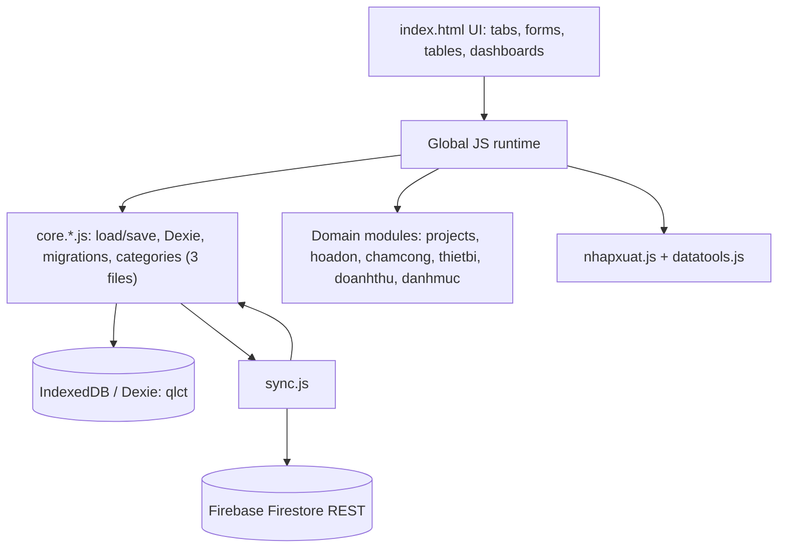
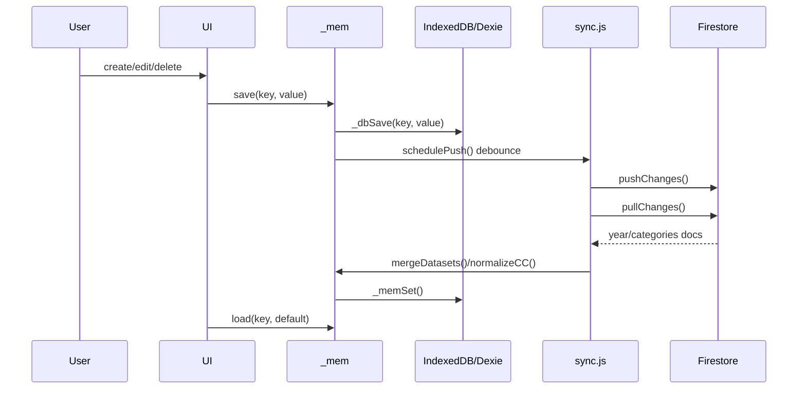

# AI_CONTEXT.md

Tài liệu ngữ cảnh kỹ thuật cho AI Code khi làm việc với project **App Quản Lý Chi Phí Công Trình**.

---

## 1. Tổng quan ứng dụng (Project Overview)

| Hạng mục | Mô tả |
|---|---|
| Loại ứng dụng | SPA tĩnh, Vanilla JS, không bundler, không ES module import/export |
| Entry point | `index.html` nạp toàn bộ CSS/JS bằng `<script>` tuần tự |
| Mục đích | Quản lý chi phí công trình: hóa đơn, chấm công, thiết bị, tiền ứng, doanh thu, công nợ, nhập/xuất dữ liệu |
| UI language | Tiếng Việt, domain text dùng thuật ngữ xây dựng/kế toán Việt Nam |
| Core tech | HTML, CSS, Vanilla JavaScript, IndexedDB qua Dexie, Firebase/Firestore REST sync, XLSX import/export, html2canvas export image |
| Runtime style | Global mutable state trên `window`/global scope; file sau gọi trực tiếp biến/hàm của file trước |

Kiến trúc tổng thể:



---

## 2. Thứ tự nạp Script (Script Load Order)

Thứ tự chính xác trong `index.html`:

| # | Script | Vai trò |
|---:|---|---|
| 1 | `https://cdnjs.cloudflare.com/ajax/libs/xlsx/0.18.5/xlsx.full.min.js` | Thư viện Excel |
| 2 | `https://cdnjs.cloudflare.com/ajax/libs/html2canvas/1.4.1/html2canvas.min.js` | Export UI/table thành ảnh |
| 3 | `https://unpkg.com/dexie@4/dist/dexie.min.js` | IndexedDB wrapper |
| 4 | `js/core/core.storage.js` | Lớp nền thấp nhất: `DEFAULTS`, `CATS`, `FB_CONFIG`, Dexie `db`, `DB_KEY_MAP`, `_mem`, `load/save`, pending sync counter (`_pendingChanges`, `_SYNC_DATA_KEYS`, `_incPending`, `_resetPending`, `_updateSyncBtnBadge`), `LAST_SYNC_KEY`, `mkRecord`, `mkUpdate`, autocomplete |
| 5 | `js/core/core.state-backup.js` | State orchestration: `DATA_VERSION`, `migrateData`, `_migrateHopDongKeys`, project lookup helpers, `BACKUP_KEYS`, backup/restore (`_snapshotNow`, `restoreFromBackup`, `renderBackupList`), `exportJSON`, `importJSON`, `importJSONFull`, `clearAllCache`, `afterDataChange`, `_reloadGlobals`, khởi tạo global `cats`, `cnRoles`, `invoices`, `filteredInvs`, `curPage`, `PG` |
| 6 | `js/core/core.cloud-cats-ui.js` | Cloud helpers: `fbReady`, compress/expand (Firestore format), `fsWrap/fsUnwrap`, `fbYearPayload`, `fbCatsPayload`, Firebase REST (`fsGet/fsSet`), `gsLoadAll`, sync dot UI, modal Firebase config (`openBinModal`, `fbSaveConfig`, `fbDisconnect`), `buildYearSelect`, `saveCats`, cat items soft-delete (`_syncCatItems`, `_rebuildCatArrsFromItems`, `_migrateCatItemsIfNeeded`), `showSyncBanner`, `_setSyncState` |
| 7 | `js/modules/projects/projects.model.js` | Domain model công trình: `PROJECT_STATUS`, `PROJECT_COMPANY`, `let projects = []`, `_saveProjects`, `rebuildCatCTFromProjects`, `createProject`, `updateProject`, `getProjectById`, `findProjectIdByName`, `getSortedProjects`, `getAllProjects`, `getProjectOptions`, `getProjectDays/Factor/Weight`, `getCompanyCost`, `allocateCompanyCost`, `canDeleteProject`, `resolveProjectName` |
| 8 | `js/modules/projects/projects.migration-selects.js` | Migration linking + shared select helpers: `migrateProjectLinks`, `deduplicateProjects`, `_buildProjOpts`, `_buildProjFilterOpts`, `_readPidFromSel`, `_checkProjectClosed` |
| 9 | `js/modules/projects/projects.ui.js` | Full UI tab Công Trình: `_fmtProjDate`, `_PT_STATUS_META`, `_PT_GROUP_LABELS`, `_PT_ORDER`, `_goTabWithCT`, `renderProjectsPage`, `renderCTOverview`, `_ctApply`, `_ctRenderGrid`, `openCTDetail`, `openCTCreateModal`, `saveCTCreate`, `openCTEditModal`, `saveCTEdit`, `quickCloseCT`, `confirmQuickClose`, `quickCompleteCT`, `confirmQuickComplete`, `confirmDeleteCT` |
| 10 | `js/legacy/tienich.js` | Utility, formatter, `buildInvoices()`, invoice cache |
| 11 | `js/modules/hoadon/hoadon.quick-entry.js` | Nhập hóa đơn nhanh, duplicate check, shared row/money helpers: `initTable`, `addRows`, `addRow`, `delRow`, `renumber`, `calcSummary`, `clearTable`, `saveAllRows`, `_showDupModal`, `closeDupModal`, `forceSaveAll`, `_ensureInvRef`, `_doSaveRows`, `calcRowMoney`, `getRowData` |
| 12 | `js/modules/hoadon/hoadon.sheet-grid.js` | Engine lưới nhập liệu giống Excel cho hóa đơn nhanh: selection, copy/paste vùng, keyboard navigation, autocomplete trực tiếp trong bảng |
| 13 | `js/modules/hoadon/hoadon.detail-entry.js` | Hóa đơn chi tiết nhiều dòng vật tư/nội dung: `goInnerSub`, `_initDetailFormSelects`, `renderDetailRowHTML`, `addDetailRow`, `delDetailRow`, `calcDetailRow`, `calcDetailTotals`, `generateDetailNd`, `saveDetailInvoice`, `clearDetailForm`, `_setSelectFlexible`, `openDetailEdit`, `getDetailRows` |
| 14 | `js/modules/hoadon/hoadon.list-trash.js` | Filter/render danh sách, sửa/xóa, thùng rác, hóa đơn trong ngày: `switchTatCaView`, `buildFilters`, `filterAndRender`, `renderTable`, `goTo`, `delInvoice`, `editCCInvoice`, `openEntryEdit`, `_resolveInvSource`, `editManualInvoice`, `trash` (global), `trashAdd`, `trashRestore`, `trashDeletePermanent`, `trashClearAll`, `renderTrash`, `renderTodayInvoices`, `refreshHoadonCtDropdowns` |
| 15 | `js/modules/danhmuc/danhmuc.categories.js` | Danh mục/settings: normalize, render settings, CT page, CN role, tbTen, rebuild selects, dedup cat arrays |
| 16 | `js/modules/tienung/tienung.core.js` | Tiền Ứng core: `ungRecords`, migration/normalize deletedAt/projectId, shared state cho entry/history |
| 17 | `js/modules/tienung/tienung.entry.js` | Form nhập tiền ứng nhiều dòng, đổi loại ứng, lưu/xóa dòng, rebuild selects |
| 18 | `js/modules/tienung/tienung.history.js` | Lịch sử tiền ứng, lọc/tìm kiếm, phân trang, xuất CSV/ảnh phiếu ứng |
| 19 | `js/modules/danhmuc/danhmuc.tools.js` | Wrapper backup/restore (`toolBackupNow`, `toolRestoreBackup`) |
| 20 | `js/modules/nhapxuat/nhapxuat.parsers.js` | Helper parse/normalize Excel + parser sheet 1–9: `_normStr`, `_parseDate`, `_pNum`, `_str`, `_sheetRows`, `_hasDiacritics`, `_deduplicateCatNames`, `_buildCanonMap`, `_dayOfWeek`, `_isEmptyRow`, `_formatCatName`, `_markDuplicateInBatch`, `_makeCatLookup`, `_makeCatLookupWithExtra`, `_resolveProvisionalProjectIds`, `_mkErr`, `_fmtErr`, `parseSheet1`–`parseSheet9`, `_DANHMUC_GROUP_MAP` |
| 21 | `js/modules/nhapxuat/nhapxuat.import.js` | Import session, detect sheet, preview, apply import, log: `_isDupInvQ/D/Ung/Thu/Tb/Tp/CC`, `_detectSheetType`, `_importSession`, `_doImportParse`, `_markDuplicates`, `_showImportPreviewNew`, `_toggleAllImportSheets`, `_applyImport`, `_generateImportLog`, `openImportModal`, `handleImportFile` |
| 22 | `js/modules/nhapxuat/nhapxuat.export.js` | Export modal, Excel sheet builders, CSV exports: `openExportModal`, `_buildSheet`, `buildHoaDonNhanh/ChiTiet/ChamCong/TienUng/ThietBi/DanhMuc/HopDongChinh/ThuTien/HopDongThauPhu/HuongDan`, `exportExcel`, `_doExport`, `exportEntryCSV`, `exportAllCSV`, `toolImportExcel`, `toolExportExcel` |
| 23 | `js/legacy/datatools.js` | Dashboard, reset/delete-year, data health, migration tools |
| 24 | `js/modules/chamcong/chamcong.core.js` | Global data (`ccData`, `ccOffset`, `ccHistPage`, `ccTltPage`), constants (`CC_DAY_LABELS`, `CC_DATE_OFFSETS`), date/week helpers, normalize/category helpers, CT selector helpers: `_dedupCC`, `round1`, `toggleCCDebtCols`, `_calcDebtBefore`, `isoFromParts`, `ccSundayISO`, `ccSaturdayISO`, `snapToSunday`, `weekLabel`, `ccAllNames`, `rebuildCCNameList`, `normalizeAllChamCong`, `rebuildCCCategories`, `updateTopFromCC`, `populateCCCtSel`, `updateCCSaveBtn`, `onCCCtSelChange`, `_fmtDate` |
| 25 | `js/modules/chamcong/chamcong.week-form.js` | Form nhập tuần, build table, row handlers, lưu/copy/paste: `initCC`, `ccGoToWeek`, `ccPrevWeek`, `ccNextWeek`, `onCCFromChange`, `loadCCWeekForm`, `buildCCTable`, `addCCWorker`, `addCCRow`, `buildCCRow`, `onCCNameInput`, `onCCDayKey`, `onCCWageKey`, `onCCMoneyKey`, `calcCCRow`, `delCCRow`, `renumberCC`, `updateCCSumRow`, `saveCCWeek`, `clearCCWeek`, `copyCCWeek`, `pasteCCWeek`; global `ccClipboard` |
| 26 | `js/modules/chamcong/chamcong.history-reports.js` | Lịch sử, tổng lương tuần, load/delete, CSV exports, phiếu lương/ảnh: `buildCCHistFilters`, `renderCCHistory`, `ccHistGoTo`, `renderCCTLT`, `fmtK`, `updateTLTSelectedSum`, `exportCCTLTCSV`, `ccTltGoTo`, `loadCCWeekById`, `delCCWeekById`, `delCCWorker`, `exportCCWeekCSV`, `exportCCHistCSV`, `removeVietnameseTones`, `xuatPhieuLuong`, `exportUngToImage` |
| 27 | `js/legacy/thietbi.js` | Quản lý thiết bị/kho tổng |
| 28 | `js/modules/doanhthu/doanhthu.core.js` | Global data (`hopDongData`, `thuRecords`, `thauPhuContracts`), state, shared helpers: `calcHopDongValue`, `_migrateHopDongSL`, `_normalizeThuProjectIds`, `bindItemsToTable`, `dtGoSub`, `dtPopulateSels`, `fmtInputMoney`, `_readMoneyInput`, `_dtPaginationHtml`, `_dtMatchProjFilter`, `_dtMatchHDCFilter`, pagination state, CT filter |
| 29 | `js/modules/doanhthu/doanhthu.forms.js` | Form save/edit/delete và render tables: `hdcUpdateTotal`, `saveHopDongChinh`, `editHopDongChinh`, `delHopDongChinh`, `renderHdcTable`, `saveThuRecord`, `editThuRecord`, `delThuRecord`, `renderThuTable`, `hdtpUpdateTotal`, `saveHopDongThauPhu`, `editHopDongThauPhu`, `delHopDongThauPhu`, `renderHdtpTable` |
| 30 | `js/modules/doanhthu/doanhthu.reports-export.js` | Công nợ, Lãi/Lỗ, init, copy/paste KLCT, xuất phiếu ảnh: `renderCongNoThauPhu`, `_renderCongNoTable`, `renderCongNoNhaCungCap`, `renderLaiLo`, `initDoanhThu`, `copyKLCT`, `pasteKLCT`, `exportHdcToImage`, `exportHdtpToImage`, `exportThuToImage`; gán `window.initDoanhThu`, `window.dtGoSub` |
| 31 | `js/sync/sync.v2format.js` | V2 Firestore format helpers — human-readable document IDs, field maps, typed value converters, push subcollection (year + meta), pull subcollection (year), debug helper |
| 32 | `js/sync/sync.v2meta.js` | V2 Meta Pull Module — đọc 4 loại meta từ V2 subcollections song song: `_v2PullProjects`, `_v2PullUsers`, `_v2PullDanhMuc`, `_v2PullHopDong`, `_v2PullMetaFull`; `_mergeUsersV2` (password-safe merge) |
| 33 | `js/sync/sync.js` | Sync engine Firestore, conflict merge, auto/manual sync |
| 34 | `js/app/auth.js` | Auth/session/role UI: đăng nhập, đăng xuất, đổi thông tin tài khoản, quản lý `users_v1`, phân quyền `admin`/`giamdoc`/`ketoan` |
| 35 | `js/app/main.js` | Bootstrap khởi động cuối cùng: init, year filter, tab rendering, role UI, auto-sync |

Thứ tự này quan trọng vì code không dùng module system. Nhóm `core.*.js` **bắt buộc nạp trước tất cả module nghiệp vụ**. Các file dùng chung biến/hàm global như `load`, `save`, `cats`, `projects`, `invoices`, `ccData`, `hopDongData`, `buildInvoices`, `pullChanges`, `manualSync`. Nếu đổi thứ tự, module có thể đọc biến chưa khai báo hoặc render trước khi `dbInit()` populate `_mem`.

> **`sync.v2format.js` (vị trí 31)** phải nạp **trước `sync.v2meta.js` và `sync.js`** vì cả hai file sau đều dùng `_v2FsGetSubcollDocs`, `_v2FromFsFields`, `_v2ReverseApplyFieldMap`, `_V2_FIELD_MAPS`, `_V2_SUBCOLL_NAME` từ file này. File này không có side-effect lúc nạp, sử dụng `FS_BASE()` và `FB_CONFIG` từ `core.storage.js` (vị trí 4).

> **`sync.v2meta.js` (vị trí 32)** phải nạp **sau `sync.v2format.js`** (phụ thuộc các helpers V2) và **trước `sync.js`** (pullChanges gọi `_v2PullMetaFull`). File không có side-effect lúc nạp.

---

## 3. Sơ đồ thư mục (Directory Structure)

```text
index.html                    ← Entry point SPA
AI_CONTEXT.md
assets/
  css/
    style.css                 ← Stylesheet duy nhất

js/
  core/                       ← Nạp đầu tiên, nền tảng toàn app
    core.storage.js
    core.state-backup.js
    core.cloud-cats-ui.js

  modules/                    ← Các module nghiệp vụ đã tách
    hoadon/
      hoadon.quick-entry.js
      hoadon.sheet-grid.js
      hoadon.detail-entry.js
      hoadon.list-trash.js
    projects/
      projects.model.js
      projects.migration-selects.js
      projects.ui.js
    danhmuc/
      danhmuc.categories.js
      danhmuc.tools.js
    tienung/
      tienung.core.js
      tienung.entry.js
      tienung.history.js
    nhapxuat/
      nhapxuat.parsers.js
      nhapxuat.import.js
      nhapxuat.export.js
    chamcong/
      chamcong.core.js
      chamcong.week-form.js
      chamcong.history-reports.js
    doanhthu/
      doanhthu.core.js
      doanhthu.forms.js
      doanhthu.reports-export.js

  legacy/                     ← File chưa tách module, vẫn ở dạng đơn khối
    tienich.js
    hoadon.js
    datatools.js
    thietbi.js

  sync/
    sync.v2format.js          ← V2 Firestore format helpers (push year + meta, pull year)
    sync.v2meta.js            ← V2 Meta Pull Module (pull projects/users/catItems/hopDong)
    sync.js                   ← Sync engine Firestore

  app/
    auth.js
    main.js                   ← Bootstrap cuối cùng
```

**Lưu ý tổ chức thư mục:**
- Thư mục chỉ là tổ chức **vật lý** — không phải module system, không dùng `import/export`.
- Toàn bộ file vẫn chạy global scope qua `<script>` tuần tự trong `index.html`.
- `js/legacy/` chứa các file chưa được tách module; có thể tách thêm trong tương lai theo cùng pattern.
- Khi thêm file mới: phải thêm `<script src="...">` vào `index.html` đúng thứ tự và cập nhật `AI_CONTEXT.md`.

---

## 4. Kiến trúc lưu trữ (Storage Architecture)

| Layer | Thành phần | Vai trò |
|---|---|---|
| Source of truth local | IndexedDB qua Dexie DB `qlct` | Nguồn dữ liệu gốc khi app chạy offline-first |
| Memory snapshot | `_mem` trong `core.js` | Cache runtime; `load(k, def)` chỉ đọc từ `_mem` sau `dbInit()` |
| Write path | `save(k, v)` | Cập nhật `_mem`, ghi Dexie bằng `_dbSave()`, invalidate invoice cache, đánh dấu pending, debounce sync |
| Sync cloud | `sync.js` + Firebase/Firestore REST | Pull/merge/push dữ liệu theo năm và document categories |
| LocalStorage | Config/session only | Lưu Firebase config, `deviceId`, session user, pending marker, block-pull marker; không là nguồn dữ liệu nghiệp vụ |

Dexie physical schema:

| Dexie table | Key/index | Logical keys |
|---|---|---|
| `invoices` | `id, updatedAt` | `inv_v3` |
| `attendance` | `id, updatedAt` | `cc_v2` |
| `equipment` | `id, updatedAt` | `tb_v1` |
| `ung` | `id, updatedAt` | `ung_v1` |
| `revenue` | `id, updatedAt` | `thu_v1` |
| `settings` | `id` | `projects_v1`, `hopdong_v1`, `thauphu_v1`, `trash_v1`, `users_v1`, `cat_ct_years`, `cat_cn_roles`, `cat_items_v1` |

Offline-first data flow:



Sync rules:

| Rule | Mô tả |
|---|---|
| Conflict resolution | `resolveConflict(local, cloud)`: tombstone (`deletedAt`) ưu tiên, sau đó `updatedAt` mới hơn thắng |
| Multi-year sync | `_getAllLocalYears()` gom năm từ `inv_v3`, `ung_v1`, `cc_v2`, `tb_v1`, `thu_v1`; push/pull theo year document |
| Categories sync | Document categories chứa: <br> - `cat_items_v1`: { [type]: { id, name, isDeleted, updatedAt }[] } (Master category storage) <br> - `cat_ct`: string[] (Derived from projects_v1) <br> - `cat_ct_years`: { [ctName]: number } <br> - `cat_loai`, `cat_ncc`, `cat_nguoi`, `cat_tp`, `cat_cn`, `cat_tbteb`: string[] (Derived from cat_items_v1) |
| Pull guard | `_blockPullUntil`/`localStorage._blockPullUntil` chặn pull sau reset/import để tránh cloud cũ ghi đè local mới |
| Pending | `_pendingChanges` và `_PENDING_KEY` giúp hiển thị trạng thái còn thay đổi chưa sync |
| **V2 Firestore Subcollection** | Cấu trúc: parent document chứa summary fields (tiếng Việt, typed) + subcollection `ban_ghi/` chứa từng record riêng lẻ với human-readable document ID (`{ngay}_{slug}_{tien}_{uid6}`). **Push** (`sync.v2format.js`): chạy sau manual sync (không chạy auto-debounce 30s). Incremental: lần đầu full write, lần sau chỉ ghi record `updatedAt > lastPush`, xóa `deletedAt > lastPush`. Timestamp `lastPush` ở localStorage `_v2SubcollLastPush`. **Pull year** (`sync.v2format.js`): `_v2PullYearFull(yr)` đọc 5 loại năm từ V2 subcollections. **Pull meta** (`sync.v2meta.js`): `_v2PullMetaFull()` đọc 4 loại meta song song — V2 là **primary read source** cho cả year data và meta data; V1 cats/year docs chỉ còn là fallback khi V2 chưa có data. `_mergeUsersV2` đảm bảo password không bị mất khi merge (V2 không lưu password). `meta_danh_muc` parent document lưu thêm `cn_roles` + `ct_years` để pull về được. |

---

## 5. Sơ đồ dữ liệu (Data Model)

| Logical key | Kiểu | Object chính | Fields quan trọng |
|---|---|---|---|
| `inv_v3` | `Array<Object>` | Hóa đơn | `id:string`, `ngay:YYYY-MM-DD`, `congtrinh:string`, `projectId:string|null`, `loai:string`, `nguoi:string`, `ncc:string`, `nd:string`, `tien:number`, `thanhtien:number`, `sl:number`, `items:array?`, `source:string?`, `ccKey:string?`, `createdAt:number`, `updatedAt:number`, `deletedAt:number|null`, `deviceId:string` |
| `cc_v2` | `Array<Object>` | Chấm công tuần | `id:string`, `fromDate:YYYY-MM-DD`, `toDate:YYYY-MM-DD`, `ct:string`, `projectId:string|null`, `ctPid:string?`, `workers:array`, `createdAt:number`, `updatedAt:number`, `deletedAt:number|null`, `deviceId:string` |
| `cc_v2.workers[]` | `Array<Object>` | Dòng công nhân | `name:string`, `d:number[7]`, `luong:number`, `phucap:number`, `hdmuale:number`, `tru:number`, `loanAmount:number`, `nd:string`, `role:string?` |
| `tb_v1` | `Array<Object>` | Thiết bị | `id:string`, `ct:string`, `projectId:string|null`, `ten:string`, `soluong:number`, `tinhtrang:string`, `nguoi:string`, `ghichu:string`, `ngay:string`, metadata |
| `ung_v1` | `Array<Object>` | Tiền ứng | `id:string`, `ngay:string`, `loai:'thauphu'|'nhacungcap'|'congnhan'`, `tp:string`, `congtrinh:string`, `projectId:string|null`, `tien:number`, `nd:string`, metadata |
| `thu_v1` | `Array<Object>` | Thu tiền | `id:string`, `ngay:string`, `congtrinh:string`, `projectId:string|null`, `tien:number`, `nguoi:string`, `nd:string`, metadata |
| `projects_v1` | `Array<Object>` | Master công trình | `projects_v1`: { id, name, type, status, startDate, endDate, closedDate, note, createdYear, createdAt, updatedAt, deletedAt } <br> - Special ID: `COMPANY` (CÔNG TY) for overhead costs. <br> - Statuses: `planning`, `active`, `completed`, `closed`. <br> - Types: `CT` (Công trình), `SC` (Sửa chữa), `OTHER`. |
| `hopdong_v1` | `Object map` | Hợp đồng chính | Key ưu tiên là `projectId`, legacy fallback là tên CT. Value: `giaTri:number`, `giaTriphu:number`, `phatSinh:number`, `nguoi:string`, `ngay:string`, `projectId:string`, `items:array?`, `updatedAt:number`, `deletedAt:number|null` |
| `thauphu_v1` | `Array<Object>` | Hợp đồng thầu phụ | `id:string`, `ngay:string`, `congtrinh:string`, `projectId:string|null`, `thauphu:string`, `giaTri:number`, `phatSinh:number`, `nd:string`, `items:array?`, metadata |
| `trash_v1` | `Array/Object` | Thùng rác hóa đơn | Lưu record bị đưa vào trash; vẫn cần giữ metadata để phục hồi/đối chiếu |
| `users_v1` | `Array<Object>` | User/auth | `id:string`, `username:string`, `password:string`, `role:'admin'|'giamdoc'|'ketoan'`, `updatedAt:number`, `sessionVersion:number`, `sessions:array` |
| `cat_items_v1` | `Object<string, Array>` | Danh mục có soft delete | Type keys: `loai`, `ncc`, `nguoi`, `tp`, `cn`, `tbteb`; item gồm `id:string`, `name:string`, `isDeleted:boolean`, `updatedAt:number` |
| `cat_cn_roles` | `Object` | Vai trò công nhân | `{ [workerName:string]: string }` |
| `cat_ct_years` | `Object` | Năm công trình | `{ [projectName:string]: number }` |

Metadata chuẩn cho record nghiệp vụ:

| Field | Kiểu | Quy tắc |
|---|---|---|
| `id` | `string` | UUID từ `crypto.randomUUID()`; legacy id có migration trong Data Tools |
| `createdAt` | `number` | Unix ms khi tạo; giữ nguyên khi edit |
| `updatedAt` | `number` | Unix ms khi sửa/import/apply; dùng cho LWW |
| `deletedAt` | `number|null` | Soft delete/tombstone cho record nghiệp vụ |
| `deviceId` | `string` | Sinh một lần trong `sync.js`, lưu localStorage |

---

## 6. Hàm và Biến Global quan trọng (Key Functions & Globals)

| File | Globals quan trọng | Hàm xương sống |
|---|---|---|
| `js/core/core.storage.js` | `DEFAULTS`, `CATS`, `FB_CONFIG`, `FS_BASE`, `FB_CFG_KEY`, `db`, `DB_KEY_MAP`, `_mem`, `_pendingChanges`, `_blockPullUntil`, `LAST_SYNC_KEY`, `_SYNC_DATA_KEYS` | `_loadLS()`, `_saveLS()`, `_memSet()`, `dedupById()`, `mergeUnique()`, `_dbSave()`, `dbInit()`, `_incPending()`, `_resetPending()`, `_updateSyncBtnBadge()`, `load()`, `save()`, `mkRecord()`, `mkUpdate()`, `buildNDFromItems()`, `_normViStr()`, `_acHide()`, `_acShow()` |
| `js/core/core.state-backup.js` | `DATA_VERSION`, `DATA_VERSION_KEY`, `BACKUP_KEYS`, `BACKUP_KEY`, `cats`, `cnRoles`, `invoices`, `filteredInvs`, `curPage`, `PG` | `migrateData()`, `_migrateHopDongKeys()`, `_hdLookup()`, `_hdKeyOf()`, `_getProjectById()`, `_getProjectNameById()`, `_resolveCtName()`, `_restoreStore()`, `clearAllCache()`, `getState()`, `afterDataChange()`, `_reloadGlobals()`, `_snapshotNow()`, `getBackupList()`, `restoreFromBackup()`, `renderBackupList()`, `exportJSON()`, `importJSON()`, `importJSONFull()` |
| `js/core/core.cloud-cats-ui.js` | `lastSyncUI`, `_CATITEM_TYPE_MAP` | `fbReady()`, `compressInv()`, `expandInv()`, `compressCC()`, `expandCC()`, `compressUng()`, `expandUng()`, `compressTb()`, `expandTb()`, `fsWrap()`, `fsUnwrap()`, `fbDocYear()`, `fbDocCats()`, `fbYearPayload()`, `fbCatsPayload()`, `fsUrl()`, `fsGet()`, `fsSet()`, `estimateYearKb()`, `gsLoadAll()`, `updateJbBtn()`, `openBinModal()`, `closeBinModal()`, `fbSaveConfig()`, `fbDisconnect()`, `reloadFromCloud()`, `syncNow()`, `buildYearSelect()`, `saveCats()`, `_catNormKey()`, `_dedupCatItemsNow()`, `_syncCatItems()`, `_rebuildCatArrsFromItems()`, `_migrateCatItemsIfNeeded()`, `showSyncBanner()`, `hideSyncBanner()`, `_setSyncState()` |
| `js/app/main.js` | `activeYears`, `activeYear`, `currentUser`, `_roleObserver`, `_userHeartbeatTimer`, `window._dataReady` | `init()`, `initAuth()`, `goPage()`, `renderActiveTab()`, `buildYearSelect()`, `onYearChange()`, `applyRoleUI()`, `loadUsers()`, `saveUsers()` |
| `js/modules/projects/projects.model.js` | `PROJECT_STATUS`, `PROJECT_COMPANY`, `projects`, `_PROJ_DATE_RE`, `_VALID_STATUSES`, `_PROJ_VALID_TYPES`, `_PROJ_FACTORS` | `_projTypeByName()`, `_isValidProject()`, `cleanupInvalidProjects()`, `_saveProjects()`, `rebuildCatCTFromProjects()`, `_migrateProjectDates()`, `getProjectAutoStartDate()`, `createProject()`, `updateProject()`, `getProjectById()`, `findProjectIdByName()`, `getSortedProjects()`, `getAllProjects()`, `getProjectOptions()`, `getProjectDays()`, `getProjectFactor()`, `getProjectWeight()`, `getCompanyCost()`, `allocateCompanyCost()`, `canDeleteProject()`, `resolveProjectName()` |
| `js/modules/projects/projects.migration-selects.js` | _(không có global riêng)_ | `migrateProjectLinks()`, `deduplicateProjects()`, `_buildProjOpts()`, `_buildProjFilterOpts()`, `_readPidFromSel()`, `_checkProjectClosed()` |
| `js/modules/projects/projects.ui.js` | `_fmtProjDate`, `_PT_STATUS_META`, `_PT_GROUP_LABELS`, `_PT_ORDER`, `_ctSearch`, `_ctFStatus`, `_ctFType`, `_ctFLaiLo` | `_goTabWithCT()`, `renderProjectsPage()`, `_ctGetCosts()`, `_buildInvoiceMap()`, `_ctGetCostsFromMap()`, `_ptDuration()`, `_ptStatusBadge()`, `_ptStatBox()`, `_ptDurationDays()`, `renderCTOverview()`, `_ctApply()`, `_ctRenderGrid()`, `openCTDetail()`, `openCTCreateModal()`, `saveCTCreate()`, `openCTEditModal()`, `saveCTEdit()`, `quickCloseCT()`, `confirmQuickClose()`, `quickCompleteCT()`, `confirmQuickComplete()`, `confirmDeleteCT()` |
| `js/legacy/tienich.js` | `invoiceCache`, numeric keypad state | `buildInvoices()`, `getInvoicesCached()`, `clearInvoiceCache()`, format/date utilities |
| `js/modules/hoadon/hoadon.quick-entry.js` | _(không có global riêng ngoài scope của module)_ | `initTable()`, `addRows()`, `refreshEntryDropdowns()`, `addRow()`, `delRow()`, `renumber()`, `calcSummary()`, `clearTable()`, `saveAllRows()`, `_showDupModal()`, `closeDupModal()`, `forceSaveAll()`, `_ensureInvRef()`, `_doSaveRows()`, `calcRowMoney()`, `getRowData()` |
| `js/modules/hoadon/hoadon.sheet-grid.js` | Sheet/grid interaction state | Excel-like selection, copy/paste vùng, keyboard navigation, autocomplete trong bảng nhập nhanh |
| `js/modules/hoadon/hoadon.detail-entry.js` | _(không có global riêng)_ | `goInnerSub()`, `_initDetailFormSelects()`, `renderDetailRowHTML()`, `addDetailRow()`, `delDetailRow()`, `calcDetailRow()`, `calcDetailTotals()`, `generateDetailNd()`, `saveDetailInvoice()`, `clearDetailForm()`, `_setSelectFlexible()`, `openDetailEdit()`, `getDetailRows()` |
| `js/modules/hoadon/hoadon.list-trash.js` | `trash` (global shared state — gán lại bởi `_reloadGlobals()`) | `switchTatCaView()`, `buildFilters()`, `filterAndRender()`, `renderTable()`, `goTo()`, `delInvoice()`, `editCCInvoice()`, `openEntryEdit()`, `_resolveInvSource()`, `editManualInvoice()`, `trashAdd()`, `trashRestore()`, `trashDeletePermanent()`, `trashClearAll()`, `renderTrash()`, `renderTodayInvoices()`, `refreshHoadonCtDropdowns()` |
| `js/modules/danhmuc/danhmuc.categories.js` | `_catNamesMigrated`, `normalizeName`, `normalizeKey` | `renderCtPage()`, `showCtModal()`, `closeModal()`, `normalizeName()`, `normalizeKey()`, `_isDmItemUsedInYear()`, `_isDmItemUsedAnytime()`, `scanAndFixAllDataFormats()`, `_migrateCatNamesFormat()`, `renderSettings()`, `_dmFilterCard()`, `renderCTItem()`, `renderItem()`, `renderCNItem()`, `updateCNRole()`, `renderTbTenItem()`, `syncCNRoles()`, `startEdit()`, `cancelEdit()`, `finishEdit()`, `addItem()`, `isItemInUse()`, `delItem()`, `_dedupCatArr()`, `rebuildEntrySelects()` |
| `js/modules/danhmuc/danhmuc.tools.js` | _(không có global riêng)_ | `toolBackupNow()`, `toolRestoreBackup()` |
| `js/modules/tienung/tienung.core.js` | `ungRecords`, `filteredUng`, `ungPage`, `UNG_TP_PG`, `ungTpPage`, `_editingUngId` | `_normalizeUngDeletedAt()`, `_normalizeUngProjectIds()`, shared Tiền Ứng state/migration helpers |
| `js/modules/tienung/tienung.entry.js` | _(không có global riêng)_ | `renderUngPage()`, entry row builders, `saveAllUngRows()`, add/delete/clear tiền ứng rows, rebuild selects |
| `js/modules/tienung/tienung.history.js` | _(không có global riêng)_ | `renderUngTable()`, `renderUngThauPhuPage()`, `editUngRecord()`, history filter/pagination, CSV/export image helpers |
| `js/modules/nhapxuat/nhapxuat.parsers.js` | `_DANHMUC_GROUP_MAP` | `_normStr()`, `_parseDate()`, `_pNum()`, `_str()`, `_sheetRows()`, `_hasDiacritics()`, `_deduplicateCatNames()`, `_buildCanonMap()`, `_dayOfWeek()`, `_isEmptyRow()`, `_formatCatName()`, `_markDuplicateInBatch()`, `_makeCatLookup()`, `_makeCatLookupWithExtra()`, `_resolveProvisionalProjectIds()`, `_mkErr()`, `_fmtErr()`, `parseSheet1()`–`parseSheet9()` |
| `js/modules/nhapxuat/nhapxuat.import.js` | `_importSession` | `_isDupInvQ()`, `_isDupInvD()`, `_isDupUng()`, `_isDupThu()`, `_isDupTb()`, `_isDupTp()`, `_isDupCC()`, `_detectSheetType()`, `_doImportParse()`, `_markDuplicates()`, `_showImportPreviewNew()`, `_toggleAllImportSheets()`, `_applyImport()`, `_generateImportLog()`, `openImportModal()`, `handleImportFile()` |
| `js/modules/nhapxuat/nhapxuat.export.js` | _(không có global riêng)_ | `openExportModal()`, `_buildSheet()`, `buildHoaDonNhanh()`, `buildHoaDonChiTiet()`, `buildChamCong()`, `buildTienUng()`, `buildThietBi()`, `buildDanhMuc()`, `buildHopDongChinh()`, `buildThuTien()`, `buildHopDongThauPhu()`, `buildHuongDan()`, `exportExcel()`, `_doExport()`, `exportEntryCSV()`, `exportAllCSV()`, `toolImportExcel()`, `toolExportExcel()` |
| `js/modules/chamcong/chamcong.core.js` | `ccData`, `ccOffset`, `ccHistPage`, `ccTltPage`, `CC_PG_HIST`, `CC_PG_TLT`, `CC_DAY_LABELS`, `CC_DATE_OFFSETS`, `_ccDebtColsHidden` | `_dedupCC()`, `round1()`, `toggleCCDebtCols()`, `_applyCCDebtColsVisibility()`, `_calcDebtBefore()`, `isoFromParts()`, `ccSundayISO()`, `ccSaturdayISO()`, `snapToSunday()`, `viShort()`, `weekLabel()`, `iso()`, `ccAllNames()`, `rebuildCCNameList()`, `normalizeAllChamCong()`, `rebuildCCCategories()`, `updateTopFromCC()`, `populateCCCtSel()`, `updateCCSaveBtn()`, `onCCCtSelChange()`, `_fmtDate` |
| `js/modules/chamcong/chamcong.week-form.js` | `ccClipboard` | `initCC()`, `ccGoToWeek()`, `ccPrevWeek()`, `ccNextWeek()`, `onCCFromChange()`, `loadCCWeekForm()`, `buildCCTable()`, `addCCWorker()`, `addCCRow()`, `buildCCRow()`, `onCCNameInput()`, `onCCDayKey()`, `onCCWageKey()`, `onCCMoneyKey()`, `calcCCRow()`, `delCCRow()`, `renumberCC()`, `updateCCSumRow()`, `saveCCWeek()`, `clearCCWeek()`, `copyCCWeek()`, `pasteCCWeek()` |
| `js/modules/chamcong/chamcong.history-reports.js` | _(không có global riêng)_ | `buildCCHistFilters()`, `renderCCHistory()`, `ccHistGoTo()`, `renderCCTLT()`, `fmtK()`, `updateTLTSelectedSum()`, `exportCCTLTCSV()`, `ccTltGoTo()`, `loadCCWeekById()`, `delCCWeekById()`, `delCCWorker()`, `exportCCWeekCSV()`, `exportCCHistCSV()`, `removeVietnameseTones()`, `xuatPhieuLuong()`, `exportUngToImage()` |
| `js/legacy/thietbi.js` | `tbData`, `tbPage`, `khoPage` | `migrateTbData()`, `tbSaveRows()`/device save helpers, `tbRenderList()`, `renderKhoTong()` |
| `js/modules/doanhthu/doanhthu.core.js` | `hopDongData`, `thuRecords`, `thauPhuContracts`, `_hdcItems`, `_hdtpItems`, `_hdcPage`, `_hdtpPage`, `_thuPage`, `DT_PG`, `_dtCtFilter` | `calcHopDongValue()`, `_migrateHopDongSL()`, `_normalizeThuProjectIds()`, `_initDoanhThuAddons()`, `updateGlobalTotals()`, `bindItemsToTable()`, `fmtInputMoney()`, `_readMoneyInput()`, `_dtInYear()`, `_dtPaginationHtml()`, `_dtMatchProjFilter()`, `_dtMatchHDCFilter()`, `dtPopulateCtFilter()`, `dtSetCtFilter()`, `dtGoSub()`, `dtEnsureCongNoSubtab()`, `dtPopulateSels()`, `_dtAddCT()`, `_dtAddTP()` |
| `js/modules/doanhthu/doanhthu.forms.js` | _(không có global riêng)_ | `hdcUpdateTotal()`, `saveHopDongChinh()`, `_hdcResetForm()`, `editHopDongChinh()`, `delHopDongChinh()`, `renderHdcTable()`, `saveThuRecord()`, `editThuRecord()`, `_thuCancelEdit()`, `_thuResetForm()`, `delThuRecord()`, `renderThuTable()`, `hdtpUpdateTotal()`, `saveHopDongThauPhu()`, `_hdtpResetForm()`, `editHopDongThauPhu()`, `delHopDongThauPhu()`, `renderHdtpTable()` |
| `js/modules/doanhthu/doanhthu.reports-export.js` | `window.initDoanhThu`, `window.dtGoSub` (top-level assignments) | `renderCongNoThauPhu()`, `_renderCongNoTable()`, `renderCongNoNhaCungCap()`, `renderLaiLo()`, `initDoanhThu()`, `copyKLCT()`, `pasteKLCT()`, `exportHdcToImage()`, `exportHdtpToImage()`, `exportThuToImage()` |
| `js/sync/sync.v2format.js` | `_V2_YEAR_TYPES`, `_V2_META_TYPES`, `_V2_YEAR_KEY_MAP`, `_V2_FIELD_MAPS`, `_V2_SUBCOLL_NAME`, `_V2_LAST_PUSH_KEY`, `_V2_ID_SCHEMA_VER` | **Formatters:** `_v2FmtMoney(n)`, `_v2FmtDateTime(ts)`, `_v2FmtCtList(records,ctField)`, `_v2TypeLabel(type)` — **ID helpers:** `_v2Slug(s,maxLen)`, `_v2FmtMoneyShort(n)`, `_v2MakeDocId(type,rec)`, `_v2DocYearId(type,yr)`, `_v2DocMetaId(type)` — **Converters (to FS):** `_v2ToFsValue(v)`, `_v2ToFsFields(obj)`, `_v2ApplyFieldMap(rec,map,exclude)` — **Converters (from FS):** `_v2FromFsValue(v)`, `_v2FromFsFields(fields)`, `_v2ReverseApplyFieldMap(fsObj,map)` — **REST helpers:** `_v2FsPatchDoc(path,fields)`, `_v2FsListIds(parentId,coll)`, `_v2FsBatchWrite(writes[])`, `_v2FsGetSubcollDocs(parentDocId,collName)` — **Push:** `_v2GetLastPush(id)`, `_v2SetLastPush(id,ts)`, `_v2ResetLastPush(id)`, `_v2ResetAllLastPush()`, `_v2PushSubcoll(parentId,records,map,summary,idFn?)`, `_v2PushSubcollFull(parentId,records,map,summary,idField?)`, `_v2PushYear(yr)`, `_v2PushMeta()` — **Pull year:** `_v2PullSubcoll(parentDocId,fieldMap)`, `_v2PullYearFull(yr)` — **Debug:** `debugV2(filter?)` |
| `js/sync/sync.v2meta.js` | _(không có global state)_ | **Pull meta từ V2 subcollections:** `_v2PullProjects()` → projects array, `_v2PullUsers()` → users array (không có password), `_mergeUsersV2(localUsers,cloudUsers)` (restore password từ local), `_v2PullDanhMuc()` → `{ catItems, cnRoles, ctYears }` (items từ subcollection + cnRoles/ctYears từ parent doc fields), `_v2PullHopDong()` → `{ hopDong, thauPhu }`, `_v2PullMetaFull()` → tất cả 4 loại song song qua `Promise.allSettled` |
| `js/sync/sync.js` | `DEVICE_ID`, `_syncPulling`, `_syncPushing`, `_pushTimer` | `mkRecord()`, `stampEdit()`, `softDeleteById()`, `resolveConflict()`, `mergeDatasets()`, `normalizeCC()`, `pullChanges()`, `pushChanges()`, `schedulePush()`, `manualSync()`, `startAutoSync()`, `stampNew()` |
| `js/app/auth.js` | `currentUser`, role/session helpers | `initAuth()`, login/logout/account settings, user/session persistence, role UI helpers |
| `js/legacy/datatools.js` | `selectedCT`, migration dry-run reports | `renderDashboard()`, `toolDeleteYear()`, `_doDeleteYear()`, `toolResetAll()`, `_doResetAll()`, `scanDataHealth()`, `normalizeProjectLinks()`, `migrateIdsToUUID()` |

Lưu ý đặc biệt: `buildInvoices()` không chỉ đọc `inv_v3`; nó tạo hóa đơn tổng hợp từ hóa đơn manual và dữ liệu chấm công (`cc_v2`) gồm `hdmuale` và tiền công nhân. Các render/report hóa đơn nên dùng `getInvoicesCached()` hoặc `buildInvoices()` thay vì chỉ đọc `invoices`.

---

## 7. Quy tắc lập trình (Coding Rules)

| Quy tắc | Cách áp dụng trong code |
|---|---|
| Giữ Vanilla JS/global style | Classic script, global scope — **không dùng ES module `import/export`**. Hàm cần gọi từ HTML inline phải ở global scope hoặc gán `window.fn = fn`. |
| Nhóm `hoadon.*.js` nạp sau tienich.js, trước danhmuc.*.js | `hoadon.quick-entry.js` → `hoadon.sheet-grid.js` → `hoadon.detail-entry.js` → `hoadon.list-trash.js`. File cũ `js/legacy/hoadon.js` đã tách thành nhóm này — không nạp lại. `hoadon.quick-entry.js` nạp trước vì chứa shared helpers `calcRowMoney()`, `getRowData()`, `_ensureInvRef()`, `_doSaveRows()` mà `detail-entry.js` dùng. `hoadon.sheet-grid.js` phụ trách thao tác Excel-like trong bảng nhập nhanh, nên phải nạp sau quick-entry DOM/row helpers và trước các thao tác UI phụ thuộc. `trash` là global shared state (`let trash = load('trash_v1', [])`) trong `list-trash.js` — có thể được reassign bởi `_reloadGlobals()`. `DEVICE_ID` (từ `sync.js`) chỉ dùng trong body của `delInvoice()` và `trashRestore()` trong list-trash — an toàn vì chỉ gọi sau khi app load đầy đủ. |
| Nhóm `core.*.js` nạp trước tất cả | `core.storage.js` → `core.state-backup.js` → `core.cloud-cats-ui.js` phải nạp trước mọi module nghiệp vụ. File cũ `core.js` đã được tách thành 3 file này — không nạp lại `core.js`. |
| Nhóm `projects.*.js` nạp sau core, trước tienich | `projects.model.js` → `projects.migration-selects.js` → `projects.ui.js`. File cũ `projects.js` đã tách thành 3 file này — không nạp lại `projects.js`. Thứ tự nội bộ quan trọng: model trước vì migration và UI đều phụ thuộc `projects[]`, `getProjectById`, v.v. |
| Nhóm `danhmuc.*.js` và `tienung.*.js` nạp sau hoadon.js, trước nhapxuat.js | `danhmuc.categories.js` → `tienung.core.js` → `tienung.entry.js` → `tienung.history.js` → `danhmuc.tools.js`. File cũ `danhmuc.js` đã tách; file cũ `danhmuc.ung.js` không còn tồn tại. `tienung.*.js` dùng normalize/category helpers từ `danhmuc.categories.js`, nên categories phải nạp trước. `ungRecords` là global shared state — được reassign bởi `_reloadGlobals()` và các thao tác tiền ứng; `DEVICE_ID` từ `sync.js` chỉ dùng trong function body, không ở top-level. |
| Nhóm `nhapxuat.*.js` nạp sau danhmuc.tools.js, trước datatools.js | `nhapxuat.parsers.js` → `nhapxuat.import.js` → `nhapxuat.export.js`. File cũ `nhapxuat.js` đã tách thành 3 file này — không nạp lại `nhapxuat.js`. `nhapxuat.parsers.js` phải nạp trước vì `nhapxuat.import.js` dùng mọi parser và helper. `nhapxuat.export.js` không được gọi ở top-level vì `hopDongData`/`thuRecords`/`thauPhuContracts` (từ `doanhthu.core.js`) nạp cùng lúc — hàm export chỉ chạy khi user click. Import phải tiếp tục dùng `save()` để IndexedDB, cache, pending sync và cloud sync nhất quán. |
| Nhóm `chamcong.*.js` nạp sau datatools.js, trước thietbi.js | `chamcong.core.js` → `chamcong.week-form.js` → `chamcong.history-reports.js`. File cũ `chamcong.js` đã tách thành 3 file này — không nạp lại `chamcong.js`. `chamcong.core.js` phải nạp trước vì chứa global shared state (`ccData` khởi tạo parse-time qua `_dedupCC(load('cc_v2',[]))`, `ccOffset`, `ccHistPage`, `ccTltPage`, `CC_DAY_LABELS`, `CC_DATE_OFFSETS`) và tất cả date/week helpers, normalize helpers mà week-form và history-reports đều phụ thuộc. `_dedupCC` có standalone fallback: nếu `sync.js` chưa load (parse-time), nó dùng logic inline; nếu `sync.js` đã load, nó delegate sang `normalizeCC()` canonical. Split là NON-LINEAR: các hàm core (`normalizeAllChamCong`, `rebuildCCCategories`, `updateTopFromCC`, `populateCCCtSel`, `updateCCSaveBtn`, `onCCCtSelChange`) nằm xen kẽ trong file gốc nhưng được gom đúng vào `chamcong.core.js`. `DEVICE_ID` (từ `sync.js`) chỉ dùng trong body của `delCCWeekById()` trong history-reports — an toàn vì hàm chỉ gọi sau khi app load đầy đủ. |
| Nhóm `doanhthu.*.js` nạp sau thietbi.js, trước sync.v2format.js | `doanhthu.core.js` → `doanhthu.forms.js` → `doanhthu.reports-export.js`. File cũ `doanhthu.js` đã tách thành 3 file này — không nạp lại `doanhthu.js`. `doanhthu.core.js` phải nạp trước vì chứa global data (`hopDongData`, `thuRecords`, `thauPhuContracts`, `_hdcItems`, `_hdtpItems`) và các top-level migration calls (`_normalizeThuProjectIds()`, `_migrateHopDongSL()`, `bindItemsToTable('hdc',...)`, `bindItemsToTable('hdtp',...)`) mà forms.js và reports-export.js đều phụ thuộc. `window.initDoanhThu` và `window.dtGoSub` được gán ở top-level trong `doanhthu.reports-export.js` — không gọi bất kỳ hàm export nào ở top-level vì chúng chỉ chạy khi user tương tác. `DEVICE_ID` (từ `sync.js`) chỉ được dùng trong body của `delThuRecord()` trong forms.js — an toàn vì hàm chỉ gọi sau khi app load đầy đủ. |
| Nhóm `sync.*.js` nạp sau doanhthu.*.js, trước auth.js | `sync.v2format.js` → `sync.v2meta.js` → `sync.js`. Thứ tự bắt buộc: v2format phải trước v2meta (v2meta dùng helpers từ v2format), v2meta phải trước sync.js (`pullChanges` gọi `_v2PullMetaFull`). Không nạp lại thứ tự nào khác. |
| Không đổi script order tùy tiện | File sau phụ thuộc biến/hàm file trước. `main.js` phải chạy cuối sau `sync.js`. |
| IndexedDB là nguồn dữ liệu nghiệp vụ | Đọc bằng `load()`, ghi bằng `save()`. Không ghi nghiệp vụ trực tiếp vào `localStorage`. |
| `save()` là write path chuẩn | Khi sửa dataset phải cập nhật global hiện hành nếu cần, rồi gọi `save(logicalKey, value)` để `_mem`, Dexie, cache và sync cùng nhất quán. |
| Soft Delete | Record nghiệp vụ dùng `deletedAt` thay vì xóa cứng để sync tombstone. Category item dùng `isDeleted`. UI/report thường filter `!deletedAt` hoặc `!isDeleted`. |
| ID chuẩn | - `mkRecord(fields)` — Creates record with `id` (UUID), `createdAt`, `updatedAt`, `deletedAt: null`, `deviceId`. <br> - `mkUpdate(existing, changes)` — Returns updated record (preserves `id`, `createdAt`). <br> - `load(key, default)` / `save(key, val)` — IndexedDB + Memory sync. <br> - `dbInit()` — Critical async bootstrap. |
| Conflict sync | LWW theo `updatedAt`; nếu một bản có `deletedAt`, tombstone thắng để tránh dữ liệu bị sống lại. |
| Project linking | `projectId` là khóa chuẩn; `congtrinh`/`ct` là text hiển thị legacy/fallback. Khi thêm record theo công trình, cố gắng resolve `projectId`. |
| Hợp đồng chính | `hopdong_v1` đang hỗ trợ cả key `projectId` và legacy key tên CT; code mới nên ưu tiên `projectId` và dùng `_hdLookup()`/helper tương ứng. |
| Chấm công dedup | `cc_v2` dedup theo logical key `fromDate + projectId` qua `normalizeCC()`/`normalizeAllChamCong()`, không chỉ theo `id`. |
| Import Excel | Parser strict theo sheet/cột định nghĩa; khi apply import, stamp `updatedAt` mới để local thắng cloud cũ. |
| UI tiếng Việt | Text hiển thị, toast, confirm, label dùng Tiếng Việt; technical identifier giữ English/Vietnamese mixed theo code hiện tại. |
| Normalize tên | So sánh tên thường bỏ dấu, lowercase, trim space (`normalize('NFD')`, remove diacritics); không dùng so sánh raw khi dedup danh mục/công trình. |
| Render sau sync | Sau `pullChanges()` hoặc tab switch, gọi `_reloadGlobals()` rồi render tab hiện hành để global state không cũ. |
| Data ready guard | Một số render kiểm tra `window._dataReady`; không render dữ liệu trước khi `dbInit()` hoàn tất. |
| Không hard delete khi reset/delete-year | Các tools ưu tiên tombstone/block pull/push để cloud nhận trạng thái xóa; nếu cần xóa cứng phải hiểu sync fallout. |
| Cấu trúc thư mục chỉ là tổ chức vật lý | `js/core/`, `js/modules/*/`, `js/legacy/`, `js/sync/`, `js/app/`, `assets/css/` là phân vùng vật lý — không phải module system. Không dùng `import/export`. Thứ tự nạp script trong `index.html` là nguồn quyết định duy nhất. Khi thêm file mới: (1) tạo file đúng thư mục phù hợp, (2) thêm `<script src="...">` vào `index.html` đúng vị trí thứ tự, (3) cập nhật bảng Script Load Order và Key Functions & Globals trong `AI_CONTEXT.md`. |
| **Format tên danh mục (canonical)** | Helper duy nhất: `normalizeCatDisplayName(catIdOrType, name)` trong `core.cloud-cats-ui.js`. Rule: `loaiChiPhi`/`loai`/`tbTen`/`tbteb` → **Title Case** (chữ đầu mỗi từ). `nhaCungCap`/`ncc`/`nguoiTH`/`nguoi`/`thauPhu`/`tp`/`congNhan`/`cn` → **UPPERCASE**. Hàm `normalizeName(catId, val)` trong `danhmuc.categories.js` là wrapper của helper này. `normalizeKey(val)` / `_catNormKey(s)` dùng **chỉ để so sánh trùng** (bỏ dấu + lowercase), không dùng làm display name. |
| **cat_items_v1 là nguồn master danh mục** | Mọi `item.name` trong `cat_items_v1` phải ở canonical format. Canonicalization được áp dụng nhất quán ở: (1) `_rebuildCatArrsFromItems()` — sau `_reloadGlobals()`; (2) `_syncCatItems()` — sau mỗi `saveCats()`; (3) `pullChanges()` catItems merge — sau pull từ cloud; (4) `_mergeCatArr()` trong `_applyImport()` — sau import Excel; (5) `_formatCatName()` trong parsers. Nếu canonicalize làm đổi item.name → dùng `save('cat_items_v1', ...)` (không `_memSet`) để pending được tăng và cloud nhận bản canonical trong lần push tiếp theo. `cat_items_v1` đã có trong `_SYNC_DATA_KEYS`. |
| **Không rebuild cat string arrays từ raw item.name** | Mọi đường rebuild `cat_loai`, `cat_tbteb`, v.v. từ `cat_items_v1` phải gọi `normalizeCatDisplayName(type, item.name)`. Tuyệt đối không lấy `item.name` trực tiếp vào string array mà không qua canonical helper. |

---

## 8. Cập nhật gần đây (Bootstrap Migration + Cleanup, 20-22/05/2026)

Các tài liệu tạm `BOOTSTRAP_MIGRATION_REPORT.md`, `BOOTSTRAP_POST_MIGRATION_AUDIT.md`, `BOOTSTRAP_CLEANUP_REPORT.md`, `BAO_CAO_CHI_TIET_UNG_DUNG.md`, `analysis_results.md` đã được đọc và gộp vào file này. Sau khi cập nhật, chỉ giữ lại `AI_CONTEXT.md` làm nguồn ngữ cảnh duy nhất.

### 8.1. Thay đổi cấu trúc/module đã xác nhận

| Hạng mục | Trạng thái mới |
|---|---|
| Bootstrap | `index.html` nạp Bootstrap 5.3.3 CSS trước `assets/css/style.css`, nạp Bootstrap Icons 1.11.3, và nạp Bootstrap bundle ở cuối body. |
| Tiền Ứng | Không còn `js/modules/danhmuc/danhmuc.ung.js`. Module Tiền Ứng hiện nằm ở `js/modules/tienung/` gồm `tienung.core.js`, `tienung.entry.js`, `tienung.history.js`. |
| Hóa đơn quick entry | Có thêm `js/modules/hoadon/hoadon.sheet-grid.js` cho lưới nhập liệu dạng Excel: selection, keyboard navigation, copy/paste, autocomplete. |
| Auth | Có `js/app/auth.js` riêng, nạp sau `sync.js` và trước `main.js`. File này phụ trách đăng nhập, đăng xuất, đổi tài khoản, phân quyền và session. |
| UI cleanup | Đã xóa marker migration tạm (`<!-- Sprint8 -->`, `/* Sprint8 */`, `REMOVED Sprint...`) khỏi runtime sau lỗi Danh Mục. |

### 8.2. Trạng thái Bootstrap hiện tại

| Nhóm UI | Trạng thái |
|---|---|
| Button | Đã chuyển phần lớn sang Bootstrap: `btn`, `btn-outline-secondary`, `btn-warning`, `btn-success`, `btn-danger`, `btn-sm`. CSS còn override `.btn`/`.btn.btn-sm` bằng biến `--bs-btn-*` để giữ kích thước compact; không hard-code màu. |
| Form/select | Nhiều input/select ngoài bảng đã chuyển sang `form-control form-control-sm`, `form-select form-select-sm`. |
| Card/panel | Nhiều wrapper chuyển sang `card shadow-sm`, `bg-body`, `bg-body-tertiary`, `border`, `rounded`. |
| Table danh sách | Nhiều bảng list chuyển sang `table table-sm table-hover align-middle mb-0`. |
| Nav/tab | Sub-nav đã chuyển theo hướng Bootstrap `nav nav-pills`, `nav-link`. |
| Modal/toast | Custom modal/toast đã đổi sang `.app-modal`, `.app-toast` để tránh xung đột Bootstrap `.modal`/`.toast`. Chưa chuyển hoàn toàn sang Bootstrap Modal/Toast thật vì các modal đang render HTML động và dùng global open/close helpers. |
| Pagination | Dùng `.app-pagination` cho pagination custom, tránh xung đột Bootstrap `.pagination`. |

### 8.3. Quy tắc bảo trì UI sau Bootstrap migration

| Quy tắc | Cách áp dụng |
|---|---|
| Không tạo marker migration trong runtime | Không chèn comment như `<!-- Sprint8 -->`, `/* Sprint8 */`, `REMOVED Sprint...` vào HTML/CSS/JS. Đã từng gây lỗi Danh Mục khi comment nằm trong opening tag input và làm `oninput` hiện ra UI. |
| Không đặt HTML comment trong opening tag | Tuyệt đối tránh dạng `style="..." <!-- note --> oninput="..."`. Nếu cần ghi chú, dùng comment JS/CSS bên ngoài template hoặc commit message. |
| Bootstrap là lớp component chính | Với UI phổ thông, ưu tiên `btn`, `form-control`, `form-select`, `card`, `table`, `nav`, `text-*`, `bg-*`, `border`, `shadow-sm`, `rounded`. |
| Không override màu Bootstrap mặc định | Không khai báo lại `--bs-primary`, `--bs-success`, `--bs-warning`, `--bs-danger`, v.v. Nếu cần màu semantic, dùng class/variable Bootstrap có sẵn. |
| Vùng nhập liệu dạng spreadsheet được bảo vệ | `entry-table`, `cell-input`, `cc-grid-table`, `sheet-*`, sticky column, autocomplete, và template print/export có thể giữ CSS custom vì Bootstrap table/form-control mặc định dễ làm vỡ layout nhập nhanh. |
| Custom component phải có prefix app | Modal/toast/pagination custom dùng `.app-modal`, `.app-toast`, `.app-pagination`; không dùng lại `.modal`, `.toast`, `.pagination` cho style custom. |
| CSS chết không giữ trong source | Không giữ block CSS đã comment kiểu "removed". Dùng git history thay vì giữ code chết trong `style.css`. |

### 8.4. Các màu/token còn được phép giữ

Một số token cũ vẫn tồn tại có chủ đích:

- `--gold`, `--green`, `--blue`, `--red`, `--ink*`, `--paper`, `--line*` trong bảng nhập liệu, chấm công, sheet selection, autocomplete.
- `#1a1814`, `#c8870a` trong template xuất ảnh/print như phiếu lương/hợp đồng vì cần màu cố định khi render ảnh.
- Màu topbar/brand tối có thể giữ nếu là chủ đích nhận diện app.

Với UI chính mới hoặc khi refactor tiếp, ưu tiên chuyển dần sang:

- `var(--bs-body-bg)`, `var(--bs-body-color)`, `var(--bs-secondary-color)`
- `var(--bs-tertiary-bg)`, `var(--bs-border-color)`
- `var(--bs-success)`, `var(--bs-danger)`, `var(--bs-warning)`, `var(--bs-primary)`
- `text-success`, `text-danger`, `text-warning`, `text-primary`, `text-secondary`
- `bg-success-subtle`, `bg-danger-subtle`, `bg-warning-subtle`, `bg-primary-subtle`

### 8.5. Điểm kiểm tra sau cleanup

Sau cleanup gần nhất:

- Lỗi Danh Mục do `<!-- Sprint8 -->` trong `<input>` đã được xác định và cleanup report ghi nhận đã sửa.
- Các file JS đã được `node --check` trong cleanup report và không phát hiện lỗi cú pháp.
- Quét marker migration trong cleanup report ghi nhận `Sprint[5-8]`, `<!-- Sprint8 -->`, `/* Sprint8 */` còn 0 ở phạm vi runtime được kiểm tra.

Khi AI sửa UI tiếp theo, vẫn nên chạy lại:

```text
rg -n -- "<!-- Sprint|/\\* Sprint|REMOVED Sprint|btn-gold|btn-green|records-table|thu-table|ll-table|sub-nav-btn|inner-sub-btn|page-btn|page-btns" index.html assets/css/style.css js
```

Nếu có output mới, cần phân loại là comment mô tả hợp lệ hay code cũ cần xóa.

