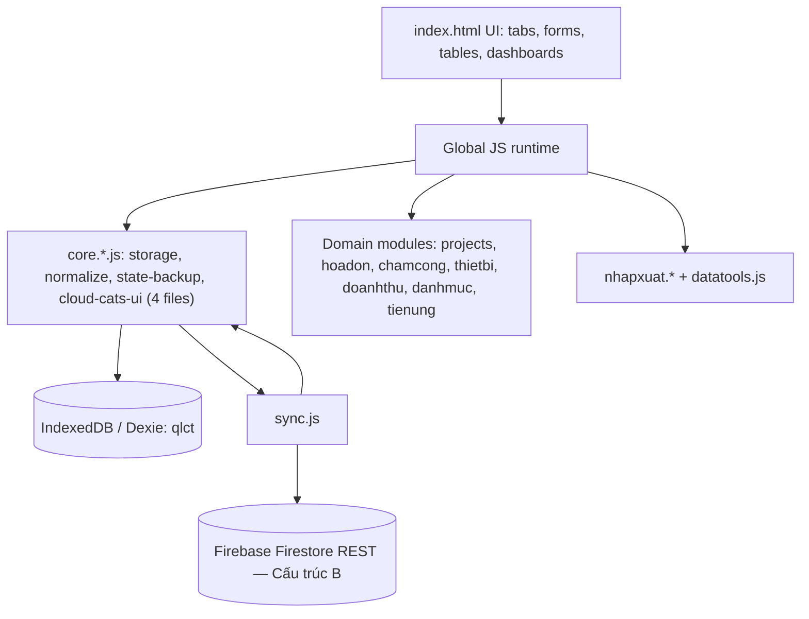
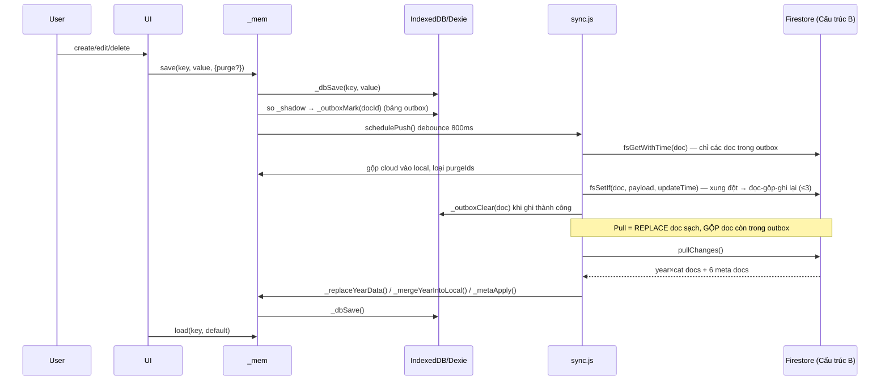

# AI_CONTEXT.md

Tài liệu ngữ cảnh kỹ thuật cho AI Code khi làm việc với project **App Quản Lý Chi Phí Công Trình**.

> **Cách dùng tài liệu này:** Phần **I — THAM CHIẾU HIỆN HÀNH** (mục 1–7) luôn phản ánh **trạng thái code thực tế hiện tại**. Phần **II — QUY TẮC UI & BẢO TRÌ** (mục 8) là quy ước phải tuân theo. Phần **III — LỊCH SỬ THAY ĐỔI** (mục 9) là changelog theo thời gian; một số mục trong đây mô tả kiến trúc cũ (V2 subcollection) đã bị thay thế — đọc để hiểu bối cảnh, KHÔNG dùng làm tham chiếu hiện hành. **Phụ lục A** lưu di sản V2 đã xóa khỏi code để nhận diện dấu vết khi dọn dẹp.

---

## Mục lục

**Phần I — Tham chiếu hiện hành**
1. [Tổng quan ứng dụng](#1-tổng-quan-ứng-dụng-project-overview)
2. [Thứ tự nạp Script](#2-thứ-tự-nạp-script-script-load-order)
3. [Sơ đồ thư mục](#3-sơ-đồ-thư-mục-directory-structure)
4. [Kiến trúc lưu trữ & đồng bộ](#4-kiến-trúc-lưu-trữ--đồng-bộ-storage--sync-architecture)
5. [Sơ đồ dữ liệu](#5-sơ-đồ-dữ-liệu-data-model)
6. [Hàm & Biến Global quan trọng](#6-hàm--biến-global-quan-trọng-key-functions--globals)
7. [Quy tắc lập trình](#7-quy-tắc-lập-trình-coding-rules)

**Phần II — Quy tắc UI & bảo trì**

8. [Bootstrap migration & quy tắc UI](#8-bootstrap-migration--quy-tắc-ui)

**Phần III — Lịch sử thay đổi (Changelog)**

9. [Lịch sử thay đổi theo thời gian](#9-lịch-sử-thay-đổi-theo-thời-gian-changelog)
   - [9.1 Bootstrap migration + cleanup (20–22/05/2026)](#91-bootstrap-migration--cleanup-202205-2026)
   - [9.2 V2 Quota Optimization — Phase 1+2+3+4 (23/05/2026)](#92-v2-quota-optimization--phase-1234-23052026--lịch-sử)
   - [9.3 Sync Reliability & Quota Fix — Phase 5 (24/05/2026)](#93-sync-reliability--quota-fix--phase-5-24052026)
   - [9.4 Cải tiến UI/UX — Tasks 7–14 (24/05/2026)](#94-cải-tiến-uiux--tasks-714-24052026)
   - [9.5 Điểm kiểm tra sau cleanup](#95-điểm-kiểm-tra-sau-cleanup)
   - [9.6 UI/UX Phase 2 — Sticky + Dropdown + Layout (24/05/2026)](#96-uiux-phase-2--sticky--dropdown--layout-24052026)
   - [9.7 UI/UX Phase 3 — Sticky + dropdown + dashboard fixes (24/05/2026)](#97-uiux-phase-3--sticky--dropdown--dashboard-fixes-24052026)
   - [9.8 Chủ Đầu Tư + Hide Closed Projects (24/05/2026)](#98-chủ-đầu-tư--hide-closed-projects-24052026)
   - [9.9 Bỏ Offline-first → Online-only + Cấu trúc B + Normalize (29/05/2026)](#99-bỏ-offline-first--online-only--cấu-trúc-b--normalize-29052026--kiến-trúc-hiện-hành)
   - [9.10 Hóa đơn trong ngày + Chấm công copy + Tiền Ứng (11/06/2026)](#910-hóa-đơn-trong-ngày--chấm-công-copy--tiền-ứng-11062026)
   - [9.11 Fix lỗi Thùng Rác "xóa rồi vẫn hồi về" (13/06/2026)](#911-fix-lỗi-thùng-rác-xóa-rồi-vẫn-hồi-về-13062026)
   - [9.12 Tách Tab Công Nợ + Doanh Thu 2 subtab + UI Công Nợ mới (16/06/2026)](#912-tách-tab-công-nợ--doanh-thu-2-subtab--ui-công-nợ-mới-16062026)
   - [9.13 Tách meta_khach_hang + Quyết Toán Chi Phí + Subtab Lợi Nhuận (19/06/2026)](#913-tách-meta_khach_hang--quyết-toán-chi-phí--subtab-lợi-nhuận-19062026)
   - [9.14 Đưa Quản Lý Khách Hàng ra Tổng Quan + Chi tiết CT chỉ theo dõi chi phí (19/06/2026)](#914-đưa-quản-lý-khách-hàng-ra-tổng-quan--chi-tiết-ct-chỉ-theo-dõi-chi-phí-19062026)
   - [9.15 Lọc tuần + Sort DESC + Fix dropdown đổi tên + Số ngày thi công + Biểu đồ 52 tuần đa năm (22/06/2026)](#915-lọc-tuần--sort-desc--fix-dropdown-đổi-tên--số-ngày-thi-công--biểu-đồ-52-tuần-đa-năm-22062026)
   - [9.16 Fix bug đặt tên Công Trình & dọn dead code Danh Mục (23/06/2026)](#916-fix-bug-đặt-tên-công-trình--dọn-dead-code-danh-mục-23062026)
   - [9.17 Tách Tạm Ứng/Công Nợ Công Nhân ra khỏi Sổ Chấm Công (23/06/2026)](#917-tách-tạm-ứngcông-nợ-công-nhân-ra-khỏi-sổ-chấm-công-23062026)
   - [9.20 Sổ Chấm Công: đổi thứ tự tab + popup Tiền ứng CN tick vào Thực Lãnh + badge vai trò (15/07/2026)](#920-sổ-chấm-công-đổi-thứ-tự-tab--popup-tiền-ứng-cn-tick-vào-thực-lãnh-badge-vai-trò-15072026)
   - [9.21 Fix bug: Quyết Toán Chi Phí nhập vào không lưu (store quyettoan_v1 thiếu đăng ký) (16/07/2026)](#921-fix-bug-quyết-toán-chi-phí-nhập-vào-không-lưu-store-quyettoan_v1-thiếu-đăng-ký-16072026)
   - [9.22 Tái cấu trúc UI/UX Modal Chi Tiết Công Trình (đưa lại Lãi/Lỗ + 3 tab) (16/07/2026)](#922-tái-cấu-trúc-uiux-modal-chi-tiết-công-trình-đưa-lại-lãilỗ--3-tab-16072026)
   - [9.26 Giao diện điện thoại (mobile shell) + PWA cài được (25/07/2026)](#926-giao-diện-điện-thoại-mobile-shell--pwa-cài-được-25072026)
   - [9.28 Gia cố đồng bộ: Outbox + Sao lưu cloud hằng ngày + Khóa lạc quan (28–29/09/2026)](#928-gia-cố-đồng-bộ-outbox--sao-lưu-cloud-hằng-ngày--khóa-lạc-quan-2829092026)
   - [9.29 Thùng rác: xóa vĩnh viễn bằng "bia mộ" + kiểm tra dữ liệu khi khôi phục (01/10/2026)](#929-thùng-rác-xóa-vĩnh-viễn-bằng-bia-mộ--kiểm-tra-dữ-liệu-khi-khôi-phục-01102026)
   - [9.50 Gộp Tất toán vào tab Công Nợ + bỏ tất toán hàng loạt + doc Firestore riêng `meta_quyet_toan` (03/10/2026)](#950-gộp-tất-toán-vào-tab-công-nợ--bỏ-tất-toán-hàng-loạt--doc-firestore-riêng-meta_quyet_toan-03102026)
   - [9.51 Thùng Rác: gỡ "Làm sạch thùng rác" + tách tab Hợp Đồng chính / Hợp Đồng TP + thêm tab Quyết Toán (03/10/2026)](#951-thùng-rác-gỡ-làm-sạch-thùng-rác--tách-tab-hợp-đồng-chính--hợp-đồng-tp--thêm-tab-quyết-toán-03102026)
   - [9.52 Tab Doanh Thu: bố cục mới 2 subtab HỢP ĐỒNG CHÍNH / THU TIỀN — form nằm ngoài màn hình, bỏ popup (03/10/2026)](#952-tab-doanh-thu-bố-cục-mới-2-subtab-hợp-đồng-chính--thu-tiền--form-nằm-ngoài-màn-hình-bỏ-popup-03102026)
   - [9.53 Tab Lợi Nhuận: thiết kế lại bảng — tiêu đề 2 tầng, số đầy đủ, phân cấp thị giác (03/10/2026)](#953-tab-lợi-nhuận-thiết-kế-lại-bảng--tiêu-đề-2-tầng-số-đầy-đủ-phân-cấp-thị-giác-03102026)
   - [9.54 Phiếu thu tự động từ quyết toán + bỏ quy tắc max khi đã có QT + tối ưu form/bảng Doanh Thu (03/10/2026)](#954-phiếu-thu-tự-động-từ-quyết-toán--bỏ-quy-tắc-max-khi-đã-có-qt--tối-ưu-formbảng-doanh-thu-03102026)
   - [9.55 Tab Công Nợ → HỢP ĐỒNG THẦU PHỤ: bỏ popup, bảng Master-Detail Đã Ứng / Còn Phải Trả + cập nhật tạm ứng (03/10/2026)](#955-tab-công-nợ--hợp-đồng-thầu-phụ-bỏ-popup-bảng-master-detail-đã-ứng--còn-phải-trả--cập-nhật-tạm-ứng-03102026)
   - [9.56 Đồng bộ lại tài liệu với code thực tế (03/10/2026)](#956-đồng-bộ-lại-tài-liệu-với-code-thực-tế-03102026)
   - [9.57 Khách hàng làm trung tâm: tab Công Trình chia 3 phân khu + gộp theo khách hàng, Hồ sơ Khách hàng, CĐT bắt buộc (04/10/2026)](#957-khách-hàng-làm-trung-tâm-tab-công-trình-chia-3-phân-khu--gộp-theo-khách-hàng-hồ-sơ-khách-hàng-cđt-bắt-buộc-04102026)
   - [9.58 Đổi tên công trình: ID là nguồn sự thật — 1 lệnh ghi, tên cũ (aliases), tự cập nhật từ máy khác (04/10/2026)](#958-đổi-tên-công-trình-id-là-nguồn-sự-thật--1-lệnh-ghi-tên-cũ-aliases-tự-cập-nhật-từ-máy-khác-04102026)
   - [9.59 Thẻ công trình hiện tên đầy đủ + địa chỉ, tên gợi ý bỏ tháng/năm (≤ 40 ký tự), Thêm công trình từ Hồ sơ khách hàng (04/10/2026)](#959-thẻ-công-trình-hiện-tên-đầy-đủ--địa-chỉ-tên-gợi-ý-bỏ-thángnăm--40-ký-tự-thêm-công-trình-từ-hồ-sơ-khách-hàng-04102026)
   - [9.60 CÔNG TY xuống cuối, tên gợi ý dạng ngoặc đơn (≤ 45), gỡ nút Thêm CT ở hồ sơ, Gán nhanh công trình cho khách hàng (05/10/2026)](#960-công-ty-xuống-cuối-tên-gợi-ý-dạng-ngoặc-đơn--45-gỡ-nút-thêm-ct-ở-hồ-sơ-gán-nhanh-công-trình-cho-khách-hàng-05102026)

   - [9.69 Tab mới TỈ TRỌNG CHI PHÍ — Lần 1/2 (05/10/2026)](#969-tab-mới-tỉ-trọng-chi-phí--lần-12-bảng-m2-dời-sang-kpi-đm2-giai-đoạnhạng-mục-phân-bổ-theo-mốc-ngày--gán-hàng-loạt-05102026)
   - [9.70 Tỉ Trọng Chi Phí: 3 tab con + bảng cây ma trận (05/10/2026)](#970-tỉ-trọng-chi-phí-3-tab-con--bảng-cây-ma-trận-giai-đoạn--hạng-mục--loại-chi-phí-05102026)
   - [9.71 Tỉ Trọng Chi Phí — hoàn tất Lần 2 (05/10/2026)](#971-tỉ-trọng-chi-phí--hoàn-tất-lần-2-luật-tự-gán-gắn-theo-hđ-thầu-phụ-định-mức--dự-toán-so-sánh-công-trình-05102026)

**Phụ lục**

- [Phụ lục A — Di sản V2 đã xóa khỏi code](#phụ-lục-a--di-sản-v2-đã-xóa-khỏi-code)

---

# PHẦN I — THAM CHIẾU HIỆN HÀNH

## 1. Tổng quan ứng dụng (Project Overview)

| Hạng mục | Mô tả |
|---|---|
| Loại ứng dụng | SPA tĩnh, Vanilla JS, không bundler, không ES module import/export |
| Entry point | `index.html` nạp toàn bộ CSS/JS bằng `<script>` tuần tự |
| Mục đích | Quản lý chi phí công trình: hóa đơn, chấm công, thiết bị, tiền ứng, doanh thu, công nợ, nhập/xuất dữ liệu |
| UI language | Tiếng Việt, domain text dùng thuật ngữ xây dựng/kế toán Việt Nam |
| Core tech | HTML, CSS, Vanilla JavaScript, IndexedDB qua Dexie, Firebase/Firestore REST sync, XLSX import/export, html2canvas export image |
| Runtime style | Global mutable state trên `window`/global scope; file sau gọi trực tiếp biến/hàm của file trước |
| Mô hình sync | **Online-only, cloud là nguồn chân lý** (từ 29/05/2026). Pull = REPLACE local bằng cloud, **trừ doc còn trong outbox** (thay đổi local chưa đẩy) → GỘP. Push = đọc-gộp-**ghi có điều kiện** (khóa lạc quan theo `updateTime`). Khi offline → chặn dùng app; thay đổi đã lưu nằm an toàn trong outbox (IDB). Sao lưu toàn bộ cloud hằng ngày vào collection `cpct_backup` (giữ 30 ngày). Xem [9.28](#928-gia-cố-đồng-bộ-outbox--sao-lưu-cloud-hằng-ngày--khóa-lạc-quan-2829092026). |

Kiến trúc tổng thể:


```mermaid
flowchart TD
  UI["index.html UI: tabs, forms, tables, dashboards"] --> JS["Global JS runtime"]
  JS --> Core["core.*.js: storage, normalize, state-backup, cloud-cats-ui (4 files)"]
  JS --> Domain["Domain modules: projects, hoadon, chamcong, thietbi, doanhthu, danhmuc, tienung"]
  JS --> Tools["nhapxuat.* + datatools.js"]
  Core --> IDB[("IndexedDB / Dexie: qlct")]
  Sync["sync.js"] --> Cloud[("Firebase Firestore REST — Cấu trúc B")]
  Core --> Sync
  Sync --> Core
```

---

## 2. Thứ tự nạp Script (Script Load Order)

Thứ tự chính xác trong `index.html`:

| # | Script | Vai trò |
|---:|---|---|
| 1 | `https://cdnjs.cloudflare.com/ajax/libs/xlsx/0.18.5/xlsx.full.min.js` | Thư viện Excel |
| 2 | `https://cdnjs.cloudflare.com/ajax/libs/html2canvas/1.4.1/html2canvas.min.js` | Export UI/table thành ảnh |
| 3 | `https://unpkg.com/dexie@4/dist/dexie.min.js` | IndexedDB wrapper |
| 4 | `js/core/core.storage.js` | Lớp nền thấp nhất: `DEFAULTS`, `CATS`, `FB_CONFIG`, Dexie `db` (version 3 có bảng `outbox`), `DB_KEY_MAP`, `_mem`, `load/save` (`save(k,v,{skipSync,purge})`), bảng ánh xạ key→doc cloud (`_YEAR_KEY_CAT`, `_META_KEY_DOC`, `_isMetaKey`, `_yearDocId`), **OUTBOX** lưu bền (`_outboxMark/_outboxClear/_outboxClearAll/_outboxList/_outboxLoad/_outboxNow`…), **bảng bóng** `_shadow` (`_shadowDiffMark`, `_shadowSet`, `_shadowRebuildAll`), bộ đếm tương thích suy ra từ outbox (`_pendingChanges`, `_dirtyKeys`, `_dirtyYears`, `_outboxOnChange`, `_updateSyncBtnBadge`), `LAST_SYNC_KEY`, `mkRecord`, `mkUpdate`, autocomplete |
| 5 | `js/core/core.normalize.js` | Module chuẩn hóa record về 6 field tiêu chuẩn (`id`, `createdAt`, `updatedAt`, `deletedAt`, `deviceId`, `projectId`) dùng cho import/restore: `normalizeRecord`, `normalizeDataset`, `normalizeImportStore`, `_NORM_CT_FIELD`. Nạp sau `core.storage.js`, trước `core.state-backup.js`. |
| 6 | `js/core/core.state-backup.js` | State orchestration: `DATA_VERSION`, `migrateData`, `_migrateHopDongKeys`, project lookup helpers, `BACKUP_KEYS`, backup/restore (`_snapshotNow`, `restoreFromBackup`, `renderBackupList`), `exportJSON`, `importJSON`, `importJSONFull` (push cloud cấu trúc B), `_normalizeImportData` (wrapper gọi `normalizeImportStore`), `clearAllCache`, `afterDataChange`, `_reloadGlobals`, khởi tạo global `cats`, `cnRoles`, `invoices`, `filteredInvs`, `curPage`, `PG` |
| 7 | `js/core/core.cloud-cats-ui.js` | Cloud helpers: `fbReady`, `fsWrap/fsUnwrap`, Firebase REST an toàn (`fsGet` — 404→null, lỗi khác→throw; `fsSet` — throw khi lỗi, chỉ dùng cho ghi đè có chủ đích; `fsDelete`; `fsGetWithTime` → `{data, updateTime, exists}`; `fsSetIf` — ghi có điều kiện, xung đột → throw `.conflict`; `fsListDocIds`), cấu trúc B (`fbDocYearCat`, `fbDocMetaCT/KH/DM/TK/HD/QT`, `_YEAR_CATS`, `fbYearCatPayload`, `fbMetaCT/KH/DM/TK/HD/QTPayload` — `fbMetaKHPayload` = customers doc riêng, `fbMetaHDPayload` = `{hopDong, thauPhu}`, `fbMetaQTPayload` = `{quyetToan}` doc riêng `meta_quyet_toan` (qua `_qtAuditFields` — vá createdAt/updatedAt/deletedAt cho bản ghi cũ)), `_wipeOrphanCloudDocs` (dọn doc rác cấu trúc cũ), `gsLoadAll`, sync dot UI, modal Firebase config (`openBinModal`, `fbSaveConfig`, `fbDisconnect`), `buildYearSelect`, `saveCats`, cat items soft-delete (`_syncCatItems`, `_rebuildCatArrsFromItems`, `_migrateCatItemsIfNeeded`), `normalizeCatDisplayName`, `showSyncBanner`, `_setSyncState` |
| 8 | `js/modules/projects/projects.model.js` | Domain model công trình: `PROJECT_STATUS`, `PROJECT_COMPANY`, `let projects = []`, `_saveProjects`, `rebuildCatCTFromProjects`, `createProject` (có param `customerId`), `updateProject`, `getProjectById`, `findProjectIdByName` (khớp cả tên cũ qua `aliases`), `findProjectByAlias`, `relinkProjectNames` (viết lại bản sao tên CT trên RAM theo projectId), `_propagateProjectRename` (chỉ gắn id cho bản ghi mồ côi), `getSortedProjects`, `getAllProjects`, `getProjectOptions`, `getProjectDays`, `getProjectK`, `getProjectFactor` (=k, tương thích cũ), `getProjectWeight` (=ngày×k), `getCompanyCost`, `allocateCompanyCost`, `canDeleteProject`, `resolveProjectName`. Project có thêm field `customerId` (FK → khách hàng), `heSoTiTrong` (k) và `aliases` (tên cũ đã chuẩn hóa — 9.58). |
| 8b | `js/modules/khachhang/khachhang.model.js` | Model Khách Hàng (Chủ đầu tư/CRM): `let customers = []`, `_saveCustomers`, `_normCustomerName`, `getCustomerById`, `findCustomerByName`, `getAllCustomers`, `createCustomer`, `updateCustomer`, `deleteCustomer` (xóa mềm), `getOrCreateCustomerByName`, `getCustomerOptions` (SĐT trong option chỉ hiện cho admin/GĐ), `khCanSeePhone` (quyền SĐT), `getProjectsOfCustomer`, `_migrateCustomersFromProjects`. **Không còn trường email** (9.57). Nạp sau `projects.model.js`, trước `projects.migration-selects.js`. |
| 8c | `js/modules/khachhang/khachhang.ui.js` | Modal **Hồ Sơ Khách Hàng** (mở từ tab Công Trình): danh sách + tìm kiếm, bấm tên → hồ sơ (Tổng giá trị KH + Lịch sử công trình). State `_khMode` (`null`/`'add'`/`'edit'`/`'profile'`)/`_khEditId`/`_khProfileId`/`_khSearch`; `openKhachHangModal`, `openKhachHangProfile(id)`, `closeKhachHangModal`, `_khRender`, `_khProfileHtml`, `_khOpenProfile`, `_khBackToList`, `_khOpenProject`, `_khShowAddForm`, `_khSaveAdd`, `_khOpenEdit`, `_khSaveEdit` (đổi tên → cập nhật `chuDauTu` các CT liên kết), `_khDelete`, `_khCancelForm`. Gọi lúc render `lnTinhCongTrinh` (doanhthu.reports-export.js), `_ctCategoryInfo`/`_ptStatusBadge` (projects.ui.js). Nạp ngay sau `khachhang.model.js`. Xem 9.57 |
| 9 | `js/modules/projects/projects.migration-selects.js` | Migration linking + shared select helpers: `migrateProjectLinks`, `deduplicateProjects`, `_buildProjOpts`, `_buildProjFilterOpts`, `_readPidFromSel`, `_checkProjectClosed` |
| 10 | `js/modules/projects/projects.ui.js` | Full UI tab Công Trình: `_fmtProjDate`, `_PT_STATUS_META`, `_PT_GROUP_LABELS`, `_PT_ORDER`, `_ctSelectForce`, `_goTabWithCT`, `renderProjectsPage`, `renderCTOverview`, `_ctApply`, `_ctRenderGrid` (→ `_ctRenderBody`: 3 phân khu CT/SC/SN-Khác hoặc gộp theo khách hàng), `_ctSetView`, `_ctToggleClient`, `_ctCardHtml`, `_ctClientOf`, `openCTDetail`, `openCTCreateModal` (Loại · CĐT bắt buộc + Thêm nhanh · Hạng mục · tên tự gợi ý · Địa chỉ công trình), `saveCTCreate`, `openCTEditModal`, `saveCTEdit`, `quickCloseCT`, `confirmQuickClose`, `quickCompleteCT`, `confirmQuickComplete`, `confirmDeleteCT` |
| 11 | `js/legacy/tienich.js` | Utility, formatter, `buildInvoices()`, invoice cache |
| 12 | `js/modules/hoadon/hoadon.quick-entry.js` | Nhập hóa đơn nhanh, duplicate check, shared row/money helpers: `initTable`, `addRows`, `addRow`, `delRow`, `renumber`, `calcSummary`, `clearTable`, `saveAllRows`, `_showDupModal`, `closeDupModal`, `forceSaveAll`, `_ensureInvRef`, `_doSaveRows`, `calcRowMoney`, `getRowData` |
| 13 | `js/modules/hoadon/hoadon.sheet-grid.js` | Engine lưới nhập liệu giống Excel cho hóa đơn nhanh: selection, copy/paste vùng, keyboard navigation, autocomplete trực tiếp trong bảng |
| 14 | `js/modules/hoadon/hoadon.detail-entry.js` | Hóa đơn chi tiết nhiều dòng vật tư/nội dung: `goInnerSub`, `_initDetailFormSelects`, `renderDetailRowHTML`, `addDetailRow`, `delDetailRow`, `calcDetailRow`, `calcDetailTotals`, `generateDetailNd`, `saveDetailInvoice`, `clearDetailForm`, `_setSelectFlexible`, `openDetailEdit`, `getDetailRows` |
| 15 | `js/modules/hoadon/hoadon.list-trash.js` | Filter/render danh sách hóa đơn, sửa/xóa mềm, hóa đơn trong ngày: `buildFilters`, `filterAndRender`, `renderTable`, `goTo`, `delInvoice`, `editCCInvoice`, `openEntryEdit`, `_resolveInvSource`, `editManualInvoice`, `renderTodayInvoices`, `refreshHoadonCtDropdowns`. **Không còn code thùng rác** (global `trash`, `trash*()`, `renderTrash` đã xóa) — thùng rác nay ở `thungrac.js`; tên file chỉ là di sản |
| 16 | `js/modules/danhmuc/danhmuc.categories.js` | Danh mục/settings: normalize, render settings, CT page, CN role, tbTen, rebuild selects, dedup cat arrays |
| 17 | `js/modules/tienung/tienung.core.js` | Tiền Ứng core: `ungRecords`, migration/normalize deletedAt/projectId, shared state cho entry/history, subtab nav: `ungGoSub`, `ungShowSubNhap`, `ungShowSubBaoCao` |
| 18 | `js/modules/tienung/tienung.entry.js` | Form nhập tiền ứng nhiều dòng, đổi loại ứng, lưu/xóa dòng, rebuild selects |
| 19 | `js/modules/tienung/tienung.history.js` | Lịch sử tiền ứng, lọc/tìm kiếm, phân trang, xuất CSV/ảnh phiếu ứng, bảng phiếu gần đây: `renderUngMini` |
| 20 | `js/modules/danhmuc/danhmuc.tools.js` | Wrapper backup/restore (`toolBackupNow`, `toolRestoreBackup`) + modal **Khôi phục từ sao lưu cloud** (`openCloudRestoreModal`, `_cloudRestorePick`, chỉ admin) |
| 20b | `js/modules/danhmuc/danhmuc.project-clear.js` | **Xóa dữ liệu theo công trình × hạng mục** (nút trong tab Danh Mục): cấu hình `PROJECT_CLEAR_DEFS`, `_prcInvSource`, `_prcBelongs`, `_prcCount`, `openProjectClearModal`, `closeProjectClearModal`, `_prcReset`, `onPrcProjectChange`, `onPrcCheckboxChange`, `onPrcConfirmInput`, `doProjectClear` (snapshot trước khi xóa, rồi `pushChanges`). Nạp sau `danhmuc.tools.js`, trước `nhapxuat.parsers.js` |
| 21 | `js/modules/nhapxuat/nhapxuat.parsers.js` | Helper parse/normalize Excel + parser sheet 1–9: `_normStr`, `_parseDate`, `_pNum`, `_str`, `_sheetRows`, `_hasDiacritics`, `_deduplicateCatNames`, `_buildCanonMap`, `_dayOfWeek`, `_isEmptyRow`, `_formatCatName`, `_markDuplicateInBatch`, `_makeCatLookup`, `_makeCatLookupWithExtra`, `_resolveProvisionalProjectIds`, `_mkErr`, `_fmtErr`, `parseSheet1`–`parseSheet9`, `_DANHMUC_GROUP_MAP` |
| 22 | `js/modules/nhapxuat/nhapxuat.import.js` | Import session, detect sheet, preview, apply import, log: `_isDupInvQ/D/Ung/Thu/Tb/Tp/CC`, `_detectSheetType`, `_importSession`, `_doImportParse`, `_markDuplicates`, `_showImportPreviewNew`, `_toggleAllImportSheets`, `_applyImport`, `_generateImportLog`, `openImportModal`, `handleImportFile` |
| 23 | `js/modules/nhapxuat/nhapxuat.export.js` | Export modal, Excel sheet builders, CSV exports: `openExportModal`, `_buildSheet`, `buildHoaDonNhanh/ChiTiet/ChamCong/TienUng/ThietBi/DanhMuc/HopDongChinh/ThuTien/HopDongThauPhu/HuongDan`, `exportExcel`, `_doExport`, `exportEntryCSV`, `exportAllCSV`, `toolImportExcel`, `toolExportExcel` |
| 24 | `js/legacy/datatools.js` | **Dashboard Tổng Quan** (`renderDashboard`, KPI/biểu đồ cột/tròn theo CT, theo tuần và 52 tuần đa năm, Top 5: `_dbKPI`, `_dbBarChart*`, `_dbPieChart*`, `_dbTop5`, `_dbByCT`, `_dbUngByCT`, `_dbSetWeekFilter`…), **Reset toàn bộ** (`toolResetAll`, `_doResetAll`), xuất/nhập JSON (`toolExportJSON`, `toolImportJSON`), modal xác nhận xóa (`openDeleteModal`). Không còn xóa theo năm / data health / migration tools |
| 25 | `js/modules/chamcong/chamcong.core.js` | Global data (`ccData`, `ccOffset`, `ccHistPage`, `ccTltPage`), constants (`CC_DAY_LABELS`, `CC_DATE_OFFSETS`), date/week helpers, normalize/category helpers, CT selector helpers: `_dedupCC`, `round1`, `toggleCCDebtCols`, `_calcDebtBefore`, `isoFromParts`, `ccSundayISO`, `ccSaturdayISO`, `snapToSunday`, `weekLabel`, `ccAllNames`, `rebuildCCNameList`, `normalizeAllChamCong`, `rebuildCCCategories`, `updateTopFromCC`, `populateCCCtSel`, `updateCCSaveBtn`, `onCCCtSelChange`, `_fmtDate`, `ccGoSub`, `ccShowSubSoCC` |
| 26 | `js/modules/chamcong/chamcong.week-form.js` | Form nhập tuần, build table, row handlers, lưu/copy/paste: `initCC`, `ccGoToWeek`, `ccPrevWeek`, `ccNextWeek`, `onCCFromChange`, `loadCCWeekForm`, `buildCCTable`, `addCCWorker`, `addCCRow`, `buildCCRow`, `onCCNameInput`, `onCCDayKey`, `onCCWageKey`, `onCCMoneyKey`, `calcCCRow`, `delCCRow`, `renumberCC`, `updateCCSumRow`, `saveCCWeek`, `clearCCWeek`, `copyCCWeek`, `pasteCCWeek`; global `ccClipboard` |
| 27 | `js/modules/chamcong/chamcong.history-reports.js` | Lịch sử, tổng lương tuần, load/delete, CSV exports, phiếu lương/ảnh: `buildCCHistFilters`, `renderCCHistory`, `ccHistGoTo`, `renderCCTLT`, `renderCCTLTMini`, `fmtK`, `updateTLTSelectedSum`, `exportCCTLTCSV`, `ccTltGoTo`, `loadCCWeekById`, `delCCWeekById`, `delCCWorker`, `exportCCWeekCSV`, `exportCCHistCSV`, `removeVietnameseTones`, `xuatPhieuLuong`, `exportUngToImage` |
| 27b | `js/modules/chamcong/chamcong.ung-ledger.js` | **Sổ cái Ứng Công Nhân** + popup "Tiền ứng CN" (tab Chấm Công → ỨNG CÔNG NHÂN): `_ccUngEditId`, `_ccUngEditReturnName`, `buildCCUngFilters`, `onCCUngMonthChange`, `renderCCUngLedger`, `openCCUngModal`, `saveCCUng`, `editCCUngRecord`, `openCCUngHist`, `renderCCUngHistory`, `delCCUngRecord`, `_ccUngSyncTLLabel`, `_ccUngSyncRoleBadge`. Dùng chung kho `ung_v1` với Tiền Ứng (`loai:'congnhan'`). Nạp sau `chamcong.history-reports.js`, trước `thietbi.js` |
| 28 | `js/legacy/thietbi.js` | Quản lý thiết bị/kho (Danh sách tại CT + Kho Thiết Bị + Kho Giàn Giáo). **Ô tìm kiếm chung** `#tb-global-search` lọc đồng thời 3 bảng: `_tbGlobalQ`, `tbGlobalSearch`, `tbClearGlobalSearch`; `_tbMatchQ` khớp Tên CT + Tên TB (+ Thông tin máy, Người TH), không dấu qua `_tbNormQ` (xem 9.49) |
| 29 | `js/modules/doanhthu/doanhthu.core.js` | Global data (`hopDongData`, `thuRecords`, `thauPhuContracts`, `quyetToanRecords`), state, shared helpers: `calcHopDongValue`, `_migrateHopDongData`, `_normalizeThuProjectIds`, `bindItemsToTable`, `dtGoSub`/`dtShowSub` (2 subtab: HỢP ĐỒNG CHÍNH `dt-sub-hdc` / THU TIỀN `dt-sub-thu` — xem 9.52), `dtRenderAll`, `_dtSetEditing`, `_dtFocusForm`, `_dtFillSelects`, `dtPopulateSels`, `dtPopulateCtFilter` (lọc CT + người TH), `dtSetHdcCtFilter`/`dtSetHdcNguoiFilter`/`dtSetHdcSearch`/`dtSetThuSearch`/`dtSetTdSearch`, `dtPopulateThuCtFilter`/`dtSetThuCtFilter`/`_dtThuMatchCt` (lọc CT Lịch Sử Thu Tiền), `_dtIsAutoThu` (phiếu thu tự động từ QT), `dtFilterHdcByCt`, `fmtInputMoney`, `_readMoneyInput`, `fmtInputMoneySigned`/`_readMoneySigned` (cho phép số âm — dùng Quyết Toán), `_thuOnCtChange`, `_dtPaginationHtml`, `_dtMatchTkHDCFilter`, `DT_LOAI_THU` (tamung/giaidoan/quyettoan/khac), pagination state, bộ lọc |
| 30 | `js/modules/doanhthu/doanhthu.forms.js` | Form lưu/sửa/xóa (form nằm thẳng trong subtab, không popup) + vẽ bảng: `hdcUpdateTotal`, `saveHopDongChinh`, `editHopDongChinh`, `delHopDongChinh`, `_hdcCancelEdit`, `renderHdcTable` (= ), `saveThuRecord`, `editThuRecord`, `delThuRecord` (2 hàm này + `_dtThuActions` chặn phiếu tự động), `_thuSetLoaiThu` (giữ mã loại cũ bằng option tạm), `renderThuTable` (= `renderThuTableTk` sổ quỹ + `renderThuTienDo` tiến độ theo CT), `dtToggleTienDo`, `dtThuChoCT`. Xem 9.52, 9.54 |
| 30b | `js/modules/congno/congno.hdtp.js` | **HĐ Thầu Phụ** (tab Công Nợ → HỢP ĐỒNG THẦU PHỤ, form nằm thẳng trên màn hình — không popup): `hdtpUpdateTotal`, `saveHopDongThauPhu`, `_hdtpResetForm`, `_hdtpCancelEdit`, `editHopDongThauPhu`, `delHopDongThauPhu`, `renderHdtpTable` (→ `ttRender`), `renderHdtpTableTk` (Master-Detail), `_hdtpUngAlloc` (Đã ứng từng HĐ), `_hdtpDetailRow`, `hdtpToggleRow`, `hdtpToggleUngForm`, `hdtpUngFillCon`, `hdtpSaveUng`. Nạp ngay sau `doanhthu.forms.js`. Xem 9.42, 9.55 |
| 31 | `js/modules/doanhthu/doanhthu.reports-export.js` | Lãi/Lỗ, Lợi Nhuận, init, copy/paste KLCT, xuất phiếu ảnh: `renderLaiLo` (dashboard cũ), `renderLoiNhuan` + helpers `_lnContext`/`lnTinhCongTrinh(p, ctx)` (số liệu 1 CT — Hồ sơ KH dùng chung)/`_lnContractsB`/`_lnRevenueX`/`_lnBuildDashboard` (donut + Top5 lãi/lỗ bằng CSS thuần)/`_lnNum` (số tiền đầy đủ, 0 → `_LN_DASH` "—" mờ, tùy chọn dấu ±)/`_lnShort` (số lời/lỗ rút gọn có dấu cho dashboard)/`_lnBadge` (badge Lợi nhuận xanh/đỏ — class `.ln-badge`)/`_lnChiCell` (ô Tổng chi + badge xám `% DT` bên cạnh)/`toggleLoiNhuanDetail` (Thu gọn/Hiện chi tiết, state `_lnShowDetail` — **mặc định `true`** = hiện đủ cột) (tab chính **LỢI NHUẬN** — page `loinhuan`, partial `pages/loinhuan.html`: A hóa đơn + B thầu phụ + C phân bổ chung vs X HĐ gốc + Y quyết toán), `initDoanhThu` (set up 2 subtab KHAI BÁO/THỐNG KÊ), `initLoiNhuan` (nạp lại `hopDongData`/`thauPhuContracts`/`quyetToanRecords` rồi `renderLoiNhuan`), `copyKLCT`, `pasteKLCT`, `exportHdcToImage`, `exportHdtpToImage`, `exportThuToImage`; gán `window.initDoanhThu`, `window.initLoiNhuan`, `window.dtGoSub`. (`renderCongNoThauPhu`/`renderCongNoNhaCungCap`/`_renderCongNoTable` còn lại nhưng **DEPRECATED** — xem 9.12) |
| 31c | `js/modules/quyettoan/quyettoan.core.js` | **Lõi Quyết Toán + công thức doanh thu dùng chung** (chỉ đọc/tính): `QT_LOAI`, `qtLoaiOf`, `qtSoTien`, `qtGiaTriLuu`, `qtLoaiBadge`, `qtSoTienTxt`, `qtSoTienCls`, `qtHdGocCuaCT`, `qtTinhDelta`, `qtDaThuCuaCT`, `qtTongQuyetToan` (trả thêm `coQT`), `calcTongDoanhThu` (có QT → bỏ quy tắc max). Nạp sau `doanhthu.reports-export.js`. Xem 9.41, 9.54 |
| 31d | `js/modules/quyettoan/quyettoan.congtrinh.js` | Tab **QUYẾT TOÁN** (page `quyettoan`, partial `pages/quyettoan.html`) — phân hệ 2A: `initQuyetToan`, `qtRefresh`, `qtSave`, `qtEdit`, `qtOpenEdit`, `qtDelete`, `qtUpdatePreview`, `qtRenderHistory`, phiếu thu tự động `_qtAutoThuOf`/`_qtTinhConLai`/`_qtSyncAutoThu`/`_qtUpdateThuConLaiHint` (ô `#qtf-thu-conlai`)... Nạp sau `quyettoan.core.js`, trước `thungrac.js`. Xem 9.54 |
| 31d2 | `js/modules/tytrong/tytrong.core.js` | Tab **TỈ TRỌNG CHI PHÍ** — tính toán thuần: `tyTrongRecords` (store `tytrong_v1`), `tytRecordOf`, `tytStructOf`, `tytSaveStruct`, bảng M2 `tytKlNum`/`tytKlHeSo`/`tytKlTinh`/`tytTongSanRows`/`tytTongSan`/`tytFmtM2`, `tytCostLines(p)` (các khoản chi cấu thành Tổng chi thực tế), `tytResolve`, `tytGdTheoNgay`, `tytTongHop(p)`, `tytMauGoiY(p)`. Nạp sau `quyettoan.congtrinh.js` (dùng `_qtProjList`). Xem 9.69 |
| 31d3 | `js/modules/tytrong/tytrong.ui.js` | Tab **TỈ TRỌNG CHI PHÍ** (page `tytrong`, partial `pages/tytrong.html`, tiền tố ID `tyt-`/`tytf-`): `initTyTrong`, `tytRefresh`, `tytOpenFor(pid)`, tab con `tytGoSub(id)` (PHÂN TÍCH / PHÂN BỔ / THIẾT LẬP / ĐỊNH MỨC & DỰ TOÁN / SO SÁNH), luật tự gán + gắn theo HĐ thầu phụ, định mức & dự toán, so sánh CT + xuất Excel, bảng cây ma trận (`tytRenderCay`/`tytCayToggle`/`tytCayAll`), bảng M2 (`tytKlAddRow`/`tytKlDelRow`/`tytKlReset`/`tytKlSave`), cấu trúc (`tytGdAdd`/`tytGdSet`/`tytGdMove`/`tytGdDel`/`tytHmAdd`/`tytHmSet`/`tytHmDel`/`tytCtMau`/`tytCtReset`/`tytCtSave`), phân bổ (`tytPbFilter`/`tytRenderPb`/`tytPbToggle`/`tytPbSelectAll`/`tytPbAssign`/`tytPbUnassign`). Nạp ngay sau `tytrong.core.js`. Xem 9.69–9.71 |
| 31e | `js/modules/congno/congno.tattoan.js` | Tab **CÔNG NỢ TP/NCC** → sub-tab **CÔNG NỢ** (= Tất toán TP/NCC, đổi tên + chuyển từ tab Quyết Toán 03/10/2026, thay bảng Công Nợ cũ): `CN_DONE_TOLERANCE`, `_ttCanEdit` (mọi vai trò đã đăng nhập), `_cnGroupBadge`, `_ttBuildRows(opts)` (`includeDone` → cả dòng đã xong/ứng dư), `ttRender`, `ttApplyFilters`, `ttToggleShowDone`, `ttSettleOne` (chỉ 1 dòng — đã bỏ tất toán hàng loạt), `ttUndoLast`, `ttCancelBatch`, `ttCreatePhieu`, `_ttBatches`, `cnGoSub`, `initCongNo`. Nạp sau `quyettoan.congtrinh.js`. Xem 9.50 |
| 31f | `js/modules/thungrac/thungrac.js` | Tab **THÙNG RÁC** (page `thungrac`, JS render): `renderThungRac`, `_TRASH_TABS` (8 tab: hoadon, chamcong, tienung, thietbi, thutien, **hopdong-chinh**, **hopdong-tp**, **quyettoan** — id tab = loại dữ liệu), `_trashGoSubTab`, `_trashGetRecords`, `_trashRenderTable`, `_trashGetHeaders`, `_trashBuildRow`, `_TRASH_STORES`, `_trashCanTouch`, `_trashCheck`, `_trashRestore`, `_trashPurgeIds`, `_trashGcTombstones`, `_trashPushPurge`, `_trashHardDelete`, `_trashEmptyCurrentTab` (nút dọn dẹp duy nhất — chỉ xóa tab đang chọn). Nạp sau `congno.tattoan.js`, trước `sync.js`; dùng `qtLoaiBadge`/`qtSoTienTxt`/`_qtCanEdit` lúc render. |
| 32 | `js/sync/sync.js` | Sync engine Firestore (cấu trúc B, online-only, cloud-authoritative): `DEVICE_ID`, `pushChanges` (push ngầm = đúng các doc trong outbox; thủ công/allYears = đủ mọi năm × hạng mục + 7 meta; mỗi doc đọc-gộp-**ghi có điều kiện** qua `_pushDocWithLock`, xung đột → gộp lại tối đa 3 lần; lỗi → giữ outbox + backoff `_schedulePushRetry`), `pullChanges`/`_pullMeta` (REPLACE doc sạch, GỘP doc còn trong outbox, giữ nguyên doc có cờ overwrite; customers fallback `meta_cong_trinh.customers`; quyết toán: field cũ `meta_hop_dong.quyetToan` → `_qtMigrateLegacy` gộp + chuyển sang `meta_quyet_toan`), `_metaApply` (replace/merge 7 doc meta), `_mergeYearIntoLocal`, `_refreshGlobal`, `_replaceYearData`, `manualSync`, `schedulePush` (debounce 800ms), conflict merge (`resolveConflict`/`mergeDatasets`/`normalizeCC`), `_refreshGlobal` gọi `relinkProjectNames` cho các kho có tên CT (`_RELINK_KEYS`), **dò thay đổi danh sách công trình từ máy khác** `ctWatchTick` (focus / mở lại tab / 2 phút — đọc 1 doc `meta_cong_trinh`, khác → áp + vẽ lại, xem 9.58) |
| 32b | `js/sync/sync.backup.js` | **Sao lưu cloud hằng ngày**: `cloudDailyBackup(opts)` (chụp toàn bộ `cpct_data` trên cloud → gzip → base64 → chia phần ≤900KB → `cpct_backup/b{YYYY-MM-DD}_p0.._pN`, giữ 30 ngày), `cloudBackupList()`, `cloudBackupDownload(date)`. Nạp NGAY SAU `sync.js`, TRƯỚC `auth.js`. |
| 33 | `js/app/auth.js` | Auth/session/role UI: đăng nhập, đăng xuất, đổi thông tin tài khoản, quản lý `users_v1`, phân quyền `admin`/`giamdoc`/`ketoan` |
| 34 | `js/app/main.js` | Bootstrap khởi động cuối cùng: init, year filter, tab rendering, role UI, auto-sync, chặn dùng app khi offline (`_showOfflineBlock`), **bật mobile shell khi màn hình ≤768px** (`mbIsMobile()` → `initMobile()`) |
| 34b | `js/mobile/mobile.core.js` | **Giao diện điện thoại — lõi.** State `MB`, `mbIsMobile()`, `loadMobilePartials()`, `initMobile()`, render shell (`mbRender`/`mbRenderHeader`/`mbRenderYears`/`mbRenderSubtabs`/`mbRenderBody`/`mbRenderNav`), router riêng `#/m/<tab>` (`mbRouteFromHash`), event delegation (`data-act` / `data-in`), bảng hành động `MB_ACTS`, helper hiển thị (`mbFmt`/`mbFull`/`mbDate`/`mbCanSee`/`mbProjStats`…) |
| 34c | `js/mobile/mobile.screens.js` | **Giao diện điện thoại — màn hình.** `mbScreen(tab)` + 14 hàm render (Tổng quan, Công trình, Chi tiết CT, Nhập HĐ, Chấm công, Tiền ứng, Doanh thu, **Quyết toán** — `mbScrQuyetToan`/`mbQtCongTrinh`, Công nợ (+ tab con HĐ thầu phụ), Thiết bị, Danh mục, Thống kê CPHĐ, Thùng rác, Thêm). Số doanh thu lấy từ `calcTongDoanhThu` (xem 9.43). Chỉ ĐỌC dữ liệu, dùng lại helper desktop |
| 34d | `js/mobile/mobile.actions.js` | **Giao diện điện thoại — ghi dữ liệu.** Bổ sung vào `MB_ACTS`: lưu HĐ nhanh/chi tiết, phiếu ứng, tuần chấm công, khai báo doanh thu; danh mục và thùng rác gọi lại `addItem`/`delItem`/`_trashRestore`/`_trashHardDelete` của desktop |
| 34e | *(inline trong `index.html`)* | Đăng ký service worker `sw.js` (PWA — "Thêm vào màn hình chính") |
| 35 | `https://cdn.jsdelivr.net/npm/bootstrap@5.3.3/dist/js/bootstrap.bundle.min.js` | Bootstrap bundle (nạp ở cuối body, sau toàn bộ JS app) |

Thứ tự này quan trọng vì code không dùng module system. Nhóm `core.*.js` **bắt buộc nạp trước tất cả module nghiệp vụ**. Các file dùng chung biến/hàm global như `load`, `save`, `cats`, `projects`, `invoices`, `ccData`, `hopDongData`, `buildInvoices`, `pullChanges`, `manualSync`. Nếu đổi thứ tự, module có thể đọc biến chưa khai báo hoặc render trước khi `dbInit()` populate `_mem`.

> **Hai file V2 (`sync.v2format.js`, `sync.v2meta.js`) đã bị XÓA** trong đợt chuyển sang online-only + cấu trúc B. `sync.js` không còn phụ thuộc engine subcollection V2. Nếu thấy tham chiếu `_v2*` ở đâu đó thì đó là dấu vết cũ cần dọn (xem [Phụ lục A](#phụ-lục-a--di-sản-v2-đã-xóa-khỏi-code)).

---

## 3. Sơ đồ thư mục (Directory Structure)

```text
index.html                    ← Entry point SPA (sidebar 13 tab, login, modal chung, mẫu phiếu ẩn, tab Công Trình viết thẳng)
AI_CONTEXT.md · CLAUDE.md     ← Tài liệu kiến trúc / quy tắc dự án (.md bị .gitignore bỏ qua, trừ AI_CONTEXT.md)
manifest.json                 ← PWA manifest ("Thêm vào màn hình chính")
sw.js                         ← Service worker network-first (chỉ để cài được app)
migrate-2026-firebase.js      ← Script Node CHẠY RIÊNG (không nạp vào app): làm sạch dữ liệu 2026 trên Firebase (dry-run, --write để ghi)
cpct_snapshot_2026-06-03_16-23.json ← Bản xuất dữ liệu 03/06/2026 (⚠️ chứa users_v1 mật khẩu thường — không nên để trong git)
.claude/                      ← launch.json (http-server cổng 8123), settings.local.json (quyền Claude Code)
assets/
  css/
    style.css                 ← Stylesheet chính (desktop)
    mobile.css                ← Giao diện điện thoại (chỉ áp dụng khi body.mb-on)
  img/
    logo-cty.png
    icon-192.png              ← Icon PWA (sinh từ logo)
    icon-512.png

pages/                        ← HTML partial của từng tab (nạp bằng fetch, loadAllPartials() trong main.js)
  nhap.html · thongkecphd.html · chamcong.html · nhapung.html
  congno.html · doanhthu.html · loinhuan.html · quyettoan.html
  thietbi.html · danhmuc.html · dashboard.html
  mobile/
    mobile.html               ← Khung shell của giao diện điện thoại
  (tab Công Trình nằm thẳng trong index.html; tab Thùng Rác do thungrac.js tự render)

js/
  core/                       ← Nạp đầu tiên, nền tảng toàn app
    core.storage.js
    core.normalize.js
    core.state-backup.js
    core.cloud-cats-ui.js

  modules/                    ← Các module nghiệp vụ đã tách
    projects/
      projects.model.js
      projects.migration-selects.js
      projects.ui.js
    khachhang/
      khachhang.model.js        ← Model Khách Hàng (CRM) — nạp ngay sau projects.model.js
      khachhang.ui.js           ← Modal Hồ Sơ Khách Hàng (danh sách + hồ sơ + phân quyền SĐT)
    hoadon/
      hoadon.quick-entry.js
      hoadon.sheet-grid.js
      hoadon.detail-entry.js
      hoadon.list-trash.js      ← Danh sách HĐ (không còn thùng rác — xem thungrac.js)
    danhmuc/
      danhmuc.categories.js
      danhmuc.tools.js
      danhmuc.project-clear.js  ← Xóa dữ liệu theo công trình × hạng mục
    tienung/
      tienung.core.js
      tienung.entry.js
      tienung.history.js
    nhapxuat/
      nhapxuat.parsers.js
      nhapxuat.import.js
      nhapxuat.export.js
    chamcong/
      chamcong.core.js
      chamcong.week-form.js
      chamcong.history-reports.js
      chamcong.ung-ledger.js    ← Sổ cái Ứng Công Nhân (kho ung_v1, loai='congnhan')
    doanhthu/
      doanhthu.core.js          ← Khai báo hopDongData/thuRecords/thauPhuContracts/quyetToanRecords
      doanhthu.forms.js         ← HĐ Chính + Thu Tiền
      doanhthu.reports-export.js ← Lãi/Lỗ, tab Lợi Nhuận, initDoanhThu, xuất phiếu ảnh
    congno/
      congno.hdtp.js            ← HĐ Thầu Phụ (Master-Detail Đã Ứng / Còn Phải Trả), tách từ doanhthu.forms.js
      congno.tattoan.js         ← Tab Công Nợ → CÔNG NỢ = Tất toán TP/NCC (tạo phiếu ứng tự động)
    quyettoan/
      quyettoan.core.js         ← Hàm tính doanh thu DÙNG CHUNG (calcTongDoanhThu) + loại quyết toán
      quyettoan.congtrinh.js    ← Tab QUYẾT TOÁN (Quyết toán công trình: form + Live Preview + lịch sử + phiếu thu tự động)
    tytrong/
      tytrong.core.js           ← Tab TỈ TRỌNG CHI PHÍ — tính toán (khoản chi, giai đoạn/hạng mục, đ/m2)
      tytrong.ui.js             ← Tab TỈ TRỌNG CHI PHÍ — giao diện (bảng M2, cấu trúc, báo cáo, phân bổ)
    thungrac/
      thungrac.js               ← Tab THÙNG RÁC thống nhất (8 loại dữ liệu, bia mộ purgedAt)

  legacy/                     ← File chưa tách module, vẫn ở dạng đơn khối
    tienich.js                ← Tiện ích dùng khắp nơi (format, toast, buildInvoices, numpad…)
    datatools.js              ← Dashboard + Reset toàn bộ + xuất/nhập JSON
    thietbi.js                ← Theo dõi thiết bị + 2 kho

  sync/
    sync.js                   ← Sync engine Firestore (cấu trúc B, online-only, outbox + khóa lạc quan)
    sync.backup.js            ← Sao lưu cloud hằng ngày (collection cpct_backup) + tải bản sao lưu

  app/
    auth.js
    main.js                   ← Bootstrap cuối cùng của bản desktop

  mobile/                     ← Tầng hiển thị cho điện thoại (nạp SAU main.js)
    mobile.core.js            ← State MB, shell, router #/m/*, event delegation, MB_ACTS
    mobile.screens.js         ← 14 màn hình (chỉ đọc dữ liệu)
    mobile.actions.js         ← Các hành động ghi dữ liệu (Object.assign vào MB_ACTS)
```

**Lưu ý tổ chức thư mục:**
- Thư mục chỉ là tổ chức **vật lý** — không phải module system, không dùng `import/export`.
- Toàn bộ file vẫn chạy global scope qua `<script>` tuần tự trong `index.html`.
- `js/legacy/` chứa các file chưa được tách module; có thể tách thêm trong tương lai theo cùng pattern.
- File cũ `js/legacy/hoadon.js` đã được tách thành nhóm `js/modules/hoadon/*.js` — **không còn tồn tại**, không nạp lại.
- Hai file V2 cũ `js/sync/sync.v2format.js` và `js/sync/sync.v2meta.js` đã bị **xóa** khi chuyển sang online-only + cấu trúc B; thư mục `js/sync/` hiện có `sync.js` + `sync.backup.js` (thêm 28/09/2026).
- Khi thêm file mới: phải thêm `<script src="...">` vào `index.html` đúng thứ tự và cập nhật `AI_CONTEXT.md` (mục 2 và mục 6).

---

## 4. Kiến trúc lưu trữ & đồng bộ (Storage & Sync Architecture)

| Layer | Thành phần | Vai trò |
|---|---|---|
| Source of truth local | IndexedDB qua Dexie DB `qlct` | Cache dữ liệu khi app chạy (online-only — pull REPLACE từ cloud) |
| Memory snapshot | `_mem` trong `core.storage.js` | Cache runtime; `load(k, def)` chỉ đọc từ `_mem` sau `dbInit()` |
| Write path | `save(k, v, opts)` | Cập nhật `_mem`, ghi Dexie bằng `_dbSave()`, invalidate invoice cache, so **bảng bóng** `_shadow` → ghi **outbox** đúng các doc cloud bị ảnh hưởng, debounce push. `opts.skipSync=true` → chỉ cập nhật bóng, không outbox/push. `opts.purge=[id…]` → xóa cứng có chủ đích (ghi purgeIds) |
| Hàng chờ đẩy | Bảng Dexie `outbox` + `_outboxMem` (RAM) | Mỗi dòng = 1 doc cloud còn thay đổi local chưa đẩy. Sống qua F5/tắt máy. Chỉ gỡ khi đẩy thành công |
| Sync cloud | `sync.js` + Firebase/Firestore REST | Push theo outbox: đọc (kèm `updateTime`) → gộp → ghi có điều kiện. Pull: REPLACE doc sạch, GỘP doc còn trong outbox |
| Sao lưu cloud | `sync.backup.js` → collection `cpct_backup` | 1 bản/ngày, chụp toàn bộ `cpct_data`, nén gzip, chia phần ≤900KB, giữ 30 ngày. Khôi phục qua tab Danh Mục (admin) |
| LocalStorage | Config/session only | Lưu Firebase config, `deviceId`, session user, pending marker, block-pull marker; không là nguồn dữ liệu nghiệp vụ |

Dexie physical schema:

| Dexie table | Key/index | Logical keys |
|---|---|---|
| `invoices` | `id, updatedAt` | `inv_v3` |
| `attendance` | `id, updatedAt` | `cc_v2` |
| `equipment` | `id, updatedAt` | `tb_v1` |
| `ung` | `id, updatedAt` | `ung_v1` |
| `revenue` | `id, updatedAt` | `thu_v1` |
| `settings` | `id` | `projects_v1`, `customers_v1`, `hopdong_v1`, `thauphu_v1`, `quyettoan_v1`, `tytrong_v1`, `trash_v1`, `users_v1`, `cat_ct_years`, `cat_cn_roles`, `cat_items_v1` |
| `categories` | `id` | `cat_ct`, `cat_loai`, `cat_ncc`, `cat_nguoi`, `cat_tp`, `cat_cn`, `cat_tbteb` |
| `outbox` *(Dexie version 3, từ 28/09/2026)* | `docId` | Không phải key logic — hàng chờ đẩy: `{ docId, firstTs, lastTs, count, purgeIds: string[], overwrite? }` |

Online-only data flow (cloud-authoritative):


```mermaid
sequenceDiagram
  participant User
  participant UI
  participant Mem as _mem
  participant IDB as IndexedDB/Dexie
  participant Sync as sync.js
  participant Cloud as Firestore (Cấu trúc B)

  User->>UI: create/edit/delete
  UI->>Mem: save(key, value, {purge?})
  Mem->>IDB: _dbSave(key, value)
  Mem->>IDB: so _shadow → _outboxMark(docId) (bảng outbox)
  Mem->>Sync: schedulePush() debounce 800ms
  Sync->>Cloud: fsGetWithTime(doc) — chỉ các doc trong outbox
  Sync->>Mem: gộp cloud vào local, loại purgeIds
  Sync->>Cloud: fsSetIf(doc, payload, updateTime) — xung đột → đọc-gộp-ghi lại (≤3)
  Sync->>IDB: _outboxClear(doc) khi ghi thành công
  Note over Sync,Cloud: Pull = REPLACE doc sạch, GỘP doc còn trong outbox
  Sync->>Cloud: pullChanges()
  Cloud-->>Sync: year×cat docs + 6 meta docs
  Sync->>Mem: _replaceYearData() / _mergeYearIntoLocal() / _metaApply()
  Mem->>IDB: _dbSave()
  UI->>Mem: load(key, default)
```

### Cấu trúc B (collection `cpct_data`)

Mỗi **năm × hạng mục = 1 doc** + **7 doc meta dùng chung**, tên field **đầy đủ (không nén)**:

- `meta_cong_trinh` → `{ projects }`
- `meta_khach_hang` → `{ customers }` (tách riêng 19/06/2026; pull có fallback đọc `customers` cũ trong `meta_cong_trinh` khi doc mới chưa tồn tại)
- `meta_danh_muc` → `{ cats, catItems, cnRoles, ctYears }`
- `meta_tai_khoan` → `{ users }`
- `meta_hop_dong` → `{ hopDong, thauPhu }`
- `meta_quyet_toan` → `{ quyetToan }` (tách riêng 03/10/2026, dễ xem trên Firebase Console; mỗi bản ghi luôn có `createdAt`/`updatedAt`/`deletedAt` — `null` = chưa xóa, xóa mềm = gán thời điểm). Chuyển đổi tự động: gặp field cũ `meta_hop_dong.quyetToan` → `_qtMigrateLegacy` gộp vào local + đánh dấu đẩy cả 2 doc → doc HĐ ghi lại KHÔNG còn field cũ. Thứ tự `_META_DOCS`: `meta_hop_dong` trước `meta_quyet_toan`.
- `meta_ty_trong` → `{ tyTrong }` (05/10/2026 — tab Tỉ Trọng Chi Phí; gộp bằng `mergeDatasets`; doc chưa tồn tại → pull bỏ qua, máy đầu tiên lưu sẽ tạo). Đứng cuối `_META_DOCS`.
- `y{YYYY}_hoa_don` / `_tien_ung` / `_cham_cong` / `_thiet_bi` / `_thu_tien` → `{ v:4, yr, cat, records:[...] }`
- Ánh xạ năm×hạng mục: `_YEAR_CATS` trong `core.cloud-cats-ui.js`. Ánh xạ key local → doc (dùng cho outbox): `_YEAR_KEY_CAT` + `_META_KEY_DOC` trong `core.storage.js`. `trash_v1` **không** thuộc doc cloud nào (chỉ local).

### Collection `cpct_backup` (sao lưu hằng ngày — từ 28/09/2026)

- `b{YYYY-MM-DD}_p0` — phần 0 + thông tin chung: `parts`, `createdAt`, `deviceId`, `bytesRaw`, `bytesStored`, `enc` (`gzip`|`raw`), `docCount`, `chunk`
- `b{YYYY-MM-DD}_p1` … — phần tiếp theo: `part`, `date`, `chunk`
- Nội dung ghép các `chunk` → base64 → (gunzip nếu `enc='gzip'`) → JSON `{ meta, data }` cùng định dạng file export JSON (`data` = các key local `inv_v3`, `cc_v2`, `projects_v1`, `cat_items_v1`…; `users_v1` đã bỏ `passwordHash`).
- Phần `_p0` được ghi SAU CÙNG → có `_p0` = bộ đã ghi đủ. Không nằm trong `cpct_data` nên `_wipeOrphanCloudDocs()` không đụng tới.
- ⚠️ Firestore Rules phải cho phép đọc/ghi/xóa `cpct_backup/*`.

### Sync rules (hiện hành)

| Rule | Mô tả |
|---|---|
| Mô hình | **Online-only, cloud-authoritative.** Pull = **REPLACE** local bằng cloud (không merge tích lũy) — **trừ doc còn trong outbox** thì GỘP (không bao giờ đè dữ liệu chưa đẩy). Pre-push merge (id-based, tombstone + LWW) chạy lúc PUSH. |
| Outbox (hàng chờ bền) | `save()` so bảng bóng `_shadow` (key năm: `id → updatedAt|deletedAt + doc năm`; key khác: JSON) → `_outboxMark(docId)`. Record đổi ngày sang năm khác → đánh dấu CẢ doc năm cũ. Migration/chuẩn hóa không đổi dữ liệu thật → không đánh dấu. `_memSet()` (dữ liệu từ cloud, chuẩn hóa nội bộ) chỉ cập nhật bóng, không đánh dấu. **Mọi sửa đổi nghiệp vụ phải cập nhật `updatedAt`** (mkRecord/mkUpdate/softDeleteRecord), sửa tại chỗ không đổi `updatedAt` coi như chuẩn hóa nội bộ, không đẩy. |
| Push | Push ngầm = đúng các doc trong outbox; nút 🔄 / `allYears` = đủ mọi năm × hạng mục + 6 meta. Mỗi doc: `fsGetWithTime` → gộp → `fsSetIf(updateTime)`; doc chưa có → `currentDocument.exists=false`. Đọc lỗi → doc FAIL, không ghi. Ghi xong → `_outboxClear(doc, pushStartTs, purgeIds)` (doc bị sửa thêm trong lúc push vẫn ở lại). Lỗi → backoff 5s/15s/60s/5 phút. Chỉ báo "✅ Đã đồng bộ" khi outbox rỗng. |
| Khóa lạc quan (GĐ2) | Xung đột (400 `FAILED_PRECONDITION`, 409 `ALREADY_EXISTS`, 412, 404 khi đòi updateTime) → đọc lại, gộp lại, ghi lại, tối đa 3 lần, chờ ngẫu nhiên 300–1200ms. Log `[Sync] ⚔ Xung đột <doc> — gộp lại lần i/3`. Hết lượt → FAIL, giữ outbox. |
| Xóa cứng | KHÔNG tự suy ra "xóa cứng" từ id biến mất (mảng global có thể cũ → sẽ xóa nhầm dữ liệu máy khác). Xóa cứng có chủ đích phải gọi `save(k, v, { purge:[id…] })` (hopdong_v1: key) → outbox ghi `purgeIds` (doc năm: `id`; doc meta: `key:id`) → khi gộp cloud (push lẫn pull) loại các id này. Id biến mất mà không purge → chỉ đánh dấu doc bẩn, lần gộp sau tự trả record về (tự lành). |
| Ghi đè có chủ đích | Chỉ **Reset toàn bộ** (`_doResetAll` — `fsSet` thẳng) và **Khôi phục** (`importJSONFull` — đánh dấu outbox `{overwrite:true}`) được ghi đè không điều kiện. Doc có cờ overwrite: push ghi đè không đọc-gộp, pull giữ nguyên local. `opts.skipPull` đã BỎ (GĐ2). |
| Khởi động | `dbInit()` nạp outbox + dựng bảng bóng. `init()`: outbox còn dữ liệu → `pushChanges` TRƯỚC rồi mới `gsLoadAll()`. Không còn `_resetPending()` lúc khởi động. |
| Firestore REST | `fsGet`: 404 → null, lỗi khác → throw (trước đây lỗi 500/429 bị coi như "cloud trống" → ghi đè mất dữ liệu). `fsSet`/`fsSetIf`: HTTP ≠ 2xx → throw. |
| Conflict resolution | `resolveConflict(local, cloud)` (từ 01/10/2026): **bia mộ `purgedAt` luôn thắng**; một bên xóa mềm / một bên sống → bên xóa thắng nếu `deletedAt >= updatedAt` của bản sống, ngược lại bản sống thắng (để "Khôi phục" có tác dụng); cùng trạng thái → `updatedAt` mới hơn thắng. `_mergeHopDong` cũng ưu tiên `purgedAt`. `normalizeCC`/`_dedupCC`: bia mộ không tranh chỗ "tuần + công trình", giữ riêng theo id |
| Xóa vĩnh viễn (thùng rác) | Từ 01/10/2026: KHÔNG bỏ hẳn bản ghi mà gắn `purgedAt` (bia mộ, `_trashPurgeIds`) → đồng bộ như dữ liệu thường, máy khác không làm sống lại được. Thùng rác lọc `deletedAt && !purgedAt`. Bia mộ quá 90 ngày được `_trashGcTombstones()` bỏ hẳn (kèm `purge`) khi mở tab Thùng Rác |
| Multi-year sync | `_getAllLocalYears()` gom năm từ `inv_v3`, `ung_v1`, `cc_v2`, `tb_v1`, `thu_v1`; push/pull theo từng doc `y{YYYY}_<cat>`. Pull năm Y đọc thêm `y{Y-1}_cham_cong` (tuần vắt năm: lưu theo `fromDate` năm trước nhưng hóa đơn lương tính vào năm Y). `onYearChange()` tải các năm chưa có trong `_pulledYearsThisSession` (xem 9.28.1) |
| Categories sync | Doc `meta_danh_muc` chứa: <br> - `catItems` (`cat_items_v1`): { [type]: { id, name, isDeleted, updatedAt }[] } (Master category storage) <br> - `cats` (các mảng `cat_loai`, `cat_ncc`, `cat_nguoi`, `cat_tp`, `cat_cn`, `cat_tbteb` — derived từ `catItems`) <br> - `cnRoles` (`cat_cn_roles`) <br> - `ctYears` (`cat_ct_years`) |
| Pull guard | `_blockPullUntil`/`localStorage._blockPullUntil` chặn pull sau reset/import để tránh cloud cũ ghi đè local mới |
| Pending | `_pendingChanges` = **số doc trong outbox** (suy ra qua `_outboxOnChange()`); `_dirtyKeys`/`_dirtyYears` suy ra từ docId trong outbox — giữ tên cũ cho badge/`mobile.core.js`/`main.js`. `_incPending()`/`_resetPending()` chỉ còn là hàm tương thích (vẽ lại badge, KHÔNG xóa gì). `save(k,v,{skipSync:true})` không đánh dấu outbox |
| Offline | `main.js` `_showOfflineBlock()` chặn hẳn app khi mất mạng, bắt reload khi có mạng lại. Thay đổi đã lưu vẫn nằm trong outbox |
| Flush on hide | IIFE trong `sync.js` lắng nghe `visibilitychange`(hidden)/`pagehide`: nếu `_pendingChanges>0` → `pushChanges({silent:true})` (push THƯỜNG có đọc-gộp, best-effort; chưa kịp thì lần mở app sau tự đẩy nốt). Cảnh báo `beforeunload` khi outbox còn dữ liệu |
| Có mạng lại | `window.addEventListener('online', ...)`: nếu `_pendingChanges>0` → reset backoff + `schedulePush()` |
| Reset toàn bộ | `_outboxClearAll()` → push tombstone/rỗng theo cấu trúc B bằng `fsSet` trực tiếp (ghi đè có chủ đích); `_wipeOrphanCloudDocs()` xóa hẳn doc không thuộc B bằng `fsDelete`; cuối cùng `_shadowRebuildAll()`. Cloud lỗi → toast cảnh báo. (Không có chức năng xóa theo năm — `toolDeleteYear` không tồn tại trong code.) |
| Khôi phục (Import JSON / sao lưu cloud) | `importJSONFull`: xóa IDB → ghi dữ liệu → `_shadowRebuildAll()` + `_outboxClearAll()` → đánh dấu `{overwrite:true}` mọi doc năm có dữ liệu + mọi doc năm đang có trên cloud (`fsListDocIds`) + 6 meta → `pushChanges({silent, allYears})` → chờ `_outboxQueue` → reload. Doc năm cloud có mà bản khôi phục trống sẽ được ghi rỗng |
| Import Excel | Push theo outbox `pushChanges({silent:true})` (có gộp) — không còn ghi đè thẳng mọi năm |
| Sao lưu hằng ngày | `init()` → sau pull thành công 8s → `cloudDailyBackup()`. Cờ `localStorage.lastCloudBackupDate`; máy khác đã sao lưu hôm nay (có `_p0`) → bỏ qua. Mọi lỗi chỉ `console.warn` |

> **Lưu ý:** Kiến trúc V2 Firestore Subcollection (parent doc + subcollection `ban_ghi/`, các phase quota optimization) **đã bị thay thế hoàn toàn** bởi Cấu trúc B. Mô tả V2 được lưu ở [mục 9.2](#92-v2-quota-optimization--phase-1234-23052026--lịch-sử) và [Phụ lục A](#phụ-lục-a--di-sản-v2-đã-xóa-khỏi-code) chỉ để tham khảo lịch sử.

---

## 5. Sơ đồ dữ liệu (Data Model)

| Logical key | Kiểu | Object chính | Fields quan trọng |
|---|---|---|---|
| `inv_v3` | `Array<Object>` | Hóa đơn | `id:string`, `ngay:YYYY-MM-DD`, `congtrinh:string`, `projectId:string\|null`, `loai:string`, `nguoi:string`, `ncc:string`, `nd:string`, `tien:number`, `thanhtien:number`, `sl:number`, `items:array?`, `source:string?`, `ccKey:string?`, `createdAt:number`, `updatedAt:number`, `deletedAt:number\|null`, `deviceId:string` |
| `cc_v2` | `Array<Object>` | Chấm công tuần | `id:string`, `fromDate:YYYY-MM-DD`, `toDate:YYYY-MM-DD`, `ct:string`, `projectId:string\|null`, `ctPid:string?`, `workers:array`, `createdAt:number`, `updatedAt:number`, `deletedAt:number\|null`, `deviceId:string` |
| `cc_v2.workers[]` | `Array<Object>` | Dòng công nhân | `name:string`, `d:number[7]`, `luong:number`, `phucap:number`, `hdmuale:number`, `tru:number`, `loanAmount:number`, `nd:string`, `role:string?` |
| `tb_v1` | `Array<Object>` | Thiết bị | `id:string`, `ct:string`, `projectId:string\|null`, `kho:'TB'\|'GG'` (chỉ record kho, projectId=`COMPANY`), `ten:string`, `soluong:number`, `tinhtrang:string`, `nguoi:string`, `ghichu:string`, `ngay:string`, metadata |
| `ung_v1` | `Array<Object>` | Tiền ứng | `id:string`, `ngay:string`, `loai:'thauphu'\|'nhacungcap'\|'congnhan'`, `cnKind:'ung'\|'tra'` (chỉ khi loai='congnhan'; trống=ung), `tp:string` (TP/NCC hoặc tên CN), `congtrinh:string`, `projectId:string\|null`, `tien:number`, `nd:string`, metadata |
| `thu_v1` | `Array<Object>` | Thu tiền | `id:string`, `ngay:string`, `congtrinh:string`, `projectId:string\|null`, `tien:number`, `nguoi:string`, `nd:string`, metadata |
| `projects_v1` | `Array<Object>` | Master công trình | `{ id, name, type, status, startDate, endDate, closedDate, note, chuDauTu, customerId, heSoTiTrong, loaiCongTrinh, hangMuc, khoiLuong, createdYear, createdAt, updatedAt, deletedAt }` <br> - `khoiLuong`: bảng M2 sàn `[{ ten, dvt, kl, heSo?, tinh? }]` — `heSo` hệ số quy đổi (thiếu → 1), `tinh:false` = không cộng vào tổng sàn. Sửa ở tab Tỉ Trọng Chi Phí (form Sửa CT chỉ hiện tổng). <br> - `customerId`: FK → `customers_v1[].id` (dual-write cùng `chuDauTu` = tên KH). <br> - `heSoTiTrong` (k): hệ số phân bổ chi phí chung, mặc định 1, `k=0` → không gánh. <br> - Special ID: `COMPANY` (CÔNG TY) for overhead costs. <br> - Statuses: `planning`, `active`, `completed`, `closed`. <br> - Types: `CT` (Công trình), `SC` (Sửa chữa), `OTHER`. |
| `customers_v1` | `Array<Object>` | Master khách hàng (Chủ đầu tư / CRM) | `{ id, name, phone, email, address, taxCode, note, createdAt, updatedAt, deletedAt }` <br> - 1 khách hàng → nhiều công trình (qua `projects_v1[].customerId`). <br> - Sync piggyback trong doc `meta_cong_trinh`. |
| `hopdong_v1` | `Object map` | Hợp đồng chính | Key ưu tiên là `projectId`, legacy fallback là tên CT. Value: `giaTri:number`, `giaTriphu:number`, `phatSinh:number`, `nguoi:string`, `ngay:string`, `projectId:string`, `khachHang:string` (legacy fallback cho Chủ Đầu Tư), `items:array?`, `updatedAt:number`, `deletedAt:number\|null` |
| `thauphu_v1` | `Array<Object>` | Hợp đồng thầu phụ | `id:string`, `ngay:string`, `congtrinh:string`, `projectId:string\|null`, `thauphu:string`, `giaTri:number`, `phatSinh:number`, `nd:string`, `items:array?`, metadata |
| `quyettoan_v1` | `Array<Object>` | Quyết toán công trình | `id:string`, `ngay:string`, `congtrinh:string`, `projectId:string`, `loai:'tang'\|'giam'\|'thaythe'` (thiếu → suy theo dấu), `giaTri:number` (giảm = âm; thay thế = tổng DT mới), `nd:string`, `nguoi:string`, `chot:boolean` (quyết toán cuối cùng), metadata. Tính doanh thu qua `calcTongDoanhThu()` — xem 9.41 |
| `tytrong_v1` | `Array<Object>` | Tỉ trọng chi phí (mỗi CT 1 bản ghi) | `id`, `projectId`, `giaiDoan:[{id,ten,tu,den}]` (tu/den = mốc ngày tự phân bổ), `hangMuc:[{id,gdId,ten}]`, `phanBo:{ <khóa khoản chi>: {g, h} }` (gán tay — khóa `inv:<id>` / `ung:<id>` / `cc\|<từ ngày>\|<projectId>\|<đuôi>`), `theoHdtp:{ <id HĐ TP>: {g, h} }`, `luat:[{id, truong:'nd'\|'dt'\|'loai', giaTri, g, h}]`, metadata. KHÔNG ghi gì vào hóa đơn/tiền ứng — xem 9.69, 9.71. **Cùng store** có bản ghi **định mức** `kind:'dinhmuc'` (không có projectId): `ten, loaiCT, nguonPid, nguonTen, nam, tongSan, tongChi, dgTong, dgLoai:{loại: đ/m2}, dgGd:{tên GĐ: đ/m2}` |
| `trash_v1` | `Array/Object` | Thùng rác hóa đơn | Lưu record bị đưa vào trash; vẫn cần giữ metadata để phục hồi/đối chiếu |
| `users_v1` | `Array<Object>` | User/auth | `id:string`, `username:string`, `password:string`, `role:'admin'\|'giamdoc'\|'ketoan'`, `updatedAt:number`, `sessionVersion:number`, `sessions:array` |
| `cat_items_v1` | `Object<string, Array>` | Danh mục có soft delete | Type keys: `loai`, `ncc`, `nguoi`, `tp`, `cn`, `tbteb`; item gồm `id:string`, `name:string`, `isDeleted:boolean`, `updatedAt:number` |
| `cat_cn_roles` | `Object` | Vai trò công nhân | `{ [workerName:string]: string }` |
| `cat_ct_years` | `Object` | Năm công trình | `{ [projectName:string]: number }` |

Metadata chuẩn cho record nghiệp vụ:

| Field | Kiểu | Quy tắc |
|---|---|---|
| `id` | `string` | UUID từ `crypto.randomUUID()`; legacy id có migration trong Data Tools |
| `createdAt` | `number` | Unix ms khi tạo; giữ nguyên khi edit |
| `updatedAt` | `number` | Unix ms khi sửa/import/apply; dùng cho LWW |
| `deletedAt` | `number\|null` | Soft delete/tombstone cho record nghiệp vụ |
| `deviceId` | `string` | Sinh một lần trong `sync.js`, lưu localStorage |

---

## 6. Hàm và Biến Global quan trọng (Key Functions & Globals)

| File | Globals quan trọng | Hàm xương sống |
|---|---|---|
| `js/core/core.storage.js` | `DEFAULTS`, `CATS`, `FB_CONFIG`, `FS_BASE`, `FB_CFG_KEY`, `db` (Dexie v3 + bảng `outbox`), `DB_KEY_MAP`, `_mem`, `_pendingChanges`/`_dirtyKeys`/`_dirtyYears` (suy ra từ outbox), `_blockPullUntil`, `LAST_SYNC_KEY`, `_SYNC_DATA_KEYS`, `_YEAR_DATE_FIELD`, `_YEAR_KEY_CAT`, `_META_KEY_DOC`, `_outboxMem`, `_outboxQueue`, `_outboxLastTs`, `_shadow` | `_loadLS()`, `_saveLS()`, `_memSet()` (cập nhật bóng, không outbox), `dedupById()`, `mergeUnique()`, `_dbSave()`, `dbInit()` (nạp outbox + dựng bóng), `_isMetaKey()`, `_yearDocId()`, **outbox:** `_outboxNow()`, `_outboxEnqueue()`, `_outboxPersist()`, `_outboxMark(docId, purgeIds, {overwrite})`, `_outboxClear(docId, beforeTs, pushedPurgeIds)`, `_outboxClearAll()`, `_outboxList()`, `_outboxHas()`, `_outboxGet()`, `_outboxSize()`, `_outboxLoad()`, `_outboxOnChange()`, **bóng:** `_recSig()`, `_recYearDoc()`, `_shadowBuild()`, `_shadowSet()`, `_shadowRebuildAll()`, `_shadowDiffMark(k, v, purge)`, `_incPending()`/`_resetPending()` (tương thích — chỉ vẽ lại badge), `_updateSyncBtnBadge()`, `load()`, `save(k,v,opts)` (`opts.skipSync`, `opts.purge`), `mkRecord()`, `mkUpdate()`, `buildNDFromItems()`, `_normViStr()`, `_acHide()`, `_acShow()` |
| `js/core/core.normalize.js` | `_NORM_CT_FIELD`, `_NORM_UUID_RE` | `_normIsUUID()`, `_normDeviceId()`, `normalizeRecord(rec, key, ctByName)`, `normalizeDataset(key, arr, ctByName)`, `normalizeImportStore(data)` |
| `js/core/core.state-backup.js` | `DATA_VERSION`, `DATA_VERSION_KEY`, `BACKUP_KEYS`, `BACKUP_KEY`, `cats`, `cnRoles`, `invoices`, `filteredInvs`, `curPage`, `PG` | `migrateData()`, `_migrateHopDongKeys()`, `_hdLookup()`, `_hdKeyOf()`, `_getProjectById()`, `_getProjectNameById()`, `_resolveCtName()`, `_restoreStore()`, `clearAllCache()`, `getState()`, `afterDataChange()`, `_reloadGlobals()`, `_snapshotNow()`, `getBackupList()`, `restoreFromBackup()`, `renderBackupList()`, `exportJSON()`, `importJSON()`, `importJSONFull()`, `_normalizeImportData()` (wrapper gọi `normalizeImportStore`) |
| `js/core/core.cloud-cats-ui.js` | `lastSyncUI`, `_CATITEM_TYPE_MAP`, `_YEAR_CATS`, `_fsReads`, `_fsWrites` | `fbReady()`, `fsWrap()`, `fsUnwrap()`, `fbDocYearCat(yr,cat)`, `fbDocMetaCT()`, `fbDocMetaDM()`, `fbDocMetaTK()`, `fbDocMetaHD()`, `fbYearCatPayload(yr,key,dateField)`, `fbMetaCTPayload()`, `fbMetaDMPayload()`, `fbMetaTKPayload()`, `fbMetaHDPayload()`, `fbDocMetaQT()`/`fbMetaQTPayload()`, `fbDocMetaTT()`/`fbMetaTTPayload()` (doc `meta_ty_trong`), `_fsCountRead()`, `_fsCountWrite()`, `getFsCounter()`, `fsUrl()`, `_fsHttpError()`, `fsGet()` (404→null, lỗi→throw), `fsSet()` (throw khi lỗi; chỉ ghi đè có chủ đích), `fsGetWithTime()`, `_fsIsConflict()`, `fsSetIf(docId, payload, updateTime)`, `fsDelete()`, `fsListDocIds()`, `_wipeOrphanCloudDocs()`, `estimateYearKb()`, `gsLoadAll()`, `updateJbBtn()`, `_ensureSyncDot()`, `_setSyncDot()`, `openBinModal()`, `closeBinModal()`, `renderBinModal()`, `_createModalOverlay()`, `fbSaveConfig()`, `fbDisconnect()`, `reloadFromCloud()`, `syncNow()`, `buildYearSelect()`, `_renderYearSelect()`, `_updateYearBtn()`, `saveCats()`, `_catNormKey()`, `_dedupCatItemsNow()`, `normalizeCatDisplayName(catIdOrType,name)`, `_syncCatItems()`, `_rebuildCatArrsFromItems()`, `_migrateCatItemsIfNeeded()`, `showSyncBanner()`, `hideSyncBanner()`, `_setSyncState()` |
| `js/app/main.js` | `activeYears`, `activeYear`, `currentUser`, `_roleObserver`, `_userHeartbeatTimer`, `window._dataReady`, `_VALID_PAGES` | `init()`, `initAuth()`, `goPage()` (chấp nhận `btn` rỗng + tự set `location.hash`), `initHashRouter()`, `_routeFromHash()`, `_pageIdFromHash()`, `loadAllPartials()` (nạp `pages/*.html`), `renderActiveTab()`, `buildYearSelect()`, `onYearChange()`, `applyRoleUI()`, `loadUsers()`, `saveUsers()`, `_showOfflineBlock()`, (trong `init()`: `_startPull` — đẩy outbox trước khi pull, rồi hẹn `cloudDailyBackup()`), `_migrateProjectDates()`, `_migrateChuDauTuFromHopDong()`, `_migrateCustomersFromProjects()` (nạp `customers` global ở cả 2 block load) |
| `js/modules/projects/projects.model.js` | `PROJECT_STATUS`, `PROJECT_COMPANY`, `projects`, `_PROJ_DATE_RE`, `_VALID_STATUSES`, `_PROJ_VALID_TYPES`, `_PROJ_NAME_FIELDS` | `_projTypeByName()`, `_isValidProject()`, `cleanupInvalidProjects()`, `_saveProjects()`, `rebuildCatCTFromProjects()`, `_migrateProjectDates()`, `getProjectAutoStartDate()`, `createProject(...customerId, heSoTiTrong)`, `updateProject()`, `_syncChuDauTuToHopDong()`, `getProjectById()`, `findProjectIdByName()`, `findProjectByAlias()`, `relinkProjectNames()`, `_projGlobalArr()`, `_propagateProjectRename()`, `_rekeyHopDongOnRename()`, `getSortedProjects()`, `getAllProjects()`, `getProjectOptions()`, `getProjectDays()`, `getProjectK()` (k phân bổ, mặc định 1), `getProjectFactor()` (=k, tương thích cũ), `getProjectWeight()` (=ngày×k), `getCompanyCost()`, `allocateCompanyCost()`, `canDeleteProject()`, `resolveProjectName()`. _(Đã bỏ `_PROJ_FACTORS` cứng CT/SC/OTHER.)_ |
| `js/modules/khachhang/khachhang.model.js` | `customers` | `_saveCustomers()`, `_normCustomerName()` (bỏ dấu, không phân biệt hoa/thường), `getCustomerById()`, `findCustomerByName()`, `getAllCustomers()`, `createCustomer()`, `updateCustomer()`, `deleteCustomer()` (xóa mềm), `getOrCreateCustomerByName()`, `getCustomerOptions(selectedId)`, `khCanSeePhone()`, `getProjectsOfCustomer(customerId)`, `_migrateCustomersFromProjects()` |
| `js/modules/khachhang/khachhang.ui.js` | `_khMode` (`null`\|`'add'`\|`'edit'`\|`'profile'`), `_khEditId`, `_khProfileId`, `_khSearch` | `openKhachHangModal()`, `openKhachHangProfile(id)`, `closeKhachHangModal()`, `_khRender()`, `_khProfileHtml()`, `_khOpenProfile()`, `_khBackToList()`, `_khOpenProject()`, `_khOnSearch()`, `_khFormHtml()`, `_khPhoneText()`, `_khPhoneInput()`, `_khReadForm()`, `_khShowAddForm()`, `_khHideAddForm()`, `_khSaveAdd()`, `_khOpenEdit()`, `_khHideEditForm()`, `_khSaveEdit()`, `_khCancelForm()`, `_khDelete()` |
| `js/modules/projects/projects.migration-selects.js` | _(không có global riêng)_ | `migrateProjectLinks()`, `deduplicateProjects()`, `_buildProjOpts(selected, placeholder, { includeCompany, excludeClosed })`, `_buildProjFilterOpts()`, `_readPidFromSel()`, `_checkProjectClosed()` |
| `js/modules/projects/projects.ui.js` | `_fmtProjDate`, `_PT_STATUS_META`, `_PT_GROUP_LABELS`, `_PT_ORDER`, `_ctSearch`, `_ctFStatus`, `_ctFType`, `_ctFLaiLo`, `_ctView` (`'type'`\|`'client'`, nhớ ở localStorage `ct_view_mode`), `_ctOpenClients`, `_CT_SECTIONS`, `_ctFormAuto` | `_goTabWithCT()`, `renderProjectsPage()`, `_ctGetCosts()`, `_buildInvoiceMap()`, `_ctGetCostsFromMap()`, `_ptDuration()`, `_ptStatusBadge()`, `_ptStatBox()`, `_ptDurationDays()`, `renderCTOverview()`, `_ctApply()`, `_ctRenderGrid()`, `_ctRenderBody()`, `_ctCardHtml()`, `_ctCardsGrid()`, `_ctSetView()`, `_ctToggleClient()`, `_ctClientOf()`, `_ctMatchSearch()`, `_ctTongChi(p,c)` (nguồn duy nhất tính tổng chi — dùng cho thẻ + chi tiết), `openCTDetail()`, `_renderCustomerSelect()`, `_renderNewCustPane()`, `_ctToggleQuickCust()`, `_ctQuickAddCust()`, `_ctSelectCustomer()`, `_onCustPickerChange()` (kế thừa địa chỉ), `_resolveCustomerFromPicker()`, `_ctSuggestName()`/`_ctAutoName()` (tự gợi ý tên `Loại Khách (Hạng mục)`, ≤ `CT_NAME_MAX`=45), `_ctCompanyBlock()` (thẻ CÔNG TY cuối danh sách), `openCTQuickAssign()`/`_ctQaRenderList()`/`_ctQaUpdateCount()`/`_ctQaConfirm()` (gán nhanh CT cho khách), `CT_LOAI_RE`, `ctDetectLoai()`, `ctLoaiOf()`, `_ctNormalizeNamePrefix()`, `_ctStripPrefix()`, `_ctNameTyped()`, `CT_KL_DEFAULT_ROWS`, `_ctKlRowHtml()`, `_ctKlTableHtml()`, `ctKlAddRow()`, `ctKlDelRow()`, `ctKlUpdateTotal()`, `ctKlSerialize()`, `_ctKlSum()`, `_ctKlFmt()`, `_ctKlReadonlyHtml()` (form Sửa: tổng sàn read-only + nút `tytOpenFor`), `_ctFormHtml()`, `_ctReadK()`, `_ctHangMucOf()`, `_ctNameCounter()`, `_ctApplyCustAddress()`/`_ctUseCustAddress()`/`_ctNoteTyped()` (tự điền địa chỉ nhẹ tay), //(Loại = mã đầu tên), `openCTCreateModal()`, `saveCTCreate()`, `openCTEditModal()`, `saveCTEdit()`, `quickCloseCT()`, `confirmQuickClose()`, `quickCompleteCT()`, `confirmQuickComplete()`, `confirmDeleteCT()` |
| `js/legacy/tienich.js` | `invoiceCache`, numeric keypad state | `buildInvoices()`, `getInvoicesCached()`, `clearInvoiceCache()`, `updateTop()`, format/date utilities |
| `js/modules/hoadon/hoadon.quick-entry.js` | _(không có global riêng ngoài scope của module)_ | `initTable()`, `addRows()`, `refreshEntryDropdowns()`, `addRow()`, `delRow()`, `renumber()`, `calcSummary()`, `clearTable()`, `saveAllRows()`, `_showDupModal()`, `closeDupModal()`, `forceSaveAll()`, `_ensureInvRef()`, `_doSaveRows()`, `calcRowMoney()`, `getRowData()` |
| `js/modules/hoadon/hoadon.sheet-grid.js` | Sheet/grid interaction state | Excel-like selection, copy/paste vùng, keyboard navigation, autocomplete trong bảng nhập nhanh |
| `js/modules/hoadon/hoadon.detail-entry.js` | _(không có global riêng)_ | `goInnerSub()`, `_initDetailFormSelects()`, `renderDetailRowHTML()`, `addDetailRow()`, `delDetailRow()`, `calcDetailRow()`, `calcDetailTotals()`, `generateDetailNd()`, `saveDetailInvoice()`, `clearDetailForm()`, `_setSelectFlexible()`, `openDetailEdit()`, `getDetailRows()` |
| `js/modules/hoadon/hoadon.list-trash.js` | _(không có global riêng — global `trash` đã bỏ; `trash_v1` chỉ còn là key local legacy)_ | `buildFilters()`, `filterAndRender()`, `renderTable()`, `goTo()`, `delInvoice()` (xóa mềm), `editCCInvoice()`, `openEntryEdit()`, `_resolveInvSource()`, `editManualInvoice()`, `renderTodayInvoices()`, `refreshHoadonCtDropdowns()` |
| `js/modules/danhmuc/danhmuc.categories.js` | `_catNamesMigrated`, `normalizeName`, `normalizeKey` | `renderCtPage()`, `showCtModal()`, `closeModal()`, `normalizeName()`, `normalizeKey()`, `_isDmItemUsedInYear()`, `_isDmItemUsedAnytime()`, `scanAndFixAllDataFormats()`, `_migrateCatNamesFormat()`, `renderSettings()`, `_dmFilterCard()`, `renderCTItem()`, `renderItem()`, `renderCNItem()`, `updateCNRole()`, `renderTbTenItem()`, `syncCNRoles()`, `startEdit()`, `cancelEdit()`, `finishEdit()`, `addItem()`, `isItemInUse()`, `delItem()`, `_dedupCatArr()`, `rebuildEntrySelects()` |
| `js/modules/danhmuc/danhmuc.tools.js` | _(không có global riêng)_ | `toolBackupNow()`, `toolRestoreBackup()`, `_cloudRestoreOverlay()`, `closeCloudRestoreModal()`, `_cloudRestoreFrame()`, `openCloudRestoreModal()`, `_cloudRestorePick(date)` (chỉ admin; nút `#dm-cloud-restore-btn` trong `pages/danhmuc.html`, ẩn/hiện bởi `applyRoleUI()`) |
| `js/modules/danhmuc/danhmuc.project-clear.js` | `PROJECT_CLEAR_DEFS` (danh sách hạng mục xóa được — thêm hạng mục mới chỉ cần thêm vào đây) | `_prcInvSource()`, `_prcBelongs()`, `_prcCount()`, `openProjectClearModal()`, `closeProjectClearModal()`, `_prcReset()`, `onPrcProjectChange()`, `onPrcCheckboxChange()`, `onPrcConfirmInput()`, `doProjectClear()` |
| `js/modules/tienung/tienung.core.js` | `ungRecords`, `filteredUng`, `filteredUngTp`, `filteredUngNcc`, `ungPage`, `ungNccPage`, `UNG_TP_PG`, `ungTpPage`, `_editingUngId` | `_normalizeUngDeletedAt()`, `_normalizeUngProjectIds()`, `_syncFilteredUng()`, `ungGoSub()`, `ungShowSubNhap()`, `ungShowSubBaoCao()`, shared Tiền Ứng state/migration helpers |
| `js/modules/tienung/tienung.entry.js` | _(không có global riêng)_ | `addUngRow()`/`addUngRows()`/`delUngRow()`, `renumberUng()`, `initUngTable()`/`initUngTableIfEmpty()`, `resetUngForm()`, `clearUngRows()`, `_ungTpOptions()`, `exportUngEntryCSV()`, entry row builders, `saveAllUngRows()`, add/delete/clear tiền ứng rows, rebuild selects |
| `js/modules/tienung/tienung.history.js` | _(không có global riêng)_ | `buildUngTpFilters()`, `buildUngNccFilters()`, `renderUngTpSection()`, `renderUngNccSection()`, `filterAndRenderUngTp()`, `filterAndRenderUngNcc()`, `_ungTableHTML()`, `renderUngTable()` (backward-compat), `renderUngMini()`, `goUngTpTo()`, `exportUngTpCSV()`/`exportUngNccCSV()`/`exportUngAllCSV()`, `editUngRecord()`, history filter/pagination, CSV/export image helpers |
| `js/modules/nhapxuat/nhapxuat.parsers.js` | `_DANHMUC_GROUP_MAP` | `_normStr()`, `_parseDate()`, `_pNum()`, `_str()`, `_sheetRows()`, `_hasDiacritics()`, `_deduplicateCatNames()`, `_buildCanonMap()`, `_dayOfWeek()`, `_isEmptyRow()`, `_formatCatName()`, `_markDuplicateInBatch()`, `_makeCatLookup()`, `_makeCatLookupWithExtra()`, `_resolveProvisionalProjectIds()`, `_mkErr()`, `_fmtErr()`, `parseSheet1()`–`parseSheet9()` |
| `js/modules/nhapxuat/nhapxuat.import.js` | `_importSession` | `_isDupInvQ()`, `_isDupInvD()`, `_isDupUng()`, `_isDupThu()`, `_isDupTb()`, `_isDupTp()`, `_isDupCC()`, `_detectSheetType()`, `_doImportParse()`, `_markDuplicates()`, `_showImportPreviewNew()`, `_toggleAllImportSheets()`, `_applyImport()`, `_generateImportLog()`, `openImportModal()`, `handleImportFile()` |
| `js/modules/nhapxuat/nhapxuat.export.js` | _(không có global riêng)_ | `openExportModal()`, `_buildSheet()`, `buildHoaDonNhanh()`, `buildHoaDonChiTiet()`, `buildChamCong()`, `buildTienUng()`, `buildThietBi()`, `buildDanhMuc()`, `buildHopDongChinh()`, `buildThuTien()`, `buildHopDongThauPhu()`, `buildHuongDan()`, `exportExcel()`, `_doExport()`, `exportEntryCSV()`, `exportAllCSV()`, `toolImportExcel()`, `toolExportExcel()` |
| `js/legacy/datatools.js` | `selectedCT`, migration dry-run reports | `renderDashboard()`, `_dbBarChart()`, `_dbBarChartWeekly()`, `_dbCalcWeeklyData()`, `_dbSelectWeek()`, `_dbKPI()`, `_dbPieChart()`, `_dbTop5()`, `_dbByCT()`, `_dbUngByCT()`, `_dbTBByCT()`, `_dbBarChartWeekly52()`, `_dbSetWeekFilter()`, `openDeleteModal()`, `toolResetAll()`, `_doResetAll()`, `toolExportJSON()`, `toolImportJSON()`. _(Đã xóa: `toolDeleteYear`, `_doDeleteYear`, `scanDataHealth`, `normalizeProjectLinks`, `migrateIdsToUUID`.)_ |
| `js/modules/chamcong/chamcong.core.js` | `ccData`, `ccOffset`, `ccHistPage`, `ccTltPage`, `CC_PG_HIST`, `CC_PG_TLT`, `CC_DAY_LABELS`, `CC_DATE_OFFSETS`, `_ccDebtColsHidden` | `_dedupCC()`, `round1()`, `toggleCCDebtCols()`, `_applyCCDebtColsVisibility()`, `_calcDebtBefore()`, `isoFromParts()`, `ccSundayISO()`, `ccSaturdayISO()`, `snapToSunday()`, `viShort()`, `weekLabel()`, `iso()`, `ccAllNames()`, `rebuildCCNameList()`, `normalizeAllChamCong()`, `rebuildCCCategories()`, `updateTopFromCC()`, `populateCCCtSel()`, `updateCCSaveBtn()`, `onCCCtSelChange()`, `_fmtDate`, `ccGoSub()`, `ccShowSubSoCC()` |
| `js/modules/chamcong/chamcong.week-form.js` | `ccClipboard` | `initCC()`, `ccGoToWeek()`, `ccPrevWeek()`, `ccNextWeek()`, `onCCFromChange()`, `loadCCWeekForm()`, `buildCCTable()`, `addCCWorker()`, `addCCRow()`, `buildCCRow()`, `onCCNameInput()`, `onCCDayKey()`, `onCCWageKey()`, `onCCMoneyKey()`, `calcCCRow()`, `delCCRow()`, `renumberCC()`, `updateCCSumRow()`, `saveCCWeek()`, `clearCCWeek()`, `copyCCWeek()`, `pasteCCWeek()` |
| `js/modules/chamcong/chamcong.history-reports.js` | _(không có global riêng)_ | `buildCCHistFilters()`, `renderCCHistory()`, `ccHistGoTo()`, `renderCCTLT()`, `renderCCTLTMini()`, `fmtK()`, `updateTLTSelectedSum()`, `exportCCTLTCSV()`, `ccTltGoTo()`, `loadCCWeekById()`, `delCCWeekById()`, `delCCWorker()`, `exportCCWeekCSV()`, `exportCCHistCSV()`, `removeVietnameseTones()`, `xuatPhieuLuong()`, `exportUngToImage()` |
| `js/modules/chamcong/chamcong.ung-ledger.js` | `_ccUngEditId`, `_ccUngEditReturnName` | `_ccUngMonthRange()`, `_ccUngPeriod()`, `buildCCUngFilters()`, `onCCUngMonthChange()`, `renderCCUngLedger()`, `openCCUngModal()`, `saveCCUng()`, `editCCUngRecord()`, `openCCUngHist()`, `renderCCUngHistory()`, `delCCUngRecord()`, `_ccUngSyncTLLabel()`, `_ccUngSyncRoleBadge()` |
| `js/legacy/thietbi.js` | `tbData`, `tbPage`, `_khoPage` (`{TB,GG}`), hằng `TB_KHO`/`TB_KHO_CODES`/`TB_KHO_DEFAULT` | `migrateTbData()`, `tbSave()`, `tbRenderList()`, `_tbListVisible()`, `_tbRefreshCtFilter()`, `renderKhoTong()` (= vẽ 2 kho qua `_renderKho(code)`), `khoReset(code)`/`khoGoTo(code,p)`, `tbEditCell()`/`_tbApplyEdit()`, helper nơi `_tbKhoCode/_tbKhoByName/_tbLocKey/_tbLocName/_tbLocFromSel/_tbKhoOpts`, `_initTbSheetGrid()`, `_tbNormQ()`/`_tbMatchQ()` |
| `js/modules/doanhthu/doanhthu.core.js` | `hopDongData`, `thuRecords`, `thauPhuContracts`, `quyetToanRecords`, `_hdcItems`, `_hdtpItems`, `_hdtpPage`, `_hdcTkPage`, `_hdtpTkPage`, `_thuTkPage`, `_thuTdPage`, `DT_PG`, `DT_TD_PG`, `DT_LOAI_THU`, `_dtTkCtFilter`, `_dtThuCtFilter`, `_dtTpCtFilter`, `_dtTkSearch`, `_dtThuSearch`, `_dtTdSearch`, `_dtTpSearch`, `_dtTdOpen`, `_dtHdcLastKey`, `_dtThuLastId` | `calcHopDongValue()`, `_normalizeThuProjectIds()`, `updateGlobalTotals()`, `bindItemsToTable()`, `fmtInputMoney()`, `_readMoneyInput()`, `_dtInYear()`, `_dtCalcRevenue()`, `_dtPaginationHtml(total, page, fn, pageSize?)`, `_dtMatchTkHDCFilter()`, `_dtMatchTpProjFilter()`, `dtPopulateCtFilter()`, `dtPopulateThuCtFilter()`, `_dtThuMatchCt()`, `dtSetThuCtFilter()`, `_dtIsAutoThu()`, `dtPopulateTpCtFilter()`, `dtSetHdcCtFilter()`, `dtSetHdcSearch()`, `dtSetThuSearch()`, `dtSetTdSearch()`, `dtSetTpCtFilter()`, `dtSetTpSearch()`, `dtFilterHdcByCt()`, `_dtRenderDashboardMini()`, `dtGoSub()`, `dtShowSub()`, `_dtSetEditing()`, `_dtFocusForm()`, `dtRenderAll()`, `_dtFillSelects()`, `dtPopulateSels()`, `_thuOnCtChange()`, `_hdtpOnCtChange()`, `openDtModal()`/`closeDtModal()` (không còn nơi gọi — mọi popup Doanh Thu/HĐ TP đã gỡ, 9.55), `_dtAddCT()`, `_dtAddTP()` |
| `js/modules/doanhthu/doanhthu.forms.js` | _(không có global riêng)_ | `hdcUpdateTotal()`, `saveHopDongChinh()`, `hdcSyncChuDauTu()`, `_hdcResetForm()`, `_hdcCancelEdit()`, `editHopDongChinh()`, `delHopDongChinh()`, `renderHdcTable()`, `renderHdcTableTk()`, `saveThuRecord()`, `editThuRecord()`, `_thuCancelEdit()`, `_thuResetForm()`, `delThuRecord()`, `_thuSetLoaiThu()`, `renderThuTable()`, `renderThuTableTk()`, `_dtThuMatchSearch()`, `renderThuTienDo()`, `_dtTienDoGroups()`, `_dtTienDoDetailRow()`, `_dtProgressBar()`, `dtToggleTienDo()`, `dtThuChoCT()`, helper `_dtFmtTs()` (dd-mm-yyyy hh:mm)/`_dtThuActions(r)`/`_dtLoaiThuBadge(r)`/`_dtHdcCtName()`/`_dtHdcCdt()`/`_dtHdcTong()` _(HĐ Thầu Phụ → `congno.hdtp.js`; `renderKhaiBaoTable` đã gỡ — 9.52)_ |
| `js/modules/doanhthu/doanhthu.reports-export.js` | `_lnSearch`, `_lnSort`, `_lnRowsAll`, `window.initDoanhThu`, `window.initLoiNhuan`, `window.dtGoSub`, `window.lnDrill`, `window.lnSortBy`, `window.lnSetSearch` (top-level assignments) | `renderLaiLo()`, `renderLoiNhuan()`, `_lnRenderTable()`, `_lnSum()`, `_lnNorm()`, `_lnMatchSearch()`, `_lnCdtOf()`, `_lnTipA()`, `LN_EY_RATE`, `_lnInvOfProj()`, `lnEffectiveYear()`, `_lnAllYears()`, `_lnEyBreakdown()`, `_lnEyBadge()`, `lnHieuQuaCT()`, `LN_MARGIN_TOT`, `lnMarginBadge()`, `lnSetSearch()`, `lnSortBy()`, `lnDrill()`, `_lnLink()`, `_lnSortTh()`, `_lnContext()`, `lnTinhCongTrinh()`, `_lnUngCT()`, `_lnNormNcc()`, `_lnNccDaUng()`, `initDoanhThu()`, `initLoiNhuan()`, `copyKLCT()`, `pasteKLCT()`, `exportHdcToImage()`, `exportHdtpToImage()`, `exportThuToImage()` |
| `js/modules/quyettoan/quyettoan.core.js` | `QT_LOAI` | `qtLoaiOf()`, `qtSoTien()`, `qtGiaTriLuu()`, `qtLoaiBadge()`, `qtSoTienTxt()`, `qtSoTienCls()`, `_qtResolveProj()`, `_qtMatchProj()`, `_qtSortAsc()`, `qtHdGocCuaCT()`, `qtTinhDelta()`, `qtDaThuCuaCT()`, `qtTongQuyetToan()`, `calcTongDoanhThu()`, `qtCtInYear()`, `_qtCandidateYears()`, `qtMissingYears()` (gán `window.calcTongDoanhThu`, `window.qtTongQuyetToan`, `window.qtCtInYear`) _(qtEnsureAllYears đã gỡ — 9.46)_ |
| `js/modules/quyettoan/quyettoan.congtrinh.js` | `_qthPage`, `_qthCtFilter`, `_qthSearch`, `_qtLocked`, `_QT_HINT`, `_QT_SOTIEN_LABEL` | `_qtCanEdit()`, `_qtSetLocked()`, `qtUnlockEdit()`, `_qtProjList()`, `_qtGetLoai()`, `_qtSetLoai()`, `_qtApplyLoaiText()`, `_qtToggleBlocks()`, `_qtClearSummary()`, `_qtFin()`, `_qtRecordOfCt()`, `_qtClearInputs()`, `_qtFillForm()`, `initQuyetToan()`, `qtRefresh()`, `qtPopulateSels()`, `qtResetForm()`, `qtOnLoaiChange()`, `qtOnCtChange()`, `_qtReadForm()`, `qtUpdatePreview()`, `qtSave()`, `qtEdit()`, `qtOpenEdit()`, `qtDelete()`, `_qtRefreshOtherTabs()`, `_qtAutoThuOf()`, `_qtTinhConLai()`, `_qtSyncAutoThu()`, `_qtUpdateThuConLaiHint()`, `qtSetHistorySearch()`, `qtRenderHistory()` _(`qtGoSub` đã gỡ — 9.50)_ |
| `js/modules/tytrong/tytrong.core.js` | `tyTrongRecords`, `TYT_LOAI_UNG_TP`, `TYT_LOAI_UNG_NCC`, `TYT_LOAI_KHAC` | `tytNewId()`, `_tytMatch()`, `tytRecordOf(pid)`, `tytStructOf(pid)`, `tytSaveStruct(pid, changes)`, `tytKlNum()`, `tytKlHeSo()`, `tytKlTinh()`, `tytTongSanRows()`, `tytTongSan(p)`, `tytFmtM2()`, `tytCostLines(p)`, `tytResolve(line, st)`, `tytGdTheoNgay()`, `tytTongHop(p)` (trả `tongKhop` = tự kiểm tra khớp `_ctTongChi`), `_tytSum()`, `_tytNhomLoai()`, `tytCay(r)` (cây Giai đoạn → Hạng mục → Loại CP → khoản chi), `_tytBoDau()`, `tytGiongLoaiCP(ten)`, `tytMauGoiY(p)`, **(Lần 2)** `_tytDich()`, `tytHdtpOf(p)`, `TYT_LUAT_TRUONG`, `tytLuatKhop()`, `tytLuatXemTruoc(r, luat)`, `tytHdtpThongKe(r)`, định mức `tytDinhMucList()`/`tytDinhMucById()`/`tytNhanNam()`/`tytTaoDinhMuc(p, r, ten)`/`tytSuaDinhMuc()`/`tytXoaDinhMuc()`/`tytDuToan(dm, dienTich, r)`, so sánh `tytSoSanh(projs)` |
| `js/modules/tytrong/tytrong.ui.js` | `_tytPid`, `_tytDraft`, `_tytKlDirty`, `_tytPbPage`, `_tytPbSel`, `_tytLast`, `TYT_PB_PG` (30), `_tytSub`, `_tytOpen`, `_tytOpenPid`, `_TYT_KIND_CLS`, `_TYT_SRC_TXT`, `_TYT_SRC_TIP`, `_tytDtDm`, `_tytSsSel`, `_tytSsInit`, `_tytSsLast` | `initTyTrong()`, `tytRefresh()`, `tytOpenFor(pid)`, `tytPopulateSels()`, `tytOnCtChange()`, `tytRenderAll()`, `_tytRecalc()`, `_tytRenderKpi()`, `_tytRenderKl()`, `_tytKlRead()`, `_tytKlChanged()`, `tytKlAddRow()`, `tytKlDelRow()`, `tytKlReset()`, `tytKlSave()`, `_tytRenderCauTruc()`, `tytGdAdd()`, `tytGdSet()`, `tytGdMove()`, `tytGdDel()`, `tytHmAdd()`, `tytHmSet()`, `tytHmDel()`, `tytCtMau()`, `tytCtReset()`, `tytCtSave()`, `tytGoSub()`, `_tytRenderSubBadges()`, `_tytHmWarnHtml()`, `_tytRenderLoai()`, `tytRenderCay()`, `tytCayToggle()`, `tytCayAll()`, `_tytRenderPbDich()`, `_tytRenderPbLoai()`, `_tytPbFiltered()`, `tytPbFilter()`, `tytRenderPb(page)`, `tytPbToggle()`, `tytPbSelectAll()`, `tytPbAssign()`, `tytPbUnassign()`, **(Lần 2)** `_tytDichOpts()`, `_tytDichParse()`, `_tytDichVal()`, `_tytDichTen()`, `_tytRenderLuat()`, `tytLuatPreview()`, `tytLuatAdd()`, `tytLuatDel()`, `tytLuatMove()`, `_tytRenderHdtp()`, `tytHdtpSet()`, `_tytRenderDm()`, `tytDmLuu()`, `tytDmDung()`, `tytDmDoiTen()`, `tytDmXoa()`, `tytDtLaySan()`, `tytRenderDuToan()`, `tytSsToggle()`, `tytRenderSoSanh()`, `tytSsExcel()` |
| `js/modules/congno/congno.tattoan.js` | `_ttGroup`, `_ttCtKey`, `_ttSearch`, `_ttRowsCache`, `_ttLastSettleId`, `_ttUndoTimer`, `_ttPending` (`{key, i}`), `_ttShowDone`, hằng `CN_DONE_TOLERANCE` | `_ttTolerance()`, `_ttCanEdit()`, `_cnGroupBadge()`, `_ttBuildRows(opts)`, `_ttBatches()`, `initTatToan()`, `ttToggleShowDone()`, `ttApplyFilters()`, `ttRender()`, `_ttRenderHistory()`, `ttSettleOne()`, `ttLastNguoi()`, `_ttEnsureModal()`, `_ttConfirmOk()`, `ttCreatePhieu(rows, ngay, nguoi)`, `_ttShowUndo()`, `_ttHideUndo()`, `ttUndoLast()`, `ttCancelBatch()`, `_ttRemoveBatch()`, `cnGoSub()`, `initCongNo()` |
| `js/modules/thungrac/thungrac.js` | `_trashCurrentType`, `_TRASH_TABS` (8 tab), `_TRASH_STORES`, `_TRASH_TOMB_KEEP_DAYS` (90 ngày), `_trashPurgeLog` | `renderThungRac()`, `_trashGoSubTab()`, `_trashCountType()`/`_trashCountAll()`, `_trashGetRecords()`, `_trashRenderTable()`, `_trashGetHeaders()`, `_trashBuildRow()`, `_trashActionBtns()`, `_trashCanTouch()`, `_trashCheck()`, `_trashRestore()`, `_trashTomb()`, `_trashPurgeIds()`, `_trashGcTombstones()`, `_trashHardDelete()`, `_trashEmptyCurrentTab()` |
| `js/modules/congno/congno.hdtp.js` | `_hdtpOpen` (Set HĐ đang mở chi tiết), `_hdtpUngFormFor`, `_hdtpLastId` | `hdtpUpdateTotal()`, `saveHopDongThauPhu()`, `_hdtpResetForm()`, `_hdtpCancelEdit()`, `editHopDongThauPhu()`, `delHopDongThauPhu()`, `renderHdtpTable()`, `renderHdtpTableTk()`, `_hdtpCtKey()`, `_hdtpSortAsc()`, `_hdtpTong()`, `_hdtpUngAlloc()`, `_hdtpTol()`, `_hdtpDaUngCell()`, `_hdtpConCell()`, `_hdtpDetailRow()`, `hdtpToggleRow()`, `hdtpToggleUngForm()`, `hdtpUngFillCon()`, `hdtpSaveUng()` |
| `js/sync/sync.js` | `DEVICE_ID`, `_syncPushing`, `_syncPulling`, `_pushTimer`, `_lastFlushTs`, `_YEAR_FIELD`, `_TS_EPOCH`, `_META_DOCS`, `_pushRetryIdx`, `_pushRetryTimer`, `_PUSH_RETRY_DELAYS`, `_PUSH_CONFLICT_RETRY`, `_RELINK_KEYS`, `_CT_WATCH_MS`/`_CT_WATCH_MIN_GAP`, `_ctWatchLastTime`/`_ctWatchLastRun`/`_ctWatchBusy`/`_ctWatchPending` | `softDeleteRecord()`, `resolveConflict()`, `mergeDatasets()`, `_mergeUsersSafe()`, `_getAllLocalYears()`, `_safeTs()`, `_fillCCProjectId()`, `normalizeCC()`, `isSyncing()`, `_mergeKey()`, `_replaceYearData()`, `_mergeHopDong()`, `_mergeCatItems()`, `_applyCatItemArrays()`, `_refreshGlobal(key)`, `_outboxIsOverwrite()`, `_purgeSetOf()`, `_mergeYearIntoLocal()`, `_parseYearDocId()`, `_metaPayload()`, `_purgeArr()`, `_qtMigrateLegacy(legacyArr, purge)`, `_metaApply(docId, d, mode, purge)`, `_schedulePushRetry()`, `_sleep()`, `_pushDocWithLock()`, `_pushYearDoc()`, `_pushMetaDoc()`, `pushChanges(opts)` (trả `true` khi đẩy hết; `opts.skipPull` đã bỏ), `_pullMeta()`, `pullChanges(yr, callback, opts)`, `cancelScheduledPush()`, `schedulePush()`, `manualSync()`, `processQueue()`, `ctWatchTick(force)` (gán `window.ctWatchTick`), `_ctProjSig()`, `_ctUserTyping()`, `_ctWatchRerender()` + IIFE flush-on-hide (`visibilitychange`/`pagehide`) + listener `online`. _(Đã xóa `_mergeMetaForPush` — thay bằng `_metaApply(...,'merge')` theo từng doc.)_ |
| `js/sync/sync.backup.js` | `_BK_COLL`, `_BK_KEEP_DAYS`, `_BK_PART_MAX`, `_BK_LS_FLAG`, `_bkRunning` | `cloudDailyBackup(opts)`, `cloudBackupList()`, `cloudBackupDownload(date)`, helper: `_bkBase()`, `_bkUrl()`, `_bkMask()`, `_bkDateStr()`, `_bkDocId()`, `_bkGet()`, `_bkPut()`, `_bkDelete()`, `_bkListAll()`, `_bkEncode()`, `_bkDecode()`, `_bkB64FromBytes()`, `_bkBytesFromB64()`, `_bkCollectCloudData()`, `_bkCleanupOld()` |
| `js/app/auth.js` | `currentUser`, role/session helpers | `initAuth()`, login/logout/account settings, `saveUsers(arr, opts)` (propagate `skipSync`), `_startSessionHeartbeat()` (dùng `saveUsers(users,{skipSync:true})`), `trySyncUsersBeforeAuth()` (không chặn khi đã có tài khoản local — Phương án A), `_backgroundUsersSync()` (pull cloud ngầm cho khách), user/session persistence, role UI helpers |
| `js/mobile/mobile.core.js` | `MB` (state), `MB_BREAKPOINT` (768), `MB_FORCE_KEY`, `MB_MORE_TABS`, `MB_NAV`, `MB_SEGS`, `MB_ACTS` (bảng hành động), `MB_TO_DESKTOP` | `mbIsMobile()`, `initMobile()`, `loadMobilePartials()`, `mbRender()`/`mbRenderHeader()`/`mbRenderYears()`/`mbRenderSubtabs()`/`mbRenderBody()`/`mbRenderNav()`, `mbRouteFromHash()`, `mbGo()`, `mbBindEvents()`, `mbWatchViewport()`, `mbEnableMobile()`/`mbExitMobile()`, helper `mbFmt`/`mbFull`/`mbDate`/`mbToday`/`mbCanSee`/`mbProjects`/`mbProject`/`mbOptions`… |
| `js/mobile/mobile.screens.js` | _(không có global riêng)_ | `mbScreen(tab)` + 14 màn hình: `mbScrDashboard`, `mbScrProjects`, `mbScrProjectDetail`, `mbScrNhap`, `mbScrChamCong`, `mbScrTienUng`, `mbScrDoanhThu`, `mbScrQuyetToan` (+`mbQtCongTrinh`), `mbScrCongNo` (+`mbCnCongNo`), `mbScrThietBi`, `mbScrDanhMuc`, `mbScrThongKe`, `mbScrThungRac`, `mbScrMore`; helper `mbInvoices`, `mbInvMap`, `mbProjStats`, `mbCc*`… Chỉ ĐỌC dữ liệu |
| `js/mobile/mobile.actions.js` | _(không có global riêng)_ | `Object.assign(MB_ACTS, {...})` (lưu HĐ nhanh/chi tiết, phiếu ứng, tuần chấm công, khai báo doanh thu, tất toán, danh mục, thùng rác) + helper `mbMoney`, `mbNum`, `mbFindProjByName`, `mbBlockClosed`, `mbAfterWrite` |

Lưu ý đặc biệt: `buildInvoices()` không chỉ đọc `inv_v3`; nó tạo hóa đơn tổng hợp từ hóa đơn manual và dữ liệu chấm công (`cc_v2`) gồm `hdmuale` và tiền công nhân. Các render/report hóa đơn nên dùng `getInvoicesCached()` hoặc `buildInvoices()` thay vì chỉ đọc `invoices`.

---

## 7. Quy tắc lập trình (Coding Rules)

| Quy tắc | Cách áp dụng trong code |
|---|---|
| Giữ Vanilla JS/global style | Classic script, global scope — **không dùng ES module `import/export`**. Hàm cần gọi từ HTML inline phải ở global scope hoặc gán `window.fn = fn`. |
| Nhóm `core.*.js` nạp trước tất cả | `core.storage.js` → `core.normalize.js` → `core.state-backup.js` → `core.cloud-cats-ui.js` phải nạp trước mọi module nghiệp vụ. File cũ `core.js` đã được tách — không nạp lại `core.js`. `core.normalize.js` nạp sau `core.storage.js` (cần `mkRecord`/`_normDeviceId` helpers) và trước `core.state-backup.js` (vì `_normalizeImportData` là wrapper gọi `normalizeImportStore`). |
| Nhóm `projects.*.js` nạp sau core, trước tienich | `projects.model.js` → `khachhang.model.js` → `khachhang.ui.js` → `projects.migration-selects.js` → `projects.ui.js`. File cũ `projects.js` đã tách thành 3 file này — không nạp lại `projects.js`. Thứ tự nội bộ quan trọng: model trước vì migration và UI đều phụ thuộc `projects[]`, `getProjectById`, v.v. |
| Nhóm `hoadon.*.js` nạp sau tienich.js, trước danhmuc.*.js | `hoadon.quick-entry.js` → `hoadon.sheet-grid.js` → `hoadon.detail-entry.js` → `hoadon.list-trash.js`. File cũ `js/legacy/hoadon.js` đã tách thành nhóm này — không nạp lại. `hoadon.quick-entry.js` nạp trước vì chứa shared helpers `calcRowMoney()`, `getRowData()`, `_ensureInvRef()`, `_doSaveRows()` mà `detail-entry.js` dùng. `hoadon.sheet-grid.js` phụ trách thao tác Excel-like trong bảng nhập nhanh, nên phải nạp sau quick-entry DOM/row helpers và trước các thao tác UI phụ thuộc. Thùng rác KHÔNG còn nằm trong `list-trash.js` (đã chuyển sang `js/modules/thungrac/thungrac.js`, đọc trực tiếp `deletedAt` của các store chính; `trash_v1` chỉ còn là key local legacy). `DEVICE_ID` (từ `sync.js`) chỉ dùng trong body của `delInvoice()` — an toàn vì chỉ gọi sau khi app load đầy đủ. |
| Nhóm `danhmuc.*.js` và `tienung.*.js` nạp sau hoadon.js, trước nhapxuat.js | `danhmuc.categories.js` → `tienung.core.js` → `tienung.entry.js` → `tienung.history.js` → `danhmuc.tools.js` → `danhmuc.project-clear.js`. File cũ `danhmuc.js` đã tách; file cũ `danhmuc.ung.js` không còn tồn tại. `tienung.*.js` dùng normalize/category helpers từ `danhmuc.categories.js`, nên categories phải nạp trước. `ungRecords` là global shared state — được reassign bởi `_reloadGlobals()` và các thao tác tiền ứng; `DEVICE_ID` từ `sync.js` chỉ dùng trong function body, không ở top-level. |
| Nhóm `nhapxuat.*.js` nạp sau danhmuc.project-clear.js, trước datatools.js | `nhapxuat.parsers.js` → `nhapxuat.import.js` → `nhapxuat.export.js`. File cũ `nhapxuat.js` đã tách thành 3 file này — không nạp lại `nhapxuat.js`. `nhapxuat.parsers.js` phải nạp trước vì `nhapxuat.import.js` dùng mọi parser và helper. `nhapxuat.export.js` không được gọi ở top-level vì `hopDongData`/`thuRecords`/`thauPhuContracts` (từ `doanhthu.core.js`) nạp cùng lúc — hàm export chỉ chạy khi user click. Import phải tiếp tục dùng `save()` để IndexedDB, cache, pending sync và cloud sync nhất quán. |
| Nhóm `chamcong.*.js` nạp sau datatools.js, trước thietbi.js | `chamcong.core.js` → `chamcong.week-form.js` → `chamcong.history-reports.js` → `chamcong.ung-ledger.js` (thêm 23/06/2026; dùng `renderCCTLT*` của history-reports). File cũ `chamcong.js` đã tách thành 3 file đầu — không nạp lại `chamcong.js`. `chamcong.core.js` phải nạp trước vì chứa global shared state (`ccData` khởi tạo parse-time qua `_dedupCC(load('cc_v2',[]))`, `ccOffset`, `ccHistPage`, `ccTltPage`, `CC_DAY_LABELS`, `CC_DATE_OFFSETS`) và tất cả date/week helpers, normalize helpers mà week-form và history-reports đều phụ thuộc. `_dedupCC` có standalone fallback: nếu `sync.js` chưa load (parse-time), nó dùng logic inline; nếu `sync.js` đã load, nó delegate sang `normalizeCC()` canonical. Split là NON-LINEAR: các hàm core (`normalizeAllChamCong`, `rebuildCCCategories`, `updateTopFromCC`, `populateCCCtSel`, `updateCCSaveBtn`, `onCCCtSelChange`) nằm xen kẽ trong file gốc nhưng được gom đúng vào `chamcong.core.js`. `DEVICE_ID` (từ `sync.js`) chỉ dùng trong body của `delCCWeekById()` trong history-reports — an toàn vì hàm chỉ gọi sau khi app load đầy đủ. |
| Nhóm `doanhthu.*.js` nạp sau thietbi.js, trước sync.js | `doanhthu.core.js` → `doanhthu.forms.js` → `doanhthu.reports-export.js`. File cũ `doanhthu.js` đã tách thành 3 file này — không nạp lại `doanhthu.js`. `doanhthu.core.js` phải nạp trước vì chứa global data (`hopDongData`, `thuRecords`, `thauPhuContracts`, `_hdcItems`, `_hdtpItems`) và các top-level migration calls (`_normalizeThuProjectIds()`, `_migrateHopDongSL()`, `bindItemsToTable('hdc',...)`, `bindItemsToTable('hdtp',...)`) mà forms.js và reports-export.js đều phụ thuộc. `window.initDoanhThu` và `window.dtGoSub` được gán ở top-level trong `doanhthu.reports-export.js` — không gọi bất kỳ hàm export nào ở top-level vì chúng chỉ chạy khi user tương tác. `DEVICE_ID` (từ `sync.js`) chỉ được dùng trong body của `delThuRecord()` trong forms.js — an toàn vì hàm chỉ gọi sau khi app load đầy đủ. |
| Nhóm `quyettoan.*.js` nạp sau doanhthu.reports-export.js, trước thungrac.js | `quyettoan.core.js` → `quyettoan.congtrinh.js` → `congno/congno.tattoan.js` (Công nợ/tất toán dùng `qtCtInYear`/`qtMissingYears`). (`congno.hdtp.js` nạp riêng ngay sau `doanhthu.forms.js`.) Không chạy gì ở top-level ngoài khai báo hằng/hàm; dùng `quyetToanRecords`/`hopDongData`/`thuRecords` (doanhthu.core.js) và `_dtCalcRevenue`/`_dtInYear`/`_dtPaginationHtml` chỉ trong thân hàm. Các file doanhthu (`renderLoiNhuan`, `renderKhaiBaoTable`, `renderQtTableTk`) gọi helper `qt*`/`calcTongDoanhThu` lúc render — an toàn vì chỉ chạy sau khi app nạp xong. |
| `sync.js` → `sync.backup.js` nạp sau doanhthu.*.js/thungrac.js, trước auth.js | `sync.backup.js` nạp NGAY SAU `sync.js` (dùng `DEVICE_ID`, `fsUnwrap`, `_YEAR_CATS`, `FS_BASE`), chỉ khai báo hàm — không chạy gì ở top-level. `js/sync/sync.js` là engine cấu trúc B, online-only. Hai file V2 cũ (`sync.v2format.js`, `sync.v2meta.js`) đã bị **xóa** — không nạp lại bất kỳ file `_v2*` nào. `pullChanges` đọc cloud (REPLACE local), `pushChanges` ghi theo cấu trúc B. |
| Không đổi script order tùy tiện | File sau phụ thuộc biến/hàm file trước. `main.js` phải chạy cuối cùng (sau `sync.js`, `auth.js`). |
| IndexedDB là cache dữ liệu nghiệp vụ | Đọc bằng `load()`, ghi bằng `save()`. Không ghi nghiệp vụ trực tiếp vào `localStorage`. (Online-only: cloud là nguồn chân lý, IDB là cache cục bộ.) |
| `save()` là write path chuẩn | Khi sửa dataset phải cập nhật global hiện hành nếu cần, rồi gọi `save(logicalKey, value)` để `_mem`, Dexie, cache, outbox và sync cùng nhất quán. Ghi internal không phải thay đổi nghiệp vụ (heartbeat, migration idempotent) dùng `save(k, v, { skipSync: true })`. **Sửa record nghiệp vụ PHẢI cập nhật `updatedAt`** (mkUpdate/softDeleteRecord hoặc gán tay) — bảng bóng chỉ nhận ra thay đổi qua `updatedAt|deletedAt`. **Xóa cứng** (lọc record ra khỏi mảng, `delete obj[key]`) PHẢI truyền `save(k, v, { purge: [id…] })`, nếu không bước gộp cloud sẽ trả record về. |
| Không ghi thẳng cloud | Không gọi `fsSet` cho doc dữ liệu ngoài `_doResetAll`/khôi phục. Mọi thay đổi đi qua `save()` → outbox → `pushChanges` (đọc-gộp-ghi có điều kiện `fsSetIf`). Muốn ghi đè có chủ đích (khôi phục) → `_outboxMark(docId, null, { overwrite: true })`. Dữ liệu cloud đưa vào local phải qua `_memSet()` (không đánh dấu outbox) + `_refreshGlobal(key)` để biến global không bị cũ. |
| Soft Delete | Record nghiệp vụ dùng `deletedAt` thay vì xóa cứng để sync tombstone. Category item dùng `isDeleted`. UI/report thường filter `!deletedAt` hoặc `!isDeleted`. |
| ID chuẩn | - `mkRecord(fields)` — Creates record with `id` (UUID), `createdAt`, `updatedAt`, `deletedAt: null`, `deviceId`. <br> - `mkUpdate(existing, changes)` — Returns updated record (preserves `id`, `createdAt`). <br> - `load(key, default)` / `save(key, val)` — IndexedDB + Memory sync. <br> - `dbInit()` — Critical async bootstrap. |
| Conflict sync | LWW theo `updatedAt`; nếu một bản có `deletedAt`, tombstone thắng để tránh dữ liệu bị sống lại. Áp dụng ở pre-push merge (lúc PUSH) và ở pull cho doc còn trong outbox; pull doc sạch vẫn REPLACE. Ghi cloud dùng khóa lạc quan (`updateTime`) — 2 máy ghi cùng lúc thì máy sau tự đọc-gộp-ghi lại. |
| Project linking | `projectId` là khóa chuẩn; `congtrinh`/`ct` là text hiển thị legacy/fallback. Khi thêm record theo công trình, cố gắng resolve `projectId`. |
| Hợp đồng chính | `hopdong_v1` đang hỗ trợ cả key `projectId` và legacy key tên CT; code mới nên ưu tiên `projectId` và dùng `_hdLookup()`/helper tương ứng. |
| Chủ Đầu Tư | `projects_v1[].chuDauTu` là **nguồn duy nhất**. `hopdong_v1[k].khachHang` chỉ là legacy fallback, được auto-sync qua `_syncChuDauTuToHopDong()`. Tên CĐT chỉ sửa ở tab CÔNG TRÌNH; form HĐ Chính read-only. |
| Chấm công dedup | `cc_v2` dedup theo logical key `fromDate + projectId` qua `normalizeCC()`/`normalizeAllChamCong()`, không chỉ theo `id`. |
| Import Excel | Parser strict theo sheet/cột định nghĩa; khi apply import, stamp `updatedAt` mới để local thắng cloud cũ. Mọi record qua `normalizeImportStore` (6 field tiêu chuẩn) trước khi save. |
| UI tiếng Việt | Text hiển thị, toast, confirm, label dùng Tiếng Việt; technical identifier giữ English/Vietnamese mixed theo code hiện tại. |
| Normalize tên | So sánh tên thường bỏ dấu, lowercase, trim space (`normalize('NFD')`, remove diacritics); không dùng so sánh raw khi dedup danh mục/công trình. |
| Render sau sync | Sau `pullChanges()` hoặc tab switch, gọi `_reloadGlobals()` rồi render tab hiện hành để global state không cũ. |
| Data ready guard | Một số render kiểm tra `window._dataReady`; không render dữ liệu trước khi `dbInit()` hoàn tất. |
| Không hard delete khi reset | Các tools ưu tiên tombstone/block pull/push để cloud nhận trạng thái xóa; `_doResetAll` xóa outbox + push tombstone theo cấu trúc B + `_wipeOrphanCloudDocs()` xóa doc rác. Nếu cần xóa cứng phải dùng `save(k, v, { purge })`. |
| Cấu trúc thư mục chỉ là tổ chức vật lý | `js/core/`, `js/modules/*/`, `js/legacy/`, `js/sync/`, `js/app/`, `assets/css/` là phân vùng vật lý — không phải module system. Không dùng `import/export`. Thứ tự nạp script trong `index.html` là nguồn quyết định duy nhất. Khi thêm file mới: (1) tạo file đúng thư mục phù hợp, (2) thêm `<script src="...">` vào `index.html` đúng vị trí thứ tự, (3) cập nhật bảng Script Load Order (mục 2) và Key Functions & Globals (mục 6) trong `AI_CONTEXT.md`. |
| **Format tên danh mục (canonical)** | Helper duy nhất: `normalizeCatDisplayName(catIdOrType, name)` trong `core.cloud-cats-ui.js`. Rule: `loaiChiPhi`/`loai`/`tbTen`/`tbteb` → **Title Case** (chữ đầu mỗi từ). `nhaCungCap`/`ncc`/`nguoiTH`/`nguoi`/`thauPhu`/`tp`/`congNhan`/`cn` → **UPPERCASE**. Hàm `normalizeName(catId, val)` trong `danhmuc.categories.js` là wrapper của helper này. `normalizeKey(val)` / `_catNormKey(s)` dùng **chỉ để so sánh trùng** (bỏ dấu + lowercase), không dùng làm display name. |
| **cat_items_v1 là nguồn master danh mục** | Mọi `item.name` trong `cat_items_v1` phải ở canonical format. Canonicalization được áp dụng nhất quán ở: (1) `_rebuildCatArrsFromItems()` — sau `_reloadGlobals()`; (2) `_syncCatItems()` — sau mỗi `saveCats()`; (3) `pullChanges()` catItems merge — sau pull từ cloud; (4) `_mergeCatArr()` trong `_applyImport()` — sau import Excel; (5) `_formatCatName()` trong parsers. Nếu canonicalize làm đổi item.name → dùng `save('cat_items_v1', ...)` (không `_memSet`) để pending được tăng và cloud nhận bản canonical trong lần push tiếp theo. `cat_items_v1` đã có trong `_SYNC_DATA_KEYS`. |
| **Không rebuild cat string arrays từ raw item.name** | Mọi đường rebuild `cat_loai`, `cat_tbteb`, v.v. từ `cat_items_v1` phải gọi `normalizeCatDisplayName(type, item.name)`. Tuyệt đối không lấy `item.name` trực tiếp vào string array mà không qua canonical helper. |

---

# PHẦN II — QUY TẮC UI & BẢO TRÌ

## 8. Bootstrap migration & quy tắc UI

> Các tài liệu tạm `BOOTSTRAP_MIGRATION_REPORT.md`, `BOOTSTRAP_POST_MIGRATION_AUDIT.md`, `BOOTSTRAP_CLEANUP_REPORT.md`, `BAO_CAO_CHI_TIET_UNG_DUNG.md`, `analysis_results.md` đã được đọc và gộp vào file này. Sau khi cập nhật, chỉ giữ lại `AI_CONTEXT.md` làm nguồn ngữ cảnh duy nhất.

### 8.1. Thay đổi cấu trúc/module đã xác nhận

| Hạng mục | Trạng thái mới |
|---|---|
| Bootstrap | `index.html` nạp Bootstrap 5.3.3 CSS trước `assets/css/style.css`, nạp Bootstrap Icons 1.11.3, và nạp Bootstrap bundle ở cuối body. |
| Icon UI | Icon giao diện dùng **Google Material Symbols (Outlined)** qua CDN `fonts.googleapis.com/css2?family=Material+Symbols+Outlined` (nạp trong `<head>` index.html, các page partial dùng chung). Cú pháp: `<span class="material-symbols-outlined">ten_icon</span>` (chuẩn tên mới, KHÔNG dùng đuôi `_outline`). Thêm class `msi-gap` khi icon đứng trước chữ để giãn cách đều. CSS base ở cuối `assets/css/style.css`. **Lưu ý:** icon là font ligature → KHÔNG dùng trong `<option>`, thuộc tính `placeholder`/`title`, `element.textContent`, toast/alert/confirm, log tải về, và template chụp ảnh html2canvas (giữ emoji ở các chỗ này). |
| Tiền Ứng | Không còn `js/modules/danhmuc/danhmuc.ung.js`. Module Tiền Ứng hiện nằm ở `js/modules/tienung/` gồm `tienung.core.js`, `tienung.entry.js`, `tienung.history.js`. |
| Hóa đơn quick entry | Có thêm `js/modules/hoadon/hoadon.sheet-grid.js` cho lưới nhập liệu dạng Excel: selection, keyboard navigation, copy/paste, autocomplete. |
| Auth | Có `js/app/auth.js` riêng, nạp sau `sync.js` và trước `main.js`. File này phụ trách đăng nhập, đăng xuất, đổi tài khoản, phân quyền và session. |
| UI cleanup | Đã xóa marker migration tạm (`<!-- Sprint8 -->`, `/* Sprint8 */`, `REMOVED Sprint...`) khỏi runtime sau lỗi Danh Mục. |

### 8.2. Trạng thái Bootstrap hiện tại

| Nhóm UI | Trạng thái |
|---|---|
| Button | Đã chuyển phần lớn sang Bootstrap: `btn`, `btn-outline-secondary`, `btn-warning`, `btn-success`, `btn-danger`, `btn-sm`. CSS còn override `.btn`/`.btn.btn-sm` bằng biến `--bs-btn-*` để giữ kích thước compact; không hard-code màu. |
| Form/select | Nhiều input/select ngoài bảng đã chuyển sang `form-control form-control-sm`, `form-select form-select-sm`. |
| Card/panel | Nhiều wrapper chuyển sang `card shadow-sm`, `bg-body`, `bg-body-tertiary`, `border`, `rounded`. |
| Table danh sách | Nhiều bảng list chuyển sang `table table-sm table-hover align-middle mb-0`. |
| Nav/tab | Sub-nav đã chuyển theo hướng Bootstrap `nav nav-pills`, `nav-link`. |
| Modal/toast | Custom modal/toast đã đổi sang `.app-modal`, `.app-toast` để tránh xung đột Bootstrap `.modal`/`.toast`. Chưa chuyển hoàn toàn sang Bootstrap Modal/Toast thật vì các modal đang render HTML động và dùng global open/close helpers. |
| Pagination | Dùng `.app-pagination` cho pagination custom, tránh xung đột Bootstrap `.pagination`. |

### 8.3. Quy tắc bảo trì UI sau Bootstrap migration

| Quy tắc | Cách áp dụng |
|---|---|
| Không tạo marker migration trong runtime | Không chèn comment như `<!-- Sprint8 -->`, `/* Sprint8 */`, `REMOVED Sprint...` vào HTML/CSS/JS. Đã từng gây lỗi Danh Mục khi comment nằm trong opening tag input và làm `oninput` hiện ra UI. |
| Không đặt HTML comment trong opening tag | Tuyệt đối tránh dạng `style="..." <!-- note --> oninput="..."`. Nếu cần ghi chú, dùng comment JS/CSS bên ngoài template hoặc commit message. |
| Bootstrap là lớp component chính | Với UI phổ thông, ưu tiên `btn`, `form-control`, `form-select`, `card`, `table`, `nav`, `text-*`, `bg-*`, `border`, `shadow-sm`, `rounded`. |
| Không override màu Bootstrap mặc định | Không khai báo lại `--bs-primary`, `--bs-success`, `--bs-warning`, `--bs-danger`, v.v. Nếu cần màu semantic, dùng class/variable Bootstrap có sẵn. |
| Vùng nhập liệu dạng spreadsheet được bảo vệ | `entry-table`, `cell-input`, `cc-grid-table`, `sheet-*`, sticky column, autocomplete, và template print/export có thể giữ CSS custom vì Bootstrap table/form-control mặc định dễ làm vỡ layout nhập nhanh. |
| Custom component phải có prefix app | Modal/toast/pagination custom dùng `.app-modal`, `.app-toast`, `.app-pagination`; không dùng lại `.modal`, `.toast`, `.pagination` cho style custom. |
| CSS chết không giữ trong source | Không giữ block CSS đã comment kiểu "removed". Dùng git history thay vì giữ code chết trong `style.css`. |

### 8.4. Các màu/token còn được phép giữ

Một số token cũ vẫn tồn tại có chủ đích:

- `--gold`, `--green`, `--blue`, `--red`, `--ink*`, `--paper`, `--line*` trong bảng nhập liệu, chấm công, sheet selection, autocomplete.
- `#1a1814`, `#c8870a` trong template xuất ảnh/print như phiếu lương/hợp đồng vì cần màu cố định khi render ảnh.
- Màu topbar/brand tối có thể giữ nếu là chủ đích nhận diện app.

Với UI chính mới hoặc khi refactor tiếp, ưu tiên chuyển dần sang:

- `var(--bs-body-bg)`, `var(--bs-body-color)`, `var(--bs-secondary-color)`
- `var(--bs-tertiary-bg)`, `var(--bs-border-color)`
- `var(--bs-success)`, `var(--bs-danger)`, `var(--bs-warning)`, `var(--bs-primary)`
- `text-success`, `text-danger`, `text-warning`, `text-primary`, `text-secondary`
- `bg-success-subtle`, `bg-danger-subtle`, `bg-warning-subtle`, `bg-primary-subtle`

---

# PHẦN III — LỊCH SỬ THAY ĐỔI (CHANGELOG)

## 9. Lịch sử thay đổi theo thời gian (Changelog)

> Mục này ghi nhận các đợt thay đổi theo thời gian để hiểu bối cảnh. **Lưu ý:** kiến trúc hiện hành (mục 1–7) là Online-only + Cấu trúc B (xem 9.9). Các mục 9.2 mô tả engine V2 subcollection **đã bị thay thế** — đọc để hiểu lịch sử, không dùng làm tham chiếu hiện hành.

### 9.1. Bootstrap migration + cleanup (20–22/05/2026)

Nội dung chi tiết đã được chuẩn hóa thành quy ước thường trực ở [mục 8](#8-bootstrap-migration--quy-tắc-ui) (Bootstrap migration & quy tắc UI). Tóm tắt đợt này: nạp Bootstrap 5.3.3 + Bootstrap Icons 1.11.3, chuyển phần lớn button/form/card/table/nav sang component Bootstrap, tách `auth.js` riêng, dọn marker migration tạm khỏi runtime sau lỗi Danh Mục.

### 9.2. V2 Quota Optimization — Phase 1+2+3+4 (23/05/2026) — *lịch sử*

> ⚠️ **Engine V2 subcollection đã bị xóa hoàn toàn (xem 9.9).** Mục này giữ lại để hiểu vì sao có các localStorage key `_v2*` cũ và cách nhận diện dấu vết. Xem thêm [Phụ lục A](#phụ-lục-a--di-sản-v2-đã-xóa-khỏi-code).

Sau khi V2 migration hoàn tất, app chạm giới hạn Firestore Spark (50K reads/day) do mỗi sync đọc lại toàn bộ ~1,500 docs subcollection ngay cả khi không có thay đổi, và `meta_danh_muc`/`meta_hop_dong` rewrite full mỗi sync. Đã triển khai 4 phase tối ưu:

| Phase | Vấn đề | Giải pháp | Kết quả idle sync |
|-------|--------|----------|------------------|
| 1 | Subcollection pull đọc TẤT CẢ docs mỗi sync (~1,500 reads) | **Last-Modified Guard:** parent doc lưu `last_modified_ms`; pull đọc parent trước (1 read), so sánh với `localStorage._v2SubcollLastPull[docId]`, skip subcoll nếu unchanged | 1,500 → ~19 reads (-99%) |
| 2 | `_v2PushSubcollFull` rewrite full danh_muc (163) + hop_dong (17) mỗi sync | **Hash-skip:** tính hash `id:updatedAt` từ active records, lưu `_v2HashFull_<docId>`, skip toàn bộ nếu trùng. `_v2PushSubcoll`: skip cả summary PATCH + writes khi `writes.length===0 && lastPush>0` | 180 → 0 writes (-100%) |
| 3 | Summary PATCH chạy mỗi sync dù records không đổi (~19 writes) | Gộp vào Phase 2 — `_v2PushSubcoll` skip summary PATCH cùng với writes | -100% |
| 4 | Auto-sync 30s + pre-push pull duplicate + cats V1 push vô ích | Debounce 30s → 5 phút; skip pre-push pull nếu `_lastPullTs < 60s`; xóa hoàn toàn `fsSet(fbDocCats())`; users pre-push dùng `_v2PullUsers` (rẻ với guard) | Tần suất sync -90% |

**Tổng kết:** Sync idle: **1,500 reads / 200 writes → ~19 reads / 0 writes** (~99% giảm). Sync sau 1 edit: ~70 reads / 1-2 writes.

**localStorage keys V2 (đã bỏ — chỉ còn dấu vết cần dọn):**
- `_v2SubcollLastPull` — JSON map `{ docId: cloudLastModMs }`, cập nhật sau mỗi lần pull subcoll thành công
- `_v2HashFull_<docId>` — string hash, cập nhật sau `_v2PushSubcollFull` thành công
- `_v2Initialized` — `'1'` sau `_v2PushMeta` thành công đầu tiên; pullChanges dùng làm V2-ready signal (thay cho check `data.length>0` cũ)
- `_lastPullTs` — timestamp ms khi `pullChanges` kết thúc; `pushChanges` dùng để skip pre-push pull

**Khi `_v2ResetAllLastPush()` chạy** (sau reset/import): clear cả `_v2HashFull_*`, `_v2SubcollLastPull`, `_v2Initialized` để force full re-push. Lần push tiếp theo sẽ set lại flag.

**Sau khi deploy code này lần đầu:** sync đầu tiên vẫn đọc toàn bộ (~1,500 reads) vì parent docs chưa có `last_modified_ms`. Sau lần push đầu tiên, các sync tiếp theo bắt đầu skip.

### 9.3. Sync Reliability & Quota Fix — Phase 5 (24/05/2026)

Ba lỗi nghiêm trọng được sửa trong phiên này:

#### Lỗi 1: Heartbeat session làm bão đồng bộ
**Nguyên nhân:** `_startSessionHeartbeat()` trong `auth.js` gọi `saveUsers()` mỗi 60s. `saveUsers` → `save('users_v1', ...)` → `_incPending()` → nút Sync báo đỏ liên tục → user bấm Sync nhiều lần → hàng ngàn Reads/Writes vô ích.

**Giải pháp:**
- `core.storage.js` — `save(k, v, opts)`: thêm tham số `opts.skipSync = true`. Khi `skipSync`, ghi IDB/`_mem` nhưng KHÔNG tăng `_pendingChanges`, KHÔNG gọi `schedulePush()`.
- `auth.js` — `saveUsers(arr, opts)`: propagate `opts` xuống `save()` và `schedulePush()`.
- `auth.js` — heartbeat tick: dùng `saveUsers(users, { skipSync: true })`.
- `auth.js` — `visibilitychange` (tab focus lại, cập nhật lastActive): dùng `saveUsers(users, { skipSync: true })`.

**Kết quả:** Heartbeat không còn làm tăng badge pending và không trigger cloud sync. User không cần bấm Sync cho lastActive.

#### Lỗi 2: Auto-sync kéo 19 reads mỗi 5 phút (dù không có thay đổi)
**Nguyên nhân:** `schedulePush()` gọi `pullChanges` trước khi push. Pull này đọc ~19 parent docs để kiểm tra `last_modified_ms`.

**Giải pháp:**
- `sync.js` — `schedulePush()`: bỏ hoàn toàn bước `pullChanges`. Gọi trực tiếp `pushChanges({ silent: true, skipPull: true })`. V2 subcollection độc lập per-record → push không ghi đè record của thiết bị khác → an toàn.
- Đổi debounce về **30 giây** (Phase 4 đã tăng lên 5 phút, nhưng 5 phút quá lâu với mobile).
- Sau push, gọi ngầm `_v2PushMeta()` để meta (danh mục, hợp đồng, công trình, tài khoản) được đẩy tự động mà không cần bấm Sync thủ công.

**Kết quả:** Auto-sync ngầm: ~19 reads/5 phút → 0 reads. Mỗi lần auto-sync chỉ tốn writes khi thực sự có thay đổi.

#### Lỗi 3: Mất dữ liệu khi khóa màn hình/tắt tab (mobile)
**Nguyên nhân:** Bộ đếm 30s (debounce) bị hủy khi JS freeze trên mobile. Data kẹt ở IndexedDB local, không lên cloud.

**Giải pháp:**
- `sync.js` — thêm `let _syncKeepAlive = false` (global flag).
- `sync.js` — thêm IIFE lắng nghe `visibilitychange` (hidden) và `pagehide`. Khi kích hoạt: nếu có `_pendingChanges > 0`, gọi `pushChanges({ silent: true, skipPull: true })` và bật `_syncKeepAlive = true`.
- `sync.v2format.js` — `_v2FsPatchDoc()`: đọc `_syncKeepAlive`, truyền `keepalive` vào `fetch()`.
- `sync.v2format.js` — `_v2FsBatchWrite()`: đọc `_syncKeepAlive`, truyền `keepalive` vào từng `fetch()` trong chunk.

**Kết quả:** Khi user khóa màn hình hoặc đóng tab, trình duyệt vẫn hoàn thành việc gửi data lên Firebase nhờ `keepalive: true`. Dữ liệu không bị kẹt local.

> **Cập nhật về sau (9.9):** cơ chế flush-on-hide vẫn còn trong `sync.js` (IIFE `visibilitychange`/`pagehide`), nhưng phần `_v2*` và `keepalive` trong v2format đã bị xóa cùng engine V2; debounce hiện là **800ms** (online-only).

**Lưu ý (theo thời điểm Phase 5):**
- `save(k, v, { skipSync: true })` là pattern chuẩn cho bất kỳ ghi internal nào không phải thay đổi nghiệp vụ (heartbeat, migration idempotent không có thay đổi thực sự). **(Vẫn áp dụng.)**
- `_syncKeepAlive` được khai báo trong `sync.js` — `sync.v2format.js` đọc nó qua global scope.
- `schedulePush()` debounce ở Phase 5 là **30s** (sau 9.9 đổi thành 800ms).

### 9.4. Cải tiến UI/UX — Tasks 7–14 (24/05/2026)

#### Task 7 — Tiền Ứng: tách 2 bảng độc lập

**Vấn đề:** Thầu Phụ và Nhà Cung Cấp dùng chung 1 bảng, filter và pagination.

**Giải pháp:**
- `tienung.core.js`: thêm `filteredUngTp`, `filteredUngNcc`, `ungNccPage` vào global state.
- `tienung.history.js`: viết lại hoàn toàn. Hai bộ filter riêng (`buildUngTpFilters`, `buildUngNccFilters`), hai render riêng (`renderUngTpSection`, `renderUngNccSection`), two filter+render riêng (`filterAndRenderUngTp`, `filterAndRenderUngNcc`). Hàm `_syncFilteredUng()` giữ `filteredUng` là union của hai bảng. Các hàm cũ (`buildUngFilters`, `filterAndRenderUng`, `renderUngTable`) giữ lại làm backward-compat wrappers.
- `index.html`: thay section tiền ứng bằng hai block riêng — mỗi block có search input, dropdown entity riêng (`uf-tp-tp` / `uf-ncc-ncc`), dropdown CT, dropdown tháng, container bảng (`ung-tp-section` / `ung-ncc-section`), và pagination.

**IDs HTML mới:** `ung-tp-search`, `uf-tp-tp`, `uf-tp-ct`, `uf-tp-month`, `ung-tp-section`, `ung-tp-pagination`, `ung-ncc-search`, `uf-ncc-ncc`, `uf-ncc-ct`, `uf-ncc-month`, `ung-ncc-section`, `ung-ncc-pagination`.

#### Task 8 — TLT: ẩn/hiện cột TRỪ và THỰC LÃNH

**Vấn đề:** Khi chọn "Tất cả tuần", cột TRỪ và THỰC LÃNH không có ý nghĩa (tổng cộng toàn kỳ không phản ánh từng tuần cụ thể).

**Giải pháp:**
- `index.html`: thêm `class="cc-tlt-debt-col"` vào TH "Trừ" và TH "Thực Lãnh" trong bảng TLT header.
- `chamcong.history-reports.js`: thêm class `cc-tlt-debt-col` vào TD tương ứng trong row template; sau `renderCCTLT()`, dùng `querySelectorAll('.cc-tlt-debt-col')` để set `display: none/''` dựa vào biến filter tuần `fWk`.

#### Task 9 — Dashboard: trung bình chi phí tháng khi chọn nhiều năm

**Vấn đề:** Khi chọn nhiều năm, bar chart hiển thị tổng cộng toàn bộ năm thay vì trung bình — gây số liệu mất tính so sánh.

**Giải pháp:** `datatools.js` → `_dbBarChart()`:
- Multi-year mode: tính average thay vì tổng. Denominator chỉ đếm năm đã qua tháng đó (năm quá khứ = full 12 tháng; năm hiện tại = chỉ tháng ≤ tháng hiện tại; năm tương lai = bỏ qua).
- Chart title đổi thành `'Chi Phí TB / Tháng'` (multi-year) vs `'Chi Phí / Tháng'` (single-year).
- Tooltip suffix `(TB/năm)` cho multi-year.

#### Task 10 — Weekly detail: chống double-count HĐ + ỨNG NCC

**Vấn đề:** Hóa đơn có field `ncc` trùng với tên nhà cung cấp trong `ung_v1` (loai=nhacungcap) bị đếm 2 lần — một lần trong cột HĐ, một lần trong cột ỨNG NCC.

**Giải pháp:** `datatools.js` → `_dbCalcWeeklyData()` và `_dbBarChartWeekly()`:
- Build `knownNCC = new Set(ungRecords.filter(r => !r.deletedAt && r.loai==='nhacungcap').map(r => r.tp.trim().toUpperCase()))`.
- Khi lặp `invoiceData`: nếu `invoice.ncc` match `knownNCC` → bỏ qua (không thêm vào cột HĐ).
- Khi lặp `ungData` loại NCC: cộng vào `w.ungNCC` VÀ `w.total` (trước đây NCC không được cộng vào total).
- TỔNG = HĐ (filtered) + ỨNG TP + ỨNG NCC.

#### Task 11 — Modal: căn giữa + khóa cuộn trang nền trên mobile

**Vấn đề:** `@media (max-width: 768px)` set `.overlay { align-items: flex-end }` làm modal dock vào cuối màn hình thay vì căn giữa; khi vuốt trong modal, body scroll theo.

**Giải pháp:**
- `style.css` (base): thêm `body.modal-open { overflow: hidden; touch-action: none; }`.
- `style.css` (@media 768px): đổi `.overlay { align-items: flex-end }` → `align-items: center`; `.app-modal` giữ `border-radius: 12px` (bỏ bottom-sheet style), `max-height: 92vh`, dùng `transform: scale(0.96) translateY(10px)` cho animation.
- `doanhthu.core.js` → `openDtModal()`: thêm `document.body.classList.add('modal-open')`.
- `doanhthu.core.js` → `closeDtModal()`: remove `modal-open` khỏi body chỉ khi không còn overlay nào `.open`.

#### Task 12 — Tiền Ứng: cố định cột đối tượng khi cuộn ngang

**Vấn đề:** Trên mobile, cuộn ngang bảng Tiền Ứng làm mất cột tên thầu phụ/NCC.

**Giải pháp:** `tienung.history.js` → `_ungTableHTML()`:
- Thêm 2 biến inline style: `stickyChk = 'position:sticky;left:0;z-index:2;background:var(--bs-body-bg)'` và `stickyName = 'position:sticky;left:32px;z-index:2;background:var(--bs-body-bg);box-shadow:2px 0 4px -2px rgba(0,0,0,0.12)'`.
- Áp dụng `stickyChk` vào TH/TD checkbox; `stickyName` vào TH/TD cột tên (Thầu Phụ / Nhà Cung Cấp).
- Áp dụng cho cả 2 bảng (TP và NCC) vì dùng chung 1 builder.

#### Task 13 — Chấm Công: fix overflow ngang trên mobile

**Vấn đề:** `.entry-table-wrap { overflow: hidden }` clip child `.table-scroll { overflow-x: auto }` khiến bảng chấm công không cuộn được ngang trên mobile (cả content lẫn scrollbar bị crop bởi parent).

**Giải pháp:** `style.css` (@media 768px): thêm `.entry-table-wrap { overflow-x: auto; }`, override `overflow: hidden` chỉ ở trục X, giữ nguyên overflow-y. Parent trở thành scroll container ngang, child `.table-scroll` vẫn là scroll container phụ (không gây xung đột).

#### Task 14 — HỢP ĐỒNG: tái cấu trúc layout mobile

**Vấn đề:** 3 stat cards (col-sm-4) xếp đều → trên mobile cả 3 card xếp thành 1 cột, quá nhỏ. 3 action button `d-flex flex-wrap` → xếp không gọn trên màn hình nhỏ.

**Giải pháp:** `index.html` → section `dt-mini-dash` và action buttons:

*Stat cards:*
- TỔNG GIÁ TRỊ HĐ: `col-sm-4` → `col-12 col-sm-4` (full width trên mobile, 1/3 trên sm+).
- TỔNG ĐÃ THU: `col-sm-4` → `col-6 col-sm-4` (50% trên mobile, 1/3 trên sm+).
- CÒN PHẢI THU: `col-sm-4` → `col-6 col-sm-4` (50% trên mobile, 1/3 trên sm+).

*Action buttons:* Thay `d-flex gap-3 flex-wrap` bằng `row g-2`:
- Hàng 1: `col-6` × "+ Khai Báo HĐ Chính" + `col-6` × "+ Ghi Nhận Thu Tiền" (50/50 mọi breakpoint, dùng `w-100`).
- Hàng 2: `col-12` × "+ HĐ Thầu Phụ" (full width đơn độc).

### 9.5. Điểm kiểm tra sau cleanup

Sau cleanup gần nhất:

- Lỗi Danh Mục do `<!-- Sprint8 -->` trong `<input>` đã được xác định và cleanup report ghi nhận đã sửa.
- Các file JS đã được `node --check` trong cleanup report và không phát hiện lỗi cú pháp.
- Quét marker migration trong cleanup report ghi nhận `Sprint[5-8]`, `<!-- Sprint8 -->`, `/* Sprint8 */` còn 0 ở phạm vi runtime được kiểm tra.

Khi AI sửa UI tiếp theo, vẫn nên chạy lại:

```text
rg -n -- "<!-- Sprint|/\\* Sprint|REMOVED Sprint|btn-gold|btn-green|records-table|thu-table|ll-table|sub-nav-btn|inner-sub-btn|page-btn|page-btns" index.html assets/css/style.css js
```

Nếu có output mới, cần phân loại là comment mô tả hợp lệ hay code cũ cần xóa.

### 9.6. UI/UX Phase 2 — Sticky + Dropdown + Layout (24/05/2026)

#### Task A — Tiền Ứng: sticky column ổn định khi cuộn ngang

**Vấn đề:** Sticky inline style ở `_ungTableHTML()` dùng `background:var(--bs-body-bg)` bị Bootstrap `.table-hover` ghi đè khi hover row → cột bị "trong suốt".

**Giải pháp:**
- `tienung.history.js` → `_ungTableHTML()`: thay inline style bằng class `.ung-sticky-chk` / `.ung-sticky-name` + table có class `.ung-sticky-table`.
- `style.css`: định nghĩa CSS sticky chuyên dụng:
  - z-index 3 (body) / 5 (header) để header luôn nằm trên body khi cuộn dọc.
  - Background tay đôi: cell mặc định `var(--bs-body-bg)`, hover/editing-row có rule riêng để preserve màu.
  - Box-shadow phải `4px 0 6px -3px rgba(0,0,0,0.18)` cho hiệu ứng "tách" cột sticky khỏi content cuộn.

#### Task B — Dropdown chống tràn màn hình

**Vấn đề:** `<select class="form-select w-auto">` filter công trình ở Tiền Ứng có thể chứa tên CT dài → tràn ngang trên mobile.

**Giải pháp:** `style.css` (@media 768px):
- `#page-nhapung .records-toolbar .form-select.w-auto`: `max-width: calc(100vw - 48px)`.
- `#page-nhapung select.form-select option`: `white-space: normal; word-break: break-word` để options khi bung được wrap.

#### Task C — Tái cấu trúc layout (mobile)

**Vấn đề:** Header chật, Tổng CP và Cloud button chiếm vị trí quan trọng, năm chọn lẫn vào giữa.

**Giải pháp layout mới (mobile):**

| Vùng | Trước | Sau |
|------|-------|-----|
| Header trái | ☰ + Logo + tab title + year select + Tổng CP pill (right) | ☰ + Logo + tab title + **Year select ở góc PHẢI** |
| Bottom bar | Cloud / User / Sync | **Tổng CP** / User / Sync (Cloud rời) |
| Cloud button | Bottom-left | **Trong dropdown User** (cả guest + auth view) |

**File thay đổi:**
- `index.html`:
  - Thêm `.ud-cloud-btn` vào `#user-guest` sau nút "Đăng nhập hệ thống".
  - Thêm `.ud-action-btn` (Kết nối Cloud) vào `#ud-main-view .ud-actions`.
- `style.css` (@media 768px):
  - `.top-stat-header-mobile { display:none !important }` — xóa Tổng CP khỏi header.
  - `.topbar-year-wrap { margin-left:auto !important }` — đẩy Year select sang phải.
  - `.topbar-controls #jb-btn { display:none !important }` — ẩn Cloud khỏi bottom bar.
  - `.topbar-controls .top-stat-mobile`: override `display:flex !important` + styling pill (background `#2a2620`, border + radius 999px) — Tổng CP hiển thị ở bottom-LEFT.
- `style.css` (global): class `.ud-cloud-btn` cho nút Cloud trong dropdown User.
- `core.cloud-cats-ui.js` → `updateJbBtn()`: đồng bộ trạng thái `#ud-cloud-status-guest` / `#ud-cloud-status-auth` (✅ Đã kết nối / Chưa kết nối) mỗi khi `updateJbBtn()` chạy.

**Lưu ý cho AI:**
- `top-total`, `top-total-mobile`, `top-total-header` là 3 ID cùng hiển thị Tổng CP — `updateTop()` ở `tienich.js` và `chamcong.core.js` đều update cả 3. Khi sửa layout không xóa bất kỳ ID nào.
- Nút Cloud (`#jb-btn`) chỉ ẩn trên mobile (via CSS), vẫn còn trong DOM để `updateJbBtn()` cập nhật được nếu desktop.
- `openBinModal()` dùng chung từ cả 3 entry points: jb-btn, ud-cloud-btn (guest), ud-action-btn (auth).

### 9.7. UI/UX Phase 3 — Sticky + dropdown + dashboard fixes (24/05/2026)

#### Task A — Year dropdown bị che (mobile)
**Vấn đề:** Sau khi đẩy `topbar-year-wrap` sang góc phải (Phase 2), dropdown anchored `left:0` tràn ra ngoài viewport → bị clip.

**Giải pháp:** `style.css` (@media 768px):
- `.year-dropdown { left:auto; right:0; max-width: calc(100vw - 24px) }` → dropdown anchor PHẢI và bung sang TRÁI.
- Base `.year-dropdown` thêm `max-height:70vh; overflow-y:auto` để không vượt chiều cao màn hình.

#### Task B — Ẩn Cloud button trên DESKTOP
**Lý do:** Phase 2 đã đưa Cloud vào dropdown User. Topbar không còn cần nút Cloud riêng.

**Giải pháp:** `style.css` global rule: `#jb-btn { display:none !important }`. Hàm `updateJbBtn()` vẫn chạy bình thường (chỉ update `if (btn)`) và đồng bộ status vào dropdown User.

#### Task C — Bảng NHẬP Tiền Ứng: ẩn `#` + sticky "Đối Tượng" (mobile)
**Cấu trúc table:** `<table class="entry-table">` trong `#page-nhapung > .entry-table-wrap > .table-scroll`. TH có class `.col-num` (cột `#`) và TD có class `.row-num`.

**Giải pháp:** `style.css` (@media 768px):
- Ẩn `.col-num` và `.row-num` (giải phóng không gian).
- Cột thứ 2 (Đối Tượng = `<select>` thầu phụ/NCC): `position:sticky; left:0` với background + box-shadow. Vì `display:none` không loại element khỏi DOM/order, `nth-of-type(2)` vẫn ám chỉ đúng cột "Đối Tượng".
- Header sticky z-index 5, body sticky z-index 3.

#### Task D — Bảng Thầu Phụ/NCC: ẩn checkbox + sticky cột Tên (mobile)
Phase 2 đã thêm sticky cho cả 2 cột chk + tên (left:0, left:32px). Phase 3:
- `.ung-sticky-table .ung-sticky-chk { display:none !important }` — ẩn cột checkbox.
- `.ung-sticky-table .ung-sticky-name { left:0 !important; min-width:110px }` — cột tên dời về left:0.

#### Task E — Bảng HĐ Thầu Phụ (Doanh Thu): clamp + tăng width cột "Nội Dung"
**Cấu trúc:** `<tbody id="hdtp-tbody">` render TR có cột Nội Dung tại `nth-child(5)`. Inline style cũ: `min-width:90px`.

**Giải pháp:** `style.css` global rule cho `#hdtp-tbody td:nth-child(5)`:
- `min-width:126px !important` (+40% so 90px), `max-width:220px`.
- `display:-webkit-box; -webkit-line-clamp:2; -webkit-box-orient:vertical; overflow:hidden; text-overflow:ellipsis; white-space:normal !important` → giới hạn 2 dòng + `...`.
- `word-break:break-word; line-height:1.35` để text gọn.

#### Task F — Stat boxes "Tổng đã thu" / "Còn phải thu": nowrap + responsive font
**Element:** `#dt-mini-tonghd`, `#dt-mini-dathu`, `#dt-mini-con` (id trong dt-mini-dash).

**Giải pháp:** `style.css` global:
- `white-space:nowrap !important; overflow:hidden; text-overflow:ellipsis`.
- `font-size: clamp(13px, 4.6vw, 20px) !important` cho mobile; `clamp(14px, 1.8vw, 20px)` cho sm+ (≥576px).
- Số tiền tự thu nhỏ khi card hẹp thay vì xuống dòng.

#### Task G — Dashboard chart scroll jump (mobile)
**Vấn đề:** Click cột T20, `_dbSelectWeek` → `_dbBarChartWeekly` → re-render innerHTML của `#db-bar-chart` → outer `<div style="overflow-x:auto">` bị thay mới → scrollLeft reset về 0 → user thấy giật về T1.

**Giải pháp:** `datatools.js` → `_dbSelectWeek(weekKey)`:
1. Capture `scrollLeft` của inner `div[style*="overflow-x"]` TRƯỚC re-render.
2. Capture `window.scrollY` để chống browser auto-scroll lên focused element.
3. Sau re-render, dùng `requestAnimationFrame` để khôi phục cả 2 scroll positions.
4. Nếu `window.scrollY` lệch quá 4px → `window.scrollTo({behavior:'instant'})`.

#### Task H — Bảng Chi Tiết Tuần: tiền nowrap
**Vấn đề:** Inline style của TD tiền trong `_dbBarChartWeekly weekDetailHtml` không có `white-space:nowrap` → số tiền dài bị bẻ 2 dòng trên mobile.

**Giải pháp:** `style.css` global selector:
- `#db-bar-chart table td[style*="monospace"]` → match tất cả TD monospace (cột Hóa đơn, Ứng TP, Ứng NCC, Tổng) → `white-space:nowrap !important`.
- `#db-bar-chart table tfoot td` → match grandTotal row + summary cell.

**Lưu ý cho AI:**
- `position:sticky` trên TD cần ancestor scrollable. `.entry-table` có `.table-scroll` (parent) + `.entry-table-wrap` (grandparent) — cả 2 đều `overflow-x:auto` trên mobile.
- Khi ẩn cột bằng `display:none`, `nth-of-type` / `nth-child` vẫn ám chỉ thứ tự DOM ban đầu (không tính lại) — đây là behavior cần thiết để CSS selector ổn định.
- `_dbSelectWeek` không tự render full dashboard — chỉ re-render bar chart + pie chart từ cached data. Scroll preservation chỉ cần cover 2 element này.

### 9.8. Chủ Đầu Tư + Hide Closed Projects (24/05/2026)

#### Task 1 — Field `chuDauTu` trên project (single source of truth)

**Mô hình:** `projects_v1[].chuDauTu` là nguồn duy nhất của tên Chủ Đầu Tư. `hopdong_v1[k].khachHang` còn lại làm legacy fallback và được auto-sync.

**File thay đổi:**
- `projects.model.js`: `createProject({...chuDauTu})` và `updateProject(id, {chuDauTu})` đều persist field này. Khi `updateProject` thay đổi `chuDauTu`, gọi `_syncChuDauTuToHopDong(id)` để cập nhật `hopDongData[projectId/name].khachHang` tương ứng (LWW: ghi đè nếu khác). Thêm `_migrateChuDauTuFromHopDong()` chạy 1 lần ở `main.js` sau `_migrateProjectDates()` để backfill từ `hopdong_v1.khachHang` lên `project.chuDauTu` (idempotent, chỉ ghi khi project chưa có).
- `projects.ui.js`: Add/Edit modal có ô `ct-new-chudautu` / `ct-edit-chudautu`. Detail modal Row 0 thay ô "Tên công trình" (đã có ở header) bằng ô "Chủ Đầu Tư".
- `doanhthu.forms.js`: thêm `hdcSyncChuDauTu()` — onchange của `#hdc-ct-input` sẽ đọc `project.chuDauTu` và set vào `#hdc-khachhang` (read-only). `saveHopDongChinh()` lấy `khachHang` từ project (không đọc từ input). `editHopDongChinh()` show CĐT ưu tiên `project.chuDauTu`, fallback `hd.khachHang`. `renderHdcTable` cũng đọc theo thứ tự ưu tiên này.
- `index.html`: input `#hdc-khachhang` thêm `readonly`, đổi background tertiary, đổi placeholder, label thêm chú thích "(tự động từ Công Trình)"; `#hdc-ct-input` thêm `onchange="hdcSyncChuDauTu()"`.

#### Task 2 — Layout popup Add/Edit Project (4 hàng)

Bố cục thống nhất cho cả Add và Edit:
- Hàng 1: Tên Công Trình (full width)
- Hàng 2: Chủ Đầu Tư | Trạng Thái (grid 1fr 1fr)
- Hàng 3: Ngày Bắt Đầu | Ngày Kết Thúc (grid 1fr 1fr) — trước đây Ngày Kết Thúc nằm hàng riêng
- Hàng 4: Ghi Chú (full width)
- Ngày Quyết Toán: hiển thị conditional khi status=closed (giữ vị trí cũ giữa hàng 3 và hàng 4)

#### Task 3 — Ẩn CT "Đã quyết toán" khỏi 6 tab nhập liệu

**Helper:** `_buildProjOpts(selected, placeholder, { includeCompany, excludeClosed })` — thêm option `excludeClosed: false` (default). Khi `true`, loại CT có `status === 'closed'` khỏi dropdown, NHƯNG vẫn giữ giá trị đang chọn (selectedName) để edit dữ liệu cũ không mất.

**6 tab áp dụng `excludeClosed: true`:**
| Tab | Caller |
|-----|--------|
| Nhập Nhanh | `hoadon.quick-entry.js` (source filter `p.status !== 'closed'`), `hoadon.list-trash.js` `refreshHoadonCtDropdowns`, `danhmuc.categories.js` `rebuildEntrySelects` |
| Hóa Đơn Chi Tiết | `hoadon.detail-entry.js` line 56 + `refreshHoadonCtDropdowns` `#detail-ct` |
| Sổ Chấm Công | `chamcong.core.js` `populateCCCtSel` |
| Form Hợp Đồng Chính | `doanhthu.core.js` `_dtFillSelects` (gọi từ `dtPopulateSels`) `#hdc-ct-input` (inline filter, không dùng `_buildProjOpts`) |
| HĐ Thầu Phụ | `doanhthu.core.js` `_dtFillSelects` `#hdtp-ct-input` |
| Form Ghi Nhận Thu | `doanhthu.core.js` `_dtFillSelects` `#thu-ct-input` |

**Các tab xem/filter giữ nguyên hiển thị closed:** `_buildProjFilterOpts`, filter dropdowns ở danh sách hóa đơn, Tiền Ứng entry/filter, Thiết Bị filter, etc. — không truyền `excludeClosed`.

#### Task 4 — CSS Card Công Trình (gọn + nền đồng nhất)

**File:** `assets/css/style.css` `.ct-card` / `.ct-card-head`.

- Bỏ `min-height: 120px` và `justify-content: space-between` → xoá khoảng trắng dưới đáy mỗi card khi card chỉ có `.ct-card-head`.
- `.ct-card` thêm `background: var(--bs-body-bg)` (solid).
- `.ct-card-head` bỏ `border-bottom` + chuyển `background` sang `transparent` → nền đồng nhất bao phủ toàn bộ card.

#### Task 5 — Detail Popup: thay Tên CT bằng Chủ Đầu Tư

Tên công trình đã có ở `modal-title` header. Row 0 trong `openCTDetail` đổi từ box hiển thị `p.name` → box hiển thị `p.chuDauTu` (label "Chủ Đầu Tư", fallback `— Chưa nhập —`). Box "Địa Chỉ / Ghi Chú" giữ nguyên.

**Lưu ý cho AI:**
- Tên Chủ Đầu Tư chỉ được sửa ở **tab CÔNG TRÌNH**; form HĐ Chính chỉ hiển thị (read-only).
- Backward compat: cả `renderHdcTable` và `editHopDongChinh` đọc theo ưu tiên `project.chuDauTu` → `hd.khachHang` → '—'.
- `_migrateChuDauTuFromHopDong()` chỉ chạy khi `project.chuDauTu` rỗng → an toàn khi gọi nhiều lần.
- `excludeClosed: true` **không** ảnh hưởng đến hành vi của filter/view dropdown, chỉ tab nhập liệu mới truyền flag này.

### 9.9. Bỏ Offline-first → Online-only + Cấu trúc B + Normalize (29/05/2026) — *kiến trúc hiện hành*

> Đây là **kiến trúc đồng bộ hiện hành**, đã được phản ánh ở mục 1, 2, 3, 4, 6, 7. Mục này giữ lại để ghi nhận bối cảnh chuyển đổi.

**Bối cảnh:** Mô hình offline-first (IndexedDB cache rồi merge-on-pull) gây phân kỳ số liệu giữa các máy (vd 4,38 tỷ vs 3,18 tỷ). Nguyên nhân gốc: **merge tích lũy lúc PULL**. Giải pháp: chuyển sang **100% online, cloud là nguồn chân lý**.

**Thay đổi cốt lõi:**

| Hạng mục | Trước | Sau |
|---|---|---|
| Mô hình | Offline-first, merge khi pull | Online-only; pull = **REPLACE** local bằng cloud |
| Khi offline | Vẫn dùng app | `main.js` `_showOfflineBlock()` chặn hẳn, bắt reload khi có mạng lại |
| Lưu (save) | Debounce 5 phút | Debounce **800ms**, đẩy cloud gần như tức thì; cảnh báo nếu offline |
| Cấu trúc cloud | 1 doc/năm (nén) + 1 doc danh mục | **Cấu trúc B**: mỗi năm × mỗi hạng mục = 1 doc + 4 doc meta dùng chung, **tên field đầy đủ (không nén)** |
| Engine V2 subcollection | `sync.v2format.js` + `sync.v2meta.js` | **Đã xóa** |

**Cấu trúc B (collection `cpct_data`):**
- `meta_cong_trinh` → `{ projects }`
- `meta_danh_muc` → `{ cats, catItems, cnRoles, ctYears }`
- `meta_tai_khoan` → `{ users }`
- `meta_hop_dong` → `{ hopDong, thauPhu }`
- `y{YYYY}_hoa_don` / `_tien_ung` / `_cham_cong` / `_thiet_bi` / `_thu_tien` → `{ v:4, yr, cat, records:[...] }`
- Ánh xạ năm×hạng mục: `_YEAR_CATS` trong `core.cloud-cats-ui.js`.

**Vì sao B không tái phát phân kỳ:** pull vẫn REPLACE (không merge), nên dù tách nhiều doc, mỗi lần pull vẫn ghi đè local bằng cloud. Pre-push merge (id-based, tombstone + LWW) chỉ chạy lúc PUSH để tránh 2 máy cùng năm ghi đè nhau — đây KHÔNG phải nguồn gây phân kỳ.

**Module Normalize (`core.normalize.js`):** chuẩn hóa mọi record giao dịch về 6 field tiêu chuẩn (`id`, `createdAt`, `updatedAt`, `deletedAt`, `deviceId`, `projectId`) khi import/restore. `_normalizeImportData` trong `core.state-backup.js` giờ chỉ là wrapper gọi `normalizeImportStore`.

**Reset viết lại (`_doResetAll` trong `datatools.js`):**
- Push tombstone/rỗng theo cấu trúc B (mỗi năm × hạng mục + 3 meta CT/DM/HD) bằng `fsSet` trực tiếp (không qua `pushChanges` để tránh merge kéo lại bản cũ). `meta_tai_khoan` KHÔNG đụng → giữ tài khoản.
- `_wipeOrphanCloudDocs()`: liệt kê collection, **xóa hẳn** mọi doc không thuộc B (doc gộp `y2025`/`y2026` đời cũ, `danh_muc`, rác V2...). Dùng `fsDelete` (REST DELETE).

**Dọn code chết:** đã xóa `compressInv/CC/Ung/Tb` + `expandInv/CC/Ung/Tb`, `fbDocYear`, `fbDocCats`, `fbYearPayload`, `fbCatsPayload` (không còn caller). Block push V2 trong `importJSONFull` đã xóa.

### 9.10. Hóa đơn trong ngày + Chấm công copy + Tiền Ứng (11/06/2026)

Bốn yêu cầu tính năng/sửa lỗi cộng một tinh chỉnh summary row.

#### Task 1 — Tab Nhập Hóa Đơn: nút Sửa/Xóa cho bảng "Hóa Đơn Đã Nhập Trong Ngày"

**Vấn đề:** Bảng `#today-inv-tbody` chỉ hiển thị, chưa cho sửa/xóa nhanh từng dòng.

**Giải pháp:**
- `index.html`: thêm cột header `<th class="text-center">Thao Tác</th>` vào bảng "Hóa Đơn Đã Nhập Trong Ngày" (table có `#today-inv-tbody`).
- `hoadon.list-trash.js` → `renderTodayInvoices()`: mỗi dòng thêm 1 ô thao tác với 2 nút tái dùng đúng handler của bảng "Tất cả": `editManualInvoice(id)` (✏️) và `delInvoice(id)` (🗑️). Đổi colspan của empty-row 6 → 7.
- `hoadon.list-trash.js` → `delInvoice()`: thêm `renderTodayInvoices()` vào cuối để bảng trong ngày tự cập nhật sau khi xóa (bảng này filter `!i.ccKey` nên toàn hóa đơn manual → an toàn cho cả 2 hàm sửa/xóa).

#### Task 2 — Tab Sổ Chấm Công: chỉ copy tuần khi tuần liền trước có ngày công

**Vấn đề (logic bug):** `loadCCWeekForm()` auto-copy tên + lương từ **tuần gần nhất bất kỳ** có `fromDate < f`, bất kể tuần liền trước có dữ liệu hay không. Bấm "Tuần sau" liên tục qua các tuần trống → rác (tên + lương) bị kéo dài mãi.

**Giải pháp:** `chamcong.week-form.js` → `loadCCWeekForm()` nhánh `else if (ct)`:
- Tính `prevWeekISO` = ngày CN của **đúng tuần liền trước** (lùi 7 ngày từ `f`), tìm record `fromDate === prevWeekISO && _matchCT(w)` (không lấy tuần xa hơn).
- Chỉ copy stub (tên + lương, xóa ngày công/phụ cấp/nợ) **NẾU** tuần liền trước có ngày công thực tế: `prev.workers.some(wk => Array.isArray(wk.d) && wk.d.some(v => Number(v) > 0))`.
- Ngược lại → `buildCCTable([])` (để trống danh sách).

#### Task 3 — Tab Tiền Ứng: summary row ở cuối bảng Thầu Phụ & NCC

**Diễn biến:** đầu tiên gỡ dòng text "X bản ghi · Tổng" dư thừa ở `pagEl` (`#ung-tp-pagination` / `#ung-ncc-pagination`) trong `renderUngTpSection()` / `renderUngNccSection()` (set `pagEl.innerHTML = ''`). Sau đó bổ sung lại **summary row chuẩn** trong footer của bảng.

**Giải pháp:** `tienung.history.js` → `_ungTableHTML()`:
- Dòng summary **luôn hiển thị** ở cuối bảng (kể cả khi chỉ 1 trang), thống kê theo `allRecs` (toàn bộ bản ghi **đang lọc**, không phải chỉ dòng của trang hiện tại).
- Định dạng đầy đủ: `X bản ghi · Tổng: <numFmt> đ` (dùng `numFmt` thay vì `fmtS` rút gọn "tr").
- Nút phân trang chỉ render khi `tp > 1`, nằm cùng hàng bên phải summary.

#### Task 4 — Tab Tiền Ứng: tách nút Xuất Phiếu Ứng theo loại

**Vấn đề:** 1 nút `exportUngToImage()` chung (chỉ đặt ở section Thầu Phụ) gom checkbox của cả 2 bảng (chung class `.ung-row-chk`) → chứng từ lẫn lộn.

**Giải pháp:**
- `chamcong.history-reports.js`: refactor `exportUngToImage()` thành lõi `_exportUngImageFrom(scopeId, sourceRecs)` — chỉ lấy `.ung-row-chk:checked` **trong đúng container** (`scope.querySelectorAll`) và lọc theo `sourceRecs`. Thêm 2 wrapper: `exportUngTpToImage()` (`'ung-tp-section'`, `filteredUngTp`) và `exportUngNccToImage()` (`'ung-ncc-section'`, `filteredUngNcc`).
- `index.html`: nút section Thầu Phụ đổi thành "📸 Xuất Phiếu Ứng TP" gọi `exportUngTpToImage()`; thêm nút "📸 Xuất Phiếu Ứng NCC" gọi `exportUngNccToImage()` vào section Nhà Cung Cấp.

---

### 9.11. Model Khách Hàng (CRM) + Tổng chi trên thẻ + Hệ số tỉ trọng (11/06/2026)

Ba việc: tách Chủ Đầu Tư thành model dữ liệu độc lập (hướng CRM), sửa số tiền hiển thị trên thẻ công trình, và thay "factor theo tên loại" bằng "hệ số tỉ trọng k" do người dùng nhập.

#### Việc 1 — Tách "Chủ Đầu Tư" thành Model Khách Hàng (phạm vi: Model + dropdown, **chưa có tab quản lý**)

**Bối cảnh:** trước đây `chuDauTu` chỉ là 1 ô text trên công trình. Mục tiêu CRM: 1 khách hàng → nhiều công trình (quan hệ 1-N), lưu SĐT/email/địa chỉ/MST để chăm sóc.

**Giải pháp — file mới `js/modules/khachhang/khachhang.model.js`:**
- Global `let customers = []`. Shape KH: `{ id, name, phone, email, address, taxCode, note, createdAt, updatedAt, deletedAt }`.
- CRUD: `getCustomerById`, `findCustomerByName` (so khớp không phân biệt hoa/thường & dấu qua `_normCustomerName` dùng `normalize('NFD')`), `getAllCustomers` (sort theo tên locale vi), `createCustomer`, `updateCustomer`, `deleteCustomer` (xóa mềm `deletedAt`), `getOrCreateCustomerByName`, `getCustomerOptions(selectedId)` (render `<option>`), `_saveCustomers()` → `save('customers_v1', customers)`.
- Migration `_migrateCustomersFromProjects()`: mỗi project có `chuDauTu` nhưng chưa có `customerId` → tìm/tạo KH rồi gán `project.customerId` (idempotent, chạy 1 lần lúc khởi động).
- **Chiến lược dual-write:** project lưu cả `customerId` (FK) **và** `chuDauTu` = tên KH (giữ tương thích ngược cho search/sort/đồng bộ HĐ).

**Đăng ký store (`js/core/core.storage.js`):**
- `DB_KEY_MAP['customers_v1'] = { table:'settings', isArr:false, rowId:'customers' }`.
- Thêm `'customers_v1'` vào `_SYNC_DATA_KEYS`.

**Nạp dữ liệu (`js/app/main.js`):** thêm `customers = load('customers_v1', [])` ở **cả 2 block** (callback `gsLoadAll` sau pull cloud + block init chính); gọi `_migrateCustomersFromProjects()` sau `_migrateChuDauTuFromHopDong()`.

**Đồng bộ cloud (piggyback trong doc `meta_cong_trinh`, KHÔNG tạo doc mới):**
- `js/core/core.cloud-cats-ui.js` → `fbMetaCTPayload()`: thêm `customers: load('customers_v1', [])`.
- `js/sync/sync.js`: thêm `'customers_v1'` vào `_META_TRIGGER_KEYS`; trong `_pullMeta()` (block `meta_cong_trinh`) đọc `d.customers` → `_memSet('customers_v1', ...)` + gán `customers`; trong `_mergeMetaForPush()` merge `customers` qua `mergeDatasets()` (LWW + tombstone, KH có đủ id/updatedAt/deletedAt).

**Dropdown UI (`js/modules/projects/projects.ui.js`):**
- Helper dùng chung: `_renderCustomerSelect(prefix, selectedId, ...)` (dropdown KH + option `__new__` "➕ Thêm mới"), `_renderNewCustPane(prefix, ...)` (panel nhập KH mới full-width, ẩn mặc định), `_onCustPickerChange(prefix)` (toggle panel), `_resolveCustomerFromPicker(prefix)` → `{ customerId, chuDauTu }` (chọn có sẵn / tạo KH mới / để trống).
- Modal Tạo (`openCTCreateModal`/`saveCTCreate`) và Sửa (`openCTEditModal`/`saveCTEdit`): thay ô text `ct-*-chudautu` bằng dropdown `ct-*-customer` + panel `ct-*-newcust`; khi lưu gọi `_resolveCustomerFromPicker()` → truyền `customerId` + `chuDauTu` vào `createProject`/`updateProject`.
- Ô "Chủ Đầu Tư" trong chi tiết: nếu có `customerId` → hiện tên KH + dòng phụ SĐT · email; fallback `p.chuDauTu`.
- `createProject` nhận thêm param `customerId` (lưu `customerId: customerId || null`). `updateProject` đã pass `safeChanges` nên `customerId` tự chảy.
- HTML IDs mới: `ct-new-customer`, `ct-new-newcust`, `ct-new-cust-name/-phone/-email/-address/-taxcode` (và bộ `ct-edit-*` tương ứng).

**Nạp script:** `index.html` thêm `<script src="js/modules/khachhang/khachhang.model.js">` (giữa `projects.model.js` và `projects.migration-selects.js`).

#### Việc 2 — Sửa số tiền hiển thị trên thẻ công trình

**Vấn đề:** thẻ ở Dashboard chỉ hiện tổng hóa đơn (`c.total`), không khớp "tổng chi" ở modal chi tiết (gồm cả tiền ứng thầu phụ/NCC trừ HĐ NCC trùng).

**Giải pháp (`js/modules/projects/projects.ui.js`):** thêm helper `_ctTongChi(p, c)` là **nguồn duy nhất** tính `{ tongChi, ungTp, ungNcc, tongHopDongNcc }`; dùng chung cho cả `_ctRenderGrid` (thẻ) và `openCTDetail` (chi tiết) → thẻ và chi tiết luôn cùng số.

#### Việc 3 — Hệ số tỉ trọng k (thay factor theo tên loại, giữ số ngày)

**Vấn đề:** trọng số phân bổ chi phí chung cũ = `_PROJ_FACTORS` cứng theo tên loại (CT=1.6/SC=1.0/OTHER=1.2) — không chỉnh được.

**Giải pháp (`js/modules/projects/projects.model.js`):** bỏ `_PROJ_FACTORS`; thêm `getProjectK(p)` (đọc `p.heSoTiTrong`, mặc định 1, `k=0` → không gánh chi phí chung); `getProjectWeight(p) = getProjectDays(p) × getProjectK(p)`. `createProject`/`updateProject` nhận & validate `heSoTiTrong` (số ≥ 0, không hợp lệ → 1). UI: modal Sửa thêm ô `ct-edit-hesotitrong`; nhãn box phân bổ trong chi tiết hiện `(k=...)`.

---

### 9.12. Tách tab Chấm Công thành 2 subtab + bảng Tổng Lương Tuần mini (13/06/2026)

**Yêu cầu:** tab Chấm Công quá dài (3 khối dọc nối tiếp) → tách thành 2 subtab theo pattern của tab Doanh Thu (`dtGoSub`):

1. **Subtab 1 `cc-sub-socc` "📝 SỔ CHẤM CÔNG"** (mặc định active): form nhập tuần + bảng **Tổng Lương Tuần mini** mới (chỉ xem — không checkbox/filter/export/phân trang; tự bám theo tuần đang chọn ở `#cc-from`, gộp **tất cả công trình** trong tuần, luôn hiện cột Trừ Nợ/Thực Lãnh).
2. **Subtab 2 `cc-sub-baocao` "📊 TỔNG LƯƠNG & LỊCH SỬ"**: bảng Tổng Lương Tuần đầy đủ + Lịch Sử Chấm Công Tuần — giữ nguyên 100% ID và hành vi cũ.

**File đã sửa:**

- `index.html` (trong `#page-chamcong`): thêm nav-pills `#cc-sub-nav` (2 nút `#cc-sub-socc-btn`, `#cc-sub-baocao-btn`); bọc nội dung vào 2 `div.sub-page`; thêm khối bảng mini với ID mới: `#cc-tlt-mini-week-label` (nhãn tuần), `#cc-tlt-mini-tbody`, `#cc-tlt-mini-summary`.
- `chamcong.core.js`: thêm `ccGoSub(btn, id)` (chuyển subtab, scope `#page-chamcong`; vào subtab 2 gọi `renderCCHistory()`, về subtab 1 gọi `renderCCTLTMini()`) + `ccShowSubSoCC()` (helper nhảy về subtab 1).
- `chamcong.history-reports.js`: thêm `renderCCTLTMini()` (sau `renderCCTLT`) — gom `ccData` theo `fromDate === #cc-from`, group theo tên CN, không lọc CT/năm. Hook thêm `renderCCTLTMini()` vào `loadCCWeekById` (+ `ccShowSubSoCC()` vì nút "Tải" ở subtab 2), `delCCWeekById`, `delCCWorker`.
- `chamcong.week-form.js`: cuối `loadCCWeekForm()` gọi `renderCCTLTMini()` (guard `typeof` vì load order) — phủ mọi đường đổi tuần/CT; `saveCCWeek()` gọi thêm `renderCCTLTMini()` và đổi target scroll từ `#cc-tlt-pagination` (nằm trong subtab 2 ẩn → scrollIntoView vô tác dụng) sang `#cc-tlt-mini-summary`.
- `js/app/main.js`: `goPage` case `chamcong` (dòng ~182) và `renderActiveTab` case `chamcong` (dòng ~370) thêm `renderCCTLTMini()`.
- `js/modules/hoadon/hoadon.list-trash.js`: `editCCInvoice` gọi `ccShowSubSoCC()` sau `loadCCWeekForm()`.

**Lưu ý bảo trì:**
- Bảng mini **cố ý KHÔNG dùng** class `cc-tlt-debt-col` (bị `renderCCTLT` ẩn/hiện toàn cục theo filter tuần) và `cc-tlt-chk` (bị `xuatPhieuLuong`/`updateTLTSelectedSum` quét toàn cục).
- Trong `#page-chamcong` giờ có `.nav-link` (nav-pills subtab) — nav chính của app dùng `.nav-btn` nên không đụng độ; mọi querySelector mới trong page này nên scope theo `#page-chamcong`.
- Trạng thái subtab được GIỮ khi chuyển qua lại tab khác (`goPage` không reset `.sub-page`), giống tab Doanh Thu.

---

### 9.13. Tách tab Tiền Ứng thành 2 subtab + bảng Phiếu Ứng Gần Đây + fix _goTabWithCT (13/06/2026)

**Yêu cầu:** làm tương tự changelog 9.12 (Chấm Công) cho tab Tiền Ứng (`#page-nhapung`):

1. **Subtab 1 `ung-sub-nhap` "📝 NHẬP TIỀN ỨNG"** (mặc định active): form nhập + summary bar + bảng **"Phiếu Ứng Gần Đây"** mới (`#ung-recent-section`, render bởi `renderUngMini()`): 10 phiếu mới nhất trộn cả TP + NCC (lọc `inActiveYear`, sort ngày giảm dần rồi `updatedAt`), có badge phân loại TP/NCC và nút ✏️/✕ tái sử dụng `editUngRecord`/`delUngRecord`. **Không có checkbox** `.ung-row-chk` (tránh đụng hàm xuất phiếu ảnh quét checkbox theo scope).
2. **Subtab 2 `ung-sub-baocao` "📊 BÁO CÁO"**: 2 bảng Thầu Phụ + Nhà Cung Cấp — giữ nguyên 100% ID/hành vi.

**File đã sửa:**

- `index.html`: nav-pills `#ung-sub-nav` (2 nút `#ung-sub-nhap-btn`, `#ung-sub-baocao-btn`), bọc 2 `div.sub-page`, khối mini mới.
- `tienung.core.js`: thêm `ungGoSub(btn, id)` (vào subtab 2 → `filterAndRenderUng()`, về subtab 1 → `renderUngMini()`), `ungShowSubNhap()`, `ungShowSubBaoCao()`.
- `tienung.history.js`: thêm `renderUngMini()` (sau `goUngNccTo`); hook **duy nhất** `renderUngMini()` ở cuối `filterAndRenderUng()` — tự phủ lưu/xóa/mở tab/đổi năm (không cần sửa main.js vì goPage + renderActiveTab case nhapung đều đã gọi `filterAndRenderUng()`).
- `tienung.entry.js`: `editUngRecord` gọi `ungShowSubNhap()` + `renderUngMini()` trước phần highlight `editing-row` (nút Sửa ở subtab 2 → tự về subtab 1; `document.querySelector('[data-ung-id]')` lấy match đầu tiên trong DOM = dòng ở bảng mini).
- `projects.ui.js` → `_goTabWithCT` case `'ung'`: **sửa lỗi cũ** — code set filter vào `#uf-ct` là ID đã chết từ khi tách 2 bảng TP/NCC (nút xem Tiền Ứng theo CT từ tab Công Trình không lọc gì). Giờ: gọi `ungShowSubBaoCao()` rồi set `#uf-tp-ct` + `#uf-ncc-ct` và gọi `filterAndRenderUngTp()`/`filterAndRenderUngNcc()`.

**Lưu ý bảo trì:**
- Bảng mini giữ `data-ung-id` trên mỗi `<tr>` + class `editing-row` theo `_editingUngId` để cơ chế highlight của `editUngRecord` hoạt động.
- Trong `#page-nhapung` giờ có `.nav-link` (nav-pills subtab) — querySelector mới trong page này nên scope theo `#page-nhapung`.
- Trạng thái subtab được giữ khi chuyển qua lại tab khác (goPage không reset `.sub-page`).

---

### 9.14. Chuyển ô tìm tên CN từ Lịch Sử lên bảng Tổng Lương Tuần (13/06/2026)

**Yêu cầu:** ô tìm kiếm trước đây nằm ở bảng Lịch Sử Chấm Công Tuần (`#cc-hist-search`) — chuyển lên bảng Tổng Lương Tuần (theo Công Nhân) và thu hẹp mục đích: **chỉ tìm theo tên công nhân**.

**File đã sửa:**

- `index.html`: xóa search-box `#cc-hist-search` khỏi toolbar Lịch Sử; thêm search-box **`#cc-tlt-search`** (placeholder "Tìm tên CN...", oninput `ccTltPage=1; renderCCTLT()`) vào toolbar bảng Tổng Lương Tuần, đứng trước dropdown `#cc-tlt-ct`.
- `chamcong.history-reports.js`:
  - `renderCCTLT()` + `exportCCTLTCSV()`: đọc `fQ` từ `#cc-tlt-search`, lọc ở cấp worker `if(fQ && !(wk.name||'').toLowerCase().includes(fQ)) return;` — CSV xuất đúng dữ liệu đang hiển thị.
  - `renderCCHistory()` + `exportCCHistCSV()`: gỡ toàn bộ logic `fQ`/`cc-hist-search` (lọc theo tên CT + tên CN cũ); dọn luôn trường dẫn xuất `workers` và mảng `names` giờ không còn nơi nào dùng.

**Lưu ý:** bảng TLT mini (`renderCCTLTMini`, subtab 1) KHÔNG bị ảnh hưởng bởi ô tìm kiếm này — nó luôn hiện đủ công nhân của tuần đang chọn ở sổ.

---

### 9.11. Fix lỗi Thùng Rác "xóa rồi vẫn hồi về" (13/06/2026)

**Triệu chứng:** Trong tab Thùng Rác, bấm "Làm sạch thùng rác" / "Xóa tất cả trong tab" / nút ✕ (xóa vĩnh viễn từng bản ghi) đều báo đã xóa, nhưng sau khi F5 / đồng bộ thì các bản ghi **quay trở lại** thùng rác, không mất đi.

**Nguyên nhân gốc (bug kiến trúc sync):**
- Hệ thống dùng **soft-delete tombstone** để lan truyền lệnh xóa giữa các máy. Xóa mềm (vào thùng rác) giữ bản ghi trong mảng kèm `deletedAt` → merge giữ được tombstone → đồng bộ đúng.
- Nhưng **xóa cứng** (xóa hẳn khỏi mảng) **không tạo tombstone**. Khi đó `save()` ([core.storage.js:285](js/core/core.storage.js#L285)) tự lên lịch một lần `pushChanges()` "thường", mà bước **B1 của push** ([sync.js:332-343](js/sync/sync.js#L332-L343)) lại **ĐỌC cloud rồi GỘP (`mergeDatasets`) ngược vào local**. Bản ghi đã xóa khỏi local nhưng **vẫn còn trên cloud** (kèm `deletedAt`) → bị **kéo ngược về** local → ghi đè lại lên cloud → bản ghi "sống lại".

**Cách sửa:** Thêm hàm `_trashPushPurge()` trong [thungrac.js](js/modules/thungrac/thungrac.js) — thay cho `schedulePush()` ở **3 hàm xóa cứng** (`_trashHardDelete`, `_trashEmptyCurrentTab`, `_trashEmptyAll`). Hàm này:
1. `cancelScheduledPush()` — huỷ lần push "thường" (có bước gộp) mà `save()` vừa hẹn.
2. **Ghi đè thẳng** từng document cloud (`fsSet` + `fbYearCatPayload` cho mọi năm × `_YEAR_CATS`, và `fbMetaHDPayload` cho hợp đồng) bằng dữ liệu local hiện tại — **KHÔNG đọc-gộp cloud trước**. Nhờ vậy lệnh xóa thắng tuyệt đối, kể cả khi slice một năm trở nên rỗng.
3. Reset bộ đếm pending + cập nhật badge nút Sync.

**Lưu ý:** `_trashRestore()` (khôi phục) **vẫn giữ `schedulePush()`** — vì khôi phục để lại bản ghi trong mảng (`deletedAt=null`), merge thường xử lý đúng. Khi offline, `_trashPushPurge()` chỉ giữ thay đổi ở local; cần có mạng để lệnh xóa được đẩy ghi đè lên cloud (không thì lần push thường sau vẫn có thể kéo bản ghi về).

**File đã sửa:** `js/modules/thungrac/thungrac.js` (thêm `_trashPushPurge`, thay 3 lời gọi `schedulePush` → `_trashPushPurge` trong các hàm xóa cứng).

---

### 9.12. Tách Tab Công Nợ + Doanh Thu 2 subtab + UI Công Nợ mới (16/06/2026)

Tái cấu trúc lớn phần Doanh Thu / Công Nợ theo yêu cầu nâng cấp UI/UX.

**1) Công Nợ tách thành Tab chính độc lập (`page-congno`):**
- Thêm nút nav `💳 CÔNG NỢ` trong sidebar ([index.html](index.html)) sau nút Doanh Thu.
- Thêm `congno: '💳 Công Nợ'` vào `_PAGE_LABELS`, hook `if (id==='congno') initCongNo();` trong `goPage()` và `case 'congno': initCongNo();` trong `renderActiveTab()` ([main.js](js/app/main.js)).
- Ẩn tab với role `ketoan` (cùng nhóm `dashboard`/`doanhthu`) trong `applyRoleUI()` ([auth.js](js/app/auth.js#L743)).
- File mới **`js/modules/doanhthu/doanhthu.congno.js`** (nạp sau `doanhthu.reports-export.js`): logic page Công Nợ.

**2) Tab Doanh Thu chia 2 subtab:**
- **KHAI BÁO** (`dt-sub-khaibao`): không gian làm việc hàng ngày — form nhập (modal HĐ Chính/Thu Tiền/HĐ Thầu Phụ) + mini dashboard + 3 bảng lịch sử **giới hạn 30 ngày gần nhất** (`renderHdcTable`/`renderHdtpTable`/`renderThuTable`, đã thêm `_dtWithinRecent()`), có nút Sửa/Xóa + checkbox xuất phiếu + filter `_dtCtFilter`/`_dtSearch`.
- **THỐNG KÊ** (`dt-sub-thongke`): không gian đối soát — 3 bảng **toàn bộ** ID `hdctk-`/`hdtptk-`/`thutk-` (`renderHdcTableTk`/`renderHdtpTableTk`/`renderThuTableTk`), không checkbox, vẫn có Sửa/Xóa, filter riêng `_dtTkCtFilter`/`_dtTkSearch` + `_dtMatchTkProjFilter`/`_dtMatchTkHDCFilter`, pagination riêng `_hdcTkPage`/`_hdtpTkPage`/`_thuTkPage`.
- Mọi hàm save/edit/delete HĐ Chính/Thu/HĐ TP gọi render **cả 2** scope (kb + tk) để đồng bộ.
- Đã **xóa** `dtEnsureCongNoSubtab()` (tạo subtab Công Nợ động) và lời gọi của nó; cập nhật `dtGoSub`, `dtPopulateSels`, `dtPopulateCtFilter`, `initDoanhThu`.

**3) UI Công Nợ mới (page-congno):**
- **Phần A — Thẻ KPI:** Tổng nợ Thầu Phụ (đỏ), Tổng nợ NCC (cam), Tổng đã ứng (xanh) — `_cnRenderKpis()`.
- **Phần B — Bộ lọc nâng cao:** Công trình, Nhóm đối tác (Thầu phụ/NCC), **Tháng** (dropdown chỉ liệt kê tháng có phát sinh tiền ứng — `cnPopulateMonthFilter()`), tìm kiếm → `cnApplyFilters()`/`cnResetFilters()`.
- **Phần C — Bảng trực quan:** gộp Thầu Phụ + NCC, có **thanh tiến độ %** đã ứng (`_cnProgressBar`) và **badge màu trạng thái** (`_cnStatusBadge`: ✅ Đã xong / ● Đang nợ / ⚠ Nợ lớn / ↑ Ứng dư). Dữ liệu dựng từ `thauPhuContracts` + `ungRecords` + hóa đơn (`getInvoicesCached`) qua `_cnBuildRows()`.
- **[Điều chỉnh 16/06/2026 — đợt 2]** Bảng + thẻ KPI **chỉ tính đối tác đã có phát sinh tiền ứng** (`daUng > 0`): `_cnBuildRows()` lọc `.filter(row => (row.daUng||0) > 0)`, và `_cnRenderKpis()` dùng chính tập `allRows` đó → số liệu 3 thẻ luôn đồng bộ với bảng. Bộ lọc ngày Từ/Đến đã thay bằng dropdown **Tháng** (`_cnMonth='yyyy-mm'`, `_cnInMonth()` so khớp `ngay.slice(0,7)`).
- `nhapxuat.import.js`: refresh sau import đổi `renderCongNoThauPhu()` → `initCongNo()`.

**Lưu ý dọn dẹp:** `renderCongNoThauPhu`/`renderCongNoNhaCungCap`/`_renderCongNoTable` trong `doanhthu.reports-export.js` + `_dtCnCtFilter`/`_dtMatchCnProjFilter` trong `doanhthu.core.js` nay là **legacy không còn dùng** (trỏ tới `#congno-tbody` đã bị xóa khỏi DOM → tự early-return). Đã đánh dấu `[DEPRECATED]`, sẽ xóa hẳn ở đợt sau.

**Hàm/biến global mới:** `initCongNo`, `cnApplyFilters`, `cnResetFilters`, `cnRenderTable`, `cnPopulateCtFilter`, `cnPopulateMonthFilter`, `_cnBuildRows`, `_cnRenderKpis`, `_cnProgressBar`, `_cnStatusBadge`, `_cnGroupBadge`, `_cnMatchCt`, `_cnInMonth`, state `_cnCt`/`_cnGroup`/`_cnMonth`/`_cnSearch`; `renderHdcTableTk`/`renderHdtpTableTk`/`renderThuTableTk`, `dtSetTkCtFilter`/`dtSetTkSearch`, `_dtMatchTkProjFilter`/`_dtMatchTkHDCFilter`, `_dtWithinRecent`, `DT_RECENT_DAYS`, `_dtTkCtFilter`/`_dtTkSearch`, `_hdcTkPage`/`_hdtpTkPage`/`_thuTkPage`.

**File đã sửa:** `index.html`, `js/app/main.js`, `js/app/auth.js`, `js/modules/doanhthu/doanhthu.core.js`, `doanhthu.forms.js`, `doanhthu.reports-export.js`, `js/modules/nhapxuat/nhapxuat.import.js`; **file mới:** `js/modules/doanhthu/doanhthu.congno.js`.

#### Điều chỉnh đợt 3 (16/06/2026) — Gộp bảng KHAI BÁO + dời nút xuất phiếu

- **KHAI BÁO gộp 1 bảng:** 3 bảng riêng (HĐ Chính/HĐ Thầu Phụ/Thu Tiền) gộp thành **một bảng tổng hợp** `renderKhaiBaoTable()` (tbody `#kb-tbody`, badge `#kb-count-badge`, pagination `#kb-pagination`, state `_kbPage`): gom 3 nguồn (30 ngày gần nhất), mỗi dòng có **nhãn Loại** (📋 HĐ Chính / 🤝 HĐ Thầu Phụ / 💰 Thu Tiền) + cột Đối Tác/Người + nút Sửa/Xóa gọi đúng hàm theo loại. Sắp theo `ngay` giảm dần.
- 3 hàm cũ `renderHdcTable`/`renderHdtpTable`/`renderThuTable` nay là **delegator** → `renderKhaiBaoTable(0)` (mọi nơi gọi sẵn từ save/edit/delete/init/populate tự refresh bảng gộp). Đã **bỏ** bộ lọc "Lọc Công Trình" + ô tìm kiếm khỏi KHAI BÁO (xóa khỏi DOM; `dtPopulateCtFilter` giờ chỉ populate select THỐNG KÊ; `dtSetCtFilter`/`dtSetSearch`/`_dtMatchProjFilter`/`_dtMatchHDCFilter`/`_dtCtFilter`/`_dtSearch` thành orphan, giữ tạm).
- **Dời nút xuất phiếu sang THỐNG KÊ:** các nút `exportHdcToImage`/`exportHdtpToImage`/`exportThuToImage` + **cột checkbox** (`.hdc-row-chk`/`.hdtp-row-chk`/`.thu-row-chk`) chuyển từ KHAI BÁO sang 3 bảng THỐNG KÊ (thêm checkbox vào `renderHdcTableTk`/`renderHdtpTableTk`/`renderThuTableTk`). KHAI BÁO không còn checkbox/xuất phiếu.

---

### 9.13 Tách `meta_khach_hang` + Quyết Toán Chi Phí + Subtab Lợi Nhuận (19/06/2026)

Ba mảng tính năng cho tab **Doanh Thu** và tầng dữ liệu cloud:

**1. Tách collection `meta_khach_hang`.** Khách hàng (CRM) trước đây đồng bộ chung trong doc `meta_cong_trinh` (`{ projects, customers }`) nay tách thành **doc Firestore riêng** `cpct_data/meta_khach_hang` → `{ customers }`.
- `core.cloud-cats-ui.js`: thêm `fbDocMetaKH()` + `fbMetaKHPayload()`; bỏ `customers` khỏi `fbMetaCTPayload()` (chỉ còn `{ projects }`).
- `sync.js`: thêm doc vào mảng `metas` của `pushChanges`; tách block customers trong `_pullMeta()` và `_mergeMetaForPush()` sang đọc `meta_khach_hang`. **Fallback migration**: nếu cloud chưa có doc mới → đọc `customers` cũ trong `meta_cong_trinh` (không mất dữ liệu; lần push kế tiếp tạo doc mới). Model/UI khách hàng (`js/modules/khachhang/*`) **không đổi**.

**2. Quyết Toán Chi Phí** (mảng mới `quyettoan_v1`, gộp vào doc `meta_hop_dong` → `{ hopDong, thauPhu, quyetToan }`).
- Bản ghi: `{ id, projectId, congtrinh, giaTri (CHO PHÉP ÂM = giảm trừ), nd, ngay, nguoi, createdAt, updatedAt, deletedAt }`. Global `quyetToanRecords`.
- Nút **+ Quyết Toán Chi Phí** (subtab KHAI BÁO) mở modal `#dt-modal-qt-ov` (kế thừa layout HĐ Chính): chọn CT → `_qtOnCtChange()` hiện Tổng HĐ ban đầu + Đã thu (kế thừa `_thuOnCtChange`); ô **Giá trị phát sinh** dùng `fmtInputMoneySigned`/`_readMoneySigned` (cho phép dấu trừ); textarea **Nội dung**.
- CRUD: `saveQuyetToan`/`editQuyetToan`/`delQuyetToan`/`_qtResetForm`. Hiển thị: dòng "🧾 Quyết Toán" trong bảng KHAI BÁO gộp (số âm tô đỏ) + bảng riêng THỐNG KÊ `renderQtTableTk` (tbody `#qttk-tbody`, state `_qtTkPage`). Sync: `quyettoan_v1` trong `_META_TRIGGER_KEYS`, gộp bằng `mergeDatasets` ở pull/merge.

**3. Subtab "TỔNG QUAN LỢI NHUẬN"** (`#dt-sub-loinhuan`, nút `#dt-sub-loinhuan-btn`, wrap `#dt-loinhuan-wrap`).
- `renderLoiNhuan()` + helper `_lnContractsB`/`_lnRevenueX`: mỗi công trình tính **Tổng Chi = (A) hóa đơn + (B) thầu phụ + (C) chi phí chung phân bổ** (`allocateCompanyCost`) vs **Doanh Thu = (X) HĐ chính ban đầu + (Y) quyết toán cộng dồn**; **Lợi Nhuận = DT − Chi** (class `ll-pos` xanh / `ll-neg` đỏ). Báo cáo **theo năm đang lọc** — chọn "Tất cả năm" để xem toàn vòng đời (hóa đơn 1 CT có thể nằm rải nhiều năm). `dtGoSub` thêm nhánh `dt-sub-loinhuan`; `initDoanhThu` nạp `quyetToanRecords`.
- ⚠️ **Cảnh báo trùng tính**: nếu 1 khoản thầu phụ (B) cũng được nhập như hóa đơn (A) sẽ bị cộng 2 lần — cần đối soát khi nhập liệu (đã ghi chú trong code).

**3b. Trực quan hóa subtab Lợi Nhuận (cùng đợt).**
- **Mini dashboard** (`#dt-ln-dashboard`, `_lnBuildDashboard`): donut Doanh thu vs Chi phí (CSS `conic-gradient`, tâm hiện lợi nhuận) + 2 thẻ Top 5 lãi cao nhất / Top 5 đang lỗ (bar ngang CSS thuần — **không thêm thư viện chart**).
- **Toggle cột** (`#dt-ln-toggle-btn`, `toggleLoiNhuanDetail`, state `_lnShowDetail`): mặc định chỉ hiện Công Trình · Tổng Chi · Doanh Thu · Lợi Nhuận; bấm "Hiện chi tiết" mới hiện 5 cột bóc tách (Hóa đơn/Thầu phụ/CP chung/HĐ gốc/Quyết toán). **Đã bỏ tiền tố A/B/C/X/Y** ở tên cột.
- **Progress bar nền** (`_lnChiCell`): ô Tổng Chi có nền `linear-gradient` đỏ nhạt lấp đầy theo tỷ lệ chi/doanh thu (+ dòng "% DT"). **Badge nền màu** (`_lnBadge`): cột Lợi Nhuận dùng nền xanh nhạt/chữ xanh đậm (dương), nền đỏ nhạt/chữ đỏ đậm (âm).
- **Modal Quyết Toán**: cân lại grid (Người TH 38% / Giá trị phát sinh 62%), dời hướng dẫn "nhập số âm" xuống dòng helper text nhỏ nghiêng dưới ô nhập (gọn bố cục).

**File đã sửa:** `js/core/core.cloud-cats-ui.js`, `js/sync/sync.js`, `js/modules/doanhthu/doanhthu.core.js`, `doanhthu.forms.js`, `doanhthu.reports-export.js`, `index.html`.

---

## 9.14 Đưa Quản Lý Khách Hàng ra Tổng Quan + Chi tiết CT chỉ theo dõi chi phí (19/06/2026)

Ba thay đổi UI trong tab Công Trình (`js/modules/projects/projects.ui.js`):

1. **Chuyển nút Quản Lý Khách Hàng ra màn hình Tổng Quan.** Trong `renderCTOverview()`, header "Tổng Quan Công Trình" giờ có nhóm 2 nút: `👥 Quản Lý Khách Hàng` (gọi `openKhachHangModal()`) đặt ngay cạnh `+ Thêm Công Trình`. Đã **gỡ nút `👥 +KH`** khỏi ô "Chủ Đầu Tư" trong modal chi tiết công trình (`openCTDetail`) — quản lý khách hàng không còn nằm trong phạm vi từng công trình đơn lẻ.
2. **Bỏ hoàn toàn ô "Lãi / Lỗ Hiện Tại"** khỏi modal chi tiết công trình. Màn hình chi tiết giờ chỉ tập trung theo dõi chi phí. Đã xóa các biến không còn dùng `laiLo`/`llColor`/`llPrefix` trong `openCTDetail` (biến `laiLo`/filter `_ctFLaiLo` ở **lưới Tổng Quan** vẫn giữ — không liên quan).
3. **Thêm ô "Tổng Chi Phí Dự Toán"** thay chỗ ô Lãi/Lỗ ở Row 1. Công thức: `tongChiPhiDuToan = (c.total || 0) + tongHDTP` = **Tổng chi phí hóa đơn của CT** (`c.total`) + **Tổng giá trị hợp đồng thầu phụ** (`tongHDTP` = Σ `giaTri+phatSinh` các `thauPhuContracts` của CT). Ô dùng style `_bxB` (xanh dương) màu `CB`. Hiển thị cho mọi vai trò (kể cả kế toán) vì là chỉ số chi phí; grid Row 1 đổi cố định 2 cột `1fr 1fr`.

**File đã sửa:** `js/modules/projects/projects.ui.js`.

---

## 9.15 Lọc tuần + Sort DESC + Fix dropdown đổi tên + Số ngày thi công + Biểu đồ 52 tuần đa năm (22/06/2026)

Năm sửa đổi độc lập theo yêu cầu người dùng:

**1. Bộ lọc "Tuần" ở trang Thống Kê CP/HĐ.** Thêm `<select id="f-week">` cạnh `#f-month` trong `index.html` (toolbar `page-thongkecphd`). `hoadon.list-trash.js`: `buildFilters()` build options tuần từ `snapToSunday(i.ngay)` (value = CN ISO, label = `Tuần ` + `weekLabel(key)`), sort giảm dần; `filterAndRender()` thêm điều kiện `snapToSunday(inv.ngay) === fWeek`; thêm `'f-week'` vào `filterIds` (reset đúng khi sang thùng rác). Bổ sung — KHÔNG thay thế `f-month`.

**2. Chuẩn hóa sort theo Ngày mới nhất (DESC).** `doanhthu.forms.js`: `renderHdcTableTk` (trước sort theo TÊN CT) và `renderHdtpTableTk` (trước sort theo `createdAt`) → đổi sang `ngay` DESC + tie-break `updatedAt/createdAt`. `renderThuTableTk`, `renderQtTableTk`, `renderKhaiBaoTable` vốn đã DESC — giữ nguyên.

**3. Fix dropdown form Sửa khi đổi tên danh mục (dùng ID).** Lớp phân giải ID đã có sẵn (`recCatName`/`stampCatIds`/`catName` — records tự stamp `*Id` trong `save()`), nên BẢNG đã hiển thị tên mới đúng; lỗi chỉ ở FORM SỬA do set `select.value = <text>` trực tiếp. Sửa cả 4 hàm `editHopDongChinh`/`editThuRecord`/`editHopDongThauPhu`/`editQuyetToan`: (a) gọi `dtPopulateSels()` đầu hàm để rebuild options theo danh mục hiện hành; (b) thay `el.value = ...` bằng `_setSelectFlexible(el, recCatName(rec, kind, which))` (helper ở `hoadon.detail-entry.js` — tự thêm option "orphan" nếu thiếu → không bao giờ trắng). QT lưu `nguoi` dạng text (không gắn id) → dùng `_setSelectFlexible(el, r.nguoi)`.

**4. Fix sai "Số ngày thi công" (lệch múi giờ).** `projects.ui.js`: thêm helper `_daysInclusiveLocal(startISO, endISO)` — parse cả 2 mốc về **nửa đêm LOCAL** (`new Date(y, m-1, d)`) rồi trừ, TÍNH CẢ ngày bắt đầu (bắt đầu hôm nay → 1 ngày). Trước đây `new Date("YYYY-MM-DD")` là nửa đêm UTC trừ cho `Date.now()` local → lệch tới 1 ngày ở VN (UTC+7). Áp dụng cho `_ptDurationDays` và biến `durationDays` inline trong `openCTDetail`. KHÔNG đụng `getProjectDays` (model, dùng cho phân bổ chi phí).

**5. Biểu đồ chi phí đa năm: gộp theo SỐ TUẦN, 52 cột cố định.** `datatools.js`: chế độ Nhiều năm/Toàn bộ năm trước đây dùng `_dbBarChart` (theo tháng, trung bình cùng tháng giữa các năm — gây "cộng gộp sai"). Nay thay bằng hàm mới `_dbBarChartWeekly52(years, invoiceData, ungData)`: dựng 52 bucket, cộng dồn theo số tuần (1..52) xuyên TẤT CẢ năm chọn (cột T_N = Σ tuần N của từng năm; tuần 53 gộp vào T52); render SVG cột chồng giống `_dbBarChartWeekly` nhưng cố định T1..T52, không click-chọn tuần. Thêm state `_dbChartMode` ('single'|'multi') + cache `_dbLastWeeklyYears`; `renderDashboard` nhánh đa năm set mode='multi' và gọi hàm mới (đổi tiêu đề thành "Chi Phí Theo Tuần"); `_dbSetWeekFilter` re-render đúng theo mode. Bộ lọc range: `all`=52 cột, `12/8/4`=N tuần cuối. Hàm cũ `_dbBarChart` còn định nghĩa nhưng KHÔNG còn được gọi.

**File đã sửa:** `index.html`, `js/modules/hoadon/hoadon.list-trash.js`, `js/modules/doanhthu/doanhthu.forms.js`, `js/modules/projects/projects.ui.js`, `js/legacy/datatools.js`.

---

## 9.16 Fix bug đặt tên Công Trình & dọn dead code Danh Mục (23/06/2026)

Rà soát sâu cơ chế **tên** của Tab Danh Mục (id-based qua `cat_items_v1`) vs Tab Công Trình (`projects_v1`, `cats.congTrinh*` là derived) → sửa 6 bug:

**1. Lan tên khi đổi tên CT — cứu record text-only mồ côi (BUG 1).** `projects.model.js`: thêm `_propagateProjectRename(id, oldName, newName)` — quét `invoices/ccData/ungRecords/tbData/thuRecords/thauPhuContracts`, với record có `projectId===id` HOẶC record text-only khớp `normalizeKey(oldName)` → set `projectId=id` + cập nhật text (`congtrinh`/`ct`) sang tên mới. Gọi trong `updateProject()` khi `name` đổi. Trước đây record chỉ có text `congtrinh` (import/legacy) bị kẹt tên cũ sau khi đổi tên vì `migrateProjectLinks` chỉ khớp theo tên hiện hành.

**2. Chống trùng tên Công Trình (BUG 2).** Thêm `_normProjName` (bỏ dấu+lowercase+gộp space), `_isProjectNameTaken(name, exceptId)`, `_isReservedCatName(name)`, `_assertProjectNameOk(name, exceptId)` (throw). Gọi ở `createProject()` và `updateProject()` (chỉ khi tên thực sự đổi, loại trừ chính nó). `saveCTEdit()` bọc `try/catch` + `toast` lỗi (createProject vốn đã có try/catch ở `saveCTCreate`).

**3. Chặn đặt tên CT trùng tên Danh Mục + nới `cleanupInvalidProjects` (BUG 3).** `_isReservedCatName` chặn từ lúc tạo/đổi tên. Đồng thời `cleanupInvalidProjects()` KHÔNG còn xóa cứng project trùng tên danh mục nếu project **đã có dữ liệu liên kết** (`!canDeleteProject(p.id)`) — tránh mất CT thật sau reload.

**4. `congTrinhYears` không còn key mồ côi (BUG 4).** `rebuildCatCTFromProjects()` dựng map năm **mới hoàn toàn** từ `projects[]` (chỉ giữ key là tên project hợp lệ hiện hành; thiếu `startDate` thì giữ năm cũ cho đúng tên đó) — thay vì spread map cũ để lại key tên đã đổi/đã xóa.

**5. Re-key HĐ Chính legacy khi đổi tên CT (BUG 6).** Thêm `_rekeyHopDongOnRename(id, oldName, newName)` — nếu `hopDongData[oldName]` (key legacy theo tên) tồn tại và chưa có `hopDongData[id]` → di chuyển sang key `projectId`, set `projectId`/`updatedAt`. Gọi trước `_syncChuDauTuToHopDong` trong `updateProject`.

**6. Dọn dead code congTrinh trong Danh Mục (BUG 5).** `danhmuc.categories.js`: `addItem()`/`delItem()` đã `return` sớm cho `congTrinh` → xóa các nhánh `if(catId==='congTrinh')` phía sau (gán/xóa `congTrinhYears`, gọi `populateCCCtSel`/`tbPopulateSels`) vốn không bao giờ chạy. Thêm chú thích `[KHÔNG DÙNG]` cho `renderCTItem` (card congTrinh đã bị loại khỏi `renderSettings`).

**Tham chiếu hiện hành cần cập nhật:** `projects.model.js` thêm globals/hàm `_normProjName`, `_isProjectNameTaken`, `_isReservedCatName`, `_assertProjectNameOk`, `_propagateProjectRename`, `_rekeyHopDongOnRename`.

**File đã sửa:** `js/modules/projects/projects.model.js`, `js/modules/projects/projects.ui.js`, `js/modules/danhmuc/danhmuc.categories.js`.

---

## 9.17 Hash router — URL đổi theo tab (23/06/2026)

**Yêu cầu:** thêm định tuyến để URL phản ánh tab đang xem (vd `index.html#/chamcong`), giúp **refresh giữ nguyên tab**, **nút Back/Forward** của trình duyệt hoạt động, và **bookmark/chia sẻ link** mở đúng tab. Vẫn giữ nguyên kiến trúc SPA (không tải lại trang, không đổi sang multi-page).

**Phương án:** dùng **hash routing** (`#/...`) thay vì History API — hash chạy được cả khi mở bằng `file://` lẫn qua web server, không cần cấu hình server.

**Thay đổi (chỉ [main.js](js/app/main.js)):**
1. `goPage(btn, id)`: (a) nếu gọi không có `btn` (từ router) → tự tìm nút nav qua `document.querySelector('.nav-btn[data-page="..."]')`, `btn.classList.add('active')` bọc `if (btn)`; (b) cuối hàm `if (location.hash !== '#/' + id) location.hash = '#/' + id;` để đồng bộ URL.
2. Thêm `_VALID_PAGES` (Set 11 id tab), `_pageIdFromHash()`, `_routeFromHash()` (đọc hash → mở tab; nếu vai trò không được xem tab đó (nút nav `display:none`) hoặc hash trống/sai → fallback `congtrinh`; nếu tab đã active thì thoát sớm → **chống vòng lặp** với việc `goPage` tự set hash), và `initHashRouter()` (đăng ký `hashchange` + gọi `_routeFromHash()` lúc vào app).
3. Bootstrap: gọi `initHashRouter()` ngay sau `init()`. Đăng nhập tương tác vốn `location.reload()` (auth.js) nên router tự chạy lại đúng cho cả phiên mới.

**Tham chiếu hiện hành cần cập nhật:** `js/app/main.js` thêm hàm/biến global `_VALID_PAGES`, `_pageIdFromHash`, `_routeFromHash`, `initHashRouter`; `goPage()` nay chấp nhận `btn` rỗng và tự cập nhật `location.hash`.

**File đã sửa:** `js/app/main.js`.

---

## 9.18 Tách markup các page ra `pages/*.html` (HTML partials) (23/06/2026)

**Yêu cầu:** `index.html` (3.042 dòng) quá to, khó tìm/sửa. Tách markup mỗi tab ra file riêng để gọn, vẫn giữ nguyên SPA (không đổi sang multi-page).

**Phương án (rủi ro thấp):** mỗi `<div class="page" id="page-X">` trong `.content` được thay bằng **placeholder rỗng** `<div class="page" id="page-X" data-partial="pages/X.html"></div>`; nội dung inner chuyển sang `pages/X.html`. Lúc khởi động, **nạp sẵn toàn bộ** partial (song song) **trước `init()`** → mọi render hook vẫn thấy đủ DOM, **không đổi timing**.
- Tách **9 page**: `nhap, thongkecphd, thietbi, danhmuc, nhapung, chamcong, dashboard, doanhthu, congno`. **Giữ inline** `page-congtrinh` (chỉ có `#ct-overview-wrap`, JS render) và `page-thungrac` (rỗng, JS render).
- `index.html`: **3.042 → 1.234 dòng**.

**Thay đổi ([main.js](js/app/main.js)):** thêm `loadAllPartials()` — `querySelectorAll('.page[data-partial]')` → `fetch()` đổ vào `innerHTML`, gắn `dataset.loaded='1'`; lỗi thì hiện thông báo trong ô. Bootstrap gọi `await loadAllPartials()` ngay **sau `initAuth()` và trước `init()`**. Đăng nhập tương tác vốn `location.reload()` nên phiên mới tự nạp lại.

**⚠️ Điều kiện vận hành:** `fetch()` file cục bộ **bị chặn trên `file://`** → app **phải chạy qua web server (http/https)**. Hiện app deploy trên hosting nên OK. **Khi deploy phải upload kèm thư mục `pages/`.**

**Lưu ý kỹ thuật đã kiểm:** không có `<script>` inline trong page markup (innerHTML không chạy script); không có code top-level nào truy cập phần tử bên trong page (mọi binding nằm trong hàm chạy sau `init()`); div cân bằng tuyệt đối (473 div bảo toàn, không mất dữ liệu).

**Tham chiếu hiện hành cần cập nhật:** thêm thư mục `pages/` (9 file partial); `js/app/main.js` thêm hàm `loadAllPartials()`; cấu trúc `.content` trong `index.html` nay chỉ còn placeholder cho 9 page.

**File đã sửa/thêm:** `index.html`, `js/app/main.js`, **mới:** `pages/{nhap,thongkecphd,thietbi,danhmuc,nhapung,chamcong,dashboard,doanhthu,congno}.html`.

---

## 9.19 Render-local-first — bỏ chặn cloud lúc khởi động (23/06/2026)

**Vấn đề:** mỗi lần F5, app trắng màn hình ~4s rồi mới hiện. Nguyên nhân: bootstrap `await trySyncUsersBeforeAuth()` ([main.js](js/app/main.js)) chặn chờ `await pullChanges(null,...)` (kéo toàn bộ Firestore qua mạng) **trước khi vẽ gì**. Đây là 4s mạng, **không liên quan** Phase 1/2; Phase 3 (lazy-load script) **không** giải quyết được vì nút thắt là network bị `await`, không phải parse JS.

**Sửa (Phương án A — không chặn first paint):**
- `trySyncUsersBeforeAuth()` ([auth.js](js/app/auth.js)): nếu **đã có tài khoản local** (`loadUsers().length>0` — người dùng quay lại, gần như mọi lần) → **`return` ngay**, không chờ cloud. Chỉ giữ pull **chặn** cho trường hợp **thiết bị mới/local trống** (hiếm, cần cloud để lấy tài khoản thật trước khi tạo default).
- Thêm `_backgroundUsersSync()` ([auth.js](js/app/auth.js)): `pullChanges(null, silent)` chạy **ngầm** + `_reloadGlobals` + `afterSync`. Bootstrap gọi nó khi **khách** (`initAuth()===false`) để lần đăng nhập kế dùng tài khoản mới nhất.
- Với **đã đăng nhập**: `init()` vẫn render local ngay, rồi `gsLoadAll()` (vốn đã ngầm) pull **năm đang xem** + meta(gồm tài khoản) và re-render.

**Kết quả:** F5 hiện giao diện gần như **tức thì**; đồng bộ cloud chạy nền (banner "⬇ Đang tải" nhỏ, app vẫn dùng được).

**Tradeoff (nhỏ):** lúc khởi động chỉ pull **năm đang xem** thay vì **tất cả năm** như trước. Năm khác đã có local sẽ không tự refresh khi mở app; muốn refresh toàn bộ → bấm 🔄 (manualSync) hoặc đổi sang năm còn thiếu (onYearChange tự pull năm thiếu). Phù hợp mục tiêu "nhanh/nhẹ".

**Tham chiếu hiện hành cần cập nhật:** `js/app/auth.js` thêm `_backgroundUsersSync()`; `trySyncUsersBeforeAuth()` nay **không chặn** khi có tài khoản local.

**File đã sửa:** `js/app/auth.js`, `js/app/main.js`.

---

## 9.17 Tách Tạm Ứng/Công Nợ Công Nhân ra khỏi Sổ Chấm Công (23/06/2026)

**Bối cảnh:** Trước đây Sổ Chấm Công gánh luôn công nợ thợ qua các cột `Nợ Cũ / Vay Mới (+) / Trừ Nợ (-)` (lưu `worker.loanAmount`, `worker.tru` trong `cc_v2`). Thợ ứng tiền lắt nhắt giữa tuần nhưng phải đợi mở bảng lương tuần mới ghi được → bất tiện. Tách nghiệp vụ tạm ứng/trả nợ thành luồng realtime tập trung ở popup, giữ Sổ Chấm Công gọn (chỉ ngày công + lương).

**Thay đổi chính:**

1. **Sổ Chấm Công gọn lại:** xóa hẳn 3 cột nợ + cột "Tổng Trừ Nợ/Ứng". Công thức mới: `THỰC LÃNH = Tổng Lương + Phụ Cấp + HĐ Mua Lẻ` (không còn trừ nợ trong bảng). Giữ 2 cột thu gọn `HĐ Mua Lẻ` + `Nội Dung`. Khi lưu, `loanAmount` và `tru` của record mới luôn = 0 (dữ liệu cũ vẫn được cộng dồn để không mất nợ tồn).

2. **Sub-tab mới `💵 ỨNG CÔNG NHÂN`** (`#cc-sub-ung`) giữa Sổ Chấm Công và Tổng Lương: sổ cái công nợ thợ, lọc gọn bằng dropdown **Tháng** + **Tuần** + ô tìm tên (bỏ nút Tuần trước/sau). Cột: Tên CN · T/P · Nợ Cũ Mang Sang · Ứng Trong Kỳ (+) · Trả Trong Kỳ (−) · Tổng Nợ Hiện Tại · Lịch Sử.

3. **Nút global `💵 Tiền ứng CN`** (luôn hiển thị trên thanh sub-tab) mở **popup gộp Ứng tiền + Trả nợ**: radio chọn loại giao dịch (`Ứng tiền`/`Trả nợ`), ngày, tên CN (datalist `cats.congNhan`), số tiền, công trình (tùy chọn), ghi chú. Modal "Lịch sử" xem toàn bộ ứng/trả của 1 thợ.

4. **Lưu trữ — tái dùng `ung_v1`:** không tạo key/collection mới (không đụng `sync.js`/`core.storage.js`). Phiếu công nhân có `loai='congnhan'`, `tp=tên CN`, `cnKind='ung'|'tra'`. Trang Tiền Ứng (nhapung) và Công Nợ chỉ lọc `loai` thauphu/nhacungcap (`doanhthu.congno.js` dòng 257 bỏ qua loại khác) nên phiếu công nhân không lẫn sang đó.

**Tham chiếu hiện hành cần cập nhật:**
- `js/modules/chamcong/chamcong.core.js`: bỏ logic snapshot `debtBefore`; helper công nợ mới: `_ccUngRecs`, `_ccKind`, `_ccLedgerNet`, `ccUngInRange`, `ccTraInRange`, `_ccLegacyDebt`, `_calcDebtBefore(name, dateISO)` (nợ trước mốc), `ccWorkerDebtUpTo(name, dateISO)` (nợ đến hết mốc). `ccGoSub` thêm nhánh `cc-sub-ung`.
- File mới `js/modules/chamcong/chamcong.ung-ledger.js` (nạp sau `chamcong.history-reports.js`): `renderCCUngLedger`, `buildCCUngFilters`, `onCCUngMonthChange`, `openCCUngModal`, `saveCCUng`, `openCCUngHist`, `renderCCUngHistory`, `delCCUngRecord`, `_ccUngPeriod`, `_ccUngMonthRange`.
- Schema `ung_v1` (mục 5) thêm trường tùy chọn `cnKind` cho bản ghi `loai='congnhan'`.
- `main.js` `goPage`/`renderActiveTab` nhánh `chamcong` gọi thêm `renderCCUngLedger()`.

**File đã sửa:** `pages/chamcong.html`, `index.html`, `assets/css/style.css`, `js/modules/chamcong/chamcong.core.js`, `js/modules/chamcong/chamcong.week-form.js`, `js/modules/chamcong/chamcong.history-reports.js` (CSV bỏ cột Vay Mới), `js/app/main.js`, **mới** `js/modules/chamcong/chamcong.ung-ledger.js`.

---

## 9.18 Fix bug (A): Dữ liệu năm cũ (2025...) không tự đồng bộ lên cloud — auto-push (12/07/2026)

**Vấn đề A:** Khi user nhập liệu sổ chấm công (hoặc hóa đơn, tiền ứng, thiết bị, thu tiền) cho tuần thuộc **năm cũ** (vd 2025) trong khi app đang hiển thị "năm đang xem" là 2026 (mặc định, từ `activeYear`), dữ liệu vẫn lưu vào IndexedDB local (máy này thấy đầy đủ), nhưng **KHÔNG được đẩy lên Firestore** — máy khác / sau F5 sẽ không thấy dữ liệu vừa nhập.

**Nguyên nhân A:**
- Auto-sync ngầm: `save('cc_v2', ccData)` → `schedulePush()` → `pushChanges({silent:true})`.
- Trong [sync.js:292-293](js/sync/sync.js#L292-L293), push ngầm chỉ đẩy đúng 1 năm = `activeYear` (năm đang chọn trên UI), không phải năm **thực tế của record vừa lưu**.
- Vòng lặp push `for (const yr of years)` với `years = [activeYear]` = `['2026']` → filter loại hết record 2025 → `pushChanges` không đẩy 2025 lên cloud.

**Fix A:** Theo dõi "(các) năm vừa sửa thực sự" qua `_dirtyYears` (Set các năm có `updatedAt` mới trong vài giây gần đây). Push ngầm gộp thêm các năm này vào danh sách cần đẩy:

1. **[core.storage.js](js/core/core.storage.js):**
   - Thêm global `_dirtyYears = new Set()` + `_YEAR_DATE_FIELD` map (dòng 191–208).
   - `_resetPending()` + `_dirtyYears.clear()`.
   - `save(k, v, opts)`: quét nhanh v[] để ghi nhận năm của record có `updatedAt` mới ≤5s.

2. **[sync.js](js/sync/sync.js):**
   - `pushChanges()` dòng 292–299: gộp `_extraYrs` từ `_dirtyYears` vào `years` khi push ngầm.

**Phạm vi A:** Tất cả loại dữ liệu theo năm: `inv_v3`, `ung_v1`, `cc_v2`, `tb_v1`, `thu_v1`.

---

## 9.19 Fix bug (B): Dữ liệu năm cũ không hiện trên máy khác — manual sync (12/07/2026)

**Vấn đề B (báo lỗi thực tế):** User nhập chấm công 11 hóa đơn (SC Chùa Thầy Tánh DN) từ 08/11/2025 đến
31/01/2026 trên máy bàn. Máy bàn hiện đủ dữ liệu. Nhưng máy điện thoại/laptop khác (đã chọn bộ lọc
năm **"2025, 2026"**) chỉ thấy 2/11 (cả 2 từ 2026), **toàn bộ 2025 biến mất** — dù đã chọn rõ ràng
"2025" trong dropdown năm.

**Nguyên nhân B:**
- Nút 🔄 **Sync** thủ công gọi `manualSync()` → bước B1 (Pull) [sync.js:756-760](js/sync/sync.js#L756-L760).
- Code lấy 1 năm duy nhất từ `activeYear` (biến tương thích cũ) thay vì `activeYears` (Set gốc đầy đủ):
  ```js
  const _syncYr = (typeof activeYears !== 'undefined' && activeYears.size === 1)
    ? [...activeYears][0]
    : (typeof activeYear !== 'undefined' && activeYear ? activeYear : new Date().getFullYear());
  ```
- Khi người dùng chọn ≥2 năm, `activeYear` được set = **0** ([main.js:14](js/app/main.js#L14)
  `_syncActiveYearCompat()`: `else activeYear = 0; // multi → "all" for legacy`).
- Nhưng `0 ? ... : new Date().getFullYear()` coi `0` là falsy → rơi thẳng về năm hệ thống 2026,
  **bỏ qua 2025 hoàn toàn** dù đã chọn rõ trong dropdown.

**Fix B:** Thay vì 1 năm duy nhất, pull **tuần tự từng năm** trong `activeYears` (Set gốc):
```js
const _syncYrs = (typeof activeYears !== 'undefined' && activeYears.size > 0)
  ? [...activeYears]
  : [(typeof activeYear !== 'undefined' && activeYear) || new Date().getFullYear()];
for (const _yr of _syncYrs) {
  await new Promise(resolve => pullChanges(_yr, resolve));
}
```
Pattern này đã được dùng đúng ở `onYearChange()` [main.js:354-373](js/app/main.js#L354-L373) →
chỉ `manualSync()` sai.

**Khôi phục dữ liệu 2025 kẹt:**
- Dữ liệu 2025 nhập TRƯỚC Bug A fix (commit `7fa7419`) vẫn kẹt ở IndexedDB máy bàn, chưa từng lên cloud.
- Sau deploy Bug B fix này, **bấm 🔄 Sync 1 lần trên máy bàn** (dữ liệu gốc) → B3 push tất cả năm local
  (gồm 2025) lên Firestore → mọi máy khác chọn "2025, 2026" + Sync đã sửa sẽ pull được đầy đủ.

**File đã sửa:** `js/sync/sync.js` (hàm `manualSync()`, bước B1).

---

## 9.20 Sổ Chấm Công: đổi thứ tự tab + popup Tiền ứng CN (tick vào Thực Lãnh, badge vai trò) (15/07/2026)

**Yêu cầu:**
1. Đổi thứ tự nút sub-tab: **TỔNG LƯƠNG & LỊCH SỬ** đứng trước **ỨNG CÔNG NHÂN**.
2. Popup "Tiền ứng công nhân": thêm 1 checkbox ngay dưới "Loại giao dịch", text đổi động theo loại
   ("+ Cộng vào Thực lãnh tuần giao dịch" / "− Trừ vào Thực lãnh tuần giao dịch"). Khi tick → số tiền giao
   dịch được cộng/trừ vào cột **Thực Lãnh** của đúng công nhân trong **tuần chứa Ngày giao dịch**.
3. Thêm badge Vai trò (T/P/C) tối giản kế bên ô chọn Tên công nhân, cập nhật động khi chọn CN.

**Cách làm (quan trọng — tránh đếm nợ 2 lần):**
- Popup vẫn ghi 1 phiếu `ung_v1` (loai=`congnhan`) như cũ → công nợ vẫn do **một nguồn duy nhất** này tính.
  Checkbox chỉ set thêm cờ `tinhVaoThucLanh` trên phiếu, **không** đụng `loanAmount`/`tru` và **không** tạo
  bản ghi trùng. Nhờ vậy **xóa phiếu là tự động hoàn tác** cả điều chỉnh Thực Lãnh.
- Cột Thực Lãnh được điều chỉnh **động lúc render** (không lưu vào `cc_v2`) qua helper mới
  `ccThucLanhLedgerAdj(name, start, end)`: cộng Σ các phiếu có `tinhVaoThucLanh=true` với `ngay` nằm trong
  khoảng tuần (Ứng = +tien, Trả = −tien). Vì không lưu vào tuần nên **không bị reset** khi lưu lại Sổ Chấm Công.
- Công thức Thực Lãnh ở mọi bảng Tổng Lương Tuần đổi thành `tl+pc+loan+hdml-tru + ccThucLanhLedgerAdj(...)`.
- Phiếu lương PNG: phần dương gộp vào "VAY MỚI", phần âm gộp vào "TRỪ" để breakdown vẫn khớp dòng THỰC LÃNH.
- Badge vai trò & text checkbox: 2 helper `_ccUngSyncRoleBadge()`, `_ccUngSyncTLLabel()` (gọi khi mở popup,
  đổi radio loại giao dịch, và gõ/chọn tên).

**Lưu ý hành vi:** cột Thực Lãnh chỉ hiện khi lọc **một tuần cụ thể** (bảng TLT đầy đủ) hoặc ở bảng mini theo
tuần đang mở ở Sổ. Cột "Ứng/Trả trong kỳ" của sổ cái Ứng Công Nhân **không đổi** (vẫn đếm phiếu như cũ) — cờ
tick chỉ ảnh hưởng hiển thị Thực Lãnh, không ảnh hưởng công nợ.

**Hàm/biến mới:** `ccThucLanhLedgerAdj()` (core), `_ccUngSyncTLLabel()`, `_ccUngSyncRoleBadge()` (ung-ledger);
field mới trên phiếu `ung_v1`: `tinhVaoThucLanh` (boolean); ID HTML mới: `cc-ung-m-tl`, `cc-ung-m-tl-label`,
`cc-ung-m-role`.

**File đã sửa:** `pages/chamcong.html` (đổi thứ tự tab, thêm checkbox + badge trong modal),
`js/modules/chamcong/chamcong.core.js` (helper `ccThucLanhLedgerAdj`),
`js/modules/chamcong/chamcong.ung-ledger.js` (openCCUngModal, saveCCUng, 2 helper sync),
`js/modules/chamcong/chamcong.history-reports.js` (renderCCTLT desktop+mobile, renderCCTLTMini,
exportCCTLTCSV, updateTLTSelectedSum, xuatPhieuLuong).

---

## 9.21 Fix bug: Quyết Toán Chi Phí nhập vào không lưu (store `quyettoan_v1` thiếu đăng ký) (16/07/2026)

**Vấn đề:** Nhập 1 bản Quyết Toán Chi Phí (VD SC KHO, 15/12/2025) → app báo "✅ Đã lưu",
hiện ngay trong bảng, nhưng **reload/pull là mất trắng**. Xảy ra với mọi năm (không riêng năm cũ).

**Nguyên nhân gốc:** Store `quyettoan_v1` bị **bỏ sót đăng ký ở 3 mắt xích** hạ tầng lưu trữ/sync,
nên record chỉ tồn tại trong RAM (`_mem`) + biến global, phụ thuộc hoàn toàn vào 1 lần 🔄 Sync thủ công:
1. **Thiếu trong `DB_KEY_MAP`** ([core.storage.js](js/core/core.storage.js)) → `_dbSave()` gặp `cfg=undefined`
   → return, **không ghi IndexedDB**. `dbInit()` cũng không nạp lại được.
2. **Thiếu trong `_SYNC_DATA_KEYS`** → `save('quyettoan_v1')` **không** `_incPending`/`_dirtyKeys`/`schedulePush()`
   → **không tự đẩy cloud**.
3. **Thiếu trong `_reloadGlobals()`** ([core.state-backup.js](js/core/core.state-backup.js)) → biến
   `quyetToanRecords` không được refresh từ `_mem`/IDB sau startup; chỉ được gán lại bởi pull cloud
   (sync.js:497/605) hoặc khi mở tab Doanh Thu (reports-export.js:539).

Phần cloud vốn ĐÃ đúng: `fbMetaHDPayload()` ghi `quyetToan`, `_pullMeta`/`_mergeMetaForPush` đọc `d.quyetToan`,
`quyettoan_v1` đã có trong `_META_TRIGGER_KEYS`. Đối chiếu toàn bộ key `save()/load()`: `quyettoan_v1` là
store **duy nhất** thiếu đăng ký (mọi store khác đủ).

**Fix (theo đúng tiền lệ `customers_v1` — mảng lưu blob trong bảng `settings`, sync qua meta doc):**
- `DB_KEY_MAP`: thêm `'quyettoan_v1': { table:'settings', isArr:false, rowId:'quyettoan' }`.
- `_SYNC_DATA_KEYS`: thêm `'quyettoan_v1'`.
- `_reloadGlobals()`: thêm `if (typeof quyetToanRecords !== 'undefined') quyetToanRecords = load('quyettoan_v1', []);`.

Không cần bump version Dexie (tái dùng bảng `settings`), không đụng logic cloud.

**Lưu ý khôi phục:** bản quyết toán đang ở RAM mà chưa đẩy cloud sẽ mất khi reload nạp code mới → **trước khi
deploy phải bấm 🔄 Sync 1 lần** trên máy giữ dữ liệu để đẩy `meta_hop_dong` lên cloud, rồi mới reload.

**File đã sửa:** `js/core/core.storage.js` (`DB_KEY_MAP` + `_SYNC_DATA_KEYS`),
`js/core/core.state-backup.js` (`_reloadGlobals`).

---

## 9.22 Tái cấu trúc UI/UX Modal Chi Tiết Công Trình (đưa lại Lãi/Lỗ + 3 tab) (16/07/2026)

**Yêu cầu:** modal cũ nhồi ~8 ô số liệu phẳng, khó đọc, đã bỏ Lãi/Lỗ. Thiết kế lại cho người dùng
bình thường: header rõ trạng thái, **3 cột cốt lõi (Doanh thu / Chi phí / Lãi-Lỗ)** có thanh tiến độ +
câu giải thích, và **3 tab** (Phân rã chi phí · Thầu phụ & Đối tác · Lịch sử thu tiền).

**Cách làm:** viết lại thân hàm `openCTDetail()` trong `js/modules/projects/projects.ui.js`. Các đại lượng
nền (tái dùng công thức bảng "Lợi Nhuận" — reports-export.js):
- Chi phí (dự toán) = A(hóa đơn `c.total`) + B(HĐ thầu phụ `tongHDTP`) + C(chi phí chung phân bổ
  `allocateCompanyCost` → `_chiPhiChungFixed`).
- Doanh thu = X(HĐ chính `tongGiaTriHD`) + Y(quyết toán `quyetToanRecords`, có dấu ±).
- **Lãi dự kiến khi hoàn thành = Doanh thu − Chi phí** (khớp bảng Lợi Nhuận).

**Bố cục 3 cột (theo hướng "dòng tiền thực tế" user chốt):**
- **Cột 1 Doanh thu:** số CHÍNH = **Đã thu** (`tongThu`, tiền mặt đã vào) + số đợt; thanh `% đã thu = tongThu/doanhThu`;
  dòng dưới "HĐ: {doanhThu} · Còn phải thu: {doanhThu−tongThu}".
- **Cột 2 Chi phí:** số CHÍNH = chi trực tiếp (`tongChiCongTrinh` từ `_ctTongChi`) **+ dòng "chi phí chia tỉ trọng"**
  (`_chiPhiChungFixed`) → giá vốn thật của CT; đang thi công thì kèm thanh `% đã chi / dự toán` (vượt 100% → đỏ "⚠ Vượt dự toán").
- **Cột 3 Hiệu quả:** số CHÍNH = **lãi/lỗ TỚI HIỆN TẠI = Đã thu − (chi thực tế + chi phí chia tỉ trọng)** (dòng tiền
  thực). Câu giải thích khi đang thi công nêu thêm **"Lãi dự kiến khi hoàn thành"** (= loiNhuan). CT đã hoàn thành/quyết
  toán → dùng luôn lãi/lỗ cuối `loiNhuan`.

**Helper mới (đều trong projects.ui.js):** `_ctdStatusBadge` (badge màu RIÊNG cho modal: đang thi công=
xanh dương, hoàn thành=cam, đã quyết toán=xanh lá đậm — **không** đụng `_PT_STATUS_META` global),
`_ctdProgress` (thanh tiến độ %), `_ctdSwitchTab` (đổi tab tự chứa). Tab công khai gồm 3 panel
(`#ctd-panel-chiphi|thauphu|thutien`); **role kế toán** chỉ thấy cột + tab Chi phí (ẩn Doanh thu/Lãi-Lỗ/
Thầu phụ/Thu tiền). **CÔNG TY** dùng view rút gọn (tổng chi + phân rã). Đã dọn khối `html` chết cũ (khởi
tạo rồi bị `html =` ghi đè).

**File đã sửa:** `js/modules/projects/projects.ui.js` (`openCTDetail` + 3 helper mới).

---

## 9.23 Thay emoji icon UI bằng Google Material Symbols (Outlined) (16/07/2026)

**Mục tiêu:** thay toàn bộ emoji dùng làm **icon giao diện** (sidebar, tiêu đề, nút, tab, modal, popup chi tiết công trình, badge…) bằng thẻ `<span class="material-symbols-outlined">ten_icon</span>` của Google Material Symbols, phong cách tối giản, tên icon chuẩn mới (KHÔNG có `_outline`).

**Nền tảng:**
- `index.html` `<head>`: thêm link CDN `Material+Symbols+Outlined` (đủ trục opsz/wght/FILL/GRAD). Các page partial `pages/*.html` nạp vào index nên dùng chung, không cần thêm link riêng.
- `assets/css/style.css` (cuối file): thêm base `.material-symbols-outlined` (căn `vertical-align:-0.18em`, `font-size:1.15em`, `FILL 0`), class phụ `.msi-gap` (giãn cách icon↔chữ), và canh giữa cho icon đứng một mình trong nút.

**Phạm vi thay (render dạng HTML):** ~116 chỗ trong file HTML tĩnh + ~130 chỗ trong JS sinh UI (template `innerHTML`, nhãn map render qua `innerHTML`, nút đổi trạng thái `textContent`→`innerHTML`).

**Cố ý GIỮ nguyên emoji (không thể render span):** `<option>`, thuộc tính `placeholder`/`title`; `element.textContent` động (nối biến/`${}`); `toast()`/`alert()`/`confirm()`/`showSyncBanner()`; `console.*`; comment; file log tải về (`_log`/`txt` trong `nhapxuat.import.js`); và template chụp ảnh **html2canvas** (`hdchinh-template`/`hdthauphu-template` trong index.html, phiếu lương/HĐ trong `doanhthu.reports-export.js`, `chamcong.history-reports.js`) — vì font ligature không render đáng tin trong canvas. Mũi tên `→`/`←` trong comment JS cũng giữ nguyên (không phải icon). Object `_PT_GROUP_LABELS` (dead code) giữ nguyên.

**File đã đụng:** `index.html`, toàn bộ `pages/*.html` (trừ nội dung không có emoji), và ~26 file JS (nổi bật: `js/app/main.js`, `js/core/core.storage.js`, `core.cloud-cats-ui.js`, `core.state-backup.js`, `js/modules/projects/projects.ui.js`, `js/modules/danhmuc/*`, `js/modules/doanhthu/*`, `js/modules/hoadon/*`, `js/modules/chamcong/*`, `js/modules/khachhang/khachhang.ui.js`, `js/modules/nhapxuat/*`, `js/modules/tienung/*`, `js/modules/thungrac/thungrac.js`, `js/legacy/thietbi.js`, `datatools.js`). Xem bảng "Icon UI" ở [mục 8.1](#81-thay-đổi-cấu-trúcmodule-đã-xác-nhận) cho quy ước thường trực.

**Bổ sung (đợt 2 — quét sót):** phát hiện & xử lý 2 nhóm bị bỏ sót ở lần đầu:
1. **Emoji mã hóa HTML entity** (`&#x1F4CB;`, `&#x1F4B0;`, `&#x1F91D;`, `&#x1F9FE;`, `&#x2715;`…) — cả các modal trong `pages/doanhthu.html` (Khai Báo HĐ Chính/Thầu Phụ, Ghi Nhận Thu Tiền, Quyết Toán Chi Phí) dùng entity nên regex ký tự Unicode không bắt được. Lưu ý `&#x2014;` là gạch ngang "—", KHÔNG phải emoji → giữ nguyên.
2. **Dòng continuation trong template `innerHTML` nhiều dòng** (không có thẻ `<` ngay trên dòng): header popup chi tiết CT + 3 tab (`projects.ui.js`), modal snapshot (`core.state-backup.js`), modal Firebase (`core.cloud-cats-ui.js`), modal xóa theo CT/thùng rác, thẻ tóm tắt import/export… — đã convert bổ sung.

Tổng cộng ~305 thẻ `.material-symbols-outlined` sau 2 đợt.

---

## 9.24 Badge phân loại đồng bộ + Nhận biết công trình "vắt năm" (19/07/2026)

**Mục tiêu:** (1) mọi công trình đều có **badge phân loại** thống nhất (CT, SC, SN, NB…) trích từ mã in hoa ở đầu tên; (2) đánh dấu công trình **vắt năm** (thi công > 365 ngày hoặc qua 2 năm dương lịch) ở cả card danh sách lẫn popup chi tiết.

**Helper mới (đều trong `js/modules/projects/projects.ui.js`):**
- `_ctResolveStartISO(p, invList)` — ngày bắt đầu: ưu tiên `p.startDate` → hóa đơn Nhân Công (`source==='cc'`) sớm nhất → `null`.
- `_ctCategoryInfo(name)` → `{ code, display }` — tách mã in hoa đầu tên (regex `^([A-ZĐ]{2,4})(?![a-zà-ỹ])[\s\-–:.]*`) + cắt bỏ khỏi tên hiển thị để không lặp chữ. Không có mã in hoa rõ ràng (VD "Nhà anh Tài") → badge = 2 ký tự đầu in hoa, GIỮ nguyên tên.
- `_ctCategoryBadge(name)` — badge tối giản: nền `rgba(secondary-rgb,.14)`, chữ xám đậm.
- `_ctCrossYearInfo(p, invList)` → `{ cross, startY, endY, days }` — vắt năm = `days > 365 || startY !== endY`; endY = năm `endDate` (khi `closed`) hoặc năm hiện tại.
- `_ctCrossYearBadge(p, invList)` — badge nhỏ cam/đỏ nhạt "Vắt năm" (dùng ở card danh sách).

**Card danh sách (2 chỗ: block no_cost + block withData):** thay `typeTag` cũ (`[CT]`/`[SC]` text-secondary) bằng cụm badge phân loại + badge "Vắt năm", tên hiển thị dùng `_ctCategoryInfo(p.name).display`.

**Popup chi tiết (`openCTDetail`):**
- Header: `modal-title` = tên (đã cắt mã) + badge phân loại + badge trạng thái + badge "Vắt năm YY-YY" (2 số cuối năm khởi công–kết thúc). Guard `isCompany` → không gắn badge phân loại/vắt năm.
- Dòng thời gian: "Đã thực hiện: X ngày" đổi màu cam `#d9480f` + thêm "(qua 2 năm)" khi vắt năm.
- Thẻ **CHI PHÍ THỰC TẾ ĐÃ CHI**: thêm dòng chú thích nhỏ, in nghiêng, xám (`#9ca3af`): `*(Dữ liệu chi phí trải dài từ năm [startY] - [endY])` khi vắt năm.

**File đã đụng:** `js/modules/projects/projects.ui.js`.

---

## 9.25 Fix bug: Đổi tên Danh Mục không cập nhật vào hóa đơn/record đã lưu (19/07/2026)

**Triệu chứng:** Màn hình Danh Mục ghi "Thay đổi sẽ tự cập nhật vào hóa đơn đã lưu", nhưng khi đổi tên một danh mục (VD "Đào Đất" → "Đào Đất - San Lấp") thì các hóa đơn cũ ở màn hình Thống Kê / Chi Tiết Công Trình vẫn hiển thị tên cũ.

**Nguyên nhân gốc:** Kiến trúc id-based (mỗi record lưu `*Id` như `loaiId/nccId/nguoiId/tpId/tenId` trỏ tới master `cat_items_v1`, hiển thị qua `recCatName()`/`catName()`) chỉ hoạt động khi record CÓ `*Id`. Kiểm tra dữ liệu thực tế (`cpct_snapshot`) cho thấy **0/784 hóa đơn có `loaiId`** — `stampCatIds()` chỉ chạy khi `save()`, không có migration stamp toàn bộ dữ liệu cũ. Vì thiếu id, `recCatName()` fallback về text cũ → `renameCatItemInPlace()` (chỉ đổi tên master, không quét record) không lan tới dữ liệu đã lưu.

**Cách sửa (`js/modules/danhmuc/danhmuc.categories.js`):**
- Thêm hàm `propagateCatRename(catId, normOld, newVal)` — quét thẳng các mảng record, khớp theo `normalizeKey(tên cũ)` và thay text → tên mới, rồi `save()` (sau save `stampCatIds()` tự gắn `*Id`). Bao phủ đầy đủ:
  - `loaiChiPhi` → `invoices.loai`
  - `nhaCungCap` → `invoices.ncc` + `ungRecords`(loai='nhacungcap').`tp`
  - `nguoiTH` → `invoices.nguoi` + `thuRecords.nguoi` + `hopDongData[].nguoi`
  - `thauPhu` → `ungRecords`(loai='thauphu').`tp` + `thauPhuContracts.thauphu`
  - `congNhan` → `ungRecords`(loai='congnhan').`tp` (cc_v2 + cnRoles vẫn do `finishEdit` xử lý riêng như trước)
  - `tbTen` → `tbData.ten`
- Gọi `propagateCatRename(catId, normOld, newVal)` trong `finishEdit()` ngay sau `renameCatItemInPlace()`.
- Đồng thời chỉnh các màn hình còn đọc text thô sang dùng `recCatName()` (belt-and-suspenders, nhất quán với danh sách hóa đơn): `renderCtPage()` + `showCtModal()` (`danhmuc.categories.js`), `openCTDetail()` group `byLoai` (`projects.ui.js`), `openEntryEdit()` nạp form sửa HĐ (`hoadon.list-trash.js`).

**File đã đụng:** `js/modules/danhmuc/danhmuc.categories.js` (chính), `js/modules/projects/projects.ui.js`, `js/modules/hoadon/hoadon.list-trash.js`.

### 9.25.1 Fix bổ sung: đảm bảo đổi tên đồng bộ ĐÚNG lên cloud (mọi năm bị ảnh hưởng)

**Lỗ hổng phát hiện thêm:** Bản `propagateCatRename()` ban đầu chỉ mutate field text (`r.loai/r.ncc/...`) rồi `save()` mà **KHÔNG cập nhật `r.updatedAt`**. Push ngầm (`pushChanges({silent:true})`) chỉ đẩy các năm trong `years = [năm đang xem, ..._dirtyYears]`; mà `_dirtyYears` (xem [9.24 Fix A](#924)) chỉ ghi năm của record có `updatedAt` mới trong ≤5s (`core.storage.js:298-310`). Hệ quả: hóa đơn/tiền ứng/thu/thiết bị thuộc **năm khác năm đang xem** không được đánh dấu dirty → push ngầm bỏ sót năm đó → **cloud giữ tên cũ** → thiết bị khác pull về thấy dữ liệu KHÔNG đồng nhất (chỉ khắc phục khi bấm 🔄 Sync thủ công vì nút này đẩy `_getAllLocalYears()`). Phạm vi: 4 mảng year-partition (`inv_v3/ung_v1/thu_v1/tb_v1`); `thauphu_v1`/`hopdong_v1` đẩy qua meta doc wholesale nên không bị.

**Cách sửa:** trong `propagateCatRename()` thêm `stamp(r)` = `{ r.updatedAt = Date.now(); r.deviceId = DEVICE_ID; }`, gọi ngay khi bất kỳ field text nào bị đổi (tất cả nhánh). Nhờ đó `save()` đưa đúng năm bị ảnh hưởng vào `_dirtyYears` → push ngầm 800ms sau tự đẩy đủ mọi năm lên cloud, không cần Sync thủ công. Đã kiểm chứng bằng script mô phỏng (`_dirtyYears` bắt đúng cả năm cũ lẫn năm hiện tại).

---

## 9.26 Giao diện điện thoại (mobile shell) + PWA cài được (25/07/2026)

**Bối cảnh:** App vốn chỉ có giao diện desktop (bảng nhiều cột, topbar + nav ngang). Mở trên điện thoại phải phóng to/kéo ngang, gần như không nhập liệu được ngoài công trường. Bản thiết kế trên Claude Design (`QLCP Mobile App.dc.html` + `QLCP Screens.dc.html`) đã vẽ trọn giao diện mobile cho cả 11 tab; đợt này hiện thực hóa bản thiết kế đó.

**Nguyên tắc kiến trúc (quan trọng — đọc trước khi sửa):**

- Mobile chỉ là **tầng hiển thị**. Không đẻ ra logic nghiệp vụ mới, không đẻ ra store mới, không đụng `sync.js`.
- **DOM desktop vẫn được nạp và `init()` vẫn chạy y như cũ.** Mobile shell là một lớp phủ `position:fixed` (`#mb-shell`), CSS `body.mb-on` ẩn `.topbar`/`.page`/`.container-fluid` đi. Nhờ vậy mọi hàm render/sync cũ vẫn hoạt động, không phải sửa module nghiệp vụ nào.
- Số liệu phải **trùng khít bản desktop** → mobile gọi lại chính các helper cũ: `getInvoicesCached()`, `inActiveYear()`, `_buildInvoiceMap()`, `_ctGetCostsFromMap()`, `_ctTongChi()`, `_hdLookup()`, `_cnBuildRows()`, `allocateCompanyCost()`, `getCompanyCost()`, `ccSundayISO()`/`ccSaturdayISO()`/`weekLabel()`, `ccWorkerDebtUpTo()`, `ccThucLanhLedgerAdj()`.
- Ghi dữ liệu đi **đúng đường cũ**: `mkRecord()`/`mkUpdate()` + `save()` → `save()` tự lo `_mem` → IndexedDB → `schedulePush()`. Riêng Danh Mục và Thùng Rác **gọi thẳng** `addItem()`/`delItem()`/`_trashRestore()`/`_trashHardDelete()` của desktop để không lệch luật chống trùng / kiểm tra "đang sử dụng" / dọn `ung_v1`.

**Thông tin kiến trúc (IA) của bản mobile:** bottom nav 5 mục — Tổng quan · Công trình · Nhập · Chấm công · Thêm. 7 module còn lại (Tiền ứng, Doanh thu, Công nợ, Thiết bị, Thống kê CPHĐ, Danh mục, Thùng rác) nằm trong tab **Thêm** và có nút Back về Thêm. Màn "Chi tiết công trình" Back về Công trình.

**Cơ chế:**

- **Bật/tắt:** `main.js` sau `init()` gọi `mbIsMobile()` (`matchMedia('(max-width: 768px)')`); nếu đúng → `await initMobile()`. Người dùng có thể ép về bản desktop qua mục "Mở bản máy tính" trong tab Thêm (đặt cờ `localStorage._mbForceDesktop='1'`, `mbEnableMobile()` để quay lại).
- **Tự chuyển theo bề rộng cửa sổ (2 chiều, KHÔNG reload):** `mbWatchViewport()` (gọi một lần từ `main.js`) lắng nghe `change` của media query. Kéo hẹp → `initMobile()`; kéo rộng → `mbExitMobile()`. `mbExitMobile()` bỏ class `mb-on`, tra `MB_TO_DESKTOP` để mở đúng tab desktop tương ứng (vd `tienung` → `nhapung`, `thongke` → `thongkecphd`) rồi đặt lại hash `#/<tab>`; nếu vai trò hiện tại không xem được tab đó thì lùi về `congtrinh`. Chuyển mềm được là nhờ **DOM desktop luôn tồn tại song song** — chỉ bị CSS ẩn. State `MB` giữ nguyên nên kéo hẹp lại là quay về đúng chỗ đang xem. Nếu người dùng đã bấm "Mở bản máy tính" thì listener tôn trọng lựa chọn đó và không tự ép lại.
  - `initMobile()` gọi lại được nhiều lần: cờ `_mbHashWired` chặn gắn trùng listener `hashchange`, và ngày mặc định của các form chỉ đặt khi còn trống (không đè lên thứ người dùng đang nhập dở).
- **Router:** mobile dùng namespace hash riêng `#/m/<tab>` (`mbRouteFromHash`). `_routeFromHash()` của desktop được thêm một dòng thoát sớm `if (MB.on) return;` để hai router không giành nhau.
- **Render:** `mbRender()` vẽ lại toàn bộ shell mỗi lần state đổi, có **khôi phục focus + vị trí con trỏ** theo `id` của ô đang gõ nên không bị mất focus khi nhập liệu.
- **Sự kiện:** ủy quyền (event delegation) trên `#mb-shell`. Mọi phần tử bấm được chỉ cần `data-act="tên" data-arg="tham số"` → tra `MB_ACTS`; mọi ô nhập chỉ cần `data-in="đường.dẫn.trong.MB"`. Không dùng `onclick` inline → không lo escape chuỗi tên công trình có dấu nháy.
- **`renderActiveTab()`** (main.js) được thêm nhánh: ở chế độ mobile chỉ `_reloadGlobals()` + `mbRender()` rồi `return`, không render 11 tab desktop đang bị ẩn (thừa và chậm trên máy yếu).
- **Phân quyền:** `mbCanSee(tab)` lặp lại đúng luật `applyRoleUI()` — vai trò `ketoan` không thấy Tổng quan / Doanh thu / Công nợ (ẩn ở cả bottom nav lẫn danh sách tab Thêm).
- **Chấm công:** giữ một bản nháp `MB.ccWorkers` theo khóa `tuần|công trình` (`MB.ccLoadedKey`); đổi tuần / đổi CT / sau khi sync → đặt `null` để nạp lại từ `cc_v2`. Bấm ô ngày xoay vòng `0 → 1 công → 0.5 công → 0`. Lưu tuần = upsert vào `cc_v2` theo `fromDate + ct` rồi `rebuildCCCategories()`.
- **PWA:** thêm `manifest.json` + `sw.js` + thẻ meta apple/theme-color trong `<head>`, `<meta viewport>` thêm `viewport-fit=cover` để dùng `env(safe-area-inset-*)`. `sw.js` cố ý dùng **network-first** (app chạy online 100%, cache-first sẽ khiến người dùng dính bản JS cũ sau khi deploy). Icon PWA `assets/img/icon-192.png` / `icon-512.png` sinh từ `logo-cty.png`. Muốn ra file APK thì đóng gói PWA này bằng PWABuilder/Capacitor.

**File mới:** `assets/css/mobile.css`, `pages/mobile/mobile.html`, `js/mobile/mobile.core.js`, `js/mobile/mobile.screens.js`, `js/mobile/mobile.actions.js`, `manifest.json`, `sw.js`, `assets/img/icon-192.png`, `assets/img/icon-512.png`.

**File đã sửa:**
- `index.html` — thẻ meta PWA + `viewport-fit=cover`, link `mobile.css`, `<div id="mb-shell">`, 3 `<script>` mobile sau `main.js`, script đăng ký service worker.
- `js/app/main.js` — gọi `initMobile()` sau `init()`; thoát sớm trong `_routeFromHash()` và nhánh mobile trong `renderActiveTab()`.

**Giới hạn đã biết (chưa làm trong đợt này):** bản mobile là giao diện **nhập nhanh + tra cứu**, chưa có sửa/xóa từng bản ghi (hóa đơn, phiếu ứng, khai báo doanh thu), chưa có tạo/sửa công trình, chưa có Quyết toán CP, chưa có nhập/xuất Excel và sao lưu. Những việc đó vẫn làm ở bản desktop (mục "Mở bản máy tính" trong tab Thêm).

### 9.26.1 Fix: màn Danh Mục trên mobile mở lên trống trơn

**Triệu chứng:** Vào tab Thêm → Danh Mục, danh sách rỗng ("Danh mục trống") và không chip phân loại nào sáng, dù dữ liệu danh mục vẫn đầy đủ ở bản desktop.

**Nguyên nhân:** `MB.dmType` khởi tạo bằng `'loai'`, nhưng `mbScrDanhMuc()` đọc thẳng `cats[MB.dmType]` — mà khóa thật trong `cats` là `loaiChiPhi` (xem `CATS` trong `core.cloud-cats-ui.js`). `cats['loai']` là `undefined` → `|| []` → rỗng, và không chip nào khớp để tô sáng. Việc gọi `addItem('loai')`/`delItem('loai')` cũng sẽ hỏng theo vì `CATS.find(c => c.id === 'loai')` không ra gì.

**Cách sửa:** đổi mặc định thành `'loaiChiPhi'` và ghi rõ ràng buộc "phải là khóa có thật trong `cats`" ngay tại chỗ khai báo (`mobile.core.js`). Đồng thời xóa hằng `MB_DM_KEYS` trong `mobile.screens.js` — dead code, lại còn ghi sai tên store (`cat_tbteb`), để lại chỉ tổ dẫn người đọc sau đi nhầm đường; việc lưu danh mục đã do `saveCats()` của desktop lo qua `addItem()`/`delItem()`.

**File đã đụng:** `js/mobile/mobile.core.js`, `js/mobile/mobile.screens.js`.

### 9.26.2 Chỉnh IA giao diện điện thoại theo góp ý (m0016–m0029) (26/07/2026)

Sáu thay đổi về thông tin kiến trúc và bộ lọc năm của bản mobile. Không đụng logic nghiệp vụ, chỉ đổi cách bày và cách gọi lại helper desktop.

**1 · Bottom nav bỏ Tổng quan, thêm Tiền ứng** — `MB_NAV` giờ là Công trình · Chấm công · **Nhập** (đặt giữa cho dễ bấm) · Tiền ứng · Thêm. Kéo theo: `tienung` rời `MB_MORE_TABS` (không còn nút Back về Thêm), `MB.tab` mặc định đổi `dashboard` → `congtrinh`. **Tổng quan không bị xóa** mà chuyển xuống tab Thêm — vẫn xem được, vẫn bị `mbCanSee()` chặn với vai trò kế toán.

**2 · Chi tiết công trình → tab Chấm công: liệt kê theo TUẦN** thay vì gộp theo công nhân. Mỗi dòng là một tuần (nhãn tuần, số công nhân, tổng công, tổng lương); bấm vào mở thẳng tab Chấm công đúng tuần + công trình đó để sửa. Vì hành động này nay gọi được từ **hai** nơi (Chấm công → "Tổng lương", và Chi tiết CT → "Chấm công"), `ccOpenWeek` phải đổi từ `mbSeg()` (chỉ đổi tab con) sang `MB.seg.chamcong='so'` + `mbGo('chamcong')` (chuyển hẳn tab) — trước đó gọi từ màn chi tiết sẽ không nhảy tab.

**3 · Chi tiết công trình → tab Tiền ứng: bỏ phiếu công nhân**, chỉ còn thầu phụ + NCC.

**4 · Tab Tiền ứng chỉ còn Thầu phụ · Nhà cung cấp.** Thống kê ứng rút còn 2 KPI + dòng đếm số phiếu (bỏ KPI "Ứng công nhân" và "Tổng đã ứng"). Việc này **đưa mobile về khớp với desktop**: `chamcong.ung-ledger.js` ghi rõ trang Tiền Ứng và Công Nợ vốn đã lọc bỏ phiếu `loai='congnhan'`.
  - **Hệ quả phải xử lý:** bỏ công nhân khỏi tab Tiền ứng thì mất chỗ nhập ứng công nhân. Nên subtab **Chấm công → "Ứng CN"** được bổ sung form ghi phiếu ứng/trả (state mới `MB.ccUngForm`, hành động `ccUngKind` + `saveUngCN`), ghi đúng schema sổ nợ công nhân: `loai='congnhan'`, `cnKind='ung'|'tra'`, `tinhVaoThucLanh=true`. Đặt ở đây cũng đúng với desktop (xem [9.17](#917-tách-tạm-ứngcông-nợ-công-nhân-ra-khỏi-sổ-chấm-công-23062026)). Hành động cũ `goUngCN` đã bỏ.

**5 · Tab Thêm bỏ mục Tiền Ứng** (đã lên bottom nav), thêm mục Tổng Quan.

**6 · Chọn năm: single-select → multi-select.** `pickYear` trước đây gọi `setActiveYear(y)` (thay cả Set → chỉ 1 năm). Nay gọi lại đúng hàm multi-select sẵn có của desktop: `onYearToggle(y)` (thêm/bớt khỏi `activeYears`) và `yearQuickAll()` cho chip "Tất cả". Dải chọn năm **cố ý không tự đóng** sau mỗi lần bấm để chọn tiếp năm khác. Thêm helper `mbYearLabel()` — `activeYears` rỗng → `"Tất cả"`, ngược lại liệt kê tăng dần `"2024, 2025, 2026"` (giống `_updateYearBtn()` của desktop); dùng chung cho nút năm trên header, phụ đề màn Tổng quan và mục Tổng Quan trong tab Thêm. Dữ liệu nhiều năm tự gộp vì mọi màn hình đều lọc qua `inActiveYear()`.

**File đã đụng:** `js/mobile/mobile.core.js`, `js/mobile/mobile.screens.js`, `js/mobile/mobile.actions.js`.

---

## 9.27 Mobile — Nhà cung cấp / Người chi đổi thành dropdown lấy từ Danh Mục (31/07/2026)

Ở giao diện điện thoại, màn **Nhập Hóa Đơn** (cả subtab **Nhập nhanh** và **Chi tiết**), hai ô **Nhà cung cấp** và **Người chi** trước đây là `<input>` gõ tay (Nhập nhanh có `<datalist>` gợi ý, Chi tiết thì không gợi ý gì). Nay cả bốn ô đổi thành `<select>` chọn từ danh mục: NCC lấy từ `cats.nhaCungCap`, Người chi lấy từ `cats.nguoiTH` — đúng hai danh mục quản lý ở tab **Danh Mục**.

Thêm helper `mbOptionsKeep(arr, selected, placeholder)` trong `mobile.core.js` (đặt cạnh `mbOptions`). Khác `mbOptions` ở ba điểm:
- Cho tùy biến dòng đầu (`-- Chọn NCC --`, `-- Chọn người chi --`) thay vì cứng `-- Chọn --`.
- **Giữ lại giá trị cũ không còn trong danh mục:** nếu `selected` không nằm trong `arr` thì vẫn chèn thêm 1 `<option>` cho nó. Cần thiết vì hóa đơn cũ có NCC/người chi gõ tay hoặc danh mục đã bị xóa — nếu không giữ thì dropdown sẽ âm thầm làm mất dữ liệu đang có khi sửa lại phiếu.
- Lọc rỗng + khử trùng lặp (`Set`), giống `_dedupCatArr` bên desktop.

Không đụng logic lưu: `addDraft`/lưu hóa đơn vẫn không bắt buộc hai trường này, bỏ trống vẫn lưu được. Select đã tự hoạt động với binding `data-in` sẵn có (nhánh `change` → `mbSetPath` + `mbRender`), không cần thêm sự kiện.

**File đã đụng:** `js/mobile/mobile.core.js` (thêm `mbOptionsKeep`), `js/mobile/mobile.screens.js` (`mbNhapNhanh`, `mbNhapChiTiet`).

**Hàm global mới:** `mbOptionsKeep(arr, selected, placeholder)`.

---

## 9.28 Gia cố đồng bộ: Outbox + Sao lưu cloud hằng ngày + Khóa lạc quan (28–29/09/2026)

**Bối cảnh — 7 lỗ hổng mất dữ liệu đã xác định:**
1. `_pendingChanges`/`_dirtyKeys`/`_dirtyYears` chỉ nằm trong RAM và bị `_resetPending()` xóa lúc khởi động → lưu lúc mạng yếu rồi tắt app → mở lại pull REPLACE đè mất.
2. `pushChanges` đọc → gộp → ghi đè cả doc, không khóa → 2 máy ghi gần nhau thì máy sau xóa record của máy trước.
3. Flush khi ẩn tab dùng `skipPull:true` → ghi đè thẳng cloud, xóa dữ liệu máy khác.
4. `fsGet` không kiểm tra `r.ok` → lỗi 500/429 bị coi như "cloud trống" → push ghi đè toàn bộ cloud.
5. `_resetPending()` sau push xóa cả thay đổi phát sinh TRONG lúc push.
6. Lỗi đẩy meta không tính là fail → vẫn báo "✅ Đã đồng bộ".
7. Pull REPLACE không cần biết local còn dữ liệu chưa đẩy.

### GĐ0 — Lưới an toàn (28/09/2026)
- **Bảng Dexie `outbox`** (version 3, key `docId`) + helper `_outboxMark/_outboxClear/_outboxList/_outboxLoad…` trong `core.storage.js`, mọi lần ghi IDB outbox chạy qua hàng đợi tuần tự `_outboxQueue`; đồng hồ tăng nghiêm ngặt `_outboxNow()`. Bảng ánh xạ global `_YEAR_KEY_CAT` + `_META_KEY_DOC` (thay `_META_TRIGGER_KEYS` cục bộ trong `pushChanges`).
- **Sao lưu cloud hằng ngày** — file mới `js/sync/sync.backup.js` (nạp sau `sync.js`, trước `auth.js`): `cloudDailyBackup()` chạy ngầm 8s sau pull khởi động thành công; chụp **toàn bộ `cpct_data` trên cloud** (không lấy local — vì lúc khởi động chỉ pull năm đang xem, các năm khác trong máy có thể đã cũ), chuyển về dạng key local giống file export JSON, bỏ `passwordHash`, bỏ các mảng tên `cat_*` suy ra (chỉ giữ `cat_items_v1`), nén gzip (`CompressionStream`; không có → `enc:'raw'`), base64, chia phần ≤900KB vào `cpct_backup/b{ngày}_p0.._pN` (`_p0` ghi sau cùng), giữ 30 ngày. Cloud trống → không ghi bản rỗng. Mọi lỗi chỉ `console.warn`.
- **Khôi phục từ sao lưu cloud** — nút `#dm-cloud-restore-btn` ở Danh Mục › Tools (chỉ admin): modal liệt kê ngày/dung lượng/thiết bị → xác nhận 2 lần → `_snapshotNow('before-cloud-restore')` → tải + giải nén → `importJSONFull()`.

### GĐ1 — Chặn mất dữ liệu (28/09/2026)
- **Bảng bóng `_shadow`** thay cho cách dò `updatedAt ≤ 5s`: key năm lưu `id → {sig: updatedAt|deletedAt, doc}`, key khác lưu JSON (null/`[]`/`{}` coi như nhau). `save()` so bóng → `_outboxMark` đúng doc (đổi năm → cả doc năm cũ). `_memSet()` chỉ cập nhật bóng. Đo trên dữ liệu thật: chữ ký theo `updatedAt` ~0,1ms/lần lưu (so toàn nội dung ~7ms) → chọn `updatedAt`; hệ quả: **sửa record phải cập nhật `updatedAt`** (đã sửa `delCCWorker` vốn sửa tại chỗ không cập nhật).
- **Không tự suy ra xóa cứng** (khác đề bài ban đầu): mảng global có thể cũ sau khi gộp cloud → tự suy ra sẽ xóa nhầm dữ liệu máy khác. Xóa cứng có chủ đích truyền `save(k, v, { purge })`: thùng rác (3 hàm), xóa theo công trình, `delCCWorker`, `delItem` (tiền ứng theo danh mục), `cleanupInvalidProjects`, `_rekeyHopDongOnRename`, migration xóa HĐ CC cũ (`main.js`).
- `_pendingChanges`/`_dirtyKeys`/`_dirtyYears` suy ra từ outbox (`_outboxOnChange`); bỏ `_resetPending()` lúc khởi động; `_resetPending()`/`_incPending()` còn lại chỉ để tương thích.
- **Push theo outbox**: push ngầm chỉ đẩy doc trong outbox; mỗi doc thành công → `_outboxClear(doc, pushStartTs, purgeIds)`; lỗi meta tính fail; chỉ báo ✅ khi outbox rỗng; lỗi → backoff 5s/15s/60s/5 phút (`_schedulePushRetry`). Sau khi gộp cloud → `_refreshGlobal(key)` để biến global không cũ. Mở app mà outbox còn → push trước rồi mới pull.
- **Pull không đè dữ liệu chưa đẩy**: doc trong outbox → GỘP (`_mergeYearIntoLocal`, `_metaApply(...,'merge')`) + loại purgeIds; `_mergeMetaForPush` bị thay bằng `_metaApply` theo từng doc.
- **Firestore REST**: `fsGet` 404→null, lỗi khác→throw; `fsSet` throw khi HTTP lỗi; thêm `fsListDocIds()`.
- **Flush khi ẩn tab**: bỏ `skipPull`, push thường.
- **`_trashPushPurge`**: không ghi đè thẳng mọi năm nữa — chỉ `schedulePush()`; lệnh xóa đi theo `purgeIds`.
- **Reset toàn bộ**: `_outboxClearAll()` + `_shadowRebuildAll()`; cloud lỗi → toast cảnh báo.
- **Import JSON / khôi phục**: đánh dấu outbox `{overwrite:true}` cho mọi doc năm có dữ liệu + **mọi doc năm đang có trên cloud** (nên doc mà bản khôi phục trống được ghi rỗng — trước đây bị bỏ sót) + 5 meta; doc overwrite: push ghi đè không gộp, pull giữ local; chờ `_outboxQueue` trước khi reload.
- **Import Excel** và **reset mật khẩu mặc định**: bỏ `skipPull` → push theo outbox có gộp.

### GĐ2 — Chống ghi đè giữa các thiết bị (29/09/2026)
- `fsGetWithTime(docId)` → `{ data, updateTime, exists }`; `fsSetIf(docId, payload, updateTime)` → PATCH kèm `currentDocument.updateTime=…` (doc có) hoặc `currentDocument.exists=false` (doc chưa có). Xung đột (400 `FAILED_PRECONDITION`, 409 `ALREADY_EXISTS`, 412, 404 khi đòi updateTime) → throw `.conflict`.
- `_pushDocWithLock()` dùng chung cho 5 hạng mục năm và 5 doc meta (thay gộp-một-lần bằng vòng đọc-gộp-ghi có điều kiện cho TỪNG doc): xung đột → chờ 300–1200ms ngẫu nhiên, đọc lại, gộp lại, ghi lại, tối đa 3 lần (log `[Sync] ⚔ Xung đột <doc> — gộp lại lần i/3`); hết lượt → FAIL, giữ outbox, backoff.
- **Bỏ `opts.skipPull`** khỏi `pushChanges` (truyền vào bị bỏ qua + cảnh báo console). Ghi đè có chủ đích chỉ còn: `_doResetAll` (`fsSet`) và doc có cờ overwrite (khôi phục).
- Không có xung đột: mỗi doc bẩn vẫn đúng 1 đọc + 1 ghi (không tăng lượt đọc/ghi).

**Kiểm chứng:** script mô phỏng Node (Firestore giả có `updateTime` + precondition, 2 thiết bị, IndexedDB giả): GĐ0 27/27, GĐ1 30/30 (offline → tắt app → mở lại; năm cũ; GET 500; thùng rác; badge; sửa trong lúc push; đổi năm; mảng global cũ; purge meta; overwrite), GĐ2 7/7 (2 máy thêm HĐ cùng lúc; 2 máy cùng tạo doc mới; xóa X + sửa Y cùng lúc; meta; xung đột mãi → FAIL; overwrite), khởi động với snapshot thật → F5 không sinh thay đổi giả.

**Giới hạn đã biết:**
- Máy B còn giữ bản ghi mà máy A đã xóa vĩnh viễn, và doc đó ở máy B đang có thay đổi chưa đẩy → lần gộp của B có thể trả bản ghi (đang ở trạng thái đã xóa mềm) về thùng rác. Không lẫn vào dữ liệu đang dùng.
- Đổi tên công trình (`_propagateProjectRename`) sửa text tại chỗ không cập nhật `updatedAt` → text mới không được đẩy; mỗi máy tự sửa text theo `projectId` lúc khởi động (`migrateProjectLinks`) nên không sai số liệu. _(04/10/2026 — đã xử lý triệt để ở 9.58: tên trên bản ghi là bản sao, viết lại sau MỌI lần nạp/pull + dò đổi tên từ máy khác.)_
- Firestore Rules phải cho phép collection `cpct_backup`.

**Lưu ý triển khai:** TRƯỚC khi đưa bản này lên, phải bấm 🔄 Sync trên TẤT CẢ máy đang dùng (bộ đếm cũ nằm trong RAM, tải bản mới là mất).

**Tham chiếu hiện hành đã cập nhật:** mục 1, 2 (dòng 4, 7, 20, 32, **32b mới**), 3, 4 (bảng Dexie `outbox`, luồng dữ liệu, collection `cpct_backup`, sync rules), 6, 7.

**File đã đụng:** `index.html` (script `sync.backup.js`), `pages/danhmuc.html` (nút khôi phục), `js/core/core.storage.js`, `js/core/core.cloud-cats-ui.js`, `js/core/core.state-backup.js`, `js/sync/sync.js`, **mới** `js/sync/sync.backup.js`, `js/app/main.js`, `js/app/auth.js`, `js/legacy/datatools.js`, `js/modules/danhmuc/danhmuc.tools.js`, `js/modules/danhmuc/danhmuc.categories.js`, `js/modules/danhmuc/danhmuc.project-clear.js`, `js/modules/thungrac/thungrac.js`, `js/modules/projects/projects.model.js`, `js/modules/chamcong/chamcong.history-reports.js`, `js/modules/nhapxuat/nhapxuat.import.js`.

### 9.28.1 Fix: máy mới / web ẩn danh thấy Tổng CP thấp hơn + thùng rác khác thứ tự (29/09/2026)

**Triệu chứng:** Máy quen: Tổng CP 2026 = 5.305 tỷ. Web ẩn danh vừa đăng nhập: 5.262 tỷ (thiếu ~43 tr). Ví dụ SC Chùa Thầy Tánh thiếu dòng "Lương tuần 28/12–03/01" (03-01-2026, 6,8 tr); TT Hưng Long, Nhà Tình cũng thiếu vài hóa đơn nhân công. Chọn 2025 rồi chọn lại 2026 thì khớp. Thùng rác 2 bên cùng 58 bản ghi nhưng hiện khác thứ tự.

**Nguyên nhân:**
1. Tuần chấm công lưu trong doc cloud theo **ngày BẮT ĐẦU tuần** (`fromDate`) → tuần 28/12/2025–03/01/2026 nằm trong `y2025_cham_cong`. Nhưng hóa đơn lương sinh từ tuần đó (`buildInvoices`) mang ngày 03/01/2026 → được tính vào năm 2026. Lúc khởi động app chỉ pull **năm đang xem** (2026) → máy mới thiếu mọi tuần vắt năm. Chọn 2025 → pull 2025 → có đủ.
2. `onYearChange()` coi năm là "đã có" nếu local có bất kỳ dữ liệu năm đó → máy chỉ có vài record của năm (hoặc dữ liệu cũ) sẽ không bao giờ tải lại năm đó.
3. Thùng rác hiển thị theo thứ tự mảng trong bộ nhớ — thứ tự này phụ thuộc năm nào được tải về trước trên từng máy.

**Sửa:**
- `pullChanges()` (`sync.js`): khi pull năm Y, đọc thêm doc `y{Y-1}_cham_cong` (nếu Y-1 không nằm trong danh sách pull) — 1 lượt đọc thêm/năm. Áp dụng cho mọi đường pull: khởi động (`gsLoadAll`), đổi năm, nút Sync, máy mới.
- Global mới `_pulledYearsThisSession` (`sync.js`): các năm đã pull đủ trong phiên (năm có doc lỗi không được ghi nhận). `onYearChange()` (`main.js`) giờ tải mọi năm đang chọn CHƯA pull trong phiên, thay cho kiểm tra "local có dữ liệu".
- Thùng rác (`thungrac.js`): helper mới `_trashSort()` — sắp xếp cố định theo ngày xóa mới nhất → ngày chứng từ → id.

**File đã sửa:** `js/sync/sync.js`, `js/app/main.js`, `js/modules/thungrac/thungrac.js`.

### 9.29 Thùng rác: xóa vĩnh viễn bằng "bia mộ" + kiểm tra dữ liệu khi khôi phục (01/10/2026)

**Triệu chứng:**
1. Xóa vĩnh viễn 1 bản ghi hoặc "Làm sạch thùng rác" xong, đăng nhập trên thiết bị mới vẫn thấy các bản ghi đó.
2. Thùng rác còn dữ liệu đời cũ thiếu trường (vd tuần chấm công không có `toDate`). Bấm "Khôi phục" sẽ đưa dữ liệu thiếu trường vào báo cáo / tổng chi mà không cảnh báo.
3. (Phát hiện thêm khi rà code) Bấm "Khôi phục" xong, lần đẩy cloud kế tiếp gộp với bản xóa mềm trên cloud → `resolveConflict` cho bên xóa LUÔN thắng → bản ghi lại bị xóa.

**Nguyên nhân:**
- Xóa vĩnh viễn bỏ HẲN bản ghi khỏi mảng, lệnh xóa (`purgeIds`) chỉ nằm trong outbox của máy vừa xóa. Máy khác / tab cũ còn bản xóa mềm → đẩy lên gộp lại → bản ghi sống lại trên cloud.
- `normalizeCC` gom theo "tuần + công trình": bản trùng đời cũ (khác id) không bị lệnh xóa theo id bắt được.
- `fbYearCatPayload` chỉ dùng `fromDate`, còn `_recYearDoc` có dùng thêm `from` → chấm công đời cũ chỉ có `from` không lên đúng doc năm.

**Sửa:**
- `thungrac.js`: xóa vĩnh viễn giờ gắn `purgedAt` (bia mộ) thay vì bỏ hẳn bản ghi. Hàm mới: `_TRASH_STORES`, `_trashIn`, `_trashTomb`, `_trashPurgeIds`, `_trashGcTombstones` (bỏ bia mộ quá `_TRASH_TOMB_KEEP_DAYS` = 90 ngày, chạy khi mở tab), `_trashCheck`. `_trashPushPurge(count)` báo rõ đang đồng bộ / mất mạng. `_trashHardDelete`, `_trashEmptyCurrentTab`, `_trashEmptyAll` viết lại dùng `_trashPurgeIds`.
- `_trashRestore`: chạy `_trashCheck` trước khi khôi phục. Lỗi không tự sửa được (thiếu ngày, thiếu `workers`, thiếu công trình ở chấm công, hoặc đã có tuần đang dùng cùng tuần + công trình) → chặn. Tự điền được (`toDate = ccSaturdayISO(fromDate)`, `fromDate` từ `from`) / thiếu thông tin phụ → hỏi xác nhận. Dòng thùng rác có nhãn "⚠ Thiếu trường" / "⚠ Lỗi dữ liệu".
- `sync.js`: `resolveConflict` — `purgedAt` luôn thắng; xóa mềm so với bản sống theo thời điểm (`deletedAt` vs `updatedAt`). `_mergeHopDong` ưu tiên `purgedAt`. `normalizeCC` giữ bia mộ riêng theo id, bỏ bản trùng xóa mềm cùng tuần + công trình đã xóa trước lúc purge.
- `chamcong.core.js`: `_dedupCC` (bản fallback) cũng tách bia mộ riêng.
- `core.cloud-cats-ui.js`: `fbYearCatPayload` dùng `fromDate || from` cho `cc_v2`.
- Thùng rác mobile dùng chung các hàm trên nên tự áp dụng.

**Lưu ý:** bản ghi đã "sống lại" trên cloud trước bản sửa này vẫn còn trong thùng rác. Cần xóa vĩnh viễn lại 1 lần (lần này bia mộ sẽ giữ chúng không hiện lại).

**File đã sửa:** `js/modules/thungrac/thungrac.js`, `js/sync/sync.js`, `js/modules/chamcong/chamcong.core.js`, `js/core/core.cloud-cats-ui.js`.

### 9.29.1 Xác nhận xóa vĩnh viễn trên cloud + Import snapshot an toàn (01/10/2026)

**Bối cảnh:** máy chính xóa vĩnh viễn xong thấy thùng rác trống, nhưng web ẩn danh (tải từ cloud) vẫn thấy 7 bản ghi → lệnh xóa chưa thật sự lên cloud mà app vẫn báo thành công. Import JSON từ file thiếu năm sẽ ghi RỖNG các doc năm đó trên cloud; file cũ làm mất thay đổi phát sinh sau và làm bản ghi đã xóa hiện lại — trước đây không cảnh báo.

**Sửa (B — `thungrac.js`):**
- Global mới `_trashPurgeLog` (`{type, id, docId}`): `_trashPurgeIds` ghi lại doc cloud chứa từng bản ghi vừa xóa (doc năm qua `_recYearDoc`, HĐ → `meta_hop_dong`).
- `_trashPushPurge(count)` giờ là async: đẩy NGAY (`cancelScheduledPush` + `pushChanges({silent})`, chờ `_trashWaitSyncIdle`) → `_trashVerifyCloud(log)` đọc lại đúng các doc đó → bản ghi phải không còn hoặc là bia mộ. Báo "✅ đã xác nhận trên cloud", hoặc "⚠️ X bản ghi CHƯA được xóa trên cloud" / "chưa kiểm tra được" + `schedulePush()` thử lại.

**Sửa (D — `core.state-backup.js`):**
- `importJSON` truyền thêm `exportedAt`. Hàm mới `_impFileYearDocs`, `_impAnalyze` (so doc năm cloud qua `fsListDocIds` với file; đếm bản ghi trong `_mem` có `updatedAt/deletedAt/purgedAt` > `exportedAt`). Hằng mới `_IMP_YEAR_KEYS`, `_IMP_REC_KEYS`.
- `_showImportJSONConfirm` (giờ async) hiện cảnh báo đỏ "File THIẾU dữ liệu năm …" kèm ô chọn `#imp-keep-years` (mặc định bật), và cảnh báo vàng "File CŨ hơn dữ liệu hiện tại (N bản ghi)". Global `window._pendingImportMissingDocs`.
- `importJSONFull(data, opts)`: `opts.keepDocs` → tải các doc năm đó từ cloud, gộp vào dữ liệu import TRƯỚC khi xóa máy (lỗi tải → hủy import, chưa đụng dữ liệu). Khôi phục từ sao lưu cloud (`danhmuc.tools.js`) gọi không có `opts` → hành vi cũ.

**File đã sửa:** `js/modules/thungrac/thungrac.js`, `js/core/core.state-backup.js`.

### 9.30 Ứng Công Nhân: nút Sửa giao dịch trong Lịch sử công nợ (01/10/2026)

**Yêu cầu:** popup "Lịch sử công nợ" của 1 CN có nút ✏️ để sửa giao dịch ứng/trả, dùng lại popup "Tiền ứng Công Nhân"; nút lưu đổi thành "Cập nhật giao dịch".

**Sửa (`chamcong.ung-ledger.js`):**
- Global mới `_ccUngEditId` (id đang sửa, `null` = thêm mới), `_ccUngEditReturnName` (tên CN để mở lại Lịch sử sau khi sửa).
- `openCCUngModal(prefillName, editRec)`: thêm tham số `editRec` → đổ dữ liệu cũ (loại, tick Thực Lãnh, ngày, tên, tiền, CT theo `projectId`, ghi chú) và đổi tiêu đề/nút. Không truyền → thêm mới như cũ.
- `saveCCUng()`: đang sửa → `mkUpdate` đè giao dịch cũ (giữ id/createdAt); refresh bảng Tổng Lương nếu cờ Thực Lãnh mới HOẶC cũ đang bật (bỏ tick cũng phải gỡ số khỏi tuần cũ).
- Hàm mới `editCCUngRecord(id)`: đóng popup Lịch sử → mở popup sửa (tránh 2 modal Bootstrap chồng nhau); popup sửa đóng (Lưu/Hủy) → tự mở lại Lịch sử với số liệu mới.
- `renderCCUngHistory`: dòng sổ cái (có id) có thêm nút `edit` cạnh nút xóa; dòng chấm công cũ (Vay/Trừ cũ) không sửa được.

**Sửa (`pages/chamcong.html`):** ID mới `#cc-ung-m-title` (tiêu đề popup), `#cc-ung-m-save-text` (chữ trên nút lưu).

**File đã sửa:** `js/modules/chamcong/chamcong.ung-ledger.js`, `pages/chamcong.html`.

### 9.31 Fix: Danh mục đã xóa bị "hồi sinh" sau 1 ngày (01/10/2026)

**Triệu chứng:** xóa "Chi Phí Khác" (Loại CP), "Bàn Uốn Sắt", "Cây Chống Tăng" (Thiết bị) → hôm sau hiện lại. Tất cả đều là tên trong `DEFAULTS` (core.storage.js).

**Nguyên nhân:**
1. Máy mới / web ẩn danh: `cats.*` lấy `DEFAULTS` → `_migrateCatItemsIfNeeded` tạo item với `updatedAt = bây giờ`; canonical hóa tên (vd "Bàn uốn sắt" → "Bàn Uốn Sắt") cũng đóng dấu "bây giờ" và `save()` → đánh dấu `meta_danh_muc`. Khi đẩy (đọc-gộp), `_mergeCatItems` dedup theo tên chỉ xét bản ĐANG DÙNG → bản mặc định (id khác, mới hơn) thắng bia mộ cloud → đẩy ngược lên cloud cho mọi máy.
2. `saveCats` → `_syncCatItems` so mảng `cats[catId]` với master rồi tự suy ra xóa/hồi sinh. Sau khi kéo cloud, `_applyCatItemArrays` chỉ ghi `_mem` → `cats.*` vẫn CŨ → thao tác danh mục kế tiếp hồi sinh tên đã xóa ở máy khác (và xóa tên mới thêm ở máy khác).

**Sửa:**
- `core.cloud-cats-ui.js`: hàm mới `catItemUpsert`, `catItemDelete` (thao tác tường minh, `save('cat_items_v1')`), `_catActiveNames`, `_catResolveNameConflicts` (bản mới nhất THEO TÊN thắng, kể cả bia mộ; không đóng dấu lại updatedAt). `saveCats` chỉ dựng lại `cats[catId]` từ master. `_syncCatItems(catId, names, {revive})` chỉ THÊM (hồi sinh khi `revive`). Canonical hóa không đổi `updatedAt`. `renameCatItemInPlace` dùng `save()`. Migration tạo item `seed: true, updatedAt: 0`.
- `sync.js`: `_mergeCatItems` bỏ item `seed` local khi cloud đã có dữ liệu loại đó + dùng `_catResolveNameConflicts`. `_applyCatItemArrays` gán luôn `cats.*` + `rebuildCatIdMaps()` + hàm mới `_dmRerenderIfActive()` (vẽ lại tab Danh mục nếu đang mở và không gõ dở).
- `danhmuc.categories.js`: `addItem` → `catItemUpsert`; `delItem` → `catItemDelete`; `finishEdit` → `renameCatItemInPlace` (fallback upsert); tbTen tự bổ sung → `catItemUpsert`. Hàm mới `_dmIdxStillValid` chặn sửa/xóa nhầm khi danh sách vừa đổi do đồng bộ (bỏ qua trên mobile).
- `nhapxuat.import.js`: `_syncCatItems(catId, added, { revive: true })`.

**Lưu ý dữ liệu hiện tại:** các tên đã hồi sinh đang là "đang dùng" mới trên cloud → cần xóa lại 1 lần; từ nay không hồi sinh nữa.

**File đã sửa:** `js/core/core.cloud-cats-ui.js`, `js/sync/sync.js`, `js/modules/danhmuc/danhmuc.categories.js`, `js/modules/nhapxuat/nhapxuat.import.js`.

### 9.32 Hóa Đơn Chi Tiết: dropdown gõ để tìm + bỏ TC/Chiết khấu tổng (01/10/2026)

**1. Dropdown gõ để tìm** (Loại · Công trình · NCC · Người TH):
- Hàm mới trong `hoadon.detail-entry.js`: `_ssEnhance(sel)`, `_ssRefresh`, `_ssRenderList`, `_ssOpen`, `_ssClose`, `_ssPick`, `_ssScrollActive`, `_ssNorm`. Gọi ở cuối `_initDetailFormSelects()`.
- `<select>` gốc GIỮ NGUYÊN (ẩn trong `.ss-wrap`) → code cũ đọc `.value`/`dataset.pid`/dựng lại `innerHTML` không đổi. Ô `<input id="<selectId>-ss">` hiển thị phía trên; lọc không dấu; ↑↓/Enter/Esc/Tab; rời ô mà không khớp → trả về mục cũ.
- Đồng bộ ngược: override `value` setter trên instance + `MutationObserver` (option, class `sheet-cell-invalid`, title).
- CSS mới `.ss-wrap`, `.ss-input`, `.ss-list`, `.ss-item`, `.ss-empty` (style.css).

**2. Bỏ "Tổng Cộng (TC)" + "Chiết Khấu Tổng":** xóa `#detail-tc`, `#detail-footer-ck` (nhap.html) và code liên quan; `calcDetailTotals` = tổng cột Thành tiền. `saveDetailInvoice` ghi `footerCkStr: ''`. `openDetailEdit` cảnh báo nếu HĐ cũ có `footerCkStr`. Giữ nguyên `footerCkStr` trong nhập/xuất Excel (`nhapxuat.parsers.js`, `nhapxuat.export.js`) để file cũ vẫn đọc được.

**File đã sửa:** `pages/nhap.html`, `js/modules/hoadon/hoadon.detail-entry.js`, `assets/css/style.css`.

### 9.33 Gợi ý + điền nhanh kiểu Excel (Tab/Enter) cho Nhập Nhanh & HĐ Chi Tiết (01/10/2026)

**Trước:** danh sách gợi ý có hiện nhưng không tô sáng sẵn mục nào → Tab chỉ đóng danh sách, Enter chỉ xuống dòng, phải bấm ↓ hoặc chuột mới chọn được. Ô Nội dung / Tên hàng hóa không có gợi ý.

**Sửa (`hoadon.sheet-grid.js`):**
- `_showAcForEl(el, col, config, autoPick)` / `_showAc(..., autoPick)`: khi người dùng VỪA GÕ (sự kiện `input`) → tô sáng kết quả đầu tiên; lúc mới focus (chưa gõ) → không tô sáng (Tab/Enter chỉ di chuyển, không đổi giá trị có sẵn).
- `_onKeydown`: Tab (không Shift) chốt gợi ý đang tô sáng rồi mới sang ô kế (Enter vốn đã chốt).
- `_filterItems`: thứ tự khớp nguyên tên → bắt đầu bằng → chứa.
- Kiểu cột mới `history-autocomplete` (gợi ý từ lịch sử, cho gõ tự do, không canonical/không báo đỏ; chỉ hiện khi đã gõ chữ). Helper `_isAcType`.
- `_acSuppress`: chặn sự kiện `input` do chính `_acSelectIdx` phát ra làm danh sách bung lại.

**Sửa (`hoadon.quick-entry.js`):** hàm mới `invHistorySuggest(kind)` ('nd' | 'ten') — gom từ `invoices` (bỏ HĐ đã xóa), gộp trùng không phân biệt hoa/thường, sắp theo số lần dùng rồi ngày gần nhất, cache theo tham chiếu + độ dài mảng (tối đa 60s). Cột `nd` của Nhập Nhanh → `history-autocomplete`.

**Sửa (`hoadon.detail-entry.js`):** cột `ten` của HĐ Chi Tiết → `history-autocomplete` với `invHistorySuggest('ten')`.

**File đã sửa:** `js/modules/hoadon/hoadon.sheet-grid.js`, `js/modules/hoadon/hoadon.quick-entry.js`, `js/modules/hoadon/hoadon.detail-entry.js`.

### 9.34 Reset form sau khi lưu + Sao chép/Dán form + Danh mục thiếu & validate HĐ cũ (01/10/2026)

**1. Reset form sau khi lưu/cập nhật:**
- Nhập nhanh: `_doSaveRows` → `entry-date = today()` + `initTable(5)`.
- HĐ chi tiết: `clearDetailForm(full)` — `full=true` (sau `saveDetailInvoice`) xóa cả Ngày→hôm nay, Loại, CT, `dataset.orig`; nút "Xóa form" (`full` không truyền) giữ hành vi cũ.
- `today()` (main.js) đổi sang giờ máy (trước dùng `toISOString` = UTC → 0h–7h sáng VN ra ngày hôm qua).

**2. Sao chép / Dán form** (nút mới trong `pages/nhap.html`, cả 2 tab):
- Bộ nhớ tạm `_hdClipSet/_hdClipGet/_hdClipTime` (quick-entry.js), ngăn `quick`/`detail`, lưu thêm localStorage key `hd_form_clip_v1` (chỉ máy này).
- Nhập nhanh: `copyQuickForm`, `pasteQuickForm`, `_quickFormRows` (ngày + mọi dòng kèm `projectId`). `addRow({_blank:true})` = dòng đệm không copy Loại/CT từ dòng trên.
- HĐ chi tiết: `copyDetailForm`, `pasteDetailForm`, `_detailFormItems` (ngày, loại, CT + pid, NCC, người TH, dòng hàng, nội dung). Dán luôn tạo HĐ MỚI (thoát chế độ sửa).

**3. Danh mục thiếu so với dữ liệu đã nhập:**
- Nguyên nhân: (a) lỗi đồng bộ cũ (trước 9.31) đánh dấu xóa danh mục máy khác vừa thêm → HĐ còn tên nhưng danh mục mất; (b) tab Danh Mục ẩn mục chỉ dùng ở năm khác; (c) Thống kê đếm theo chữ gốc (khác hoa/thường tính 2 lần) và cột "người" của HĐ chấm công là tên công nhân (không phải Người TH).
- `core.cloud-cats-ui.js`: hàm mới `_catUsageNames(type)` (cache 2s theo độ dài các mảng) / `_catUsageScan`, `_catUsageSig`, `catBackfillFromRecords()` — tên đang dùng trong record (chưa xóa) mà thiếu/bia mộ trong master → `catItemUpsert`. Gọi ở `_reloadGlobals` (core.state-backup.js), sau pull khởi động (main.js), đầu `openEntryEdit`/`openDetailEdit`.
- `danhmuc.categories.js`: `isItemInUse` + `_isDmItemUsedAnytime` + `renderCNItem` + `renderTbTenItem` dùng `_catUsageNames`. **Sửa lỗi:** NCC trước kiểm tra nhầm phiếu ứng THẦU PHỤ → NCC chỉ có phiếu ứng NCC bị coi "chưa dùng", xóa được và `delItem` xóa luôn phiếu ứng đó. `_isDmItemUsedInYear` sửa tương tự. Thêm `_dmShowAllYears` + `_dmToggleAllYears` (link "+N mục năm khác" ở tiêu đề card).
- Validate: `validateCategoryCell` + `_canonicalizeAcValue` (sheet-grid) cho qua nếu giá trị = `el.dataset.orig` (giá trị gốc HĐ đang sửa). `openEntryEdit` gán `dataset.orig` + truyền `projectId` (trước bỏ sót). `openDetailEdit` gán `dataset.orig`, Loại dùng `_setSelectFlexible` (option tạm "(*)").

**File đã sửa:** `pages/nhap.html`, `js/core/core.cloud-cats-ui.js`, `js/core/core.state-backup.js`, `js/app/main.js`, `js/modules/danhmuc/danhmuc.categories.js`, `js/modules/hoadon/hoadon.sheet-grid.js`, `js/modules/hoadon/hoadon.quick-entry.js`, `js/modules/hoadon/hoadon.detail-entry.js`, `js/modules/hoadon/hoadon.list-trash.js`.

### 9.35 Cảnh báo trùng 100% + NCC mặc định cho HĐ chấm công (01/10/2026)

**1. Cảnh báo trùng lặp 100%** (`hoadon.quick-entry.js`): hằng `_DUP_MSG`, hàm mới `_invDupKey` (ngày | projectId hoặc tên CT | loại | người TH | NCC | tiền | nội dung | dòng hàng — so không dấu/hoa thường), `_findExactDupInvoices(list)` (so HĐ đã lưu chưa xóa, bỏ qua chính HĐ đang sửa qua `_selfId`, bắt cả 2 dòng giống nhau trong cùng form), `_confirmDupSave` (confirm, liệt kê tối đa 5 HĐ).
- `saveAllRows`: bước 1 trùng 100% (cả thêm mới + cập nhật) → OK lưu luôn (bỏ bước 2), Hủy giữ form; bước 2 vẫn là so gần giống cũ (`_showDupModal`).
- `saveDetailInvoice`: kiểm tra trước khi ghi (cả dòng hàng).

**2. NCC mặc định cho HĐ chấm công** (`legacy/tienich.js`): hằng mới `CC_DEFAULT_NCC = 'CÔNG TY NGUYỄN HỮU'`; `buildInvoices()` gán cho HĐ Nhân Công + HĐ Mua Lẻ. HĐ chấm công tính động từ `cc_v2` (không lưu `inv_v3`) → áp dụng ngay cho toàn bộ dữ liệu cũ/mới/import, KHÔNG cần ghi lại cloud. `_catUsageScan('ncc')` thêm NCC của HĐ chấm công → tự có trong danh mục NCC (và không xóa được).

**File đã sửa:** `js/legacy/tienich.js`, `js/core/core.cloud-cats-ui.js`, `js/modules/hoadon/hoadon.quick-entry.js`, `js/modules/hoadon/hoadon.detail-entry.js`.

### 9.36 Form Nhập Tiền Ứng — phân bổ đa công trình + tổng nợ hợp lệ (01/10/2026)

**Giao diện (`pages/nhapung.html`)** — thay bảng nhập cũ (mỗi dòng 1 đối tác) bằng phiếu 1 đối tác:
- Đầu phiếu `.ung-head-grid`: `#ung-date`, `#ung-loai` (thauphu/nhacungcap), `#ung-tp` (select + `_ssEnhance`), `#ung-total` (Tổng tiền ứng, bỏ trống = tổng phân bổ), `#ung-tp-label`, `#ung-debt-info`.
- `#ung-remain` (Còn lại realtime), bảng `#ung-tbody` (Công trình · Số tiền · Nội dung), nút "+ Thêm công trình", "Tự chia theo nợ" (`ungFillDebtRows`), `#ung-save-btn` chuyển xuống thanh lưu. Giữ `#ung-row-count`, `#ung-entry-total` (= đã phân bổ).
- CSS mới: `.ung-head-grid`, `.ung-debt-info`, `.ung-remain(.zero/.pos/.neg)`, `.ung-ct-hint(.over)`.

**Logic (`tienung.entry.js` — viết lại, giữ tên hàm cũ):**
- `ungPartnerDebt(loai, tp, excludeId)` — nợ theo CT trên TOÀN BỘ năm: TP = HĐ thầu phụ (giaTri+phatSinh), NCC = tổng hóa đơn có NCC đó; chỉ CT có giá trị > 0 (bỏ CT chưa có HĐ/chi phí). Trả `{valid[{key,name,pid,value,daUng,con}], total (Σ con>0), over, unalloc (phiếu không gắn CT)}`. `_ungCtKey` (pid ưu tiên), `_ungDebtOfCt`, `_ungRenderDebt`.
- Dropdown CT `_ungCtOptionsHtml`: CT còn nợ (kèm "· còn nợ X") lên đầu, rồi CT đang hoạt động; `_ungSelectCt`. Placeholder ô tiền = số nợ CT, `_ungUpdateRowHint` cảnh báo vượt nợ.
- `calcUngSummary`: đã phân bổ + Còn lại = Tổng − phân bổ. `saveAllUngRows`: mỗi dòng = 1 bản ghi `ung_v1` như cũ; phân bổ vượt tổng → chặn; còn dư → confirm lưu thành phiếu không gắn CT nội dung `UNG_CHUNG_ND` ("Ứng chung chờ phân bổ"). Sửa phiếu: dòng đầu `mkUpdate` phiếu cũ, dòng sau tạo mới; công nợ loại trừ phiếu đang sửa.
- Hàm mới khác: `onUngPartnerChange`, `_ungBuildPartnerOpts`, `_ungBindMoney`, `_ungRaw`. `onUngLoaiChange` nay cho select đầu phiếu. `rebuildUngSelects(keepPartner)`.

**Ô chọn gõ tìm (`hoadon.detail-entry.js`):** `.ss-list` đổi sang `position: fixed` + `_ssPlace()` (mở lên trên nếu thiếu chỗ), `_ssOpenSel`, tự dời theo scroll/resize → không bị cắt trong bảng cuộn ngang.

**File đã sửa:** `pages/nhapung.html`, `js/modules/tienung/tienung.entry.js`, `js/modules/hoadon/hoadon.detail-entry.js`, `assets/css/style.css`.

#### 9.36.1 Tối giản form Nhập Tiền Ứng (01/10/2026)
- Bảng phân bổ dùng đúng cấu trúc bảng Nhập nhanh (`col-ct`/`col-tien`/`col-nd`, `<td><input class="cell-input">`, nút "+ 1 dòng"/"+ 5 dòng"); ô CT (select + `_ssEnhance`) được CSS cho giống `.cell-input`.
- Placeholder ô tiền: `_ungUpdateRowPlaceholder` (thay `_ungUpdateRowHint`) = số nợ CT, không có thì "0". Bỏ chữ "· còn nợ" trong option CT, bỏ dòng gợi ý dưới ô tiền (`.ung-ct-hint`).
- `_ungRenderDebt` chỉ còn 1 câu: "Tổng nợ công ty đang nợ hợp lệ: X đ" (chưa chọn đối tác → trống).
- XÓA: phụ đề "(phân bổ đa công trình)", placeholder ô Tổng tiền ứng, `#ung-row-count` + `#ung-entry-total`, nút + hàm `ungFillDebtRows`, CSS `.ung-debt-main/.ung-debt-sub/.ung-ct-hint`.

### 9.37 Menu Ứng TP/NCC + Công Nợ TP/NCC, nút Lưu phiếu ứng lên trên, mở Công nợ cho Kế toán (02/10/2026)
- `pages/nhapung.html`: `#ung-save-btn` dời lên header cạnh "Xóa form"; bỏ thanh `.save-bar` cuối form.
- `index.html` (sidebar): "TIỀN ỨNG" → **ỨNG TP/NCC**; "CÔNG NỢ" → **CÔNG NỢ TP/NCC** và dời nút `data-page="congno"` lên ngay dưới `nhapung` (trước THEO DÕI TB). `main.js` `_PAGE_LABELS` đổi theo. Mobile: nhãn `congno` → "Công Nợ TP/NCC" (`mobile.core.js`, `mobile.screens.js`).
- Phân quyền: `applyRoleUI` (auth.js) + `mbCanSee` (mobile.core.js) — role `ketoan` nay chỉ bị ẩn `dashboard`, `doanhthu`; được xem `congno` (gồm cả sub-tab THẦU PHỤ — giá trị HĐ thầu phụ).

**File đã sửa:** `index.html`, `pages/nhapung.html`, `js/app/auth.js`, `js/app/main.js`, `js/mobile/mobile.core.js`, `js/mobile/mobile.screens.js`.

### 9.38 Công nợ TP/NCC: hiện thầu phụ có HĐ chưa ứng + làm tròn ±100k = Đã xong (02/10/2026)
- `_cnBuildRows` (doanhthu.congno.js): giữ dòng nếu Đã ứng > 0 **hoặc** (thầu phụ có giá trị HĐ > 0). Hằng mới `CN_DONE_TOLERANCE = 100000`: |Còn phải TT| ≤ 100.000đ → gán 0 (badge "Đã xong", KPI, dòng tổng, mobile đều theo).

**File đã sửa:** `js/modules/doanhthu/doanhthu.congno.js`.

### 9.39 Theo Dõi Thiết Bị: Ngày Luân Chuyển, "Thông Tin Máy", form nhập kiểu Nhập Nhanh, fix tìm kiếm Kho Tổng (02/10/2026)
- **Đổi nhãn** "Ghi Chú" → **"Thông Tin Máy"** (popup Luân chuyển, bảng Danh Sách tại CT, Kho Tổng, bảng nhập, CSV). Dữ liệu vẫn là trường `ghichu` — không migrate.
- **Ngày Luân Chuyển** (trường `ngay` sẵn có, trước hiển thị là "Cập Nhật"): Kho Tổng đổi tên cột; bảng Danh Sách tại CT **thêm cột** ngay sau "Thông Tin Máy" (colspan 7). Popup Luân chuyển có ô date `#tb-ei-ngay` (mặc định `today()`) → ghi vào record đích; phần SL còn lại ở nguồn **giữ ngày cũ** (`r.ngay`). Form nhập có ô date `#tb-ngay` (mặc định hôm nay, set trong `tbPopulateSels`) → `tbSave` dùng ngày này.
- Cột Ngày Luân Chuyển (2 bảng) + CSV hiển thị qua `fmtISODate()` → **DD-MM-YYYY** thống nhất toàn app (dữ liệu vẫn lưu YYYY-MM-DD).
- **Ô Công trình form nhập** `#tb-ct-sel`: `_ssEnhance` (gõ để tìm, giống HĐ Chi Tiết) + ẩn CT đã quyết toán (trừ CT đang chọn).
- **Bảng nhập** `#tb-tbody` đổi sang định dạng Nhập Nhanh: ô `.cell-input` với `data-f` (`ten`, `soluong`, `tinhtrang`, `ghichu`) thay cho `<select data-tb>`; bỏ class `tb-entry-table`, hiện cột #, nút `del-btn`, thêm "+10 dòng". Hàm mới `_initTbSheetGrid()` (sheet-grid name `thietbi`; `ten`/`tinhtrang` = autocomplete). `tbSave` kiểm tra tên ∈ danh mục `tbGetNames()` và tình trạng ∈ `TB_TINH_TRANG` (không phân biệt dấu) → sai thì tô đỏ, không lưu. `tbRefreshTenSel()` thành hàm rỗng (giữ tương thích).
- **Điều kiện gộp nhóm thêm "Thông Tin Máy":** khóa gộp = Nơi (projectId/ct) + `ten` + `tinhtrang` + `_tbGhiKey(ghichu)` (helper mới: trim, gộp khoảng trắng, không phân biệt hoa/thường, vẫn phân biệt dấu). Áp dụng ở 4 chỗ: `migrateTbData` (Phase 2 dedup), `tbSave` (cộng dồn), `tbSaveEdit` (`destExist` + `srcExist`). Bỏ các dòng ghi đè `ghichu` khi cộng dồn (không còn cần vì đã trùng khóa). Record đã bị gộp từ trước không tự tách lại.
- **Sửa trực tiếp ô "Thông Tin Máy"** (2 bảng, class `.tb-ghichu-cell`): bấm → `tbEditGhichu(td, id)` (nay là alias của `tbEditCell`, xem 9.40) thay ô bằng `<input>`; Enter hoặc blur → lưu `save('tb_v1')` (đồng bộ Firebase) rồi vẽ lại; Esc → hủy. Cờ `done` chặn lưu 2 lần. Không đổi giá trị → không ghi. Nếu giá trị mới trùng khóa gộp với dòng khác cùng nơi → cộng SL vào dòng đó + xóa mềm dòng đang sửa.
- **Fix tìm kiếm Kho Tổng:** `filterKhoTable()` cũ chỉ ẩn dòng DOM của trang đang xem (7 dòng) → thiết bị ở trang khác không tìm ra, số đếm/phân trang sai. Nay `renderKhoTong()` lọc `#kho-search` trên toàn bộ dữ liệu trước khi phân trang, tự kéo `khoPage` về trang hợp lệ; `filterKhoTable()` chỉ còn là alias. Helper mới `_tbNormQ` / `_tbMatchQ` (tìm không dấu theo tên, thông tin máy, người TH) dùng chung cho cả `tbRenderList`.

**File đã sửa:** `pages/thietbi.html`, `js/legacy/thietbi.js`, `assets/css/style.css`.


### 9.40 Thiết Bị: tách KHO TỔNG thành 2 kho, sửa SL/Tình trạng trên bảng kho, lọc CT động, sắp lại trang (02/10/2026)
- **Mô hình 2 kho:** record kho vẫn `projectId = 'COMPANY'`, phân biệt bằng trường mới **`kho`**: `'TB'` = KHO THIẾT BỊ CÔNG TY, `'GG'` = KHO VẬT TƯ GIÀN GIÁO (hằng `TB_KHO`). **Không** dùng `ct` để phân biệt vì `migrateProjectIds` pass 2 / đổi tên CT có thể ghi đè `ct` của record COMPANY thành "CÔNG TY" → `ct` luôn được tính lại từ `kho`; hiển thị nơi dùng `_tbLocName(r)`; so khớp nơi dùng `_tbLocKey(r)` (`'KHO:TB'`/`'KHO:GG'`/projectId). Dữ liệu "KHO TỔNG" cũ (thiếu `kho`) → **`GG`** (`TB_KHO_DEFAULT`, vì bảng Kho Tổng cũ được đổi tên thành Kho Vật Tư Giàn Giáo); Kho Thiết Bị Công Ty bắt đầu trống — chuyển máy sang bằng Luân chuyển. Migration gán `kho` không bump `updatedAt` (máy khác tự suy ra cùng kết quả). `findProjectIdByName` nhận thêm 2 tên kho → `COMPANY`.
- **Dropdown:** ô CT form nhập (`_tbKhoOpts`) + popup Luân chuyển (nguồn là kho → bỏ chính kho đó) thay "KHO TỔNG" bằng 2 kho. Nhãn form: "Công Trình / Kho".
- **2 bảng kho** dùng chung `_renderKho(code)`; ID `kho-tb-*` / `kho-gg-*` (search, filter-ten, filter-tt, tbody, pagination, list-table); trang riêng `_khoPage[code]`; `khoReset(code)`, `khoGoTo(code,p)`. CSS `#kho-list-table` → class `.kho-list-table`. Xóa/confirm theo tên kho.
- **Sửa trực tiếp** `tbEditCell(td,id,field)` + `_tbApplyEdit()` (thay `_tbSaveGhichu`): `ghichu` (mọi bảng), `soluong` + `tinhtrang` (2 bảng kho, class `.tb-edit-cell`). SL phải > 0. Đổi tình trạng/ghi chú trùng khóa nhóm cùng nơi → gộp SL. `tbUpdateField` (select tình trạng bảng CT) cũng đi qua `_tbApplyEdit`. `_tbRerenderAll()` vẽ lại mọi bảng + bộ lọc CT.
- **Lọc CT động:** `_tbRefreshCtFilter()` chỉ liệt kê CT có record hiển thị (`_tbListVisible`) với SL > 0, sắp theo thứ tự Master; bỏ option kho (bảng CT không chứa kho).
- Cột "Ngày Luân Chuyển" → **"Ngày LC"** (3 bảng). Form nhập mặc định **3 dòng** (`tbBuildRows(n=3)`, `main.js` goPage). Thứ tự trang: Danh Sách tại CT → Kho Thiết Bị Công Ty → Kho Vật Tư Giàn Giáo → Nhập; bỏ chấm cam, thêm icon (`construction`, `home_repair_service`, `warehouse`, `add_box`).
- **Tình trạng = dropdown ở mọi bảng:** 2 bảng kho dùng `<select class="tb-status">` luôn hiện → `tbUpdateField` (như bảng CT; `tbEditCell` vẫn hỗ trợ `tinhtrang` nhưng không còn ô nào gọi). Bảng nhập: `<select class="cell-input" data-f="tinhtrang">`, sheet-grid `cellSelector: 'input, select'`, cột `tinhtrang` không còn autocomplete.
- **Popup Luân chuyển:** ẩn CT `status === 'closed'` khỏi nơi đến; `#tb-ei-ct` (class `form-select form-select-sm`) được `_ssEnhance` sau khi popup hiện, wrap kéo 100% ngang.
- **Sắp xếp mặc định 3 bảng:** `_tbCmpNgayDesc` — Ngày LC mới nhất lên đầu, thiếu ngày xuống cuối; cùng ngày → bảng CT theo thứ tự Master rồi tên, bảng kho theo tên.
- Dashboard `_dbTBByCT` (datatools.js): khối KHO TỔNG → 1 khối mỗi kho. Mobile `mbScrThietBi`: nhận kho theo `projectId === 'COMPANY'`, chip "Kho".

**File đã sửa:** `pages/thietbi.html`, `js/legacy/thietbi.js`, `assets/css/style.css`, `js/app/main.js`, `js/modules/projects/projects.model.js`, `js/legacy/datatools.js`, `js/mobile/mobile.screens.js`.

### 9.41 Tab QUYẾT TOÁN mới — Lần 1/3: lõi tính doanh thu dùng chung + Quyết toán công trình 3 loại (02/10/2026)
Kế hoạch 3 lần: **Lần 1** (bản này) lõi + phân hệ 2A · **Lần 2** phân hệ 2B Tất toán TP/NCC + dọn tab Doanh Thu · **Lần 3** mobile, Excel, tài liệu. Nguyên tắc: **tách code, KHÔNG tách dữ liệu** — vẫn kho `quyettoan_v1` (doc `meta_hop_dong`), biến `quyetToanRecords` vẫn khai báo ở `doanhthu.core.js`; Quyết Toán chỉ ghi 1 bản ghi gốc, các tab khác TỰ TÍNH lại (không "bắn" dữ liệu sang tab khác).
- **Trường mới `loai`** trong `quyettoan_v1`: `'tang'` (giaTri dương) · `'giam'` (giaTri **âm** — giữ tương thích dữ liệu cũ) · `'thaythe'` (giaTri dương = TỔNG doanh thu mới). Bản ghi cũ thiếu `loai` → suy theo dấu (`qtLoaiOf`). Trường mới **`chot`** (bool) = "quyết toán cuối cùng".
- **Quy tắc thay thế:** nhiều bản → bản mới nhất (ngày, rồi `createdAt`) thắng; tăng/giảm có ngày SAU vẫn cộng tiếp. Mỗi bản ghi quy đổi thành **delta** (thay thế: delta = giá trị − DT tích lũy ngay trước) → DT theo năm cộng dồn = DT toàn vòng đời.
- **`_dtCalcRevenue(hd, thu, qt, coThayThe)`** (doanhthu.core.js) thêm tham số 4: CT đã từng có bản thay thế → bỏ quy tắc `max(HĐ, Đã thu)`. CT chưa có thay thế → giữ nguyên quy tắc cũ (số liệu cũ không đổi).
- **File mới `js/modules/quyettoan/quyettoan.core.js`** (chỉ đọc + tính): `QT_LOAI`, `qtLoaiOf`, `qtSoTien`, `qtGiaTriLuu`, `qtLoaiBadge`, `qtSoTienTxt`, `qtSoTienCls`, `_qtResolveProj`, `_qtMatchProj`, `_qtSortAsc`, `qtHdGocCuaCT(p, inScope)`, `qtTinhDelta(p, {excludeId, extra})`, `qtDaThuCuaCT`, `qtTongQuyetToan(p, inScope, opts)`, **`calcTongDoanhThu(p, {allYears, excludeId, extra})`** → `{hdGoc, daThu, qt, tang, giam, thayThe, coThayThe, tongDT, conPhaiThu}` — nguồn DUY NHẤT của công thức doanh thu.
- **File mới `js/modules/quyettoan/quyettoan.congtrinh.js`** + **`pages/quyettoan.html`** (tab `#/quyettoan`, nút sidebar dưới DOANH THU, icon `fact_check`): form 3 nút loại (radio `qtf-loai`), **Live Preview** (`qtUpdatePreview`: DT hiện tại → DT sau, Còn phải thu trước/sau, cảnh báo thu vượt / DT âm / có bản thay thế mới hơn / có phát sinh sau ngày thay thế), ô **"quyết toán cuối cùng → đóng công trình"** (thay cho việc lưu là tự đóng CT như trước; tự tick khi chọn Thay thế), bảng **Lịch sử** có cột Ảnh hưởng DT + DT sau QT; lọc 1 CT → dòng thời gian toàn vòng đời + dòng HĐ gốc. Hàm: `initQuyetToan`, `qtRefresh`, `qtPopulateSels`, `qtResetForm`, `qtOnLoaiChange`, `qtOnCtChange`, `_qtReadForm`, `qtUpdatePreview`, `qtSave`, `qtEdit`, `qtOpenEdit` (gọi từ tab khác), `qtDelete`, `_qtRefreshOtherTabs`, `qtSetHistoryCt`, `qtSetHistorySearch`, `qtRenderHistory`, `_qtCanEdit`; state `_qthPage`/`_qthCtFilter`/`_qthSearch`. ID: `qtf-*` (form), `qth-*` (lịch sử).
- **Phân quyền:** tab ẩn với Kế toán (`applyRoleUI`); `qtSave`/`qtDelete` chặn nếu không phải Admin/Giám đốc.
- **Gỡ khỏi tab Doanh Thu:** modal `#dt-modal-qt-ov`, `saveQuyetToan`/`_qtResetForm`/`editQuyetToan`/`delQuyetToan` (forms.js), `_qtOnCtChange` (core.js), ID `qt-*`. Nút "+ Quyết Toán Chi Phí" → "Quyết Toán →" (`goPage(null,'quyettoan')`). Bảng Khai Báo + Thống Kê hiện badge loại + dấu (+ / - / =), nút Sửa/Xóa gọi `qtOpenEdit`/`qtDelete`.
- **Lợi Nhuận** (`renderLoiNhuan`) dùng `calcTongDoanhThu(p)`; **fix** tổng doanh thu dòng TỔNG CỘNG = Σ doanh thu từng dòng (trước là tX + tY nên lệch khi có CT áp quy tắc max). **Chi tiết Công Trình** (`projects.ui.js`) lấy Y từ `qtTongQuyetToan`. `_lnRevenueX` không còn được gọi (giữ lại, có thể xóa sau).

**File mới:** `js/modules/quyettoan/quyettoan.core.js`, `js/modules/quyettoan/quyettoan.congtrinh.js`, `pages/quyettoan.html`.
**File đã sửa:** `index.html`, `js/app/main.js`, `js/app/auth.js`, `js/modules/doanhthu/doanhthu.core.js`, `doanhthu.forms.js`, `doanhthu.reports-export.js`, `pages/doanhthu.html`, `js/modules/projects/projects.ui.js`.

### 9.42 Tab QUYẾT TOÁN — Lần 2/3: Tất toán TP/NCC + dọn tab Doanh Thu + tách HĐ Thầu Phụ (02/10/2026)
- **Layout 2A:** dropdown công trình + ô tìm kiếm nằm cùng hàng, ngay cạnh tiêu đề "Lịch Sử Quyết Toán" (ô tìm kiếm `width:220px` để `form-control` không tự xuống dòng).
- **Tab Quyết Toán chia 2 sub-tab** (`#qt-sub-nav`, `qtGoSub(btn,id)`): `qt-sub-congtrinh` (2A) · `qt-sub-tattoan` (2B). `qtOpenEdit` tự chuyển về sub-tab 2A.
- **Tải đủ dữ liệu mọi năm** (`quyettoan.core.js`): `qtEnsureAllYears(cb)` + `_qtCandidateYears()` (từ năm sớm nhất trong HĐ chính/HĐ thầu phụ/quyết toán/ngày CT/`cat_ct_years`/dữ liệu local → năm nay) + `_qtMissingYears()` (so với `_pulledYearsThisSession`) → `pullChanges(năm)` tuần tự, thử lại tối đa 3 vòng, xong gọi `_reloadGlobals()` + `clearInvoiceCache()` + `buildYearSelect()`. Cờ `_qtAllYearsReady`. **Lý do:** máy chỉ tải năm đang chọn; thiếu năm cũ → số dư toàn vòng đời sai → tất toán có thể TRẢ DƯ. Khi chưa tải xong: khóa nút Tất toán (`_ttSettle`) và nút Lưu quyết toán (`qtSave`), preview hiện "⏳ Đang tải dữ liệu các năm cũ".
- **Phân hệ 2B — file mới `js/modules/quyettoan/quyettoan.thauphu.js`:** `_ttBuildRows()` gom TOÀN VÒNG ĐỜI theo (nhóm × đối tác × công trình) — cùng nguồn với Công Nợ (HĐ TP `giaTri+phatSinh` / hóa đơn có NCC vs phiếu ứng `thauphu`/`nhacungcap`), khóa CT = projectId (cũ: `name:<tên>`), chỉ giữ dòng `con > CN_DONE_TOLERANCE`. Bấm **Tất toán toàn bộ** (`ttSettleOne`) hoặc tick nhiều dòng → **Tất toán các dòng đã chọn** (`ttSettleSelected`) → `confirm` → mỗi dòng tạo 1 phiếu `ung_v1` `{ngay, loai, tp, tpId, congtrinh, projectId, tien = số còn nợ, nd:"Tất toán công nợ (user)", autoSettle:true, settleId, settledBy}` (cho phép CT đã quyết toán). Dòng chuyển xanh + mờ dần rồi biến mất; thanh **Hoàn tác** 15 giây (`ttUndoLast`); bảng **Lịch Sử Tất Toán** 10 lần gần nhất (`_ttBatches`, `_ttRenderHistory`) có nút hủy (`ttCancelBatch`) → `_ttRemoveBatch` xóa mềm mọi phiếu cùng `settleId`. 3 thẻ KPI: còn phải trả TP / NCC / đã tất toán. Bộ lọc nhóm, CT (chỉ CT đang có nợ), tìm đối tác; ô **Ngày tất toán** (`#tt-ngay`). Quyền: `_qtCanEdit()` (Admin + Giám đốc). ID tiền tố `tt-`.
- **Tách HĐ Thầu Phụ — file mới `js/modules/congno/congno.hdtp.js`** (nạp ngay sau `doanhthu.forms.js`): chuyển nguyên `hdtpUpdateTotal`, `saveHopDongThauPhu`, `_hdtpResetForm`, `editHopDongThauPhu`, `delHopDongThauPhu`, `renderHdtpTable` (nay vẽ lại `cnRenderTable`), `renderHdtpTableTk`. State/bộ lọc HĐ TP vẫn ở `doanhthu.core.js`. Bảng Khai Báo tab Doanh Thu **không còn dòng HĐ Thầu Phụ**.
- **Dọn tab Doanh Thu:** chỉ còn 2 nút nhập (HĐ Chính · Thu Tiền, 50/50); thẻ "Tổng Giá Trị HĐ" → **"Tổng Doanh Thu"** = Σ `calcTongDoanhThu(p).tongDT` (năm đang lọc) + dòng phụ `#dt-mini-tonghd-sub` "HĐ gốc … · Quyết toán ±…"; Còn phải thu = Tổng DT − Đã thu. Dòng quyết toán ở bảng Khai Báo chỉ còn nút "mở ở tab Quyết Toán". THỐNG KÊ: **gỡ bảng Quyết Toán** (`renderQtTableTk`, `_qtTkPage`, `#qttk-*`); bảng HĐ Chính thêm 4 cột **Quyết Toán · Tổng DT · Đã Thu · Còn Phải Thu** (toàn vòng đời, `calcTongDoanhThu(p,{allYears:true})`).

**File mới:** `js/modules/quyettoan/quyettoan.thauphu.js`, `js/modules/congno/congno.hdtp.js`.
**File đã sửa:** `index.html`, `pages/quyettoan.html`, `pages/doanhthu.html`, `js/modules/quyettoan/quyettoan.core.js`, `quyettoan.congtrinh.js`, `js/modules/doanhthu/doanhthu.core.js`, `doanhthu.forms.js`, `doanhthu.reports-export.js`.

### 9.43 Tab QUYẾT TOÁN — Lần 3/3: lọc "chỉ đối tác có trong Tiền ứng" + giao diện điện thoại + xuất Excel (02/10/2026)
- **Logic mới Tất toán TP/NCC** (`_ttBuildRows`, quyettoan.thauphu.js): chỉ theo dõi đối tác (nhóm + tên, không phân biệt hoa/thường) **đã có ≥ 1 phiếu ứng** `thauphu`/`nhacungcap` (bất kỳ CT, bất kỳ năm). Đối tác vãng lai chỉ có hóa đơn (mua lẻ, xe ba gác, quang đá…) = "tiền trao cháo múc" → không bao giờ hiện. Thầu phụ có HĐ nhưng chưa ứng đồng nào cũng không hiện. Vẫn giữ: số dư theo (đối tác × CT), toàn vòng đời, `con > CN_DONE_TOLERANCE`. Tab Công Nợ KHÔNG đổi.
- **Tách lõi tạo phiếu:** `ttCreatePhieu(rows, ngay)` → trả `settleId` (không hỏi, không đụng DOM); `_ttSettle` (desktop) gọi lại. Global mới: `window.ttCreatePhieu`, `window.ttBuildRows`, `window.ttBatches`, `window.ttRemoveBatch`.
- **Mobile — `mobile.core.js`:** `MB.seg.congno` (`congno`|`hdtp`), `MB.seg.quyettoan` (`congtrinh`|`tattoan`), `MB.ttLast`; `MB_SEGS` thêm `congno`, `quyettoan`; tiêu đề `quyettoan`; `MB_MORE_TABS` + `MB_TO_DESKTOP` thêm `quyettoan`; `mbCanSee` ẩn `quyettoan` với Kế toán.
- **Mobile — `mobile.screens.js`:** `mbProjStats` trả thêm `dt` (doanh thu sau QT — `calcTongDoanhThu(p)`), `qt`, `conThu`. Tổng quan: KPI "Doanh thu (sau QT)". Chi tiết CT: thêm dòng Quyết toán (±), Doanh thu sau QT, Còn phải thu. Doanh thu: `MB_DT_KINDS` chỉ còn HĐ chính + Thu tiền; `mbDtKhaiBao(forceKind)` (forceKind `'hdtp'` ẩn chip loại, dùng cho màn Công nợ); Thống kê + Lợi nhuận dùng `st.dt`. Công nợ: tab con **HĐ thầu phụ** (`mbDtKhaiBao('hdtp')`). Màn mới **Quyết Toán** `mbScrQuyetToan` → `mbQtCongTrinh` (chỉ xem: mỗi CT HĐ gốc/QT/DT/đã thu/còn thu toàn vòng đời + 15 quyết toán gần nhất) · `mbQtTatToan` (danh sách nợ từ `ttBuildRows`, nút Tất toán toàn bộ cho Admin/Giám đốc, thẻ Hoàn tác, 5 lần tất toán gần nhất có nút Hủy). `mbQtLoadingCard`; tự gọi `qtEnsureAllYears` 1 lần/phiên (`_mbQtLoadTried`).
- **Mobile — `mobile.actions.js`:** `saveDt(arg)` nhận loại từ nút Lưu; mới `ttSettleMb(key)` (tính lại số dư lúc bấm, confirm, `ttCreatePhieu([r], mbToday())`), `ttUndoMb`, `ttCancelMb(id)`, `qtReloadYears`.
- **Xuất Excel** (`nhapxuat.export.js`): thêm `buildQuyetToan()` → sheet **`11_QuyetToan`** (ngày, CT, loại, số tiền nhập, ảnh hưởng DT, DT sau QT, QT cuối cùng, người, nội dung, id) và `buildDoanhThuCongTrinh()` → sheet **`12_DoanhThuCongTrinh`** (HĐ gốc, QT ±, tổng DT, đã thu, còn phải thu — toàn vòng đời). Cả 2 **chỉ để xem**: đặt sau `10_HuongDan`, tên không khớp `_detectSheetType` → import tự bỏ qua. Modal xuất + sheet Hướng dẫn cập nhật "12 sheets".

**File đã sửa:** `js/modules/quyettoan/quyettoan.thauphu.js`, `pages/quyettoan.html`, `js/mobile/mobile.core.js`, `js/mobile/mobile.screens.js`, `js/mobile/mobile.actions.js`, `js/modules/nhapxuat/nhapxuat.export.js`.

### 9.44 Tab QUYẾT TOÁN — thiết kế lại UI: 2A luồng cuộn dọc 4 block · 2B bảng tối giản + Modal xác nhận (02/10/2026)
**Phân hệ 2A (pages/quyettoan.html + quyettoan.congtrinh.js viết lại):** bỏ layout chia đôi (form | preview). Một trục dọc `max-width:920px` giữa màn hình:
- **Block 1** `#qtf-ct` (`form-select-lg`) "Chọn Công Trình Cần Quyết Toán". Chưa chọn → Block 2–4 `display:none` (`_qtToggleBlocks`).
- **Block 2** `#qt-blk-summary`: card ngang `[HĐ gốc #qt-sum-hd] | [QT đã có #qt-sum-qt] | [Đã thu #qt-sum-thu] ➔ [DOANH THU HIỆN TẠI #qt-sum-dt]` + còn phải thu `#qt-sum-con`, badge "Đã quyết toán" `#qt-sum-status`, ghi chú quy tắc max `#qt-sum-note` (khi DT ≠ HĐ gốc + QT), thẻ đang tải `#qt-sum-loading`. CSS mới `.qt-sum-cell/.qt-sum-lb/.qt-sum-val` (style.css).
- **Block 3** `#qt-blk-form`: Bootstrap `btn-group` radio `(+) Phát sinh Tăng / (−) Phát sinh Giảm / (=) Thay thế HĐ`; ô số tiền `form-control-lg`, sự kiện `input` → dòng kết quả tức thì `#qtf-sotien-hint` ("💡 Doanh thu mới sẽ cập nhật thành: …", xanh lá khi tăng / đỏ khi giảm, kèm chênh lệch + còn phải thu) và cảnh báo `#qtf-warns`; Ngày thực hiện, Người thực hiện, Nội dung, checkbox "Đây là quyết toán cuối cùng (Chốt sổ)", nút "💾 Lưu Quyết Toán". Lưu xong → `qtResetForm(true)`: xóa ô nhập nhưng GIỮ công trình để Block 2 + 4 hiện số mới.
- **Block 4** `#qt-blk-history`: lịch sử quyết toán CỦA RIÊNG công trình đang chọn (toàn vòng đời, dòng cuối = HĐ gốc), ô tìm `#qth-search`. Đã gỡ bộ lọc `#qth-ct-filter`, cột Công trình, `#qth-empty`, chế độ "tất cả CT theo năm".
- Hàm: `qtResetForm(keepCt)` (false = bỏ chọn CT), `qtOnCtChange()` (bật block + vẽ lại), `qtUpdatePreview()` (vẽ Block 2 + dòng gợi ý Block 3), `_qtToggleBlocks(show)`; `qtEdit` chọn CT ở Block 1 rồi nạp form. Đã gỡ `#qtf-preview`.

**Phân hệ 2B (quyettoan.thauphu.js + HTML):**
- **Nguồn đối tác** `_ttBuildRows`: (1) đã có ≥ 1 phiếu Ứng TP/NCC **hoặc** (2) thầu phụ đã có HĐ thầu phụ (dù chưa ứng). Hóa đơn của đối tác khác không bao giờ vào bảng. Vẫn chỉ hiện `Còn Phải TT > CN_DONE_TOLERANCE`.
- **Bảng 6 cột:** Đối tác (kèm badge nhóm) | Công trình | Giá trị HĐ/Khối lượng | Đã ứng | Còn Phải TT | Hành động — 1 nút "✔️ Tất toán toàn bộ". Đã gỡ checkbox, tất toán hàng loạt (`ttToggleAll`, `ttUpdateBulkBtn`, `ttSettleSelected`, `_ttSelectedRows`, `_ttSettle`) và ô `#tt-ngay` ở thanh công cụ.
- **Bootstrap Modal xác nhận** `#tt-confirm-modal` (tạo bằng JS, gắn vào `<body>` — `_ttEnsureModal`): "Xác nhận tạo phiếu chi thanh toán nốt [số tiền] cho [đối tác]?" + chọn **Ngày phiếu chi** `#tt-cm-ngay`. OK → `_ttConfirmOk`: tính lại số dư, `ttCreatePhieu`, dòng chuyển xanh → mờ dần → **xóa khỏi DOM** → `ttRender()`; thanh Hoàn tác giữ nguyên. State `_ttPending {row, idx}`.
- Mobile dùng chung `ttBuildRows` → tự theo nguồn mới (sửa câu ghi chú).

**File đã sửa:** `pages/quyettoan.html`, `js/modules/quyettoan/quyettoan.congtrinh.js`, `js/modules/quyettoan/quyettoan.thauphu.js`, `assets/css/style.css`, `js/mobile/mobile.screens.js`.

### 9.45 Tab QUYẾT TOÁN — 2 cột responsive + chi tiết 2x2 + tất toán hàng loạt + thu nhỏ UI (02/10/2026)
_(Thay phần bố cục "cuộn dọc 4 block" của 9.44; logic tính toán giữ nguyên.)_
- **Bố cục 2A** (`pages/quyettoan.html`): Laptop/PC ≥1200px (`col-xl-5` | `col-xl-7`) chia 2 cột; tablet/màn nhỏ tự xếp dọc (trái lên trên). **Cột trái:** card "Chọn Công Trình Cần Quyết Toán" (`#qtf-ct`, `form-select-sm`) **luôn hiện** + card "Chi Tiết Công Trình" `#qt-blk-summary` **luôn hiện**, lưới 2x2 (`row g-2 > col-6`): [HĐ gốc | Quyết toán đã có] / [Đã thu | Doanh thu hiện tại `.qt-sum-main`]; chưa chọn CT → "—" (`_qtClearSummary`). **Cột phải:** form "Thêm Quyết Toán" `#qt-blk-form` (giữ nguyên chức năng) hoặc thẻ hướng dẫn `#qt-blk-empty` khi chưa chọn CT. **Dưới cùng:** `#qt-blk-history` trải rộng 2 cột (chỉ hiện khi đã chọn CT). `_qtToggleBlocks` chỉ bật/tắt form, thẻ hướng dẫn, lịch sử.
- **Chuẩn hóa UI:** class `.qt-compact` bọc 2 sub-tab (font 13px, `card-body` 14×16px, control `-sm` 13px, `btn-group-sm`); `.qt-card-title` (14px), `.qt-lb` (nhãn 11px in hoa); `.qt-sum-*` thu nhỏ (giá trị 13.5px). Bỏ `form-select-lg`/`form-control-lg`, KPI 2B 18px, bảng 12.5px.
- **2B tất toán hàng loạt:** thêm lại cột checkbox (`.tt-row-chk`, `#tt-chk-all`) + nút `#tt-bulk-btn` "Tất toán N dòng đã chọn — tổng" (cuối hàng bộ lọc). Hàm: `ttToggleAll`, `_ttCheckedIdx`, `ttUpdateBulkBtn`, `ttSettleSelected`, `_ttOpenConfirm(idxs)` (dùng chung cho 1 dòng / nhiều dòng — modal liệt kê tối đa 8 dòng), `_ttConfirmOk` tạo phiếu cho mọi dòng (1 `settleId` chung → Hoàn tác cả lô), các dòng mờ dần rồi xóa khỏi DOM. `_ttPending = { keys, idxs }`.

**File đã sửa:** `pages/quyettoan.html`, `assets/css/style.css`, `js/modules/quyettoan/quyettoan.congtrinh.js`, `js/modules/quyettoan/quyettoan.thauphu.js`.

### 9.46 Tab QUYẾT TOÁN — theo năm đang lọc + số liệu lấy từ tab Công Trình + 2 ô "sau quyết toán" real-time (02/10/2026)
- **Gỡ tự tải mọi năm:** xóa `qtEnsureAllYears`, `_qtAllYearsReady/Busy/Waiters`, `_qtFinishPull`, `_qtFlushWaiters` (quyettoan.core.js) cùng mọi chỗ gọi (desktop 2A/2B, mobile `_mbQtLoadTried`, `mbQtLoadingCard`, action `qtReloadYears`). Thay bằng `qtCtInYear(name)` (CT thuộc năm đang lọc — `_ctInActiveYear`, "Tất cả năm" → true) và `qtMissingYears()` (năm chưa có trong máy: không thuộc `_pulledYearsThisSession` ∪ `_getAllLocalYears()`) — CHỈ để cảnh báo, không tự tải.
- **Hàm dùng chung mới `ctTaiChinh(p, {qtExcludeId, qtExtra})`** (projects.ui.js, `window.ctTaiChinh`) — tách từ `openCTDetail`, modal chi tiết CT nay gọi lại hàm này → tab Quyết Toán và modal luôn cùng số. Trả `{ c, tc, X, Y, qtSum, tongThu, soDotThu, tongHDTP, chiChung, doanhThu, chiPhiTong, loiNhuan, chiThucTe (= _ctTongChi + chi phí chia tỉ trọng), laiHienTai (= đã thu − chi thực tế), hieuQua (đang thi công/kế hoạch → laiHienTai; còn lại → loiNhuan), isActive, conPhaiThu }`. Theo năm đang lọc giống modal (X và HĐ thầu phụ không lọc năm; thu/ứng/hóa đơn/quyết toán theo năm). `qtExtra` = quyết toán giả định → tính "sau quyết toán".
- **2A — Chi tiết công trình 3 hàng** (`pages/quyettoan.html`): [Giá trị HĐ gốc `#qt-sum-hd` | **Chi phí thực tế đã chi** `#qt-sum-chi` (+ `#qt-sum-chi-sub` phần chia tỉ trọng)] / [**Doanh thu hiện tại** `#qt-sum-thu` = tiền đã thu (+ số đợt, DT HĐ+QT) | **Hiệu quả lãi/lỗ hiện tại** `#qt-sum-hq` (màu theo dấu, viền `#qt-sum-hq-cell`)] / [**DOANH THU SAU QUYẾT TOÁN** `#qt-sum-dtsau` | **LỢI NHUẬN SAU QUYẾT TOÁN** `#qt-sum-lnsau` = DT sau QT − Chi phí thực tế đã chi]. Hàng 3 tự nhảy số khi gõ số tiền (chưa gõ = bằng DT HĐ+QT hiện hành). Gỡ `#qt-sum-qt`, `#qt-sum-dt`, `#qt-sum-con`, `#qt-sum-loading`. CSS mới `.qt-sum-sub`.
- **2A JS** (quyettoan.congtrinh.js): `_qtProjList(keepId)` chỉ CT thuộc năm đang lọc (giữ CT đang chọn); `_qtFin(f)` → `{truoc, sau}` từ `ctTaiChinh` (fallback `calcTongDoanhThu`); `qtUpdatePreview` vẽ 6 ô + dòng 💡 + cảnh báo (thêm cảnh báo khi ngày quyết toán ngoài năm đang lọc); `qtSave` kiểm tra bằng `_qtFin`; lịch sử chỉ hiện bản ghi trong năm đang lọc (cột "DT sau QT" vẫn cộng dồn theo thời gian).
- **Bố cục:** mốc chia 2 cột hạ từ `col-xl` (≥1200px) xuống **`col-lg` (≥992px)** để laptop màn nhỏ / zoom 125–150% vẫn hiện 2 cột.
- **2B** (quyettoan.thauphu.js): chỉ hiện cặp (Đối tác × CT) có CT thuộc năm đang lọc (`qtCtInYear`; CÔNG TY luôn có); số dư mỗi cặp vẫn cộng mọi phát sinh đang có trong máy (chống tất toán trả dư khi HĐ năm trước, ứng năm nay). Bỏ khóa nút; popup có `#tt-cm-warn` cảnh báo `qtMissingYears()`. Mobile: `mbQtCongTrinh` lọc CT theo năm + `calcTongDoanhThu(p)` theo năm; `ttSettleMb` thêm cảnh báo thiếu năm vào confirm.

**File đã sửa:** `js/modules/projects/projects.ui.js`, `js/modules/quyettoan/quyettoan.core.js`, `quyettoan.congtrinh.js`, `quyettoan.thauphu.js`, `pages/quyettoan.html`, `assets/css/style.css`, `js/mobile/mobile.screens.js`, `js/mobile/mobile.actions.js`.

### 9.47 Quyết toán công trình: quy tắc 1-1 + lịch sử tất cả công trình + đổi tên "Lợi nhuận hiện tại" (02/10/2026)
- **Quy tắc 1-1 — mỗi công trình chỉ 01 bản quyết toán** (quyettoan.congtrinh.js): `_qtRecordOfCt(pid, preferId)` → `{rec, count}` (bản mới nhất, hoặc đúng `preferId`). `qtOnCtChange(opts)` luôn `_qtClearInputs()` rồi, nếu CT đã có bản, `_qtFillForm(rec, count)` → form tự chuyển **"Sửa Quyết Toán"** (nút "Cập nhật Quyết Toán", viền vàng, nút "Hủy thay đổi" = nạp lại bản đã lưu). `qtResetForm(keepCt)` chỉ còn: bỏ chọn CT nếu `!keepCt` rồi gọi `qtOnCtChange()`. `qtEdit(id)` chọn CT của bản ghi (thêm tạm option nếu CT ngoài năm lọc) rồi `qtOnCtChange({preferId})`. `qtSave` chặn tạo bản thứ 2: form ở chế độ Thêm mà CT đã có bản → tự chuyển thành cập nhật bản đó. Dữ liệu cũ lỡ có ≥ 2 bản → `#qtf-dup` cảnh báo vàng nhắc xóa bản thừa; CT có 1 bản → ghi chú nhỏ "mỗi công trình chỉ 01 bản".
- **Lịch sử quyết toán** `qtRenderHistory`: hiển thị **tất cả công trình** (năm đang lọc), mới nhất lên đầu, **7 dòng/trang** (`DT_PG`, `_dtPaginationHtml`), luôn hiện (không phụ thuộc CT đang chọn); thêm cột **Công Trình**; tìm theo CT/nội dung/người; dòng của CT đang chọn tô vàng, dòng đang sửa có viền trái vàng. Gỡ dòng "HĐ gốc", `qtSetHistoryCt`, `#qth-hint`. `_qtToggleBlocks` chỉ bật/tắt form + thẻ hướng dẫn.
- **Text:** "Hiệu quả lãi / lỗ hiện tại" → **"Lợi nhuận hiện tại"**; dòng phụ thu tiền rút gọn còn "Đã thu · N đợt".

**File đã sửa:** `js/modules/quyettoan/quyettoan.congtrinh.js`, `pages/quyettoan.html`.

### 9.48 Tất toán: thêm Người TH + phiếu tất toán chỉ xem ở tab Ứng + reset form sau khi lưu quyết toán (02/10/2026)
- **Popup "Xác nhận tất toán"** (quyettoan.thauphu.js): thêm ô **Người TH** `#tt-cm-nguoi` (bắt buộc, nguồn `cats.nguoiTH`, chọn sẵn người dùng lần trước — `ttLastNguoi()` đọc `localStorage.tt_last_nguoi`, bọc try/catch). `ttCreatePhieu(rows, ngay, nguoi)`: nội dung phiếu = "Tất toán công nợ (<Người TH>)" thay cho tên tài khoản (ADMIN); lưu thêm trường `nguoi` trên phiếu `ung_v1`; `settledBy` vẫn là tài khoản đăng nhập (đối chiếu). Lịch sử tất toán hiện `nguoi` (fallback `settledBy`). Mobile `ttSettleMb` dùng `ttLastNguoi()`.
- **Phiếu tự sinh từ Tất toán = CHỈ XEM** (tienung.history.js / tienung.entry.js): helper mới `_ungActionsHtml(r)` — `r.autoSettle` → thay nút Sửa/Xóa bằng nhãn khóa "🔒 Tất toán" (tooltip hướng dẫn hủy ở Quyết Toán → Tất toán TP/NCC → Lịch sử tất toán); áp dụng cho bảng Thầu Phụ / NCC (sub-tab Thống kê ứng, `_ungTableHTML`) và bảng "Phiếu Ứng Gần Đây" (`renderUngMini`). Chặn thêm ở hàm: `editUngRecord` và `delUngRecord` từ chối phiếu `autoSettle`. (Mobile không có nút sửa/xóa phiếu ứng.)
- **Reset form sau khi Lưu / Cập nhật quyết toán** (quyettoan.congtrinh.js `qtSave`): gọi `qtResetForm(false)` → làm sạch toàn bộ form, ô công trình về "-- Chọn công trình --", ẩn form (bảng lịch sử vẫn hiện bản vừa lưu).

**File đã sửa:** `js/modules/quyettoan/quyettoan.thauphu.js`, `js/modules/quyettoan/quyettoan.congtrinh.js`, `js/modules/tienung/tienung.history.js`, `js/modules/tienung/tienung.entry.js`, `js/mobile/mobile.actions.js`.

### 9.49 Thiết Bị: ô tìm kiếm chung · Doanh Thu: gỡ Quyết toán + Thống kê chỉ theo dõi HĐ chính · Tách tab LỢI NHUẬN (02/10/2026)
- **Tab Theo Dõi TB — tìm kiếm chung:** xóa 3 ô tìm kiếm riêng (`#tb-search`, `#kho-tb-search`, `#kho-gg-search`) → 1 ô `#tb-global-search` đặt đầu trang (+ nút `#tb-global-search-clear` chỉ hiện khi đang tìm). `tbGlobalSearch()` đưa cả 3 bảng về trang 1 rồi vẽ lại (`tbRenderList` + `khoReset` từng kho); `tbRenderList`/`_renderKho` đọc từ khóa qua `_tbGlobalQ()`. `_tbMatchQ` thêm **Tên công trình** (`_resolveCtName(r)`, `r.ct` — với record kho là tên kho) bên cạnh Tên thiết bị / Thông tin máy / Người TH. Không dấu, không phân biệt hoa thường nhờ `_tbNormQ` → `_normViStr`/`normalizeKey` ("may tron" khớp "Máy Trộn"). Bảng CT khi không có kết quả → "Không tìm thấy thiết bị phù hợp".
- **Tab Doanh Thu — gỡ Quyết toán khỏi giao diện chính:** bỏ dòng phụ "HĐ gốc · Quyết toán ±" dưới thẻ Tổng Doanh Thu (`#dt-mini-tonghd-sub` đã xóa; số của 3 thẻ vẫn tính bằng `calcTongDoanhThu` như cũ); bảng **Khai Báo Gần Đây** (`renderKhaiBaoTable`) chỉ còn HĐ Chính + Thu Tiền (bỏ dòng Quyết Toán). Badge loại khoản thu "Quyết toán" của phiếu **thu tiền** (`loaiThu = 'quyettoan'`) vẫn giữ — đó là loại phiếu thu, không phải bản ghi quyết toán.
- **Sub-tab THỐNG KÊ — chỉ theo dõi Hợp đồng chính:** bảng HĐ Chính (`renderHdcTableTk`) bỏ 4 cột Quyết Toán / Tổng DT / Đã Thu / Còn Phải Thu, thêm cột **Nội Dung** (`hd.nd`); ô tìm kiếm Thống kê tìm thêm theo nội dung HĐ. Bảng Lịch Sử Thu Tiền giữ nguyên.
- **Tách tab LỢI NHUẬN:** sub-tab "TỔNG QUAN LỢI NHUẬN" → tab chính `loinhuan` (partial mới `pages/loinhuan.html`, nút sidebar ngay dưới DOANH THU, icon `trending_up`). Giữ nguyên ID `dt-ln-toggle-btn`, `dt-ln-dashboard`, `dt-loinhuan-wrap` → `renderLoiNhuan`/`toggleLoiNhuanDetail` và `_qtRefreshOtherTabs` không đổi. Hàm mới `initLoiNhuan()`; `main.js`: `_PAGE_LABELS`, `goPage`, `_VALID_PAGES` (`#/loinhuan`), `renderActiveTab` (case `loinhuan`). `auth.js applyRoleUI`: ẩn tab với Kế toán (cùng quyền Doanh Thu). Đã gỡ nút `#dt-sub-loinhuan-btn`, khối `#dt-sub-loinhuan` và nhánh tương ứng trong `dtGoSub`. *Giao diện điện thoại chưa đổi* (Lợi nhuận vẫn là tab con của Doanh thu trên mobile).

**File mới:** `pages/loinhuan.html`.
**File đã sửa:** `pages/thietbi.html`, `js/legacy/thietbi.js`, `pages/doanhthu.html`, `js/modules/doanhthu/doanhthu.core.js`, `doanhthu.forms.js`, `doanhthu.reports-export.js`, `index.html`, `js/app/main.js`, `js/app/auth.js`.

### 9.50 Gộp Tất toán vào tab Công Nợ + bỏ tất toán hàng loạt + doc Firestore riêng `meta_quyet_toan` (03/10/2026)
- **Thay sub-tab CÔNG NỢ cũ bằng Tất toán:** tab **CÔNG NỢ TP/NCC** → sub-tab **CÔNG NỢ** nay là giao diện "Tất toán TP/NCC" (chuyển từ tab QUYẾT TOÁN). `git mv` `quyettoan/quyettoan.thauphu.js` → **`congno/congno.tattoan.js`**; **xóa** `doanhthu/doanhthu.congno.js` (bảng công nợ cũ: lọc tháng, thanh tiến độ, badge trạng thái, `_cnBuildRows`, `cnRenderTable`...). Phần còn dùng chuyển vào file mới: `CN_DONE_TOLERANCE`, `_cnGroupBadge`, `cnGoSub`, `initCongNo`. Xóa 3 hàm công nợ legacy trong `doanhthu.reports-export.js`. `congno.hdtp.js renderHdtpTable` → `ttRender`.
- **Tab QUYẾT TOÁN** chỉ còn Quyết toán công trình: bỏ thanh sub-nav `#qt-sub-nav` + khối `#qt-sub-tattoan`; bỏ `qtGoSub` (qtOpenEdit chỉ `goPage` + `qtEdit`); `initQuyetToan`/`qtRefresh` không còn vẽ tất toán.
- **Bỏ tất toán hàng loạt:** xóa cột checkbox (`#tt-chk-all`, `.tt-row-chk`), nút `#tt-bulk-btn`, hàm `ttToggleAll`/`_ttCheckedIdx`/`ttUpdateBulkBtn`/`ttSettleSelected`/`_ttOpenConfirm`, nhánh nhiều dòng trong modal; `_ttPending = {key, i}`; `_ttConfirmOk` tạo 1 phiếu. Bỏ `_ttRefreshOtherTabs`.
- **Công tắc "Hiện cả đối tác đã xong"** (`#tt-show-done`, `ttToggleShowDone`, state `_ttShowDone`): `_ttBuildRows({includeDone:true})` giữ cả dòng |còn nợ| ≤ ngưỡng (badge "Đã xong") và âm (chữ "Ứng dư X"), mờ 75%, không có nút tất toán. Thẻ tổng quan + dòng tổng chỉ tính dòng còn nợ. Gọi mặc định `_ttBuildRows()` vẫn chỉ dòng còn nợ (tất toán desktop/mobile dùng dạng này).
- **Quyền:** Kế toán cũng được tất toán / hủy tất toán — `_ttCanEdit()` = đã đăng nhập (thay `_qtCanEdit` ở tất toán; Quyết toán công trình vẫn chỉ Admin + Giám đốc). Mobile `ttSettleMb`/`ttCancelMb` bỏ kiểm tra vai trò.
- **Điện thoại:** màn Công nợ (`mbScrCongNo`) → `mbCnCongNo()` (= `mbQtTatToan` cũ đổi tên, thêm chip "Hiện cả đã xong" — state `MB.cnShowDone` '0'/'1'); màn Quyết toán chỉ còn `mbQtCongTrinh` (bỏ `MB_SEGS.quyettoan`).
- **Firestore — doc riêng `cpct_data/meta_quyet_toan` `{ v:4, quyetToan:[...] }`:** `_META_KEY_DOC.quyettoan_v1 = 'meta_quyet_toan'`; `fbDocMetaQT`, `fbMetaQTPayload` (+ `_qtAuditFields` vá `createdAt`/`updatedAt`/`deletedAt=null` cho bản ghi cũ thiếu trường); `fbMetaHDPayload` bỏ `quyetToan`. `sync.js`: `_META_DOCS` thêm doc (sau `meta_hop_dong`), `_metaPayload`, `_metaApply` case mới; **`_qtMigrateLegacy`**: gặp `meta_hop_dong.quyetToan` (cloud chưa chuyển hoặc máy chạy code cũ ghi vào) → gộp `mergeDatasets` vào local + `_outboxMark` cả `meta_quyet_toan` lẫn `meta_hop_dong` + `schedulePush` → doc HĐ ghi lại không còn field cũ. `_pushMetaDoc('meta_quyet_toan')` khi doc chưa tồn tại → gộp field cũ trước khi ghi. Sao lưu cloud (`sync.backup.js`) đọc doc mới, fallback field cũ; khôi phục (`importJSONFull`) ghi đè 6 meta; Reset All (`datatools.js`) ghi cả `meta_quyet_toan`. Lưu vết thời gian: tạo = `mkRecord`, sửa = `mkUpdate`, xóa mềm = gán `deletedAt` + `updatedAt` (`qtDelete`) — không đổi.
- **Kiểm thử (Node VM, stub Firebase):** chuyển dữ liệu cũ → doc mới, dọn field cũ, pull thay theo doc mới, `save` chỉ đánh dấu `meta_quyet_toan` (13/13); bảng Công nợ: lọc nợ/đã xong/ứng dư, không checkbox, quyền Kế toán (13/13).
- **Lưu ý triển khai:** sau khi cập nhật, máy đầu tiên mở app sẽ tự tạo doc `meta_quyet_toan` khi đồng bộ. Đã biết từ trước (không đổi trong đợt này): Reset All không xóa dữ liệu quyết toán local.

**File mới:** `js/modules/congno/congno.tattoan.js` (đổi tên từ `quyettoan.thauphu.js`).
**File đã xóa:** `js/modules/doanhthu/doanhthu.congno.js`.
**File đã sửa:** `index.html`, `pages/congno.html`, `pages/quyettoan.html`, `js/modules/quyettoan/quyettoan.congtrinh.js`, `quyettoan.core.js`, `js/modules/congno/congno.hdtp.js`, `js/modules/doanhthu/doanhthu.reports-export.js`, `js/modules/tienung/tienung.history.js`, `js/modules/nhapxuat/nhapxuat.export.js`, `js/app/auth.js`, `js/mobile/mobile.core.js`, `mobile.screens.js`, `mobile.actions.js`, `js/core/core.storage.js`, `core.cloud-cats-ui.js`, `core.state-backup.js`, `js/sync/sync.js`, `sync.backup.js`, `js/legacy/datatools.js`.

### 9.51 Thùng Rác: gỡ "Làm sạch thùng rác" + tách tab Hợp Đồng chính / Hợp Đồng TP + thêm tab Quyết Toán (03/10/2026)
- **Gỡ xóa toàn cục:** bỏ nút "Làm sạch thùng rác" ở đầu trang và **xóa hàm `_trashEmptyAll`**. Nút dọn dẹp duy nhất là **"Xóa tất cả trong tab này (N)"** (đổi sang `btn-danger` đặc, icon `delete_forever`) → `_trashEmptyCurrentTab()` chỉ xóa vĩnh viễn bản ghi của tab đang chọn; hộp xác nhận ghi rõ tên tab + "Các tab khác KHÔNG bị ảnh hưởng".
- **Tách tab "Hợp Đồng" (gộp chung, có cột Loại) thành 2 tab:** **Hợp Đồng chính** (`hopdong-chinh`) và **Hợp Đồng TP** (`hopdong-tp`). id tab nay trùng loại dữ liệu dùng cho khôi phục/xóa → bỏ trường tạm `_trashLoai` và mọi nhánh quy đổi `'hopdong'`. `_trashActionBtns` gọn lại (HĐ chính định danh bằng `_trashKey`, còn lại bằng `id`).
- **Cột giống bảng ngoài app:** HĐ chính = Ngày · Công Trình · CĐT · HĐ Chính · HĐ Phụ · Tổng HĐ · Nội Dung (như `renderHdcTableTk`); HĐ TP = Ngày · Công Trình · Thầu Phụ · Nội Dung · Giá Trị HĐ (= `giaTri + phatSinh`, như `renderHdtpTableTk`); số tiền dùng `fmtS`, tên CT dùng `_resolveCtName`. Thêm 2 cột Ngày Xóa · Người Xóa như các tab khác.
- **Tab mới Quyết Toán** (`quyettoan`): đọc `quyetToanRecords` có `deletedAt` (do `qtDelete` xóa mềm). Cột: Ngày · Công Trình · Loại (`qtLoaiBadge`) · Số Tiền (`qtSoTienTxt`/`qtSoTienCls`) · Nội Dung · Người QT (bỏ "Ảnh hưởng DT"/"DT sau QT" vì chỉ tính được cho bản đang sống). `_TRASH_STORES.quyettoan = { key: 'quyettoan_v1' }` → khôi phục / xóa vĩnh viễn (bia mộ) / dọn bia mộ 90 ngày dùng chung cơ chế. `_trashCheck('quyettoan')`: thiếu ngày hoặc thiếu công trình → chặn khôi phục; không có số tiền → cảnh báo. Khôi phục xong gọi `_qtRefreshOtherTabs()`.
- **Quyền:** helper mới `_trashCanTouch(type)` — khôi phục / xóa vĩnh viễn quyết toán chỉ Admin + Giám đốc (`_qtCanEdit`), giống `qtDelete`.
- **Cloud:** `_trashPurgeIds` tra doc meta qua `_META_KEY_DOC[store.key]` (HĐ TP → `meta_hop_dong`, quyết toán → `meta_quyet_toan`); `_trashVerifyCloud` đọc thêm `d.quyetToan`. Gộp cloud `meta_quyet_toan` dùng `mergeDatasets` → bia mộ luôn thắng (không đổi `sync.js`).
- **Điện thoại:** `mbScrThungRac` vẫn 5 loại cũ (không có tab hợp đồng/quyết toán) — không đổi; `_trashCountAll` (màn "Thêm") nay đếm cả HĐ chính/TP/quyết toán.
- **Kiểm thử (Node VM, dữ liệu giả):** 8 tab hiện đúng, không còn nút làm sạch toàn bộ; cột 3 tab mới đúng; "Xóa tất cả" ở tab Quyết Toán chỉ gắn bia mộ cho quyết toán đã xóa (bản đang sống + HĐ chính/TP không bị đụng); khôi phục HĐ TP đặt lại `deletedAt = null`.

**File đã sửa:** `js/modules/thungrac/thungrac.js`.

### 9.52 Tab Doanh Thu: bố cục mới 2 subtab HỢP ĐỒNG CHÍNH / THU TIỀN — form nằm ngoài màn hình, bỏ popup (03/10/2026)
- **Header chung:** 3 thẻ TỔNG DOANH THU / TỔNG ĐÃ THU / CÒN PHẢI THU (`#dt-mini-*`, `_dtRenderDashboardMini` — công thức không đổi) chuyển ra **trên thanh subtab** → luôn hiện. Thanh subtab `#dt-sub-nav`: `#dt-sub-hdc-btn` → `#dt-sub-hdc`, `#dt-sub-thu-btn` → `#dt-sub-thu` (quy ước ID nút = ID subtab + `-btn`, dùng bởi `dtShowSub`). **Đã gỡ** subtab KHAI BÁO (`#dt-sub-khaibao`, bảng gộp `#kb-*`, `renderKhaiBaoTable`, `_kbPage`) và THỐNG KÊ (`#dt-sub-thongke`, `#dt-tk-ct-filter-sel`, `#dt-tk-search-input`).
- **Bỏ 2 popup** `#dt-modal-hdc-ov` / `#dt-modal-thu-ov` → form nằm thẳng trong subtab (card `#hdc-form-card` / `#thu-form-card`, lưới Bootstrap `row g-2`, nhãn `.qt-lb`, bọc `.dt-compact`). **Giữ nguyên ID ô nhập** `hdc-*` / `thu-*` nên logic lưu không đổi. Nút Sửa ở bất kỳ bảng nào → nạp form + `_dtSetEditing(prefix, true)` (viền vàng `.dt-editing`, badge `#hdc-editing-badge`/`#thu-editing-badge`, nút **Hủy sửa** `#hdc-cancel-btn` (mới, `_hdcCancelEdit`) / `#thu-cancel-btn`, đổi tiêu đề `#hdc-form-title`/`#thu-form-title` + nút Lưu → "Cập nhật") → `dtShowSub` chuyển đúng subtab → `_dtFocusForm` cuộn tới form. `openDtModal`/`closeDtModal` nay chỉ còn phục vụ modal HĐ Thầu Phụ (tab Công Nợ).
- **Subtab HỢP ĐỒNG CHÍNH:** [1] form khai báo; [2] **Khai Báo Gần Đây** (`renderHdcRecent`, `#hdc-recent-tbody`) = `DT_HDC_RECENT` (5) HĐ có `updatedAt` mới nhất, **không lọc năm** (để đối chiếu ngay cái vừa nhập), cột "Cập Nhật Lúc" (`_dtFmtTs`: "Hôm nay 14:05"); [3] **Danh Sách HĐ Chính** (`renderHdcTableTk`) thêm cột **Người TH**, thanh lọc trên đầu bảng: công trình `#dt-hdc-ct-filter` (`dtSetHdcCtFilter`, state `_dtTkCtFilter`), người TH `#dt-hdc-nguoi-filter` (`dtSetHdcNguoiFilter`, state mới `_dtHdcNguoiFilter`, option lấy từ người đang có HĐ — `dtPopulateCtFilter`), tìm kiếm `#dt-hdc-search` (`dtSetHdcSearch` — tìm thêm theo CĐT); hiển thị số HĐ `#hdctk-count-badge` + tổng giá trị `#hdctk-sum`.
- **Subtab THU TIỀN:** [1] form ghi nhận thu (dải `#thu-progress-info` nay dùng `calcTongDoanhThu` — khớp bảng tiến độ & 3 thẻ; CT không có HĐ → "Chưa có HĐ"); [2] **Lịch Sử Thu Tiền** (sổ quỹ, `renderThuTableTk`) bỏ lọc CT, ô tìm `#dt-thu-search` (`dtSetThuSearch`, `_dtThuMatchSearch`): tìm theo **số tiền** ("50.000.000"), **ngày** ("15/09", "15-09-2026", ISO), CT, người, ghi chú, loại; sắp ngày DESC + tie-break `updatedAt`; tổng tiền `#thutk-sum`; [3] **Tiến Độ Thu Tiền Theo Công Trình** (mới — `renderThuTienDo`, `#thutd-tbody`/`#thutd-tfoot`, `DT_TD_PG` = 10/trang, state `_thuTdPage`, tìm `#dt-td-search`/`dtSetTdSearch`): mỗi dòng 1 CT = Tổng Giá Trị HĐ (`calcTongDoanhThu().tongDT`) · Đã Thu · Còn Phải Thu ("Đã thu đủ"/"Thu vượt") · % hoàn thành (progress bar `_dtProgressBar`) · số đợt; sắp còn phải thu giảm dần; phiếu thu không gắn được CT gom dòng "(Chưa gắn công trình)" cuối bảng → dòng TỔNG CỘNG khớp 3 thẻ. **Bấm dòng** → `dtToggleTienDo(key)` (Set `_dtTdOpen`) xổ chi tiết các đợt thu (cũ → mới, cột Lũy Kế + % HĐ, nút Sửa/Xóa) + nút "Ghi nhận thu cho CT này" (`dtThuChoCT` điền sẵn CT vào form).
- **Tô sáng bản ghi vừa lưu** (`.dt-row-new` + badge "Vừa lưu"): state `_dtHdcLastKey` / `_dtThuLastId`.
- **Chống ghi đè nhầm HĐ chính:** `saveHopDongChinh` hỏi xác nhận khi công trình đã có HĐ chính đang sống (key khác `editId`) — trước đây ghi đè im lặng.
- **Làm mới:** hàm mới `dtRenderAll()` (3 thẻ + `renderHdcTable` + `renderThuTable`) gọi sau mọi lưu/sửa/xóa; `renderHdcTable()` = bộ lọc + Gần đây + Danh sách; `renderThuTable()` = Sổ quỹ + Tiến độ. `dtPopulateSels` tách phần dropdown sang `_dtFillSelects()` (nút Sửa chỉ gọi hàm này, không vẽ lại bảng). `_dtPaginationHtml` thêm tham số `pageSize`. `initDoanhThu` **không** ép về subtab đầu và **không** xóa form đang nhập dở khi mở lại tab. `_qtRefreshOtherTabs` (quyettoan.congtrinh.js) gọi `dtRenderAll`. `main.js` bỏ lời gọi `renderThuTable()` thừa sau `dtPopulateSels()`.
- **Tab Công Trình → nút Doanh thu của 1 CT:** `projects.ui.js` gọi `dtFilterHdcByCt(ctName)` (mở subtab HĐ + lọc sẵn CT). Trước đây gán `_dtCtFilter` (biến của KHAI BÁO cũ) nên bộ lọc không có tác dụng.
- **Dọn biến/hàm mồ côi của subtab KHAI BÁO cũ** (doanhthu.core.js): `_hdcPage`, `_thuPage`, `DT_RECENT_DAYS`, `_dtWithinRecent`, `_dtCtFilter`, `_dtCnCtFilter`, `_dtSearch`, `dtSetCtFilter`, `dtSetSearch`, `dtSetTkCtFilter`, `dtSetTkSearch`, `_dtMatchProjFilter`, `_dtMatchCnProjFilter`, `_dtMatchHDCFilter`, `_dtMatchTkProjFilter`. Giữ `_hdtpPage` (congno.hdtp.js dùng). Hằng mới `DT_LOAI_THU` (nhãn + badge loại khoản thu).
- **CSS mới** (`style.css`, sau khối `.dt-field`): `.dt-compact`, `.dt-form-card` (+ `scroll-margin-top`), `.dt-editing`, `.dt-row-new`, `.dt-td-row`/`.is-open`, `.dt-td-chev`, `.dt-td-detail`, `.dt-td-sub`.
- **Điện thoại:** mobile shell (`mbScrDoanhThu`) **không đổi** (vẫn Khai báo/Thống kê/Lợi nhuận).
- **Kiểm thử (jsdom, dữ liệu giả, 44/44 đạt):** 3 thẻ + dòng tổng tiến độ khớp nhau; lọc CT/người/tìm CĐT; lưu HĐ mới → tô vàng ở Gần đây; hủy hộp xác nhận → không ghi đè; Sửa HĐ từ subtab Thu → tự chuyển subtab + viền "Đang sửa"; ghi thu → giữ CT, dải "Còn lại" và % tiến độ nhảy số; tìm sổ quỹ theo số tiền/ngày/loại; accordion lũy kế đúng; xóa phiếu đang sửa → form reset; `dtFilterHdcByCt`. Có chụp ảnh headless Chrome 2 subtab.

**File đã sửa:** `pages/doanhthu.html` (viết lại), `js/modules/doanhthu/doanhthu.core.js`, `doanhthu.forms.js` (viết lại), `doanhthu.reports-export.js`, `js/modules/projects/projects.ui.js`, `js/modules/quyettoan/quyettoan.congtrinh.js`, `js/app/main.js`, `assets/css/style.css`.

### 9.53 Tab Lợi Nhuận: thiết kế lại bảng — tiêu đề 2 tầng, số đầy đủ, phân cấp thị giác (03/10/2026)
- **Mặc định hiện đủ cột chi tiết** (`_lnShowDetail = true`); nút `#dt-ln-toggle-btn` ban đầu là "Thu gọn" → rút về 4 cột Công trình | Tổng thu | Tổng chi | Lợi nhuận.
- **Tiêu đề 2 tầng + thứ tự cột mới (thu trước, chi sau):** CÔNG TRÌNH | CHI TIẾT DOANH THU (VNĐ): HĐ gốc · Quyết toán · TỔNG THU | CHI TIẾT CHI PHÍ (VNĐ): Hóa đơn · Thầu phụ · CP chung · TỔNG CHI (% DT) | HIỆU QUẢ: LỢI NHUẬN. Kẻ dọc nhẹ `.ln-sep` ở ô đầu mỗi khu vực; mép phải cột tên kẻ bằng `background-image` (vì cột tên `position: sticky` khi cuộn ngang).
- **Số tiền đầy đủ** (vd `728.400.000`, không kèm "đ" — đơn vị ghi ở tiêu đề), căn phải, `tabular-nums`. Hàm mới `_lnNum(v, sign)`: 0/không có → "—" mờ (`_LN_DASH`); `sign=true` cho Quyết toán / Lợi nhuận (dấu +/−).
- **Phân cấp chữ:** cột thành phần `.ln-sub` (13px, chữ mảnh, xám); cột tổng `.ln-total` (14.5px, đậm, màu chữ chính); dòng TỔNG CỘNG nền xám nhạt, chữ 15px. Dòng dữ liệu và dòng tổng dùng chung `_rowCells()`.
- **Bỏ nền màu nặng:** ô Tổng chi không còn tô nền đỏ theo % — thay bằng badge xám nhỏ `.ln-pct` đặt cạnh số (không còn giới hạn 100%, vd "106%"). Chỉ ô Lợi nhuận giữ màu (badge `.ln-badge.is-pos` / `.is-neg`). Bảng `table-striped` (zebra). Thead bỏ `.table-light`, dùng nền `--bs-tertiary-bg`.
- **Sửa lỗi nhỏ ở dashboard:** `fmtS()` không rút gọn số âm → "Top 5 Đang Lỗ" / tâm donut hiện "-128168075" trong khi số dương hiện "190 tr". Hàm mới `_lnShort(v)` rút gọn trị tuyệt đối rồi gắn dấu ("−128.2 tr").
- **Mobile** (`mbDtLoiNhuan`) không đổi. Kiểm thử: dựng trang thử với dữ liệu giả, chụp Edge headless (đủ cột / thu gọn / cửa sổ hẹp cuộn ngang).

**File đã sửa:** `js/modules/doanhthu/doanhthu.reports-export.js`, `pages/loinhuan.html`, `assets/css/style.css` (khối `.ln-table` / `.ln-pct` / `.ln-badge` sau `.ll-zero`).

### 9.54 Phiếu thu tự động từ quyết toán + bỏ quy tắc max khi đã có QT + tối ưu form/bảng Doanh Thu (03/10/2026)
- **Phiếu thu tự động "tiền còn lại"** — ô tick mới `#qtf-thu-conlai` "Ghi nhận phiếu thu tiền còn lại" ngay dưới ô Chốt sổ ở form Quyết Toán (`pages/quyettoan.html`), kèm dòng gợi ý `#qtf-thu-conlai-hint` (`_qtUpdateThuConLaiHint`, gọi trong `qtUpdatePreview`) báo trước số tiền sẽ tạo / cập nhật / gỡ. Khi `qtSave`:
  - Tick → `_qtSyncAutoThu(qtRec, proj, true)`: số tiền = `_qtTinhConLai` = còn phải thu **toàn vòng đời** (`calcTongDoanhThu(p, {allYears:true})`) + phiếu tự động cũ (vì sẽ tính lại). > 0 → tạo/cập nhật **1** phiếu `thuRecords` `{ loaiThu:'quyettoan', auto:true, qtId, ngay = ngày QT, nguoi = người QT (in hoa), nd "Thu tiền còn lại sau quyết toán (tự động)" }`; ≤ 0 → không tạo (gỡ phiếu cũ nếu có). Máy chưa tải đủ năm (`qtMissingYears`) → hỏi xác nhận trước khi lưu.
  - Bỏ tick → xóa mềm phiếu tự động đang có (hỏi xác nhận). `qtDelete` → xóa mềm luôn phiếu đi kèm. `_qtFillForm` tự bật ô tick nếu QT đang có phiếu (`_qtAutoThuOf`). Không thấy ô tick (giao diện khác) → `wantThu = null`, không đụng phiếu.
  - **Khóa cứng ở tab Thu tiền:** `_dtThuActions(r)` (nay nhận cả bản ghi) hiện ổ khóa thay cho Sửa/Xóa; `editThuRecord` / `delThuRecord` / nhánh sửa của `saveThuRecord` chặn theo `_dtIsAutoThu(r)` (doanhthu.core.js). `_dtLoaiThuBadge(r)` thêm nhãn "Tự động". Thùng rác: `_trashCheck('thutien')` **chặn khôi phục** phiếu tự động (tạo lại bằng ô tick). Nhập Excel (`parseSheet8`): dòng trùng ID phiếu tự động giữ `auto`/`qtId`.
- **Công thức doanh thu — bỏ quy tắc `max(HĐ, Đã thu)` khi công trình ĐÃ CÓ QUYẾT TOÁN (bất kỳ loại):** `qtTongQuyetToan` trả thêm `coQT` (toàn vòng đời); `calcTongDoanhThu` và `ctTaiChinh` (projects.ui.js) truyền `coThayThe || coQT` vào `_dtCalcRevenue` (tham số 4 đổi tên `boQuyTacMax`). Lý do: trước đây khách trả đủ "HĐ + phát sinh tăng" thì đã thu > HĐ gốc → doanh thu = đã thu + QT (phát sinh bị cộng 2 lần) → "Còn phải thu" kẹt mãi bằng số phát sinh, phiếu thu còn lại không khép được nợ. CT chưa có quyết toán → giữ quy tắc cũ. **Ảnh hưởng số liệu cũ:** CT có quyết toán mà đã thu > HĐ gốc sẽ giảm doanh thu/lợi nhuận về đúng HĐ gốc + QT (tab Doanh Thu, Lợi Nhuận, Công Trình, Quyết Toán, mobile). Ghi chú `#qt-sum-note` chỉ hiện khi chưa có QT.
- **Loại khoản thu:** dropdown `#thu-loaithu` gỡ "Quyết toán", thêm **"Khác"** (`khac`); `DT_LOAI_THU`, `_LOAI_THU` (projects.ui.js), nhãn xuất Excel + `_parseLoaiThu` thêm `khac`. Mã `quyettoan` vẫn giữ để hiển thị phiếu tự động + phiếu cũ. Sửa phiếu cũ loại Quyết toán → `_thuSetLoaiThu` thêm option tạm "(loại cũ)" để không mất loại khi lưu.
- **Nút Lưu lên dòng tiêu đề:** form HĐ Chính (`#hdc-save-btn`, `#hdc-cancel-btn`, `#hdc-tong-label`) và form Thu (`#thu-save-btn`, `#thu-cancel-btn`) chuyển lên cùng hàng tiêu đề, căn phải; bỏ hàng nút dưới đáy. ID giữ nguyên → `_dtSetEditing` không đổi.
- **Lịch Sử Thu Tiền — lọc công trình:** dropdown mới `#dt-thu-ct-filter` (`dtSetThuCtFilter`, state `_dtThuCtFilter`, `_dtThuMatchCt`), option nạp bởi `dtPopulateThuCtFilter()` trong `renderThuTable` — chỉ CT đang có phiếu thu trong năm lọc. Dòng tổng đổi thành "Tổng đã thu của CT" khi đang lọc.
- **"Cập Nhật Lúc"** (`_dtFmtTs`, bảng Khai Báo Gần Đây): luôn `dd-mm-yyyy hh:mm` (VD `01-10-2026 16:29`) — bỏ "Hôm nay/Hôm qua", đồng bộ dấu gạch ngang với `fmtISODate`.
- **Kiểm thử:** trang thử nạp đúng các file JS + 2 partial thật trong Edge headless, dữ liệu giả — 35/35 kịch bản đạt (tạo / cập nhật / gỡ / tick lại / xóa QT kéo theo phiếu; chặn sửa-xóa; lọc CT; CT đã thu đủ không tạo phiếu; thùng rác chặn khôi phục; định dạng ngày giờ; loại thu cũ; vị trí nút) + chụp màn hình bố cục.

**File đã sửa:** `pages/doanhthu.html`, `pages/quyettoan.html`, `js/modules/doanhthu/doanhthu.core.js`, `doanhthu.forms.js`, `js/modules/quyettoan/quyettoan.core.js`, `quyettoan.congtrinh.js`, `js/modules/projects/projects.ui.js`, `js/modules/thungrac/thungrac.js`, `js/modules/nhapxuat/nhapxuat.export.js`, `nhapxuat.parsers.js`.

### 9.55 Tab Công Nợ → HỢP ĐỒNG THẦU PHỤ: bỏ popup, bảng Master-Detail Đã Ứng / Còn Phải Trả + cập nhật tạm ứng (03/10/2026)
- **Đổi tên** nút sub-tab `#cn-sub-thauphu-btn`: "THẦU PHỤ" → **"HỢP ĐỒNG THẦU PHỤ"**.
- **Bỏ popup** `#dt-modal-hdtp-ov` (đã xóa khỏi `index.html`) → form nằm thẳng trên đầu sub-tab: card `#hdtp-form-card`, lưới Bootstrap `row g-2` (Ngày · Công trình · Thầu phụ · Giá trị HĐ / Nội dung · nút Khối lượng chi tiết), bọc `.dt-compact`. **Giữ nguyên ID** `hdtp-*` (kể cả `hdtp-chitiet-*` của `bindItemsToTable`). Dòng tiêu đề chứa `#hdtp-tong-label`, `#hdtp-cancel-btn` (mới, `_hdtpCancelEdit`), `#hdtp-save-btn` căn phải; nhãn `#hdtp-editing-badge`, tiêu đề `#hdtp-form-title`. `_dtSetEditing` (doanhthu.core.js) nhận thêm prefix `'hdtp'`. `editHopDongThauPhu` chuyển đúng sub-tab → nạp form → `_dtFocusForm`; dropdown nạp bằng `_dtFillSelects` (thay `dtPopulateSels`). `initCongNo` đặt ngày mặc định. `initDoanhThu` **không** còn gọi `_hdtpResetForm` (tránh xóa form đang nhập dở).
- **Bảng Master-Detail** (`renderHdtpTableTk`): cột Ngày · Công Trình · Thầu Phụ · Nội Dung · Giá Trị HĐ · **Đã Ứng** (số + progress bar nhỏ, `_hdtpDaUngCell`) · **Còn Phải Trả** (đỏ = còn nợ / xanh "Đã trả đủ" / cam "Ứng vượt", `_hdtpConCell`, ngưỡng `_ttTolerance`) · Hành Động (mở rộng · Sửa · Xóa). Thêm `#hdtptk-count-badge`, `#hdtptk-sum`, dòng TỔNG CỘNG `#hdtptk-tfoot`. Bấm dòng (`hdtpToggleRow`, bỏ qua khi bấm nút/ô tick) → dòng phụ `.dt-td-detail` "Lịch sử tạm ứng / chi tiền": bảng nhỏ Ngày chi | Số tiền chi | Người chi | Lý do (+ nhãn "Tất toán", "Phân bổ chung") + tổng. Dùng lại CSS `.dt-td-row` / `.dt-td-chev` / `.dt-td-sub` của bảng Tiến Độ Thu.
- **Đã Ứng từng HĐ** (`_hdtpUngAlloc`) — cùng nguồn tab Công Nợ (`ungRecords` loai `thauphu`, toàn vòng đời, khớp Thầu phụ × Công trình): phiếu có `hdtpId` (và vẫn đúng cặp TP × CT) → tính thẳng cho HĐ đó; phiếu không gắn HĐ → cặp chỉ 1 HĐ thì cộng hết, nhiều HĐ thì **FIFO** (HĐ cũ trả đủ trước, dư dồn HĐ mới nhất). Tổng các HĐ của 1 cặp = Đã ứng của cặp ở tab Công Nợ.
- **[+ Cập nhật tạm ứng]** (`hdtpToggleUngForm`, state `_hdtpUngFormFor`): dòng nhập nhanh `#hdtpu-ngay` / `#hdtpu-tien` (nút "= Còn lại" — `hdtpUngFillCon`) / `#hdtpu-nguoi` / `#hdtpu-nd` → `hdtpSaveUng` ghi 1 phiếu `ungRecords` `{ loai:'thauphu', tp, tpId, congtrinh, projectId, tien, nd, nguoi, hdtpId }` (kho `ung_v1`) — là phiếu ứng bình thường (hiện ở tab Tiền Ứng, sửa/xóa ở đó). Chặn CT đã quyết toán (cùng quy tắc tab Tiền Ứng); hỏi lại nếu vượt số còn phải trả. Lưu xong vẽ lại bảng HĐ TP + `ttRender` + bảng Tiền Ứng + dashboard (gọi an toàn).
- `delHopDongThauPhu`: báo số đã ứng trong hộp xác nhận — phiếu ứng KHÔNG bị xóa theo.
- **Kiểm thử** (trang thử nạp file JS + partial thật, Edge headless, dữ liệu giả): 29/29 kịch bản đạt (tên tab, không popup, vị trí nút, FIFO 2 HĐ, phiếu chỉ có tên CT, khớp tab Công Nợ, màu/thanh tiến độ, accordion, ghi tạm ứng, chặn CT đã QT, phiếu đổi đối tác, thêm/sửa/hủy sửa form) + chụp màn hình.

**File đã sửa:** `index.html` (gỡ modal), `pages/congno.html`, `pages/doanhthu.html` (chú thích), `js/modules/congno/congno.hdtp.js` (viết lại), `congno.tattoan.js` (`initCongNo`), `js/modules/doanhthu/doanhthu.core.js` (`_dtSetEditing`), `doanhthu.reports-export.js` (`initDoanhThu`).

### 9.56 Đồng bộ lại tài liệu với code thực tế (03/10/2026)
Chỉ sửa tài liệu, KHÔNG đổi code. Đối chiếu từng tên hàm/file trong mục 2, 3, 6, 7 với code bằng script (44 file JS trong `index.html`, 1.073 hàm khai báo) rồi sửa các chỗ lệch:
- **Mục 2:** thêm 3 file còn thiếu (`khachhang.ui.js` 8c, `danhmuc.project-clear.js` 20b, `chamcong.ung-ledger.js` 27b); `hoadon.list-trash.js` bỏ danh sách hàm thùng rác (`trashAdd/Restore/DeletePermanent/ClearAll`, `renderTrash`, `switchTatCaView`, global `trash` — đều đã xóa khỏi code); `datatools.js` mô tả đúng (Dashboard + Reset + JSON, không còn xóa theo năm/data health); `_migrateHopDongSL` → `_migrateHopDongData`; bỏ `mbQtTatToan` không tồn tại.
- **Mục 3:** vẽ lại cây thư mục theo thực tế: thêm `khachhang/`, `thungrac/`, `congno/`, `chamcong.ung-ledger.js`, `danhmuc.project-clear.js`, `loinhuan.html`, `quyettoan.html`, `migrate-2026-firebase.js`, `cpct_snapshot_*.json`, `.claude/`; mobile screens 13 → 14 màn hình.
- **Mục 6:** bổ sung 7 hàng thiếu (`khachhang.ui`, `danhmuc.project-clear`, `chamcong.ung-ledger`, `thungrac`, `mobile.core`, `mobile.screens`, `mobile.actions`); sửa hàng `list-trash`, `datatools`, `tienung.entry` (bỏ `renderUngPage`), `tienung.history` (bỏ `renderUngThauPhuPage`).
- **Mục 7:** quy tắc thứ tự nạp thêm `khachhang.*`, `chamcong.ung-ledger`, `danhmuc.project-clear`; bỏ mô tả global `trash` ở nhóm `hoadon.*`.
- **Cảnh báo bảo mật ghi nhận:** `cpct_snapshot_2026-06-03_16-23.json` đang nằm trong git và chứa `users_v1` với mật khẩu dạng chữ thường (6 tài khoản).

**File đã sửa:** `AI_CONTEXT.md` (chỉ file này).

### 9.57 Khách hàng làm trung tâm: tab Công Trình chia 3 phân khu + gộp theo khách hàng, Hồ sơ Khách hàng, CĐT bắt buộc (04/10/2026)
- **Tab Công Trình — 3 phân khu** (`_ctRenderBody`, `_CT_SECTIONS`): thay lưới chung bằng 3 khối xếp dọc có tiêu đề + số lượng + tổng chi: **Công Trình Mới** (`_projTypeByName` = CT) · **Công Trình Sửa Chữa** (SC) · **Công Trình Sửa Nhỏ, Khác** (SN + còn lại). Thẻ CÔNG TY vẫn đứng riêng trên cùng. Thẻ công trình dùng chung `_ctCardHtml` (cả bộ lọc "Không có chi phí"). Bỏ sắp xếp theo tiền tố (đã chia nhóm), giữ thứ tự trạng thái → tên.
- **Chế độ "Theo khách hàng"** (công tắc `#ct-view-type` / `#ct-view-client`, `_ctSetView`, nhớ ở localStorage `ct_view_mode`): accordion — dòng cha = tên khách (`_ctClientOf`: `customerId` còn sống, CT cũ dò theo tên CĐT), số công trình, đếm theo loại, tổng chi, nút **Hồ sơ**; bấm (+) xổ lưới thẻ công trình của khách (`_ctOpenClients`, "Mở tất cả / Thu gọn tất cả"). Không gắn khách → nhóm "(Chưa gán khách hàng)" cuối danh sách. Ô tìm kiếm khớp cả **tên khách hàng** (`_ctMatchSearch`). CSS `.ct-section-*`, `.ct-client*`.
- **Hồ Sơ Khách Hàng** (khachhang.ui.js viết lại, modal `#kh-modal` đổi tên + rộng 880px; nút tab Công Trình đổi "Hồ Sơ Khách Hàng"):
  - Danh sách + tìm kiếm; cột Tên (bấm → hồ sơ) · SĐT · Địa chỉ · số công trình. **Bỏ Email** khỏi bảng, form, khung thêm nhanh, `createCustomer`/`updateCustomer` (dữ liệu email cũ vẫn nằm trong bản ghi, không xóa).
  - **Phân quyền SĐT** `khCanSeePhone()` (admin + giamdoc): kế toán thấy "Chỉ admin được xem", ô SĐT bị khóa và `_khReadForm` không gửi `phone` (giữ số cũ); dropdown khách hàng không kèm SĐT. Kế toán vẫn Thêm/Sửa Tên, Địa chỉ, Xóa. *Chỉ chặn ở giao diện — SĐT vẫn nằm trong dữ liệu đồng bộ.*
  - **Hồ sơ** (`_khProfileHtml`, mở bằng `openKhachHangProfile(id)` từ dòng nhóm khách hàng hoặc tên CĐT trong chi tiết công trình): liên hệ · **Tổng giá trị khách hàng** = Σ doanh thu / chi phí / lợi nhuận mọi công trình của khách, tính bằng `lnTinhCongTrinh` (tách từ `renderLoiNhuan` cùng `_lnContext`) → khớp tab Lợi Nhuận, theo năm đang lọc; **ẩn với kế toán** (kế toán không vào được tab Lợi Nhuận) · **Lịch sử công trình** dạng dòng thời gian mới → cũ ("Tháng m/yyyy", badge loại, trạng thái, địa chỉ, DT/LN từng CT); bấm 1 dòng → `openCTDetail`.
  - Đổi tên khách → cập nhật `chuDauTu` các công trình liên kết. Xóa khách báo số công trình sẽ thành "Chưa gán khách hàng".
- **Form Thêm/Sửa Công Trình** (projects.ui.js):
  - **Chủ Đầu Tư bắt buộc**, chỉ chọn dropdown (bỏ option "➕ Thêm khách hàng mới" kiểu gõ tự do); nút **[+ Thêm nhanh]** mở khung tạo khách (Tên · SĐT theo quyền · Địa chỉ) → "Tạo & chọn" (trùng tên → hỏi dùng khách có sẵn). `saveCTCreate` / `saveCTEdit` chặn khi thiếu `customerId`; form sửa CT cũ chưa gắn khách hiện cảnh báo (kèm tên CĐT cũ).
  - **Tự gợi ý tên** (form tạo): ô **Loại** (CT / SC / SN / Khác) + **Hạng mục** → `"<Loại> <Tên khách> - <Hạng mục> - T<tháng>/<yy>"` (tháng theo Ngày bắt đầu). Sửa tay ô tên → ngừng tự điền; nút "↺ Gợi ý lại". **Không dùng ngoặc "[SN]"** như đề bài: loại công trình được nhận theo chữ đầu tên (`_projTypeByName`, badge `_ctCategoryInfo`) — có "[" ở đầu thì xếp sai phân khu và badge hiện "[S". Form sửa: ô Loại đổi mã ở đầu tên (`_ctSwapPrefix`).
  - **Kế thừa địa chỉ**: chọn khách → điền `customer.address` vào "Địa chỉ công trình" nếu ô trống hoặc đang là địa chỉ tự điền trước đó (không đè địa chỉ gõ tay) — `_onCustPickerChange`, `_ctFormAuto`.
  - **Nhãn "Ghi chú" → "Địa chỉ công trình"** (vẫn lưu field `note`). Chi tiết công trình: tên CĐT bấm được → hồ sơ.
- **Kiểm thử** (trang thử nạp file JS + modal thật, Edge headless, dữ liệu giả): 34/34 kịch bản đạt, không lỗi JS (3 phân khu, accordion + tìm theo khách, bỏ email, phân quyền SĐT kế toán, dòng thời gian, LTV khớp `lnTinhCongTrinh`, nhãn địa chỉ, tự gợi ý tên, thêm nhanh khách, kế thừa địa chỉ, chặn lưu khi thiếu CĐT, đổi loại ở form sửa) + chụp màn hình 4 giao diện.

**File đã sửa:** `index.html` (modal `#kh-modal`), `js/modules/khachhang/khachhang.model.js`, `khachhang.ui.js` (viết lại), `js/modules/projects/projects.ui.js`, `js/modules/doanhthu/doanhthu.reports-export.js` (tách `lnTinhCongTrinh`), `assets/css/style.css`.

### 9.58 Đổi tên công trình: ID là nguồn sự thật — 1 lệnh ghi, tên cũ (aliases), tự cập nhật từ máy khác (04/10/2026)
- **Lỗi gốc:** `_propagateProjectRename` ghi tên mới vào bản ghi (hóa đơn, chấm công, ứng, thiết bị, thu...) bằng cách sửa tại chỗ, KHÔNG đổi `updatedAt` → bảng bóng (`_recSig` = updatedAt|deletedAt) coi là chuẩn hóa nội bộ, không đẩy cloud → pull lần sau cloud trả TÊN CŨ về, máy khác cũng chỉ thấy tên cũ. `migrateProjectLinks` (main.js) chỉ sửa lúc mở app, không chạy sau pull, bỏ sót HĐ thầu phụ / quyết toán.
- **Cách làm (theo hướng "chỉ lưu ID, tên tra theo ID" — mục 4 của yêu cầu):** không ghi dây chuyền lên Firebase. Bản ghi đã có `projectId` → tên trên bản ghi chỉ là BẢN SAO. **`relinkProjectNames()`** (projects.model.js) viết lại bản sao theo tên mới nhất **trên RAM** (không đổi updatedAt, không save) cho 7 kho `_PROJ_NAME_FIELDS` (inv_v3·congtrinh, cc_v2·ct (+`ctPid`), ung_v1, tb_v1·ct, thu_v1, thauphu_v1, quyettoan_v1); bỏ qua COMPANY (giữ tên kho thiết bị). Gọi ở: cuối `updateProject` khi đổi tên, `_reloadGlobals` (ngay sau nạp projects), `_refreshGlobal` (sync.js, `_RELINK_KEYS`) → sau mọi pull/gộp. ⇒ **Đổi tên = 1 lệnh ghi doc `meta_cong_trinh`** (vốn nguyên tử) — mọi chỗ còn đọc thẳng `r.congtrinh`/`r.ct` (~170 chỗ) tự đúng.
- **Tên cũ — `project.aliases`:** `updateProject` khi đổi tên thêm tên cũ (chuẩn hóa `_normProjName`) vào `aliases` (đổi về tên cũ thì gỡ). Bản ghi CHƯA có projectId mang tên cũ (năm cũ chưa tải, nhập Excel, máy khác) → `relinkProjectNames` gắn id + tên mới trên RAM; `findProjectIdByName` / `findProjectByAlias` khớp tên cũ (nên `migrateProjectLinks`, nhập Excel cũng nhận). Tên cũ trùng tên HIỆN TẠI của CT khác → CT mang tên đó thắng.
- **`_propagateProjectRename` viết lại:** chỉ xử lý bản ghi MỒ CÔI (không projectId, tên khớp tên cũ) ở các năm đang nạp → gắn `projectId` + tên mới + **đổi `updatedAt`** rồi `save` (để việc gắn id lên cloud); bản ghi đã có id không ghi gì.
- **Cập nhật khi máy khác đổi tên (không cần F5):** app dùng Firestore REST nên không có `onSnapshot` → `ctWatchTick` (sync.js mục [17]): khi cửa sổ focus / tab mở lại (cách ≥ 20s) và mỗi 2 phút khi tab hiển thị → đọc 1 doc `meta_cong_trinh`; `updateTime` như cũ → dừng; danh sách khác local (`_ctProjSig` id:updatedAt:deletedAt) → `_metaApply(replace)` (→ relink) → vẽ lại tab đang mở (`renderActiveTab`; điện thoại: `_reloadGlobals` + `mbRender` để không xóa nháp chấm công) + dropdown CT các tab + toast "Máy khác vừa đổi tên công trình: A → B". Bỏ qua khi đang sync / doc còn trong outbox / chưa đăng nhập; đang gõ trong ô nhập → hoãn vẽ lại tới khi rời ô (`focusout`).
- **Không làm theo nghĩa đen mục 1–2 của yêu cầu (batched write dây chuyền + transaction IDB):** dữ liệu không nằm ở collection từng bản ghi có `congTrinhId` mà ở doc gộp theo năm (`y{năm}_hoa_don`...) → ghi dây chuyền phải đọc-ghi lại MỌI doc năm (kể cả năm chưa tải), dễ đụng outbox chưa đẩy của máy khác; và gộp theo `updatedAt` từng bản ghi khiến: đổi updatedAt → có thể đè sửa đổi đồng thời của máy khác, không đổi → bị gộp trả tên cũ. Hướng ID loại bỏ hẳn bài toán.
- **Kiểm thử** (trang thử nạp `projects.model.js` + `sync.js` thật, Firebase giả, Edge headless): 18/18 kịch bản đạt — đổi tên hiện đúng ở 7 kho, không đổi updatedAt bản ghi có id, chỉ ghi `projects_v1` + kho có bản ghi mồ côi, alias nhận tên cũ, sau pull tên cũ tự đổi, tên cũ bị CT khác dùng lại không gắn nhầm, dò máy khác (không đổi → 1 lượt đọc, đổi tên → cập nhật + vẽ lại + toast, outbox bẩn → bỏ qua, đang gõ → hoãn).

**File đã sửa:** `js/modules/projects/projects.model.js`, `js/sync/sync.js`, `js/core/core.state-backup.js` (`_reloadGlobals`).

### 9.59 Thẻ công trình hiện tên đầy đủ + địa chỉ, tên gợi ý bỏ tháng/năm (≤ 40 ký tự), Thêm công trình từ Hồ sơ khách hàng (04/10/2026)
- **Thẻ công trình** (`_ctCardHtml`): hiện **tên nguyên bản** `p.name` (trước dùng `_ctCategoryInfo().display` → mất mã "SC/CT/SN" ở đầu, mã hiện thành badge riêng — đã bỏ badge loại, giữ badge "Vắt năm"). Bố cục 5 thông tin: Tên · **Địa chỉ công trình** (`p.note`, dòng `.ct-card-addr` 1 dòng có "...", trống → "Chưa có địa chỉ") · Chi phí (góc phải, như cũ) · Trạng thái (badge như cũ) · **Số ngày thi công** (thẻ "chưa phát sinh" tự tính bằng `_ptDurationDays(p, [])`). **Bỏ dòng "N hóa đơn"** ở mọi thẻ, kể cả thẻ CÔNG TY.
- **Form Thêm Công Trình:** `_ctSuggestName` bỏ "- T<tháng>/<năm>" → `"<Loại> <Tên khách> - <Hạng mục>"`, dài quá thì cắt còn `CT_NAME_MAX` (40). Ô tên `maxlength=40` + bộ đếm `#ct-new-name-count` / `#ct-edit-name-count` (`_ctNameCounter`); lưu tên > 40 bị chặn. Form sửa: CT cũ tên dài hơn 40 vẫn lưu được các thay đổi khác (chỉ chặn khi ĐỔI tên); `maxlength` = max(40, độ dài tên cũ). Ngày bắt đầu không còn kích hoạt gợi ý tên.
- **Tự điền địa chỉ "nhẹ tay"** (`_ctApplyCustAddress`, thay đoạn cũ trong `_onCustPickerChange`; áp cho form tạo + sửa): ô trống / đang là địa chỉ app tự điền → điền + nháy viền + dòng nhắc `#ct-*-note-hint` "Đã tự điền từ địa chỉ khách hàng"; ô đã có địa chỉ người dùng gõ → **không đè**, chỉ hiện "Địa chỉ khách: … [Dùng địa chỉ này]" (`_ctUseCustAddress`); người dùng gõ vào ô (`_ctNoteTyped`) → không còn coi là tự điền; đổi sang khách không có địa chỉ mà ô đang giữ địa chỉ tự điền của khách cũ → trả về trống.
- **Hồ sơ Khách hàng → nút "+ Thêm Công Trình"** (đầu hồ sơ + dòng "chưa có công trình"): `_khAddProject(id)` đóng hồ sơ → `openCTCreateModal({ customerId })` chọn sẵn Chủ đầu tư → địa chỉ tự điền (ô trống) + gợi ý tên, con trỏ vào ô Hạng mục. `openCTCreateModal(opts)` khi form tạo ĐANG MỞ dở → không vẽ lại, chỉ đổi khách (giữ nội dung, không đè địa chỉ).
- **Kiểm thử** (trang thử file JS + modal thật, Edge headless): 22/22 kịch bản đạt + chụp màn hình thẻ và form.

**File đã sửa:** `js/modules/projects/projects.ui.js`, `js/modules/khachhang/khachhang.ui.js`, `assets/css/style.css`.

### 9.60 CÔNG TY xuống cuối, tên gợi ý dạng ngoặc đơn (≤ 45), gỡ nút Thêm CT ở hồ sơ, Gán nhanh công trình cho khách hàng (05/10/2026)
- **Thẻ CÔNG TY xuống cuối** cả 2 chế độ xem — khối riêng "Chi Phí Chung Công Ty" (`_ctCompanyBlock`), sau 3 phân khu / sau danh sách khách hàng.
- **Tên gợi ý** `_ctSuggestName`: `"<Loại> <Tên khách> (<Hạng mục>)"` (VD `SN Cô Sáu (Ốp gạch sân vườn, Mái che)`); không hạng mục → `"<Loại> <Tên khách>"`. Mã loại vẫn **không** dùng ngoặc vuông `[SN]` (loại nhận theo chữ đầu tên — xem 9.57). `CT_NAME_MAX` 40 → **45** (`maxlength`, bộ đếm, chặn lưu); quá dài → cắt bớt phần hạng mục, giữ dấu ")".
- **Gỡ nút "+ Thêm Công Trình"** trong Hồ sơ khách hàng (`_khAddProject` đã xóa); dòng "chưa có công trình" hướng dẫn dùng nút gán nhanh. `openCTCreateModal(opts.customerId)` vẫn giữ (không còn nơi gọi).
- **Gán nhanh công trình cho khách hàng** (chế độ "Theo khách hàng"): nút `.ct-assign-btn` (icon `add_link`) cạnh tên mỗi khách → `openCTQuickAssign(custId)` mở popup (ct-modal): danh sách công trình **mọi năm** (không theo bộ lọc năm), mặc định chỉ "Chưa gán khách hàng" (kèm "CĐT cũ" nếu có), công tắc `#ct-qa-all` hiện cả CT đang thuộc khách khác; ô tìm `#ct-qa-search`; tick **nhiều** CT (`.ct-qa-chk`), nút Gán khóa khi chưa chọn. `_ctQaConfirm`: CT đang thuộc khách khác → hỏi xác nhận chuyển; mỗi CT `updateProject(id, { customerId, chuDauTu })` → chỉ ghi `projects_v1` (doc `meta_cong_trinh`, 1 lượt đẩy cloud) + IndexedDB; mở sẵn nhóm khách, vẽ lại; toast nhắc nếu CT không có chi phí trong năm đang xem (chọn "Tất cả năm").
- **Khách chưa có công trình vẫn có dòng** trong chế độ "Theo khách hàng" (khi không lọc trạng thái/loại/lãi-lỗ; đang tìm thì chỉ khách khớp tên): viền đứt, nhãn "Chưa có công trình", bấm dòng → mở popup gán. Thứ tự: có CT (A→Z) → chưa có CT → "(Chưa gán khách hàng)". CSS `.ct-assign-btn`, `.ct-client.is-empty`, `.ct-qa-row`.
- **Kiểm thử** (trang thử file JS + modal thật, Edge headless): 21/21 kịch bản đạt + chụp màn hình.

**File đã sửa:** `js/modules/projects/projects.ui.js`, `js/modules/khachhang/khachhang.ui.js`, `assets/css/style.css`.

### 9.61 Doanh thu = TIỀN THỰC THU (cash-basis) + dọn popup Chi tiết CT + form Thu Tiền có tìm kiếm/CÔNG TY (04/10/2026)
- **Định nghĩa mới:** *Doanh thu* = tổng đã thu thực tế (Σ `thuRecords`), KHÔNG còn là HĐ gốc + quyết toán. Giá trị HĐ sau quyết toán vẫn được tính nhưng chỉ làm mẫu số cho % đã thu / còn phải thu.
  - `calcTongDoanhThu()` (quyettoan.core.js) trả thêm **`doanhThu` (= `daThu`)**; `tongDT` nay nghĩa là *giá trị HĐ sau QT* (bảng Tiến Độ Thu, thẻ Còn Phải Thu, xuất Excel nhapxuat vẫn dùng).
  - `ctTaiChinh()` (projects.ui.js): `doanhThu = tongThu`; thêm **`giaTriHD`** (công thức cũ `_dtCalcRevenue`); `loiNhuan = doanhThu − chiPhiTong`; `conPhaiThu = giaTriHD − tongThu`.
  - `lnTinhCongTrinh()` (doanhthu.reports-export.js): `dt = _dt.doanhThu` → tab Lợi Nhuận và Hồ sơ Khách hàng cùng đổi theo. `X`/`Y` vẫn trả về nhưng không hiển thị.
- **Tab Lợi Nhuận:** bỏ 2 cột "HĐ gốc" · "Quyết toán"; chỉ còn cột **TỔNG ĐÃ THU**; LỢI NHUẬN = Đã thu − Tổng chi (A+B+C, giữ nguyên cách tính chi phí).
- **Popup Chi tiết công trình:** nhãn "Doanh Thu (HĐ + Quyết toán)" → **"Doanh Thu"**; xóa câu giải thích lãi/lỗ dự kiến (`_hqDesc`) dưới số Hiệu quả.
- **Tab Quyết Toán** (quyettoan.congtrinh.js): các chỗ "DT sau QT / còn phải thu / cảnh báo âm" đổi sang `giaTriHD` để giữ nguyên hành vi cũ.
- **Tab Doanh Thu:** thẻ "Tổng Doanh Thu" đổi nhãn → "Tổng Giá Trị HĐ" (vì đi cặp với Còn Phải Thu). **Mobile:** màn Lợi nhuận dùng `st.thu`; các nhãn "Doanh thu (sau QT)" → "Giá trị HĐ".
- **Form THU TIỀN** (`_dtFillSelects`, doanhthu.core.js): `#thu-ct-input` thành ô **gõ để tìm** (`_ssEnhance` dùng chung với form Hóa Đơn); thêm hạng mục **CÔNG TY** (`projectId='COMPANY'`); hàm lọc mới **`_dtThuProjectOptions(projs)`** loại công trình `status==='closed'` (khi SỬA phiếu của CT đã QT vẫn giữ giá trị nhờ `_setSelectFlexible`). Phiếu thu CÔNG TY nằm ở dòng "(CÔNG TY / Chưa gắn công trình)" của bảng Tiến Độ Thu; dải Tổng HĐ/Đã thu/Còn lại ẩn khi chọn CÔNG TY.

**File đã sửa:** `js/modules/quyettoan/quyettoan.core.js`, `quyettoan.congtrinh.js`, `js/modules/projects/projects.ui.js`, `js/modules/doanhthu/doanhthu.core.js`, `doanhthu.forms.js`, `doanhthu.reports-export.js`, `js/mobile/mobile.screens.js`, `pages/doanhthu.html`, `assets/css/style.css`.

### 9.62 Tab Lợi Nhuận: chi phí cash-basis (Thầu phụ = đã ứng, Hóa đơn theo NCC đã ứng) + lọc/sắp xếp/drill-down · HĐ thầu phụ: Nội dung 1 dòng (04/10/2026)
- **Cột Thầu phụ (B)** = Σ phiếu ứng `loai='thauphu'` của CT (năm đang lọc) — KHÔNG còn lấy giá trị HĐ thầu phụ (`_lnContractsB` giữ lại nhưng không dùng).
- **Cột Hóa đơn (A)** = Σ hóa đơn của NCC **chưa** có phiếu ứng ở CT + Σ phiếu ứng `loai='nhacungcap'` của CT. NCC đã ứng → bỏ giá trị hóa đơn, chỉ lấy số đã ứng (VD HĐ 88tr, ứng 40tr → tính 40tr). Cùng quy tắc `_ctTongChi()` của popup công trình. Helper mới: `_lnUngCT(p)` → `{ungTp, ungNcc, nccSet}` (nccSet = NCC đã từng ứng, toàn lịch sử), `_lnNormNcc`, `_lnNccDaUng(inv, nccSet)` (tên NCC qua `recCatName(inv,'inv','ncc')`, so không phân biệt hoa/thường). `lnTinhCongTrinh` trả thêm `id`; Hồ sơ Khách hàng dùng chung nên cũng đổi theo.
- *(Thay bằng ô tìm kiếm ở 9.63)* **Ô lọc công trình** `#ln-ct-filter` (pages/loinhuan.html) — searchable qua `_ssEnhance`, state `_lnCtFilter`, `lnSetCtFilter()`. Lọc áp cho BẢNG (dòng TỔNG CỘNG theo dòng đang hiện); mini dashboard vẫn tính toàn bộ.
- **Sắp xếp**: tiêu đề Tổng đã thu / Hóa đơn / Thầu phụ / CP chung / Tổng chi / Lợi nhuận bấm được (`lnSortBy(key)`, state `_lnSort`): lần 1 cao→thấp, bấm lại đảo chiều. Icon `unfold_more`/`arrow_downward`/`arrow_upward`.
- **Drill-down** `lnDrill(el)` (link `.ln-link`, data-go/data-ct): Đã thu → tab Doanh Thu › Thu Tiền, lọc Lịch Sử Thu (`_dtThuCtFilter`); Hóa đơn → `_goTabWithCT('thongke', ct)`; Thầu phụ → tab Công Nợ › Hợp Đồng Thầu Phụ, `dtSetTpCtFilter(ct)`. Dòng tổng không có link.
- **Bảng HĐ Thầu Phụ** (`#hdtptk-tbody`, congno.hdtp.js): cột Nội Dung 1 dòng, max-width 240px, `text-overflow: ellipsis`, `title` trên `<td>` để rê chuột xem đủ. (CSS cũ `.hdtp-nd-clamp` nhắm `#hdtp-tbody` — ID không còn tồn tại nên không có tác dụng.)

**File đã sửa:** `js/modules/doanhthu/doanhthu.reports-export.js`, `pages/loinhuan.html`, `js/modules/congno/congno.hdtp.js`, `assets/css/style.css`.

### 9.63 Lợi Nhuận: cột HĐ gốc (tham chiếu) + ô tìm kiếm không dấu theo tên CT / CĐT · HĐ Chính: gỡ Khai Báo Gần Đây, bỏ lọc & cột Người TH / CĐT (04/10/2026)
- **Cột "HĐ gốc"** (`r.X` = `calcTongDoanhThu(p).hdGoc`, năm đang lọc) nằm bên phải TỔNG ĐÃ THU *(9.64: dời sang bên trái)* trong nhóm Doanh thu (chỉ hiện ở chế độ chi tiết). CHỈ HIỂN THỊ — không vào Tổng chi / Lợi nhuận. Sắp xếp được (key `X`). Drill-down `go='hdgoc'` → `_goTabWithCT('doanhthu', ct)` → `dtFilterHdcByCt` (subtab Hợp Đồng Chính, lọc sẵn).
- **Ô tìm kiếm** `#ln-search` (`<input type="search">`, `oninput="lnSetSearch(this.value)"`) thay `<select id="ln-ct-filter">`. `_lnNorm(s)`: `normalize('NFD')` + xóa `[̀-ͯ]` + `đ/Đ→d` + chữ thường + gộp khoảng trắng. `_lnMatchSearch(r, q)`: tách từ khóa theo khoảng trắng, MỌI từ phải có trong tên CT **hoặc** trong tên CĐT (`_lnCdtOf(p)`: `getCustomerById(p.customerId).name` → `p.chuDauTu`). Tên CĐT hiện nhỏ dưới tên CT (`.ln-cdt`).
- **Tách tính / vẽ:** `renderLoiNhuan()` tính số liệu 1 lần vào `_lnRowsAll` (kèm `_nName`/`_nCdt` đã chuẩn hóa) + vẽ dashboard; `_lnRenderTable()` chỉ lọc/sắp xếp/vẽ bảng → gõ tìm và bấm sắp xếp không tính lại từ đầu. Không khớp → dòng "Không có công trình / chủ đầu tư nào khớp"; dòng TỔNG CỘNG ghi "(n/N công trình khớp tìm kiếm)".
- **Subtab Hợp Đồng Chính:** gỡ khu "Khai Báo Gần Đây" (HTML `#hdc-recent-tbody`, hàm `renderHdcRecent`, hằng `DT_HDC_RECENT`). Danh Sách HĐ Chính: bỏ select `#dt-hdc-nguoi-filter` (+ `_dtHdcNguoiFilter`, `dtSetHdcNguoiFilter`) và 2 cột CĐT · Người TH. Ô tìm kiếm của bảng vẫn tìm được theo CĐT/người TH/nội dung.

**File đã sửa:** `js/modules/doanhthu/doanhthu.reports-export.js`, `doanhthu.forms.js`, `doanhthu.core.js`, `pages/loinhuan.html`, `pages/doanhthu.html`, `assets/css/style.css`.

### 9.64 Lợi Nhuận: HĐ gốc sang trái Tổng đã thu · làm rõ "bóng ma" cột Hóa đơn (tiền ứng NCC) · ô lọc drill-down không còn trắng (04/10/2026)
- **Cột HĐ gốc** dời sang **bên trái** TỔNG ĐÃ THU (nhóm Doanh thu).
- **Điều tra lỗi "hóa đơn 3.810.000đ đã chuyển CT vẫn tính ở CT Cô Sáu":** KHÔNG phải cache — lưu hóa đơn đã `clearInvoiceCache()` + `_ensureInvRef` đồng bộ `projectId`/`congtrinh`; sync xong `renderActiveTab` → `_reloadGlobals` + `initLoiNhuan` tính lại. Nguyên nhân (gần như chắc chắn): theo quy tắc 9.62 cột Hóa đơn = HĐ của NCC chưa ứng **+ tiền ứng NCC**; phiếu ứng gắn theo công trình của PHIẾU ỨNG, không đi theo hóa đơn → chuyển hóa đơn mà không sửa phiếu ứng thì số ứng vẫn ở CT cũ, và Thống Kê CP/HĐ không có hóa đơn nào của CT đó.
  - `lnTinhCongTrinh` trả thêm **`aHd`** (phần hóa đơn thật) và **`aUng`** (phần tiền ứng NCC), `A = aHd + aUng`. Ô Hóa đơn có tiền ứng NCC → dấu `*` (`.ln-ung-mark`) + tooltip tách 2 phần (`_lnTipA`).
  - Drill-down `hoadon`: `aHd = 0 && aUng > 0` → mở tab **Tiền Ứng** (`_goTabWithCT('ung')`) + toast; có hóa đơn → Thống Kê CP/HĐ, kèm toast nhắc phần ứng NCC nếu có.
  - `initLoiNhuan()` thêm phòng thủ: `clearInvoiceCache()` + nạp lại `ungRecords` từ `load('ung_v1')`.
- **Ô lọc trắng khi drill-down:** `f-ct` (Thống Kê CP/HĐ) chỉ có option của CT CÓ hóa đơn trong năm → gán `.value` tên không có option thì ô trắng. Hàm mới **`_ctSelectForce(sel, ctName)`** (projects.ui.js): khớp đúng tên → khớp không phân biệt hoa/thường/khoảng trắng → không có thì thêm option tạm `"<tên> — không có dữ liệu"` (`data-tmp-ct`) rồi chọn. Không phát `change` (onchange của f-ct gọi `buildFilters` sẽ xóa option tạm), gọi thẳng `filterAndRender()`. `_goTabWithCT` dùng hàm này cho f-ct, uf-tp-ct, uf-ncc-ct, tb-filter-ct; nhánh `thongke` gọi `buildFilters()` trước và toast khi CT không có hóa đơn.

**File đã sửa:** `js/modules/doanhthu/doanhthu.reports-export.js`, `js/modules/projects/projects.ui.js`, `pages/loinhuan.html`, `assets/css/style.css`.

### 9.65 Lợi Nhuận theo NĂM HẠCH TOÁN — thuật toán "Tỷ trọng 80%" (04/10/2026)
- **Vấn đề:** CT "Cô Sáu" có 1,18 tỷ hóa đơn năm 2025, chỉ 141 nghìn năm 2026 nhưng vẫn hiện lợi nhuận ở năm 2026.
- **`lnEffectiveYear(p, invsAll)`** (doanhthu.reports-export.js): gom tổng hóa đơn (`thanhtien || tien`, gồm cả hóa đơn nhân công từ chấm công) của CT theo năm trên TOÀN VÒNG ĐỜI → `{ year, share, total, byYear }`. Năm nào ≥ `LN_EY_RATE` (0.8) → `year`; không năm nào đạt / chưa có hóa đơn → `year = null`. So khớp hóa đơn ↔ CT qua `_lnInvOfProj` (dùng chung với `lnTinhCongTrinh`).
- **`_lnAllYears(fn)`**: tạm đặt `activeYears = new Set()`, `activeYear = 0` (= "Tất cả năm"), chạy `fn` rồi khôi phục trong `finally` → tính số TOÀN VÒNG ĐỜI bằng chính các hàm theo năm sẵn có (`_lnContext`, `lnTinhCongTrinh`, `calcTongDoanhThu`, `allocateCompanyCost`). Chạy đồng bộ nên không ảnh hưởng tab khác.
- **`renderLoiNhuan()`** gán mỗi dòng `mode`:
  - `'all'` — lọc "Tất cả năm": số toàn vòng đời (như cũ).
  - `'ey'` — CT có năm hạch toán: CHỈ hiện khi năm đó nằm trong `activeYears`, mọi cột là số TOÀN VÒNG ĐỜI; lọc năm khác → ẩn. Nhãn `HT 2025 · 99%` (`.ln-ey`).
  - `'split'` — không năm nào ≥ 80%: Đã thu / HĐ gốc / Hóa đơn / Thầu phụ / CP chung theo năm đang lọc, riêng `ln` = lợi nhuận TOÀN THỜI GIAN (`lnNam` giữ lời/lỗ riêng năm cho tooltip). Nhãn `Nhiều năm` (`.ln-ey.is-split`).
  - Lợi nhuận dòng TỔNG CỘNG và donut dashboard = **Σ `ln` từng dòng** (không còn `tDt − tChi`).
- **Cảnh báo** `#ln-year-note` (pages/loinhuan.html): dùng `qtMissingYears()` — năm chưa có dữ liệu trong máy thì tỷ trọng có thể tính thiếu → nhắc chọn năm đó 1 lần để tải (KHÔNG tự tải, theo quy ước 9.46).
- **Giới hạn:** CP chung toàn vòng đời = phân bổ của "Tất cả năm" (không phải Σ phân bổ từng năm). Drill-down từ dòng `'ey'` mở tab đích theo năm đang lọc nên có thể chỉ thấy phần dữ liệu của năm đó. Hồ sơ Khách hàng vẫn dùng số theo năm (chưa áp năm hạch toán).
- **Kiểm thử** (node + vm, dữ liệu giả lập): Cô Sáu (2025: 1.180.000.000, 2026: 141.000) → hiện ở 2025 với số toàn vòng đời, ẩn ở 2026; CT 60/40 → hiện cả 2 năm, cột theo năm, Lợi nhuận cùng 1 số; bộ lọc năm được khôi phục sau mỗi lần tính.

**File đã sửa:** `js/modules/doanhthu/doanhthu.reports-export.js`, `pages/loinhuan.html`, `assets/css/style.css`.

### 9.66 Popup Chi tiết công trình: ô HIỆU QUẢ đồng bộ tab Lợi Nhuận (năm hạch toán 80%) + tỷ suất lợi nhuận + huy hiệu (04/10/2026)
- **Hàm dùng chung `lnHieuQuaCT(p)`** (doanhthu.reports-export.js) → `{ ey, row, ln, dt, chi, margin }`: `ey = lnEffectiveYear(...)`, `row = _lnAllYears(() => lnTinhCongTrinh(p, _lnContext()))` (số toàn vòng đời, cash-basis). Có năm ≥ 80% → lợi nhuận hạch toán vào năm đó (= toàn vòng đời, khớp dòng của CT khi lọc đúng năm ở tab Lợi Nhuận); không đạt → lợi nhuận toàn thời gian (khớp cột Lợi nhuận dòng "Nhiều năm"). `margin = ln / dt × 100`, `dt = 0` → `null`.
- **`lnMarginBadge(ln, margin)`**: `ln < 0` → `bg-danger` "Báo Động Lỗ"; chưa có doanh thu → `bg-secondary`; `margin > LN_MARGIN_TOT (15)` → `bg-success` "Tốt"; còn lại (0–15%) → `bg-warning text-dark` "Thấp".
- **Popup** (`openCTDetail`, projects.ui.js — cột 3): số chính = `lnHieuQuaCT(p).ln` (không còn "lãi hiện tại = đã thu − chi thực tế theo năm"; không phụ thuộc năm đang lọc). Thêm: huy hiệu góc phải, dòng "Tỷ suất lợi nhuận X,X%" (hoặc "—"), dòng phụ "Đã thu · Chi" toàn vòng đời, dòng cơ sở hạch toán "Hạch toán năm 2025 (99% hóa đơn)" / "Toàn thời gian (chi phí trải nhiều năm)" — rê chuột xem tỷ trọng từng năm. Fallback khi chưa nạp `lnHieuQuaCT`: lãi/lỗ dòng tiền theo năm như cũ.
- Cột 1 (Doanh thu) và cột 2 (Chi phí) của popup vẫn theo năm đang lọc như trước.
- **Kiểm thử** (node + vm): mở ở năm 2026 → Cô Sáu ra lợi nhuận hạch toán 2025 (toàn vòng đời), CT 60/40 ra lợi nhuận toàn thời gian; bộ lọc năm giữ nguyên; huy hiệu đúng 6 trường hợp.

**File đã sửa:** `js/modules/doanhthu/doanhthu.reports-export.js`, `js/modules/projects/projects.ui.js`.

### 9.67 Form Thêm/Sửa công trình: bỏ dropdown Loại (tự nhận diện từ tên) · bố cục lưới Bootstrap 5 dòng · Bảng tính m2 sàn (05/10/2026)
- **Bỏ dropdown "Loại công trình"** ở cả 2 form (xóa `_CT_LOAI_OPTS`, `_ctLoaiSelect`, `_ctSwapPrefix`, `_ctLoaiOfName`). Loại tự đọc từ tiền tố tên: `ctDetectLoai(name)` → `'CT' | 'SC' | 'SN' | 'Khác'` (regex `CT_LOAI_RE` = `^\s*\[?\s*(CT|SC|SN)\s*\]?(?![a-zà-ỹ])`, không phân biệt hoa thường; "CTY…", "Scan…" → Khác). Trước khi lưu `_ctNormalizeNamePrefix` đổi `"[SN] Cô Sáu"` → `"SN Cô Sáu"` (dấu `[` ở đầu làm `_projTypeByName`/badge xếp sai). Lưu `loaiCongTrinh` + đồng bộ `type` (`CT`/`SC`, còn lại `OTHER`). `ctLoaiOf(p)` đọc field, CT cũ chưa có → đọc từ tên. Dưới ô Tên hiện "Loại (tự nhận diện): SN".
- **Gợi ý tên** `_ctSuggestName(prefix)`: mã loại lấy theo tiền tố đang có trong ô Tên (trống → `CT`, không mã → không gắn). `_ctNameTyped(prefix)`: người dùng chỉ đổi/thêm/bỏ mã ở đầu tên → GIỮ tự điền (so phần sau mã bằng `_ctStripPrefix`); sửa phần khác → ngừng tự điền. `_ctAutoName(force, prefix)` dùng cho cả 2 form; form Sửa bật tự điền khi tên hiện tại khớp gợi ý (Khách + Hạng mục). Đổi Chủ đầu tư → `_ctAutoName(false, prefix)` cho cả 2 form.
- **Bố cục chung `_ctFormHtml(prefix, v, …)`** (lưới Bootstrap `row g-3`): Dòng 1 `col-md-7` Chủ đầu tư [+ Thêm nhanh] | `col-md-5` Trạng thái (+ khung Thêm nhanh ẩn); Dòng 2 `col-md-7` Hạng mục | `col-md-5` Tên công trình; Dòng 3 bảng m2 sàn; Dòng 4 3×`col-md-4` Ngày bắt đầu | Ngày kết thúc | Ngày quyết toán (luôn hiện, không còn ẩn/hiện theo trạng thái); Dòng 5 `col-md-3` Hệ số tỉ trọng | `col-md-9` Địa chỉ công trình. Form Thêm có thêm Hệ số tỉ trọng (trước chỉ form Sửa). Trạng thái form Thêm dùng nhãn `PROJECT_STATUS`.
- **Bảng tính m2 sàn / khối lượng**: cột TÊN HẠNG MỤC | ĐVT (mặc định `m2`) | KL (`type=number`) + nút xóa dòng. Form Thêm sẵn `CT_KL_DEFAULT_ROWS` (3) dòng; nút `+ 1 dòng` (`ctKlAddRow`); `Tổng KL: <span id="tongKL">` cập nhật realtime (`oninput="ctKlUpdateTotal()"`). `ctKlSerialize()` → `[{ ten, dvt, kl }]` (bỏ dòng trống) lưu vào field **`khoiLuong`** của công trình (`projects_v1`, đồng bộ Firestore như các field khác). Form Sửa nạp lại đúng các dòng đã lưu (chưa có → 3 dòng trống).
- **Field mới của công trình:** `loaiCongTrinh`, `hangMuc` (CT cũ chưa có → `_ctHangMucOf` lấy phần trong ngoặc cuối tên), `khoiLuong`. `createProject()` (projects.model.js) nhận thêm 3 tham số này; `updateProject` nhận qua spread như cũ.
- **Kiểm thử** (Edge headless, trang thử nạp `projects.ui.js` thật + stub): nhận diện loại 9 trường hợp, chuẩn hóa `[SN]`, form Thêm 3 dòng mặc định / không còn ô Loại / chọn CĐT tự điền tên + địa chỉ / đổi mã SN rồi gõ tiếp hạng mục vẫn tự điền / Tổng KL realtime 160,5 / lưu đúng `loaiCongTrinh`, `hangMuc`, `khoiLuong`; form Sửa nạp lại 4 dòng (Tổng 275,75), sửa hạng mục tự đổi tên, `[SC] …` lưu thành `SC …` loại SC; chụp màn hình bố cục.

**File đã sửa:** `js/modules/projects/projects.ui.js`, `js/modules/projects/projects.model.js`, `assets/css/style.css`.

### 9.68 Tab Quyết Toán: ô chọn công trình gõ để tìm · chế độ chỉ xem + nút "Sửa Quyết toán" · chỉ hiện loại đã chốt · Phát sinh tăng = 0 (05/10/2026)
- **Ô chọn công trình** `#qtf-ct` → gõ để tìm: `qtPopulateSels()` gọi `_ssEnhance(ctSel)` (dùng chung form Hóa Đơn; ô gõ có id `qtf-ct-ss`). CSS cho `.ss-wrap` chiếm trọn khung.
- **Chế độ chỉ xem** (state `_qtLocked`, hàm `_qtSetLocked(locked, hasRec)`): chọn CT ĐÃ CÓ bản quyết toán → `_qtFillForm` nạp bản đó rồi khóa: mọi input/select/textarea trong `#qtf-card` `disabled` (class `.qtf-locked` giữ chữ rõ), ẩn Lưu / Hủy, tiêu đề "Quyết Toán Đã Chốt (chỉ xem)", hiện nút **`#qtf-unlock-btn` "Sửa Quyết toán"** góc dưới phải (chỉ Admin/Giám đốc — `_qtCanEdit`). Bấm → `qtUnlockEdit()` mở khóa (viền vàng, "Sửa Quyết Toán", hiện Lưu + "Hủy thay đổi"); "Hủy thay đổi" (`qtResetForm(true)`) nạp lại bản đã lưu và khóa lại. CT chưa có quyết toán → `_qtClearInputs` gọi `_qtSetLocked(false, false)` (nhập bình thường). `qtSave` chặn khi đang khóa; `qtOnLoaiChange` bỏ qua khi khóa.
- **Chỉ hiện loại đã chốt**: khi khóa, ẩn 2 nút loại còn lại (input + label `qtf-loai-*`) và dòng chú thích loại; mở khóa (Sửa) → hiện lại đủ 3 loại để có thể đổi loại.
- **Phát sinh tăng = 0 / để trống** (công trình hoàn thiện đúng HĐ gốc): `qtSave` cho phép `loai='tang'` với số tiền 0 → lưu bản `giaTri: 0` (đánh dấu đã quyết toán, doanh thu = HĐ gốc vì `coQT` bỏ quy tắc max). Giảm / Thay thế vẫn bắt buộc > 0. `_qtFin` thêm cờ `f.forceSau` (qtSave bật) để vẫn tính "sau quyết toán" khi số tiền = 0. Nhãn/gợi ý ô số tiền loại Tăng ghi rõ "để trống / 0 nếu đúng HĐ gốc". `qtSoTienTxt` (quyettoan.core.js) hiển thị bản Tăng = 0 là **"Đúng HĐ gốc"**.
- **Kiểm thử** (Edge headless, trang thử nạp `pages/quyettoan.html` + `quyettoan.core.js` + `quyettoan.congtrinh.js` thật + `_ssEnhance` thật): ô tìm có mặt; chọn CT đã QT (Thay thế) → khóa, chỉ hiện "Thay thế HĐ", chỉ có nút Sửa; Lưu khi khóa bị chặn; Sửa → mở khóa đủ 3 loại + Lưu/Hủy; Hủy → khóa lại; CT chưa QT → form Thêm mở; Tăng để trống → lưu `giaTri 0`, hiển thị "Đúng HĐ gốc"; Giảm để trống → bị chặn; chụp màn hình chế độ chỉ xem.
- **Chưa đổi:** form quyết toán bản điện thoại (mobile) vẫn theo luật cũ.

**File đã sửa:** `js/modules/quyettoan/quyettoan.congtrinh.js`, `js/modules/quyettoan/quyettoan.core.js`, `pages/quyettoan.html`, `assets/css/style.css`.

### 9.69 Tab mới TỈ TRỌNG CHI PHÍ — Lần 1/2: bảng M2 dời sang, KPI đ/m2, giai đoạn/hạng mục, phân bổ theo mốc ngày + gán hàng loạt (05/10/2026)
Mục tiêu: xem mỗi công trình tốn bao nhiêu theo **loại chi phí / giai đoạn / hạng mục**, tính **% tổng chi** và **đ/m2 sàn** → làm định mức cho công trình sau. Kế hoạch 2 lần: **Lần 1** (bản này) nền tảng; **Lần 2** bảng cây 3 cấp (Giai đoạn → Hạng mục → Loại CP) mở/thu gọn, luật tự gán theo từ khóa/NCC, gắn theo hợp đồng thầu phụ, "Lưu thành Bộ Đơn Giá Định Mức" + dự toán công trình mới, so sánh nhiều CT. **Gắn tag ngay lúc nhập hóa đơn / ứng: CHƯA làm** (người dùng muốn giữ form nhập gọn — để dành khi có cách tinh tế).
- **Nguyên tắc dữ liệu:** KHÔNG ghi gì vào hóa đơn / tiền ứng / HĐ thầu phụ. Phân bổ lưu ở store riêng **`tytrong_v1`** (doc cloud **`meta_ty_trong`**), mỗi CT 1 bản ghi `{ projectId, giaiDoan, hangMuc, phanBo }`. Sau này đưa tag vào form nhập chỉ cần form ghi vào cùng `phanBo` — không phải đổi cấu trúc.
- **Tổng chi phí = tiền chi thực tế** (khớp `_ctTongChi` = số trên thẻ công trình), theo năm đang lọc. `tytCostLines(p)` tách ra từng khoản: hóa đơn (kể cả nhân công + HĐ lẻ từ chấm công) **trừ** hóa đơn của NCC đã có tiền ứng, + ứng thầu phụ (loại "Thầu Phụ") + ứng NCC (xếp vào loại chi phí phổ biến nhất của hóa đơn NCC đó, không đoán được → "Ứng Nhà Cung Cấp"). Ứng công nhân không tính. `tytTongHop` tự kiểm tra Σ khoản = `_ctTongChi` (`tongKhop`, sai → cảnh báo đỏ ở KPI).
- **Khóa khoản chi** cho `phanBo`: `inv:<id>`, `ung:<id>`, chấm công `cc|<từ ngày>|<projectId>|<đuôi>` (id gốc chứa TÊN CT → thay bằng projectId để đổi tên CT không mất gán).
- **Xếp khoản chi** (`tytResolve`): gán tay (còn hợp lệ) → mốc ngày `tu..den` của giai đoạn (giai đoạn đứng trước ưu tiên) → "Chưa phân bổ".
- **Giao diện** (`pages/tytrong.html`, tiền tố `tyt-` — tránh trùng `tt-` của Tất toán ở tab Công Nợ): chọn CT (`_qtProjList` + `_ssEnhance`) · 4 KPI (Tổng chi, Tổng sàn, Chi phí/m2, % Đã phân bổ) · **Bảng M2** (thêm cột Hệ số + Tính, lưu `updateProject(p.id, {khoiLuong})`, gõ là KPI đổi ngay) · **Giai đoạn & Hạng mục** sửa trên bản nháp `_tytDraft` (thêm/xóa/lên trên, mốc ngày, "Dùng mẫu gợi ý" 4 giai đoạn, hạng mục Thi công thô lấy từ tên dòng M2; Lưu → dọn gán tay trỏ tới mục đã xóa) · 2 bảng **Theo loại chi phí** / **Theo giai đoạn – hạng mục** (+ "(chưa rõ hạng mục)", "Chưa phân bổ", dòng 0 đ làm mờ) · **Phân bổ chi phí**: lọc trạng thái/loại/từ khóa, tick hoặc "chọn tất cả đang lọc" (mọi trang), Gán vào giai đoạn / hạng mục, Bỏ gán tay; 30 dòng/trang.
- **Form Sửa công trình:** bảng M2 thay bằng ô **Tổng diện tích sàn** read-only (`_ctKlReadonlyHtml`) + nút "Sửa tại tab Tỉ Trọng Chi Phí" (`tytOpenFor` — ẩn với Kế toán). `saveCTEdit` KHÔNG còn ghi `khoiLuong`. Form Thêm vẫn giữ bảng nhập nhanh.
- **Quyền:** tab ẩn với Kế toán (`applyRoleUI`). Bản điện thoại chưa có tab này.
- **Đăng ký store mới** (đủ các mắt xích như `quyettoan_v1`, rút kinh nghiệm 9.21): `DB_KEY_MAP`, `_SYNC_DATA_KEYS`, `_META_KEY_DOC` (core.storage.js) · `fbDocMetaTT`/`fbMetaTTPayload` (core.cloud-cats-ui.js) · `_META_DOCS` (thêm cuối), `_metaPayload`, `_metaApply` (merge = `mergeDatasets`), `_refreshGlobal` (sync.js) · `_reloadGlobals`, `_IMP_REC_KEYS`, danh sách 7 doc meta khi khôi phục (core.state-backup.js) · giải mã sao lưu cloud (sync.backup.js) · Reset All xóa `tytrong_v1` + ghi doc rỗng (datatools.js). Xuất/nhập JSON tự có (đọc toàn bộ `_mem`). Không đưa vào Thùng rác (bản ghi cấu trúc không xóa từ giao diện).
- **Kiểm thử:** Node VM (hàm thật `_ctGetCosts`/`_ctTongChi`) — Σ khoản = thẻ CT, loại năm khác/CT khác/ứng công nhân, tổng sàn có hệ số + bỏ tick, khóa chấm công theo projectId, mốc ngày + gán tay. Edge headless (nạp `pages/tytrong.html` + 2 file JS thật, stub phần còn lại) 15/15: thẻ hướng dẫn khi chưa chọn CT, KPI khớp thẻ CT, tổng sàn 294,8 → đổi hệ số mái 0,5 → 285,8 ngay, lưu M2, mẫu 4 giai đoạn, lưu cấu trúc, tự xếp theo ngày, gán tay ghi đè mốc ngày, gán vào hạng mục, Σ giai đoạn + chưa PB = tổng chi, Σ theo loại = tổng chi, ứng NCC Sắt → "Sắt Thép", phân trang 30, xóa giai đoạn giữ gán khác; chụp màn hình bố cục.
- **Lưu ý triển khai:** máy đầu tiên lưu dữ liệu ở tab sẽ tạo doc `meta_ty_trong` trên Firestore. Nếu Firestore Rules giới hạn theo tên doc thì phải cho phép thêm doc này.

**File mới:** `pages/tytrong.html`, `js/modules/tytrong/tytrong.core.js`, `js/modules/tytrong/tytrong.ui.js`.
**File đã sửa:** `index.html` (nút nav, page, 2 script), `js/app/main.js` (`_PAGE_LABELS`, `goPage`, `_VALID_PAGES`, `renderActiveTab`), `js/app/auth.js`, `js/core/core.storage.js`, `js/core/core.cloud-cats-ui.js`, `js/core/core.state-backup.js`, `js/sync/sync.js`, `js/sync/sync.backup.js`, `js/legacy/datatools.js`, `js/modules/projects/projects.ui.js`, `assets/css/style.css`.

### 9.70 Tỉ Trọng Chi Phí: 3 tab con + bảng cây ma trận Giai đoạn → Hạng mục → Loại chi phí (05/10/2026)
Vấn đề người dùng gặp: tạo hạng mục trộn **vị trí** (Móng) với **loại chi phí** (Sắt thép, "Nhân công thô") → 1 hóa đơn "thép làm móng" phải chọn 1 trong 2, số liệu hụt ở bên còn lại. Cách giải: tách bạch 2 chiều — **hạng mục = Ở ĐÂU** (người dùng gán), **loại chi phí = LÀ GÌ** (đã có sẵn trên hóa đơn) — và hiển thị bằng bảng cây ma trận. Mỗi khoản chi vẫn chỉ gán 1 nơi → không đếm trùng.
- **Bố cục mới** (`pages/tytrong.html` viết lại): chọn CT + 4 KPI LUÔN hiện; thanh tab con `#tyt-sub-nav` (quy ước ID nút = ID tab con + `-btn`, hàm `tytGoSub`, nhớ tab đang mở ở `_tytSub`):
  1. **PHÂN TÍCH** `#tyt-sub-pt` (mặc định): bảng cây (col-xl-8) + Theo loại chi phí toàn nhà (col-xl-4).
  2. **PHÂN BỔ CHI PHÍ** `#tyt-sub-pb`: bảng gán hàng loạt (như 9.69). Huy hiệu nút = "chưa PB x%" (vàng) / "✓" (xanh).
  3. **THIẾT LẬP** `#tyt-sub-tl`: bảng M2 + Giai đoạn & Hạng mục, khung hướng dẫn `.tyt-guide` (Giai đoạn = thời kỳ, Hạng mục = VỊ TRÍ, không đặt theo loại CP). Huy hiệu "!" khi chưa có M2 / giai đoạn.
- **Bảng cây** (`tytCay(r)` ở core → `tytRenderCay()` ở ui): Giai đoạn → Hạng mục (+ "(chưa rõ hạng mục)" cho khoản đã vào giai đoạn theo mốc ngày nhưng chưa gán hạng mục) → Loại chi phí (tự nhóm từ `line.loai`) → từng khoản chi. Giai đoạn không chia hạng mục → tách thẳng theo loại. "Chưa phân bổ" là nút cấp 1 cuối. Cột: Tổng tiền · **% Toàn CT** (có thanh) · **% Cấp trên** (so với dòng cha ngay trên; cấp 1 = "—") · đ/m2 sàn. Mở/đóng theo key ổn định (`_tytOpen`); lần đầu xem 1 CT mở sẵn cấp Giai đoạn; giai đoạn mới lưu tự mở. Nút **Mở hết** (tới cấp Loại) / **Thu gọn**, công tắc **Ẩn dòng 0 đ**. CT chưa có giai đoạn → dòng hướng dẫn + nút "Sang tab Thiết lập". Đã gỡ bảng phẳng "Theo giai đoạn / hạng mục" cũ (`_tytRenderGD`).
- **Cảnh báo tên hạng mục giống loại CP** (`tytGiongLoaiCP` — so không dấu với danh sách từ khóa + `cats.loaiChiPhi`): hiện "⚠ giống loại chi phí" cạnh ô (cập nhật khi gõ), KHÔNG chặn lưu. Placeholder ô hạng mục đổi thành "Vị trí: Móng, Sàn trệt, Lầu 1...".
- **Kiểm thử** (Edge headless, `pages/tytrong.html` + 2 file JS thật) 22/22: tab con mặc định/chuyển/giữ sau khi lưu, huy hiệu 2 tab con, cảnh báo "Nhân công thô" (có) / "Lầu 1-3", "Móng & Đà kiềng" (không), **mọi nút cha = Σ nút con**, Σ cấp 1 = tổng chi, mặc định mở cấp Giai đoạn, Mở hết dừng ở cấp Loại, % Cấp trên đúng (Móng → Đổ Bê Tông 100%), cấp 1 "—", bung loại → ra khoản chi, Ẩn 0 đ; chụp màn hình.
- **Phần còn lại của Lần 2:** đã làm ở 9.71.

**File đã sửa:** `pages/tytrong.html`, `js/modules/tytrong/tytrong.core.js`, `js/modules/tytrong/tytrong.ui.js`, `assets/css/style.css`.


### 9.71 Tỉ Trọng Chi Phí — hoàn tất Lần 2: luật tự gán, gắn theo HĐ thầu phụ, định mức & dự toán, so sánh công trình (05/10/2026)
- **Thứ tự xếp 1 khoản chi** (`tytResolve(line, st, ctx)`, ctx = `{ hdtp: tytHdtpOf(p) }`): ① gán tay (`phanBo`) → ② theo HĐ thầu phụ (`theoHdtp`) → ③ luật đầu tiên khớp (`luat`) → ④ mốc ngày → chưa phân bổ. ②③④ là lớp TỰ ĐỘNG (tính lại mỗi lần, áp cả hóa đơn nhập sau) → xóa luật / bỏ gắn = tự hoàn tác, không ghi gì vào hóa đơn. `pb.src` thêm `'hdtp'`, `'luat'` + `pb.ref` (id HĐ / id luật). Đích đã bị xóa → bỏ qua (`_tytDich`), UI báo "⚠ đích đã xóa". Nhãn "Thuộc" tô màu theo nguồn (`.tyt-src-tay/hdtp/luat/ngay`), bộ lọc thêm "Theo luật", "Theo HĐ thầu phụ".
- **Luật tự gán** (tab con PHÂN BỔ, `#tyt-luat-*`): điều kiện Nội dung chứa / NCC–Thầu phụ chứa / Loại chi phí là; nhiều từ cách dấu phẩy; so KHÔNG DẤU (`_tytBoDau`). Xem trước khi thêm (`tytLuatXemTruoc`: khớp bao nhiêu, sẽ nhận bao nhiêu khoản đang chưa PB / theo ngày); bảng luật hiện "đang nhận" + số khoản khớp nhưng bị ưu tiên khác giữ; ↑ đổi thứ tự, xóa. Datalist gợi ý tên NCC / loại.
- **Gắn theo HĐ thầu phụ** (`#tyt-hdtp-tbody`): liệt kê HĐ TP của CT (`thauPhuContracts`), chọn nơi → `theoHdtp[idHĐ]` (lưu ngay). Khớp khoản chi: phiếu ứng có `hdtpId` (ghi từ tab Công Nợ) → HĐ đó; còn lại so TÊN thầu phụ không dấu với `doiTuong` (1 TP nhiều HĐ → HĐ đầu tiên đã gắn). `tytCostLines` thêm `hdtpId` cho dòng ứng. Báo "x khoản đã gán tay nơi khác".
- **Định mức & Dự toán** (tab con 4 `#tyt-sub-dm`): lưu bản ghi `kind:'dinhmuc'` NGAY TRONG `tytrong_v1` (không thêm store/doc cloud; `tytRecordOf` loại `kind==='dinhmuc'`). Đơn giá = tiền ÷ tổng sàn (theo loại + theo tên giai đoạn). confirm khi CT chưa quyết toán / chưa lọc "Tất cả năm"; chặn khi chưa có M2. Danh sách: Dùng / Đổi tên (prompt) / Xóa mềm. Dự toán = diện tích × đơn giá từng loại, so thực tế CT đang chọn: Còn lại / Vượt, % đã dùng (vàng > 85%, đỏ > 100%, "ngoài ĐM" khi loại không có trong định mức). Ô diện tích tự theo tổng sàn CT cho tới khi người dùng tự gõ (`dataset.user`).
- **So sánh công trình** (tab con 5 `#tyt-sub-ss`): chip chọn CT (mặc định CT đang chọn + mọi CT đã có M2, theo năm đang lọc); chế độ đ/m2 | % tỉ trọng | tổng tiền; hàng Tổng sàn, Tổng chi, CHI PHÍ/M2, từng loại; cột Trung bình (chỉ CT có loại đó); tô đỏ cao nhất / xanh thấp nhất mỗi hàng; CT không có loại → "—". Xuất Excel bằng SheetJS (`XLSX` đã nạp ở index.html) → `so-sanh-ti-trong_<ngày>.xlsx`. Chỉ tính khi tab đang mở.
- **Kiểm thử** (Edge headless, file thật + stub) 50/50 (22 cũ + 28 mới): luật không dấu + xem trước, luật thắng mốc ngày, gán tay thắng luật, xóa luật tự hoàn tác, gắn HĐ TP theo hdtpId, gán tay thắng HĐ TP, lọc theo nguồn, Σ cây = tổng chi, lưu định mức đúng đơn giá + không lẫn bản ghi CT, diện tích tự theo sàn, dự toán 400 m2 = 400 × đơn giá, đổi tên, so sánh 2 CT (đ/m2 đúng, tô cao/thấp, chế độ %), xuất Excel; chụp màn hình 3 tab con.

**File đã sửa:** `pages/tytrong.html`, `js/modules/tytrong/tytrong.core.js`, `js/modules/tytrong/tytrong.ui.js`, `assets/css/style.css`.

---

## Phụ lục A — Di sản V2 đã xóa khỏi code

> Hai file `js/sync/sync.v2format.js` và `js/sync/sync.v2meta.js` **đã bị xóa** (xem [9.9](#99-bỏ-offline-first--online-only--cấu-trúc-b--normalize-29052026--kiến-trúc-hiện-hành)). Phần dưới lưu lại **toàn bộ inventory hàm/biến/localStorage key của engine V2** để khi quét code thấy dấu vết `_v2*` thì biết đó là code/dữ liệu cũ cần dọn. **KHÔNG dùng làm tham chiếu hiện hành.**

### A.1. Inventory `sync.v2format.js` (đã xóa)

**Globals:** `_V2_YEAR_TYPES`, `_V2_META_TYPES`, `_V2_YEAR_KEY_MAP`, `_V2_FIELD_MAPS`, `_V2_SUBCOLL_NAME`, `_V2_LAST_PUSH_KEY`, `_V2_LAST_PULL_KEY`, `_V2_ID_SCHEMA_VER`

- **Formatters:** `_v2FmtMoney(n)`, `_v2FmtDateTime(ts)`, `_v2FmtCtList(records,ctField)`, `_v2TypeLabel(type)`
- **ID helpers:** `_v2Slug(s,maxLen)`, `_v2FmtMoneyShort(n)`, `_v2MakeDocId(type,rec)`, `_v2DocYearId(type,yr)`, `_v2DocMetaId(type)`
- **Converters (to FS):** `_v2ToFsValue(v)`, `_v2ToFsFields(obj)`, `_v2ApplyFieldMap(rec,map,exclude)`
- **Converters (from FS):** `_v2FromFsValue(v)`, `_v2FromFsFields(fields)`, `_v2ReverseApplyFieldMap(fsObj,map)`
- **REST helpers:** `_v2FsPatchDoc(path,fields)`, `_v2FsListIds(parentId,coll)`, `_v2FsBatchWrite(writes[])`, `_v2FsGetSubcollDocs(parentDocId,collName)`
- **Push:** `_v2GetLastPush(id)`, `_v2SetLastPush(id,ts)`, `_v2ResetLastPush(id)`, `_v2ResetAllLastPush()` (clear cả `_v2HashFull_*`, `_v2SubcollLastPull`, `_v2Initialized`), `_v2PushSubcoll(parentId,records,map,summary,idFn?)` (skip-when-unchanged + ghi `last_modified_ms`), `_v2PushSubcollFull(parentId,records,map,summary,idField?)` (hash-skip + ghi `last_modified_ms`), `_v2PushYear(yr)`, `_v2PushMeta()` (set `_v2Initialized='1'`)
- **Pull guard (Phase 1):** `_v2GetLastPull(id)`, `_v2SetLastPull(id,ts)`, `_v2ResetAllLastPull()`, `_v2CheckLastModified(parentDocId)` → `{ exists, unchanged, parentFields, cloudLastMod }`
- **Pull year:** `_v2PullSubcoll(parentDocId,fieldMap)` → `{ status:'absent'|'unchanged'|'empty'|'fresh', records, parentFields }`, `_v2PullYearFull(yr)` → `{ _v2Initialized, _yearChanged, [localKey]: records? }`
- **Debug:** `debugV2(filter?)`

### A.2. Inventory `sync.v2meta.js` (đã xóa)

Không có global state — set `localStorage._v2Initialized='1'` khi pull phát hiện parent docs.

**Pull meta từ V2 subcollections (Phase 1 — guarded):** `_v2PullProjects()` → `{status, records, parentFields}` (delegate `_v2PullSubcoll`), `_v2PullUsers()` → same shape (records không có password), `_mergeUsersV2(localUsers,cloudUsers)` (restore password từ local cache trước khi merge), `_v2PullDanhMuc()` → `{ status, catItems?, cnRoles?, ctYears? }` (items từ subcoll + cnRoles/ctYears từ parentFields), `_v2PullHopDong()` → `{ status, hopDong?, thauPhu? }` (dùng `_v2CheckLastModified` trực tiếp vì cần raw fields), `_v2PullMetaFull()` → `{ _v2Initialized, projects?, users?, catItems?, cnRoles?, ctYears?, hopDong?, thauPhu? }` qua `Promise.allSettled`

### A.3. Mô tả kiến trúc V2 (sync rules cũ — đã thay bằng Cấu trúc B)

> Hai dòng sync rule dưới đây trước nằm trong bảng Sync rules; giữ lại nguyên văn để tham khảo lịch sử.

**V2 Firestore Subcollection:** Cấu trúc: parent document chứa summary fields (tiếng Việt, typed) + subcollection `ban_ghi/` chứa từng record riêng lẻ với human-readable document ID (`{ngay}_{slug}_{tien}_{uid6}`). **Push** (`sync.v2format.js`): chạy sau manual sync hoặc auto-debounce. Incremental: lần đầu full write, lần sau chỉ ghi record `updatedAt > lastPush`, xóa `deletedAt > lastPush`. Timestamp `lastPush` ở localStorage `_v2SubcollLastPush`. **Pull year** (`sync.v2format.js`): `_v2PullYearFull(yr)` đọc 5 loại năm từ V2 subcollections. **Pull meta** (`sync.v2meta.js`): `_v2PullMetaFull()` đọc 4 loại meta song song — V2 là **primary read source** cho cả year data và meta data; V1 cats/year docs chỉ còn là fallback khi V2 chưa có data. `_mergeUsersV2` đảm bảo password không bị mất khi merge (V2 không lưu password). `meta_danh_muc` parent document lưu thêm `cn_roles` + `ct_years` để pull về được. **V1 cats push đã XÓA hoàn toàn** trong pushChanges.

**V2 Quota Optimization (Phase 1+2+3+4):** Tối ưu giảm reads ~99% và writes ~99% cho idle sync. **Phase 1 — Last-Modified Guard:** mỗi parent doc lưu field `last_modified_ms = max(updatedAt, deletedAt)`. Pull đọc parent trước (1 read), nếu `cloud.last_modified_ms <= localStorage._v2SubcollLastPull[docId]` → skip subcollection read. Helpers: `_v2GetLastPull`, `_v2SetLastPull`, `_v2CheckLastModified`, `_v2ResetAllLastPull`. **Phase 2 — Skip-when-unchanged:** `_v2PushSubcoll` skip cả summary PATCH + writes khi `lastPush>0 && writes.length===0`. `_v2PushSubcollFull` (cho danh_muc/hop_dong) dùng **hash-skip**: tính hash `id:updatedAt` từ active records, lưu `localStorage._v2HashFull_<docId>`; nếu hash trùng → skip toàn bộ. **Phase 3 — Skip summary PATCH:** gộp vào Phase 2. **Phase 4 — Frequency + Cleanup:** debounce auto-sync `30_000` → `300_000` ms (5 phút). Pre-push pull skip nếu `Date.now() - localStorage._lastPullTs < 60_000`. Users pre-push merge chuyển từ `fsGet(fbDocCats())` sang `_v2PullUsers()`. **localStorage keys:** `_v2SubcollLastPull` (map docId→ts), `_v2HashFull_<docId>` (hash per doc), `_v2Initialized` ('1' sau lần `_v2PushMeta` đầu tiên), `_lastPullTs` (timestamp pullChanges xong).

### A.4. localStorage keys V2 cần dọn nếu còn sót

`_v2SubcollLastPush`, `_v2SubcollLastPull`, `_v2HashFull_<docId>`, `_v2Initialized`, `_lastPullTs` (V2-era), `_syncKeepAlive` (flag V2 keepalive). Mô hình online-only hiện hành không sinh các key này nữa.
